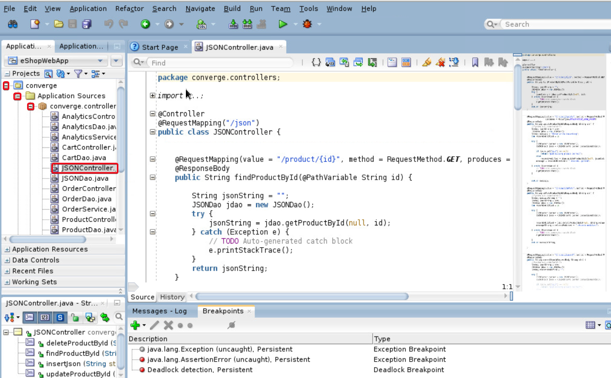
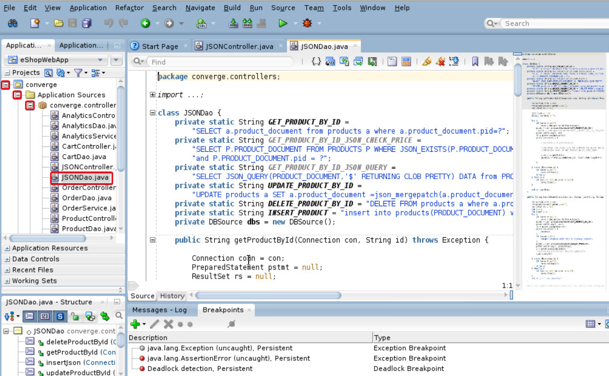
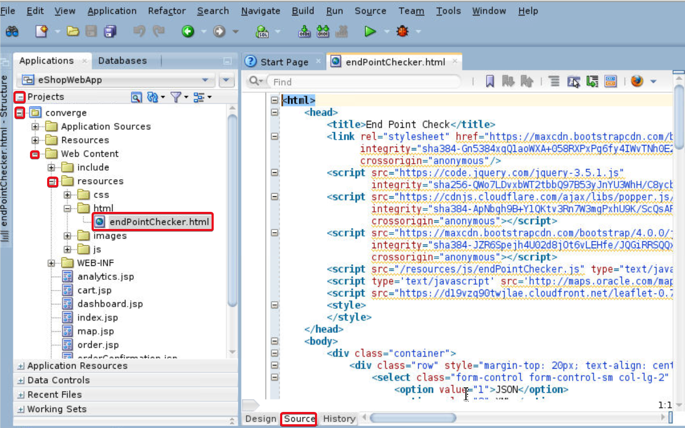
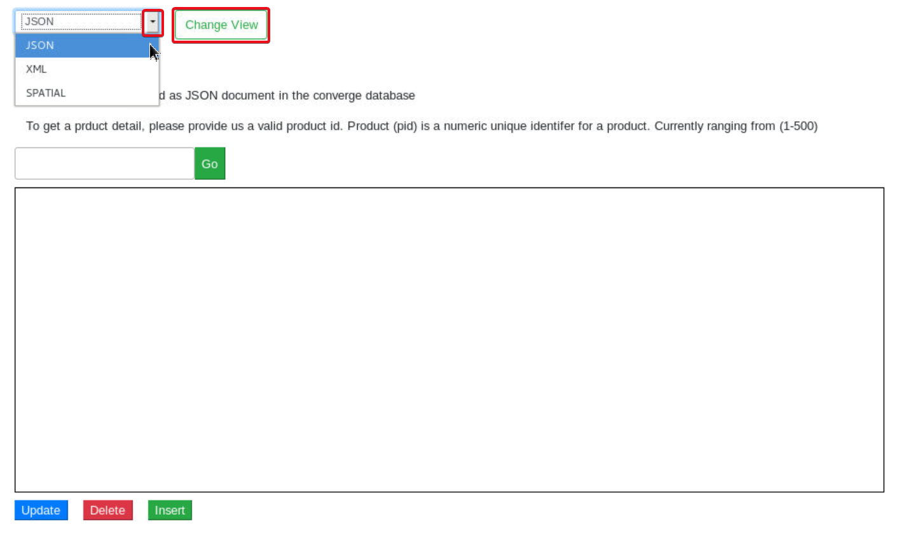

# Data Type Demonstration Tool

## Introduction

 In this lab we will launch an application(Datatype Demonstration tool) which will be used to do CRUD operations on different datatypes like JSON, XML and SPATIAL stored in the converged database.

*Estimated Lab Time*: 10 Minutes

### About Datatype Demonstration tool
 The datatype access and testing utility **endPointChecker** is pre-installed as part of the eSHOP application for workshop convenience.
 This tool will be used to perform Create, Retrieve, Update and Delete operations on the different data types.
 The tool makes AJAX calls to the business logic.

### Objectives
- Introduction to pre-built data type demonstration tool
- Launch the tool UI

### Prerequisites
This lab assumes you have:
- A Free Tier, Paid or LiveLabs Oracle Cloud account
- You have completed:
    - Lab: Prepare Setup (*Free-tier* and *Paid Tenants* only)
    - Lab: Environment Setup
    - Lab: Initialize Environment
    - Lab: eSHOP Application

## Task 1:  Access data type code

  The logic for creating REST end points to access data from converged database is written under controllers   as xxxController.java.  All the java class files collecting such data are named as xxxDao.java files.

1. In the JDeveloper under Projects Navigation Pane, Click on **+** sign against **converge**, expand **Application Sources**, expand **converge.controllers**.
2. Double click on **JSONController.java** to open it in JDeveloper.
3. Check all the `@RequestMapping` annotations.  You will find the request method and data type consumed for each method.

    

4. Note that the code has functions to hold logic for presenting, updating, inserting and deleting JSON datatype.
5. Double click on JSONDao.java to open it in JDeveloper.

    
6. Observe the SQL queries written to do database operations.
7. In the declaration section at top of the file (around line 16) check the `GET_PRODUCT_BY_ID` string and the sql select statement.
8. Also check the getProductById(Connection con,  String id) function consuming the SQL select query and the result set is retrieved as a CLOB.
9. Also check the statement

    ```
    conn = dbs.getJsonXmlConnection();
    ```

  Clearly we can understand that this method in **DBSource.java** under converge.dbHelpers is using the be **`datasource_jsonXml`** bean name declared in **applicationContext.xml**  under **Resources** to get database connection. The bean configuration in-turn points to **converge.oracle.jsonxml** datasource to fetch the records from apppdb (PDB).

10. Similarly, there are controller and DAO files for different datatypes like XML, SPATIAL and Analytics.  Open the code and verify the flow if interested.

## Task 2: Access the tool code

1. Open JDeveloper in **Studio** mode.

      

2. Under **Projects**  expand **Converge**.
3. Navigate to **Web Content** and expand it.
4. Expand **resources**, Open folder **html** to see the UI tool.
5. Double click on **endPointChecker.html** (Optional).

 ***Note***: Accept certificates if prompted and proceed.

      

6. Click on **Source** to view code (Optional).

## Task 3: Launch the demonstrator tool

1. On the web browser window on the right preloaded with  **Oracle Weblogic Server Administration Console**, navigate to `http://localhost:7101/resources/html/endPointChecker.html`
2. Click on the drop-down to see the list of datatypes shown in workshop.
3. Select a datatype and click on **Change View** button to change.

    

***Note***: Certain Datatype's fetch requests may not give results instantaneously. In certain cases we have to insert data before accessing it.

## Summary
To summarize, you have accessed the data-type demonstration tool deployed along with eShop application and are familiar with the tool's UI to work with different data-types in the further labs.

You may now *proceed to the next lab*.

## Acknowledgements
- **Authors** - Pradeep Chandramouli, Nishant Kaushik, Balasubramanian Ramamoorthy, Dhananjay Kumar, AppDev & Database Team, Oracle, October 2020
- **Contributors** - Robert Bates, Daniel Glasscock, Baba Shaik, Meghana Banka, Rene Fontcha
- **Last Updated By/Date** - Rene Fontcha, LiveLabs Platform Lead, NA Technology, December 2020
