# eSHOP Application

## Introduction

This lab will show how to create a datasource in WebLogic and will be recoding the steps for automation. We will also deploy the eSHOP application from JDeveloper to WebLogic server and verify the eSHOP application functionality.

*Estimated Lab Time*: 20 Minutes

### About eShop Application

The eSHOP company has a shopping cart web application to sell all clothing and fashion accessories to its customers.  The product details are all provided in JSON format by different vendors of the product and the customers shopping data is retained as XML as per the current single database used for the shopping application.  The store location details are stored as spatial data in a separate single purpose database and all analytical data for the application is residing in a different single purpose database.  In total., the application must deal with multiple datatypes. Hence, the eSHOP company earlier had an overhead of connecting to different single-purpose databases to work on each datatype for its shopping cart web application.

The connections to databases and transactions involved with database is always costly and complex.  Because of these multiple single purpose databases, the eShop company had to have engineers knowing to handle these specific single purpose databases, bear the integration costs and complexities of handling the application code which talks to these different databases.  Scalability is another challenge the eSHOP company is facing due to the data fragmentation in the old architecture involving these multiple single-purpose databases.
The CTO of the company decides to re-write the e-shopping  web application using J2EE standards to host on WebLogic., the market leader for enterprise application services. Java developers at eSHOP can leverage the Oracle’s best JEE development tool JDeveloper for coding this new application.

The new application re-written in J2EE standards using JDeveloper to deploy on WebLogic, demonstrates how convenient it is to work with converged oracle database.

### Objectives
- Setup and configure eSHOP application
- Setup and record WLST scripts from WebLogic console
- Create datasources required for upcoming labs

### Prerequisites
This lab assumes you have:
- A Free Tier, Paid or LiveLabs Oracle Cloud account
- You have completed:
    - Lab: Prepare Setup (*Free-tier* and *Paid Tenants* only)
    - Lab: Environment Setup
    - Lab: Initialize Environment

## Task 1: Access the WebLogic Admin Console

Handling database connections using WebLogic datasources gives the developers freedom to configure database related performance parameters on the WebLogic side rather than tweaking the application code.

It improves application performance as connections are not created/closed within a class, they are managed by the application server and can be fetched while at runtime. It provides a facility for creating a pool of connectionsrecycling of connections in the pool is helpful for enterprise application performance It supports distributed transactions.

1. On the web browser window on the right is a tab preloaded with  **Oracle Weblogic Server Administration Console**, provide the credentials below to login

    ```
    Username	: <copy>weblogic</copy>
    ```

    ```
    Password	: <copy>Oracle123!</copy>
    ```

    


## Task 2: Configure datasource recoding

1. Click on **Preferences**.

    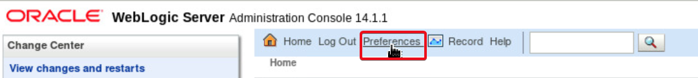

2. Click on **WLST Script Recording** tab. Under **General** tab, edit the values for parameters as below:

    ```
    Base Script Directory	: <copy>/u01/middleware_demo/scripts</copy>
    ```

    ```
    File Name	: <copy>createDS.py</copy>
    ```

    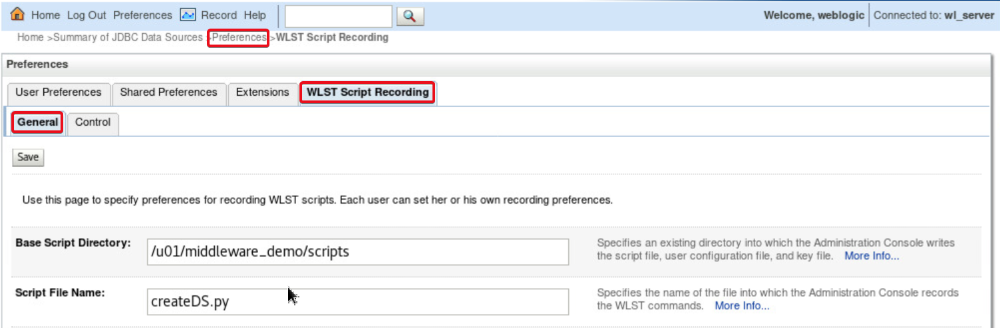

3. Scroll down, Select the CheckBox **Generate Prescript and Postscript**.  Fill the values given below in respective text areas:

    - Prescript Text:

    ```
    <copy>
    connect("weblogic","Oracle123!","t3://localhost:7101")
    edit()
    startEdit()
    </copy>
    ```

    - Postscript Text:

    ```
    <copy>
    save()
    activate()
    exit()
    </copy>
    ```

    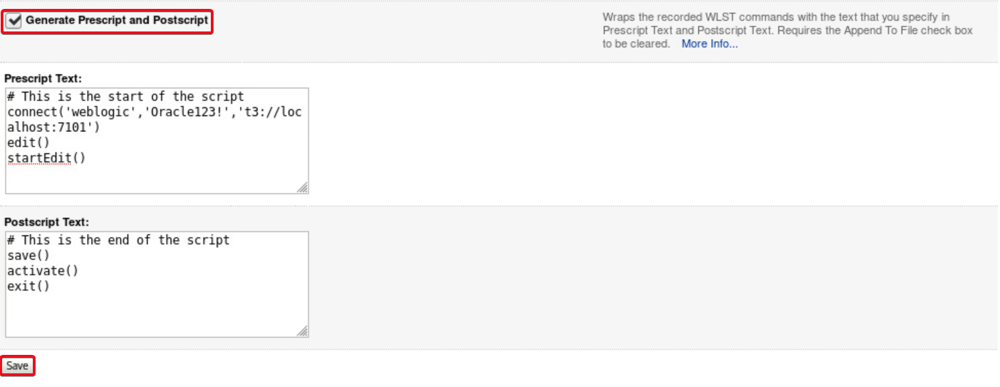

4. Click on the **Save** button.
5. Click on **Control** tab.  Click Start **Recording**.

     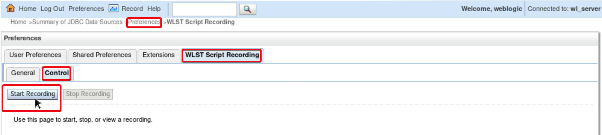

## Task 3: Create a datasource using WebLogic console

1. Under **Domain Structure** tab on the left hand side, expand **Service**.
2. Click on **Data Sources**  Click on New and select **Generic Data Source**.

    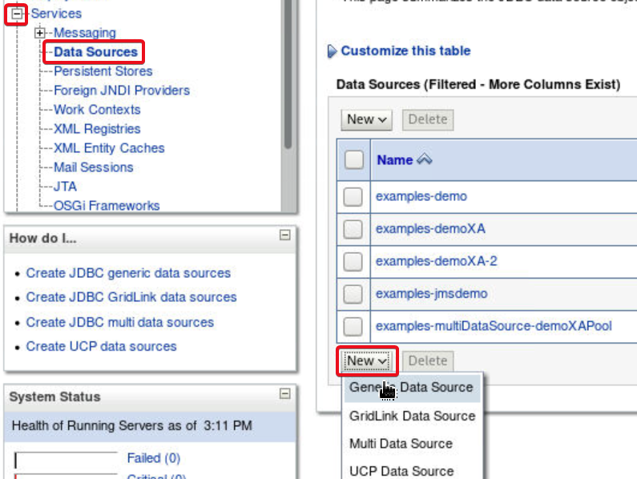

3. Fill the values as below and click **Next** button.

    ```
    Name	: <copy>jsonxmlds</copy>
    ```

    ```
    JNDI Name	: <copy>convergeddb.jsonxmlds</copy>
    ```

    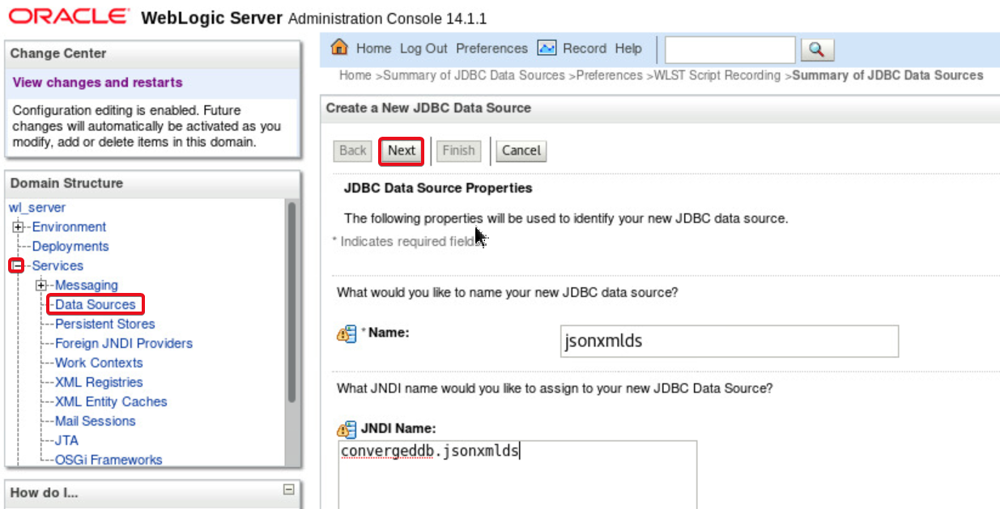

4. For **Database Driver** select the default value of **Oralce’s Driver (Thin) for Service Connections; Versions: Any.** Click **Next**.

    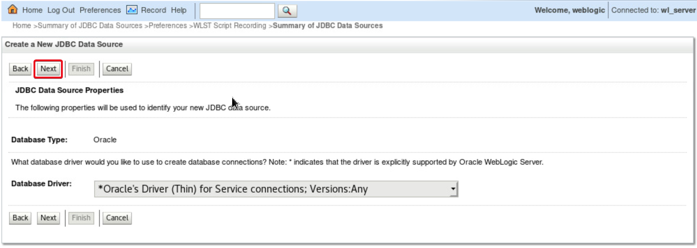

5. In the next screen do not change any values.  Let the default selections prevail.  Click **Next**.

    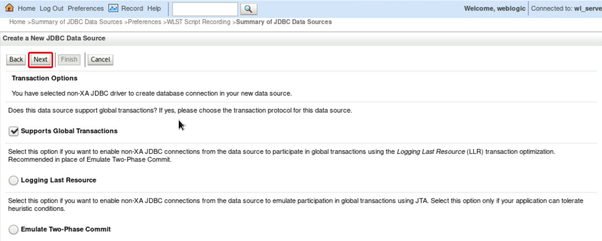

6. Under the **Connection Properties** screen provide the following values. Click **Next**.
    - **Database Name**: JXLPDB
    - **Host Name**: localhost
    - **Port**: 1521
    - **Database User Name**: appxml
    - **Password**: Oracle_4U
    - **Confirm Password**: Oracle_4U

    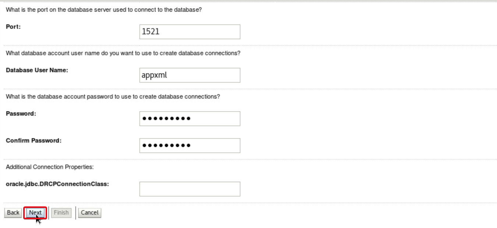

7. Click on **Test Configuration** to confirm the connection.  Once you see a successful connection, Click **Next**.

    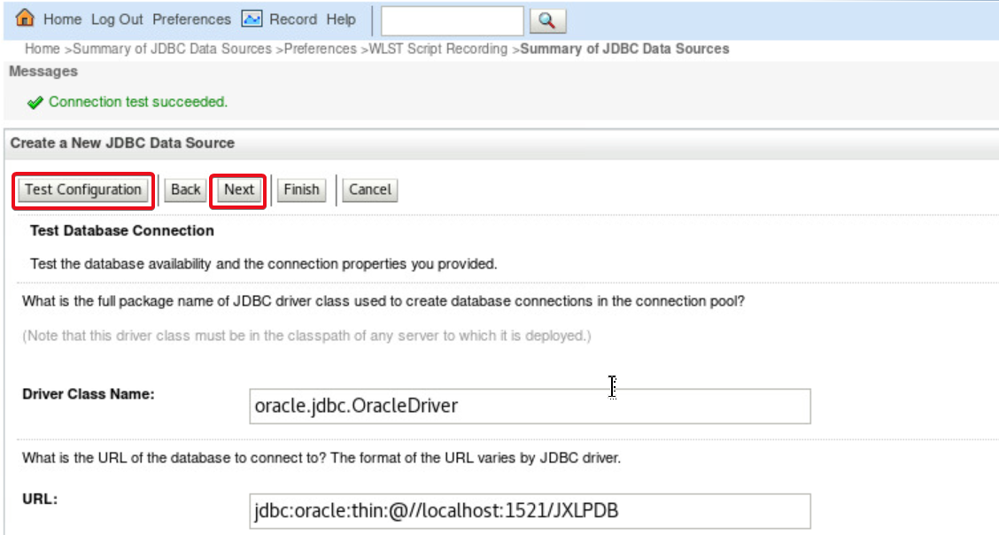

8. In the **Select Target** screen, select the checkbox against **AdminServer**. Click **Finish**.

    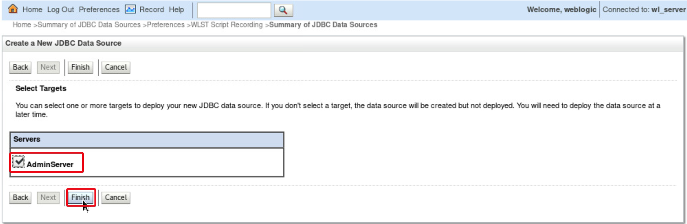

9. Navigate back to **Preferences**, **WLST Script Recording** tab. Click **Control** tab. Click on **Stop Recording** button.

    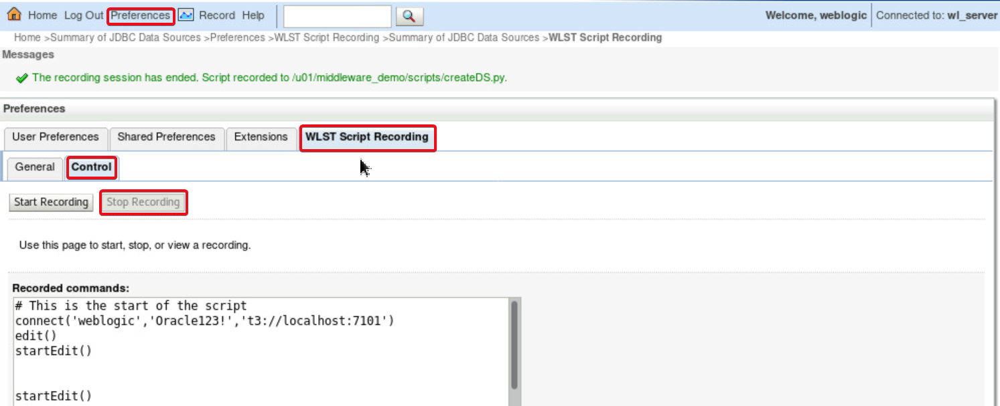

Now we have successfully recorded how a datasource can be created from WebLogic Admin Console.

## Task 4: Edit the recorded script for creating another datasource

WebLogic Scripting tool is used to perform administrative actions which can be done using administrative console on a command prompt.

In this step we will edit the recorded script a little to connect to the required AdminServer, change the parameters like data source name, other connection parameters and execute the script from command line.

1. Open a **Terminal** in the VNC desktop.

2. Edit the recorded commands in *`/u01/middleware_demo/scripts/createDS.py`* using the command below:

    ```
    <copy>
    gedit /u01/middleware_demo/scripts/createDS.py
    </copy>
    ```

3. Remove the line with keyword **setEncrypted**( or comment it by adding **#** as the first character of the line - before the keyword **setEncrypted**.

    ```
    <copy>
    #setEncrypted('Password', 'Password_1592840128546',
    '/u01/middleware_demo/scripts/createDSConfig',
    '/u01/middleware_demo/scripts/createDSSecret')
    </copy>
    ```

4. Instead of setEncrypted() function, we can set the password for the datasource connection using the setPassword() command in WLST.  Write the below line in place of line containing **setEncrypted**.

    ```
    <copy>
    cmo.setPassword("Oracle_4U")
    </copy>
    ```

5. Click on the **Menu** icon on the right hand side of the gedit window.  Click **Find and Replace** option.

    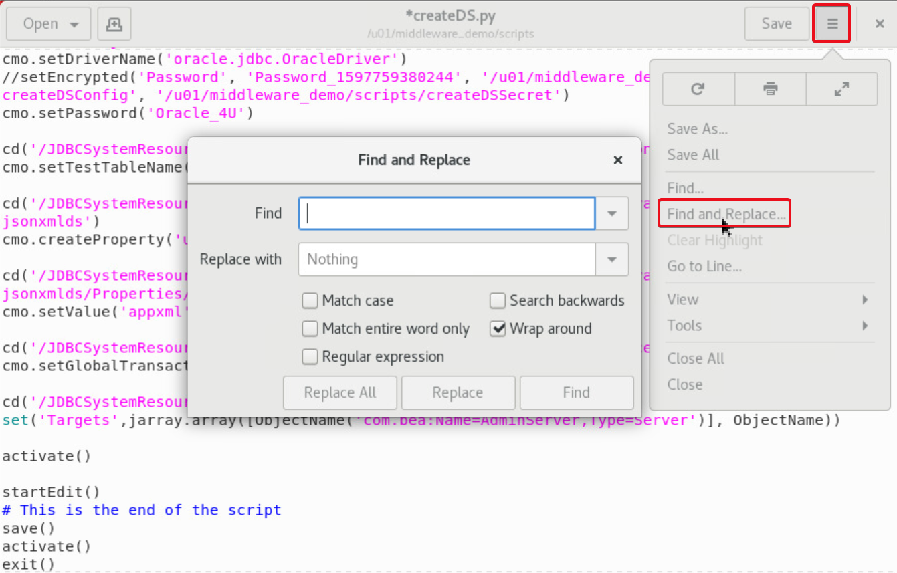

6. Find and Replace all occurrence of **jsonxmlds** with **spatialds**.

7. Find and Replace the username for database connection **appxml** with **appspat**.

8. Find and Replace the PDB name **JXLPDB** with **SGRPDB**.

9. Click **Save** button and **Close** gedit window.

## Task 5: Use WLST for creating eSHOP datasources

1. Use the existing **Terminal**  or Open a new **Terminal** on VNC desktop to execute commands.

2. Navigate to folder where the edited datasource create script exits.

    ```
    <copy>
    cd /u01/middleware_demo/scripts
    </copy>
    ```

3. Source the lab profile file (DOT SPACE PATH).

    ```
    <copy>
    . /u01/middleware_demo/scripts/setWLS14Profile.sh
    </copy>
    ```

4. Source the setDomainEnv.sh to set all WebLogic and WLST paths.

    ```
    <copy>
    sh $DOMAIN_HOME/bin/setDomainEnv.sh
    </copy>
    ```

5. Execute the java command below to run the WLST script to create the second datasource **spatialgraphds**.

    ```
    <copy>
    java weblogic.WLST createDS.py
    </copy>
    ```

6. Navigate to folder *`/u01/middleware_demo/converge-java/utilities`*.

    ```
    <copy>
    cd /u01/middleware_demo/converge-java/utilities
    </copy>
    ```

7. Execute the java command below to run the WLST script to create datasource connecting to PDB apppdb where the eShop data is stored.

    ```
    <copy>
    java weblogic.WLST createAppDataSourceSGR.py
    </copy>
    ```
    ```
    <copy>
    java weblogic.WLST createAppDataSourceJXL.py
    </copy>
    ```

## Task 6: Deploy eSHOP Application

1. Click on the **Coffee Cup** Icon of **Oracle JDeveloper** 12c on the VNC desktop to open the Oracle JDeveloper IDE.

2. When prompted for **Select Role**, opt for **Studio Developer** Role and Click **OK** button.

    This role has access to all features of JDeveloper.  We need it for accessing different kind of project templates to build the eSHOP application.

    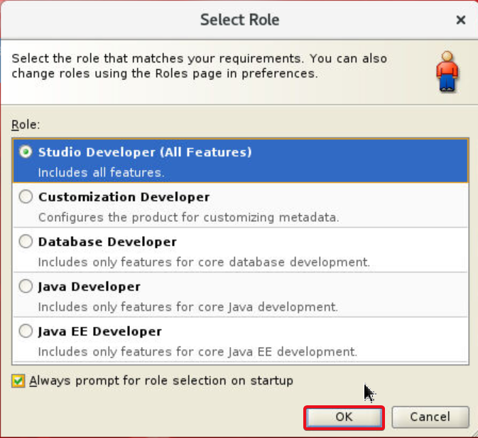

3. Click on **File** menu. Click **Import**.

4. In the **Import** menu, Select **Maven Project** and Click **OK**.

    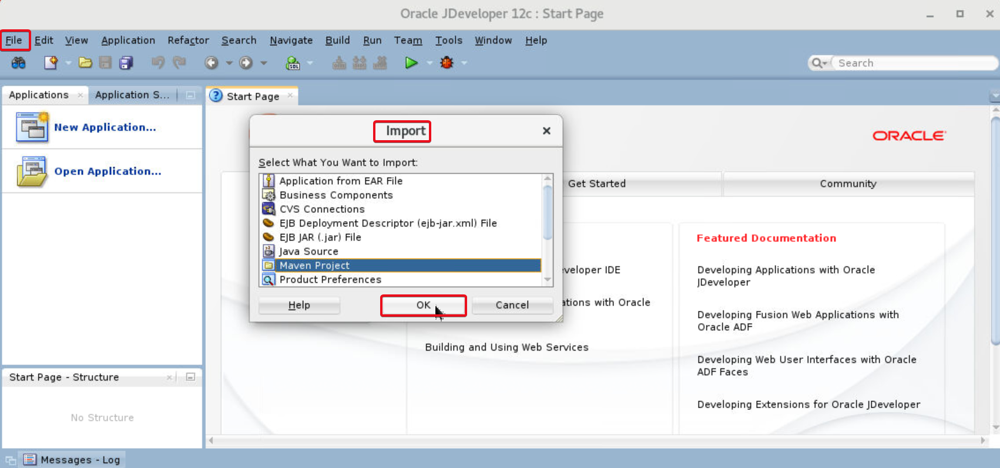

5. Use the **Search Icon** and navigate to *`/u01/middleware_demo/converge-java`* folder against the Root Directory .  Leave the **Settings File** option to default.  Select the checkbox against **pom.xml** under the **Project** options. Click **OK**.

    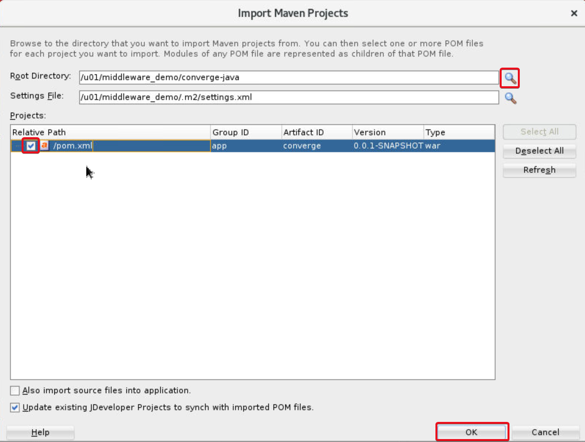

6. Provide a proper **Application Name** like eShopWebApp. Click **OK**.

    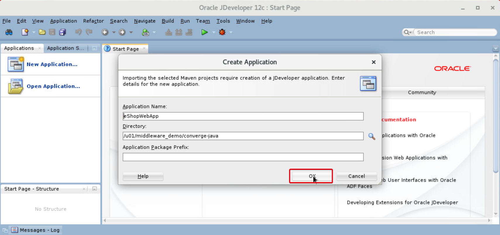

7. JDeveloper will take some time to import the application code.  Expand all **+** signs under **Converge** beneath the **Projects** tab on left hand side navigation bar to see different RESOURCES, WEB COMPONENTS and PACKAGES used in the eSHOP code.

    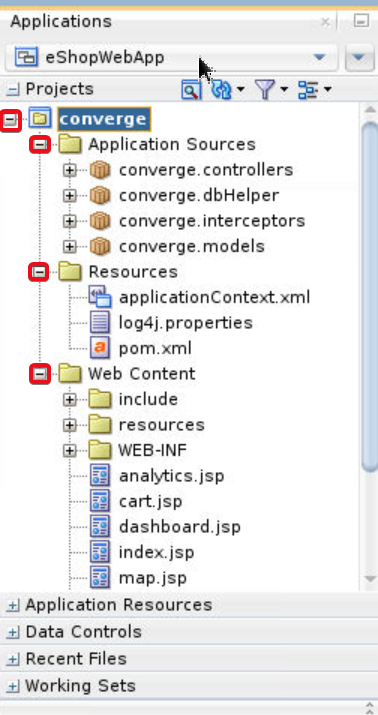

8. Expand **Resources**.  Double click on **pom.xml**.  In the Main window of the **JDeveloper**, Click on **Source**.

    We can see the weblogic-maven-plugin which calls the weblogic.deployer tool internally for and execution goal of **deploy** in a Maven call.

    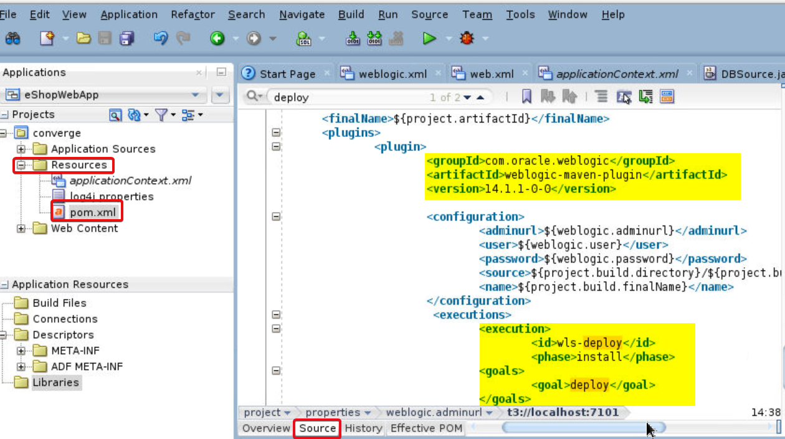

9. Under Applications Navigation Panel in JDeveloper, Under **Projects**, right click on **converge**.

10. Select Run Maven, Click **Install**.

    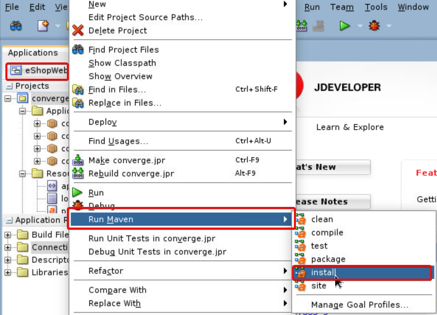

11. In the Logs section **Apache-Maven-Install-Log** observe the text **BUILD SUCCESS**.

12. Scroll up the log and observe that the Maven automation has created a deployable war file called converge.war under *`/u01/middleware_demo/converge-java/target/`* folder and using the **weblogic.deployer** tool, has installed it on the configured on AdminServer of WebLogic 14 installed.

    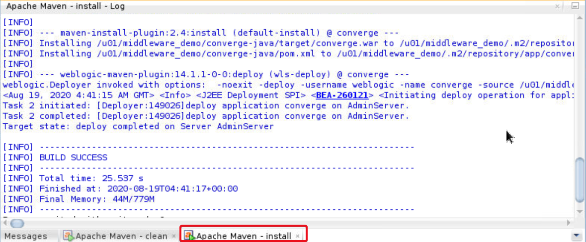

## Task 7: Verify eSHOP functionality

1. On the web browser window on the right, access the application by navigating to *`http://localhost:7101/`* .

2. Navigate through all endpoints and features of the application like Dashboard, shopping cart, search etc.

    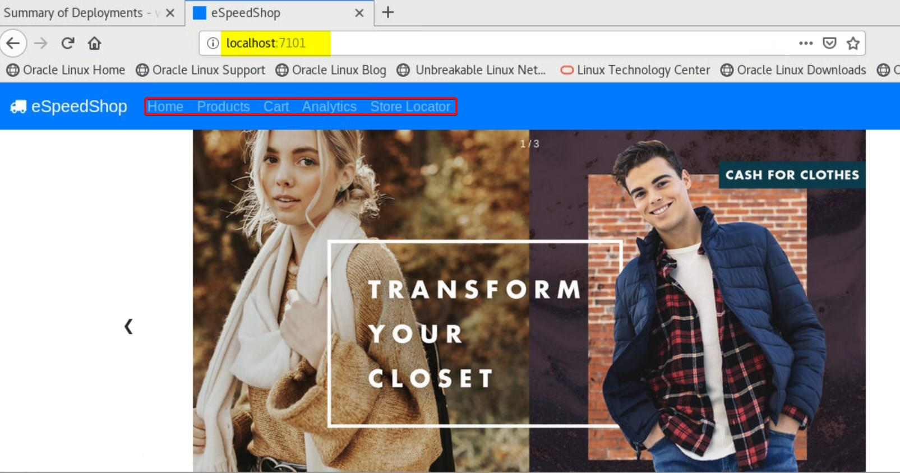

 The eShop application is deployed and functional.

## Summary
To summarize, you have deployed the eShop application on to WebLogic and verified its functionality. You have also started the JDeveloper on the lab system and have accessed to the working code of eShop application.

You may now *proceed to the next lab*.

## Acknowledgements
- **Authors** - Pradeep Chandramouli, Nishant Kaushik, Balasubramanian Ramamoorthy, Dhananjay Kumar, AppDev & Database Team, Oracle, October 2020
- **Contributors** - Robert Bates, Daniel Glasscock, Baba Shaik, Meghana Banka, Rene Fontcha
- **Last Updated By/Date** - Rene Fontcha, LiveLabs Platform Lead, NA Technology, December 2020
