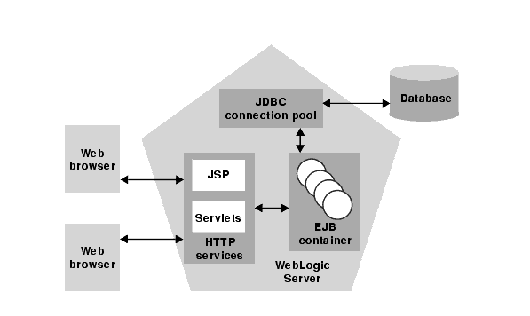
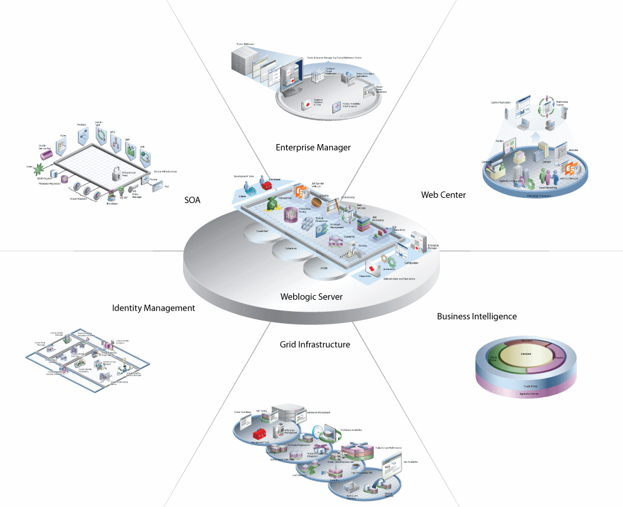

# Introduction to WebLogic Server
 
Oracle WebLogic Server is a scalable, enterprise-ready Java Platform, Enterprise Edition (Java EE) application server. The WebLogic Server infrastructure supports the deployment of many types of distributed applications and is an ideal foundation for building applications based on Service Oriented Architectures (SOA).

The WebLogic Server complete implementation of the Java EE 6.0 specification provides a standard set of APIs for creating distributed Java applications that can access a wide variety of services, such as databases, messaging services, and connections to external enterprise systems. End-user clients access these applications using Web browser clients or Java clients. It also supports the Spring Framework, a programming model for Java applications which provides an alternative to aspects of the Java EE model.

In addition to the Java EE implementation, WebLogic Server enables enterprises to deploy mission-critical applications in a robust, secure, highly available, and scalable environment. These features allow enterprises to configure clusters of WebLogic Server instances to distribute load, and provide extra capacity in case of hardware or other failures.

WebLogic Server with same features of on-premise installation is also available on Oracle Cloud Infrastructure, as an option to be deployed on Azure IaaS, as Docker Images and also as WebLogic Operator for deployment on Kubernetes Clusters to help application modernization and support lightweight and largely scalable deployment options.

## Know more about WebLogic

[WebLogic Video Page](https://www.youtube.com/user/OracleWebLogic)

[Oracle Weblogic Server Blog](https://blogs.oracle.com/weblogicserver/)

[WebLogic Whitepaper](https://www.oracle.com/middleware/weblogic/resources.html)

[Oracle Weblogic Server](https://www.oracle.com/middleware/weblogic/)

## Acknowledgements

- **Authors** - Balasubramanian Ramamoorthy, Dhananjay Kumar, Pradeep Chandramouli
- **Contributors** - Nishanth Kaushik,Kanika Sharma,Srinivas Pothukuchi,Arvind Bhope
- **Team** - North America AppDev Specialists
- **Last Updated By** - Kay Malcolm, Database Product Management, June 2021
- **Expiration Date** - June 2021

## Issues?
Please submit an issue on our [issues](https://github.com/oracle/learning-library/issues) page. We review it regularly.
