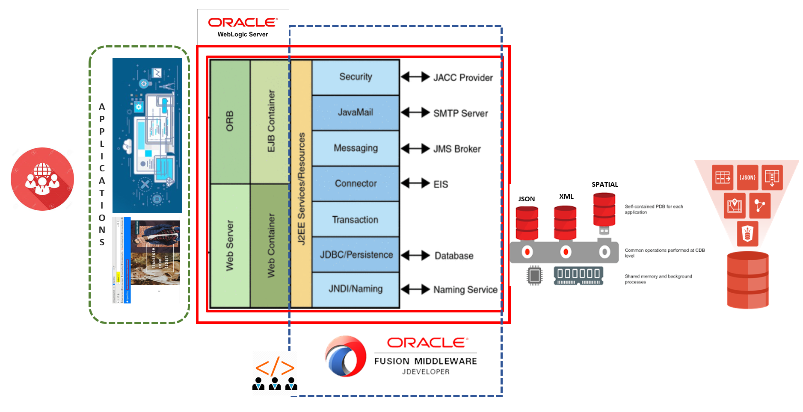

# Introduction

This workshop aims at providing hands-on labs for creating an eCommerce application using JDeveloper as an IDE. The labs show the ease of handling data stored as different datatypes like JSON, XML and Spatial as multiple pluggable databases in a single converged Oracle database.

The power of weblogic for JEE development like JNDI, DataSources, Maven Plugins and REST are leveraged in labs from a developers perspective.

*Estimated Workshop Time:* 3 Hours

## About Product/Technology
**Java EE**

Java Platform, Enterprise Edition (Java EE) is the standard in community-driven enterprise software. Java EE is developed using the Java Community Process, with contributions from industry experts, commercial and open source organizations, Java User Groups, and countless individuals. Each release integrates new features that align with industry needs, improves application portability, and increases developer productivity.

Java EE servers host several application component types that correspond to the tiers in a multitiered application. The Java EE server provides services to these components in the form of a container.

**WebLogic**

Oracle WebLogic Server is a scalable, enterprise-ready Java Platform, Enterprise Edition (Java EE) application server. The WebLogic Server infrastructure supports the deployment of many types of distributed applications and is an ideal foundation for building applications based on Service Oriented Architectures (SOA).

The WebLogic Server complete implementation of the Java EE 6.0 specification provides a standard set of APIs for creating distributed Java applications that can access a wide variety of services, such as databases, messaging services, and connections to external enterprise systems. End-user clients access these applications using Web browser clients or Java clients.

**Workshop Architecture**

The Java EE application implements the enterprise services like security, portablity and developer productivity. A JEE server like WebLogic provides a platform to leverage all components of JEE for application development and hosting.

In this workshop, we will be connecting to a converged database that holds data in different datatypes using the JNDI APIs, build the application on JDeveloper IDE using Maven extension and deploy the code on WebLogic. We also leverage the REST support provided by WebLogic to expose data as REST end-points.

### Objectives

In this workshop you will:
* Offload Converged Database features for Multiple Datatypes in a single JEE application
* Experience the ease of coding for different data types
* Leverage different built-in functions for JSON, XML, Graph and Spatial Data from Converged DB
* Develop REST end points for database development
* Consume out of box REST options from Converged Database in application

### Prerequisites

* Basic understanding of Java application development and any IDE
* An Oracle Cloud Account - Please view this workshop's LiveLabs landing page to see which environments are supported

*Note: If you have a **Free Trial** account, when your Free Trial expires your account will be converted to an **Always Free** account. You will not be able to conduct Free Tier workshops unless the Always Free environment is available. **[Click here for the Free Tier FAQ page.](https://www.oracle.com/cloud/free/faq.html)***

### Lab Overview

Converged Database with Weblogic for Developers workshop consists of 7 separate labs. The labs should be followed in order from Lab4-Lab10. There are screen shots available throughout the labs to guide you through the exercises.  Additional information has been provided in the Appendix section of the workshop to help guide you through these labs.

| Lab Seq. | Name | Approx. Time |
|--|------------------------------------------------------------|-------------|
| 3 | Initialize Environment (Start Services) | 30 minutes |
| 4 | eSHOP Application | 20 minutes |
| 5 | Data Type Demonstration Tool | 10 minutes |
| 6 | JSON With Java | 30 minutes |
| 7 | XML With Java | 30 minutes |
| 8 | SPATIAL With Java | 30 minutes |
| 9 | (Optional) Cross Data Type | 15 minutes |
| 10 | ORDS as Microservice | 15 minutes |

You may now *proceed to the labs*.

## Learn More

**Java EE**
- [Oracle J2EE (JEE)](https://www.oracle.com/in/java/technologies/java-ee-glance.html)

**WebLogic Resources**
- [Video PageBlogs](https://www.youtube.com/user/OracleWebLogic)
- [White Paper](https://www.oracle.com/middleware/weblogic/resources.html)
- [Product Page](https://www.oracle.com/java/weblogic/)

**JDeveloper**
- [Overview Video](https://www.youtube.com/watch?v=63rnCGawF9w)
- [Product Tutorial](https://docs.oracle.com/cd/E53569_01/tutorials/tut_ide/tut_ide.html)
- [Java Application Development](https://www.oracle.com/application-development/technologies/jdeveloper.html)

## Acknowledgements
- **Authors** - Pradeep Chandramouli, Nishant Kaushik, Balasubramanian Ramamoorthy, Dhananjay Kumar, AppDev & Database Team, Oracle, October 2020
- **Contributors** - Robert Bates, Daniel Glasscock, Baba Shaik, Meghana Banka, Rene Fontcha
- **Last Updated By/Date** - Rene Fontcha, LiveLabs Platform Lead, NA Technology, December 2020

