# JSON With Java

## Introduction
This lab demonstrates the ease of handling JSON data type in JAVA EE code. We will be performing insert, update and deletion of JSON data using the UI tool.

*Estimated Lab Time*: 30 Minutes

### About JSON

JSON (JavaScript Object Notation) is a syntax for storing and exchanging data. When exchanging data between a browser and a server, the data can only be text.

JSON is text, and we can convert any JavaScript object into JSON, and send JSON to the server. We can also convert any JSON received from the server into JavaScript objects.

This way we can work with the data as JavaScript objects, with no complicated parsing and translations.

**Storing and Managing JSON Documents**

JSON documents can be stored using a VARCHAR2, CLOB, or BLOB column. An IS JSON SQL constraint ensures that the column contains only valid JSON documents, allowing the database to understand that the column is being used as a container for JSON documents.

Oracle’s JSON capabilities are focused on providing full support for schemaless development and document-based storage. Developers are free to change the structure of their JSON documents as necessary. With the addition of JSON support, Oracle Database delivers the same degree of flexibility as a NoSQL JSON document store.

### Objectives

- Walk through the SQL queries having built-in functions for JSON datatype
- Change business logic to query JSON conditionally
- Showcase creation of REST end-points for JSON data retrived

### Prerequisites
This lab assumes you have:
- A Free Tier, Paid or LiveLabs Oracle Cloud account
- You have completed:
    - Lab: Prepare Setup (*Free-tier* and *Paid Tenants* only)
    - Lab: Environment Setup
    - Lab: Initialize Environment
    - Lab: eSHOP Application
    - Lab: Data Type Demonstrator Tool

## Task 1: Retrieve JSON data

1. On the web browser window on the right preloaded with  **Oracle Weblogic Server Administration Console**, navigate to *`http://localhost:7101/resources/html/endPointChecker.html`*.

2. Click on the drop-down to see the list of datatypes shown in workshop.

3. Select **JSON** datatype and click on **Change View** button to change.

    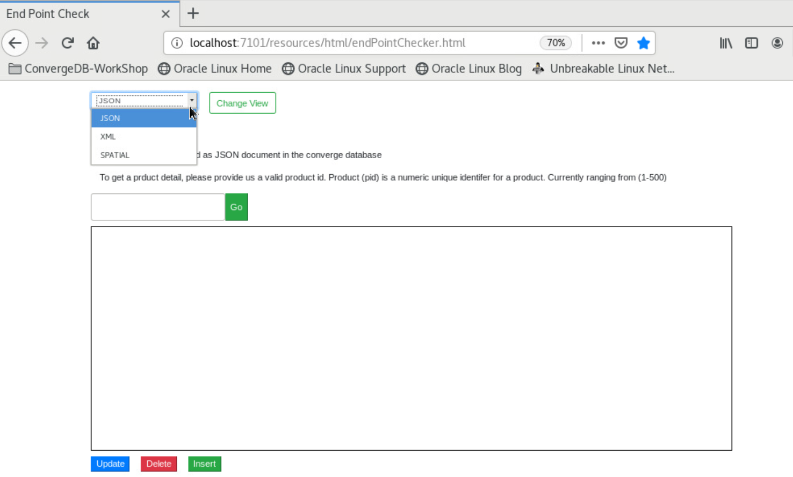

4. Search for product with ID **292** and Click on **Go** button.

5. In the text area you will find the JSON data related to product with ID 292 displayed.

    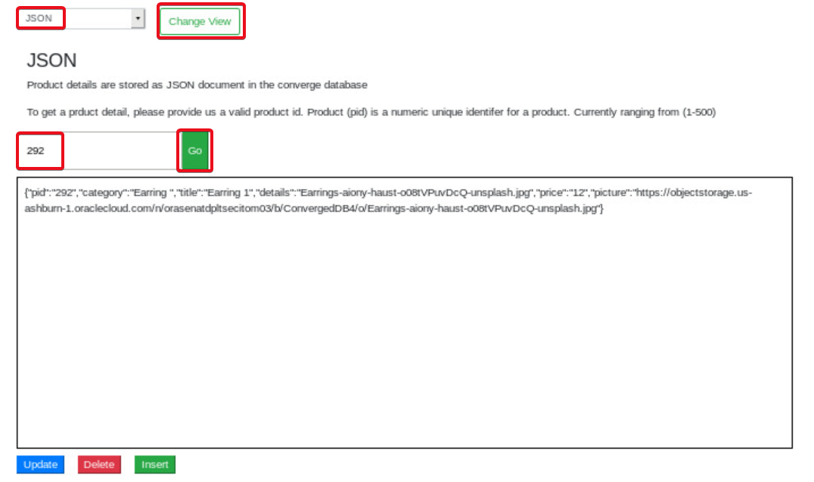

6. To verify the product on eShop application, open a new browser tab and navigate to *`http://localhost:7101/product/292`* to see the details of the product graphically.
    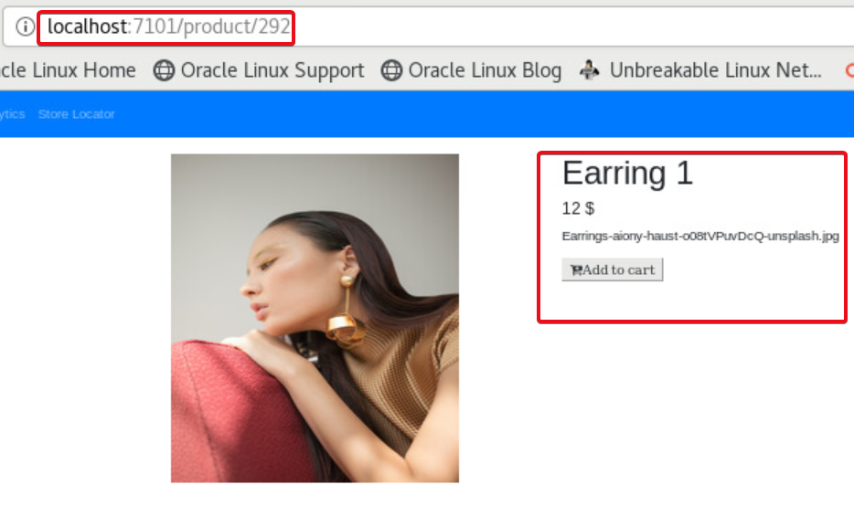

7.	Verify the PID, Details and Title.

## Task 2: Update JSON data

1.	In the search result occurring after searching for product 292, update the price of the product from 12$ to 14$ in the text area.

    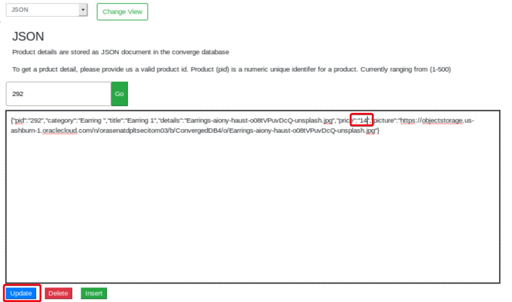

2.	Click on the blue **Update** button below the text area.

3.	You will observe the message “1 records updated”.

4.	To verify the product on eShop application, return to the browser tab on the right window loaded with the URL *`http://localhost:7101/product/292`* to see the details of the product graphically.

    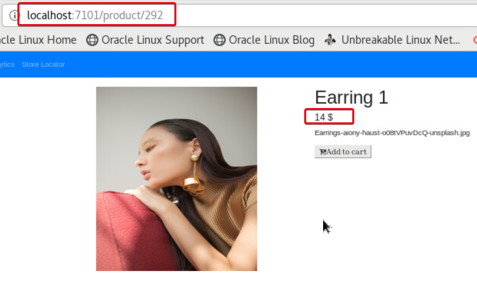

5.	Again, search for product **292**, to observe the results with updated price value in the JSON object retrieved from database.

    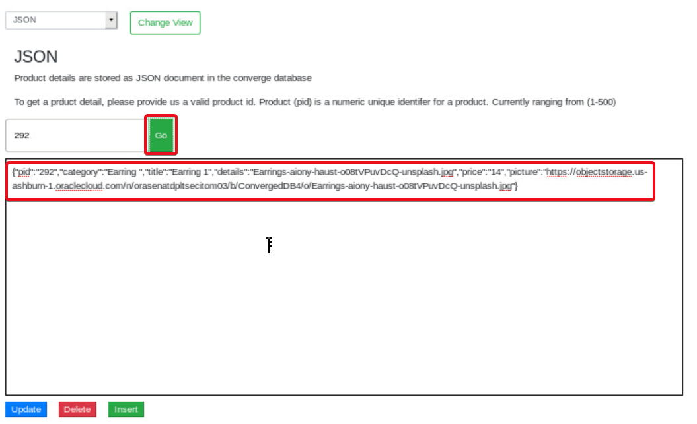

   JSON manipulation function which is supplied out of the box called JSON_MERGEPATCH which is entirely replacing the JSON text with the new text is used within the code to update JSON data.  Similarly, we can re-write the query to update only a particular field and value in JSON by other methods provided to scan through and manipulate JSON key-value pairs in Oracle Converged DB for JSON.

## Task 3: Delete JSON data

1. Search for product with ID **292** and Click on the **Go** button.

2. Click on red **Delete** button below the search result display text area.

    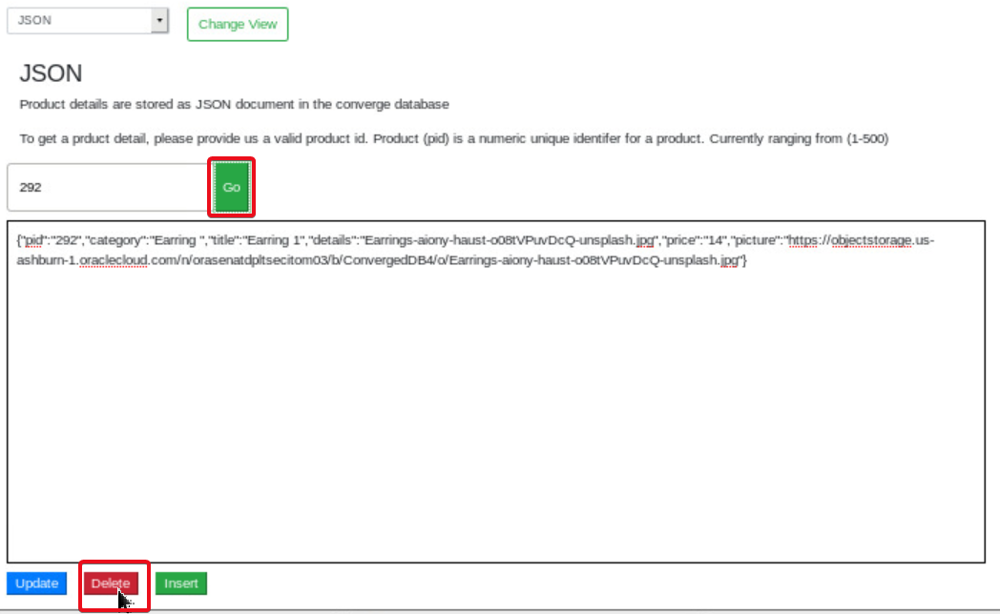

3. The deletion confirmation message is displayed.

    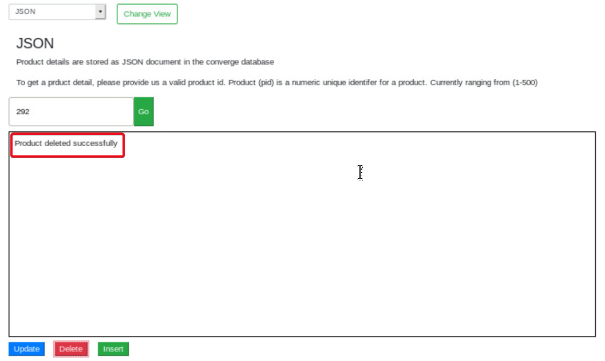

4. Click on **Go** button again to search for product with ID 292.

5. The unavailability message is displayed.

    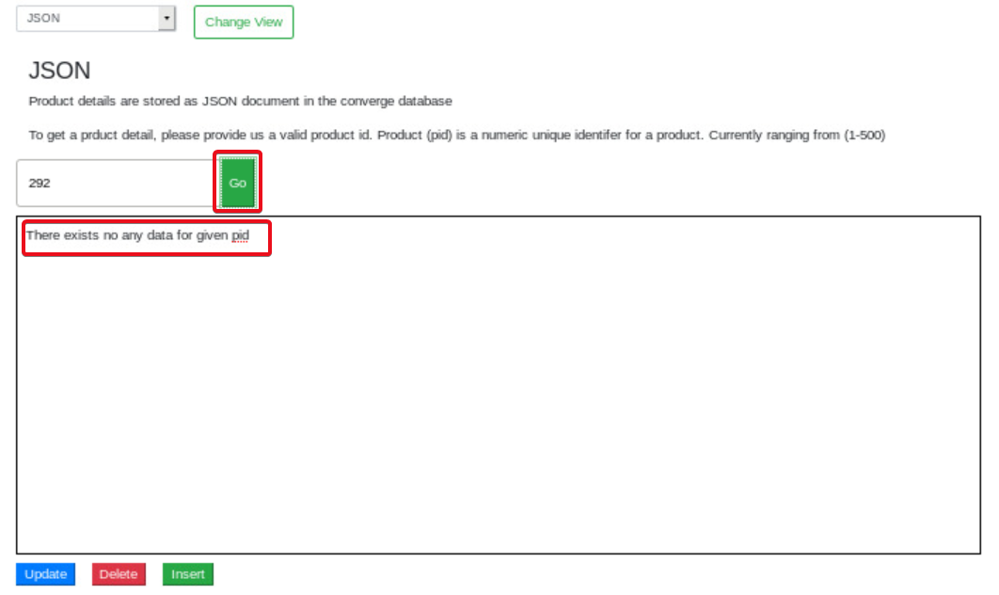

6. To verify the product on eShop application, return to the browser tab on the right window loaded with the URL *`http://localhost:7101/product/292`*.

7. You will find the product missing from the JSON database.

     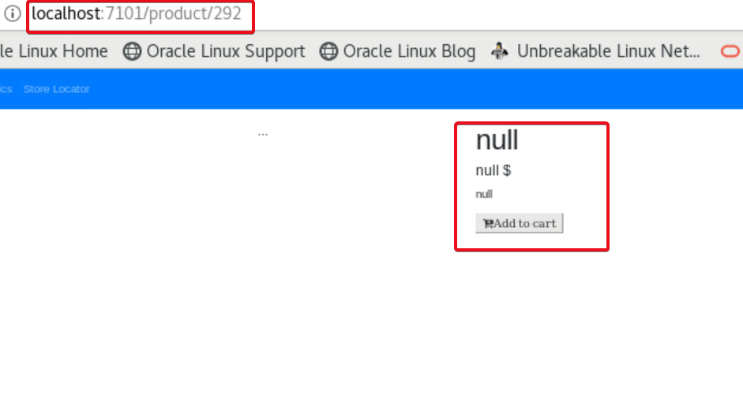

## Task 4: Insert JSON data

1.	On the web browser window on the right, navigate to *`http://localhost:7101/resources/html/endPointChecker.html`* if not already opened

2.	Click on the drop-down to see the list of datatypes shown in workshop.

3.	Select **JSON** datatype and click on **Change View** button to change.

4.	In the text area, paste the below JSON data about product **292**.

    ````
    <copy>
    {"pid":"292","category":"Earring ","title":"Earring 1","details":"Earrings-aiony-haust-o08tVPuvDcQ-unsplash.jpg","price":"12","picture":"https://objectstorage.us-ashburn-1.oraclecloud.com/n/orasenatdpltsecitom03/b/ConvergedDB4/o/Earrings-aiony-haust-o08tVPuvDcQ-unsplash.jpg"}
    </copy>
    ````
5. Click on the green **Insert** button.

    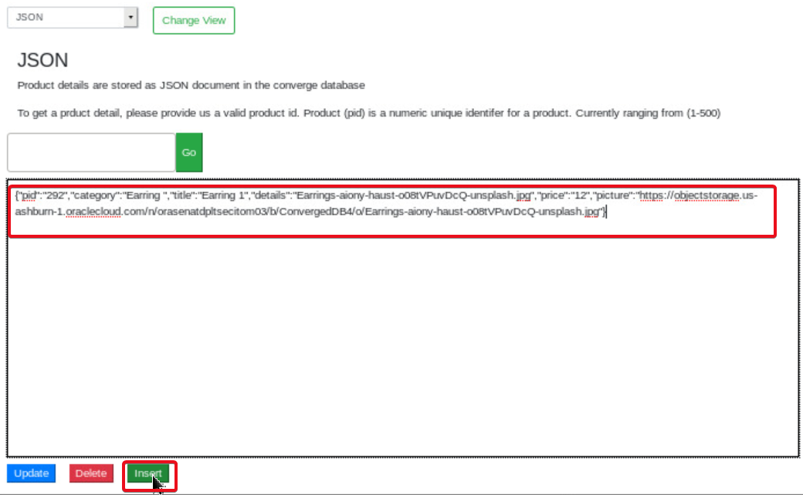

6. Data insert confirmation message is displayed.

    

7. Search for product id **292** and Click **Go**.

8. The newly inserted product details are displayed in the text area.

    

9. To verify the product on eShop application, return to the browser tab on the right window loaded with the URL *`http://localhost:7101/product/292`* to see the details of the product graphically.

    

10.	Verify the PID, Details and Title.

## Task 5: Update JSON Query and verify

We have searched and handled JSON data based on the product id.  Now what if we want to get the products by ID only if the price of the product is $10?  

There is no need to write special queries to scan through the JSON data in the database.  Oracle provides a function called JSON_EXISTS to check through the values of any key in the JSON data construct.

In this section, we will replace the query helping search product by ID to enhance the search with products of 10$ value.

To achieve this, lets replace the query beneath with a new query having the condition required.

1. Open the JDeveloper on the Remote Desktop desktop or if you already have it open continue...

2. Navigate to In JDeveloper open the **JSONDao.java** under **`Projects->converge->Application Sources->converge.controllers`** by double clicking on the file.

3. In the declaration section at top of the file (around line 16) check the `GET_PRODUCT_BY_ID` string and the sql select statement.

4. Compare the query with the one against `GET_PRODUCT_BY_ID_JSON_CHECK_PRICE`.

    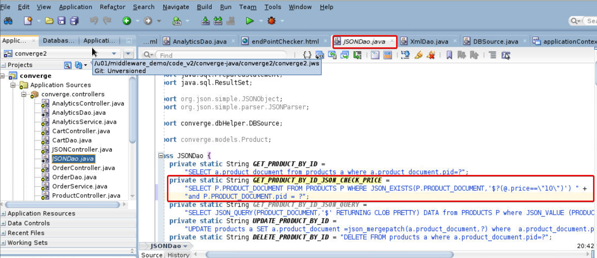

    We are first using function `JSON_EXISTS` which will do a verification if the data is in the JSON format and if the condition is met.

    You can also see that we are simply using the key “Price” as if in a relational database not even bothering that it’s a key – value entry in a JSON text inside a database.  That is the power and ease of handing JSON data in Oracle Converged Database.

5. Navigate down in JSONDao.java to function `getProductByID()`.

6. Uncomment the line below:

    ````
    <copy>
    pstmt = conn.prepareStatement(GET_PRODUCT_BY_ID_JSON_CHECK_PRICE);
    </copy>
    ````
    Comment out the line below:

    ````
    <copy>
    pstmt = conn.prepareStatement(GET_PRODUCT_BY_ID);
    </copy>
    ````

    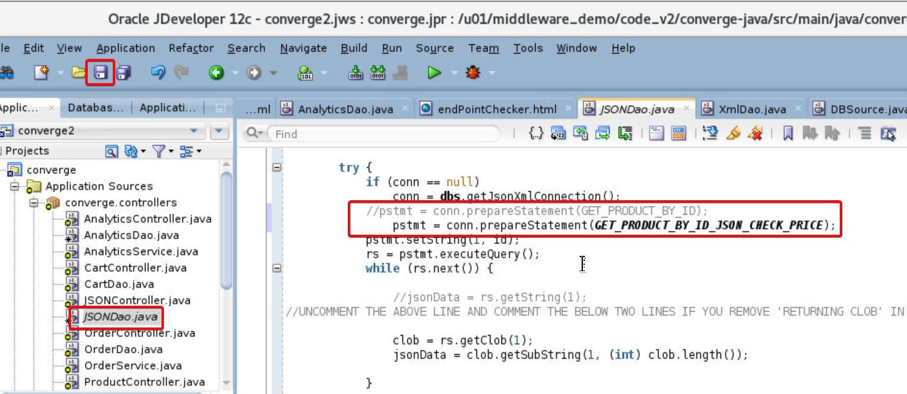

7.	Click on the **Save** button.

8.	Right Click on **Converge**.

9.	Click on **Run Maven** and click on **redeploy**.

    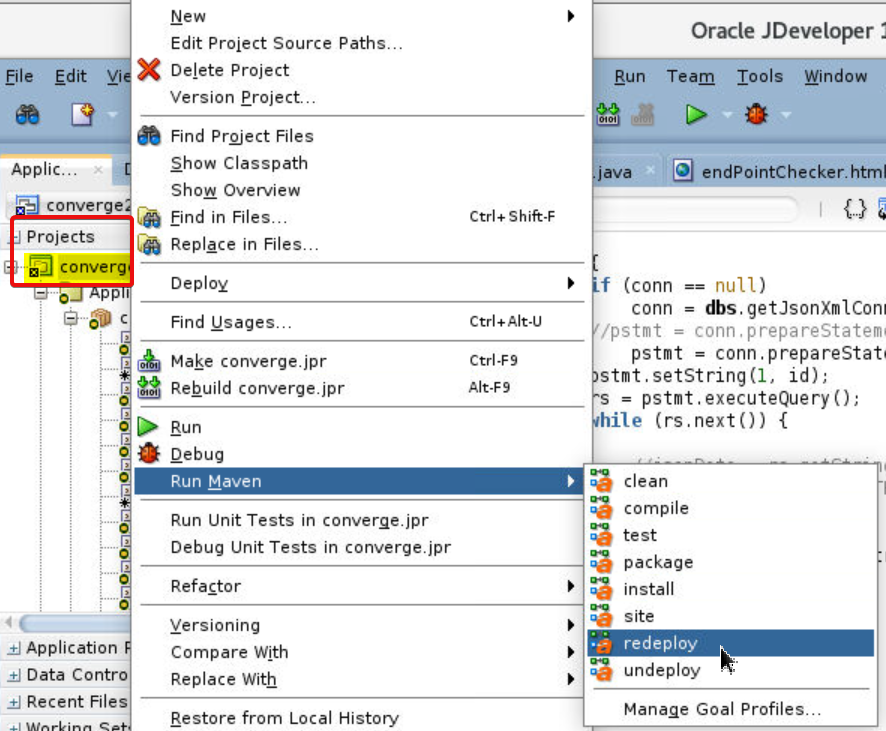

10.	In the JDeveloper Log message area, you will see the successful redeployment.

    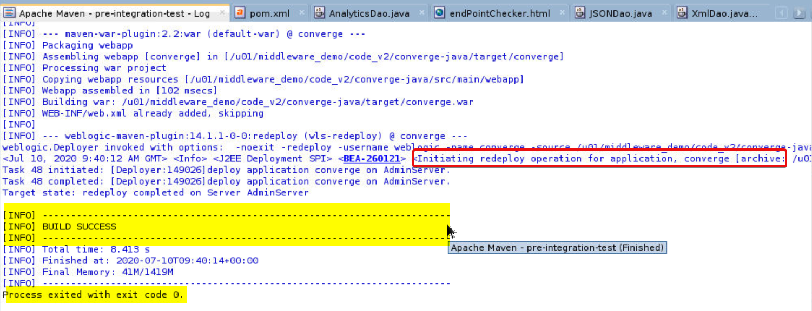

11.	Navigate back to browser to the **End Point Checker** tool at *`http://localhost:7101/resources/html/endPointChecker.html`*.

12.	Refresh couple of times to ensure avoiding pages from cache.

13.	Enter **292** as product ID and Click **Go** You will NOT see the product details as JSON in the text area., as we have set the price condition to $10, and the product we are trying to get data is worth $12.

    

14.	Enter product with ID **11** and click **Go**.

15.	You will see the product details retrieved as the price is $10.

    

 OPTIONAL
 You can also try the select statement in `GET_PRODUCT_BY_ID_JSON_QUERY` string in `JSONDao.java` which has a SQL statement containing built-in JSON operational functions `JSON_QUERY` and `JSON_VALUE` to handle the same request.

 `JSON_QUERY` finds one or more specified JSON values in JSON data and returns the values in a character string. expr. Use this clause to specify the JSON data to be evaluated. For expr , specify an expression that evaluates to a text literal.

 JSON_VALUE selects a scalar value from JSON data and returns it as a SQL value. You can also use `json_value` to create function-based B-tree indexes for use with JSON data — see Indexes for JSON Data. Function `json_value` has two required arguments and accepts optional returning and error clauses.
 Repeat the steps done above restrict product search to items with Price $10 by changing the query statement and re-deploying the app.

## Summary
To summarize, you have performed Create, Update, Retrieve and Delete functions on JSON data-type stored for eShop application in the converged database. You are also familiar with out of box functions provided by Oracle database to handle JSON data-type, modified SQL queries in java code to access JSON as data over REST.

You may now *proceed to the next lab*.

## Learn More
- [JSON](https://docs.oracle.com/en/database/oracle/oracle-database/19/adjsn/index.html)
- [REST-JSON using JDeveloper](https://docs.oracle.com/cd/E53569_01/tutorials/tut_jdev_maf_json/tut_jdev_maf_json.html)


## Acknowledgements
- **Authors** - Pradeep Chandramouli, Nishant Kaushik, Balasubramanian Ramamoorthy, Dhananjay Kumar, AppDev & Database Team, Oracle, October 2020
- **Contributors** - Robert Bates, Daniel Glasscock, Baba Shaik, Meghana Banka, Rene Fontcha
- **Last Updated By/Date** - Rene Fontcha, LiveLabs Platform Lead, NA Technology, December 2020
