# XML With Java

## Introduction
In this lab we will work on xml datatype in Converge database. You will insert sample data and create REST endpoint to access that XML data. You will learn how a line item within the XML data can be conditionally updated in JAVA code.

*Estimated Lab Time*: 30 Minutes

### About XML
XML(Extensible Markup Language) is used to store and transport data. XML data is known as self-describing or self-defining, meaning that the structure of the data is embedded with the data, thus when the data arrives there is no need to pre-build the structure to store the data; it is dynamically understood within the XML.

The basic building block of an XML document is an element, defined by tags. An element has a beginning and an ending tag. All elements in an XML document are contained in an outermost element known as the root element. XML can also support nested elements, or elements within elements. This ability allows XML to support hierarchical structures. Element names describe the content of the element, and the structure describes the relationship between the elements.

### Objectives
- Create table for XML data type
- Walk through the SQL queries having built-in functions for XML datatype
- Showcase creation of REST end-points for XML data retrieved

### Prerequisites
This lab assumes you have:
- A Free Tier, Paid or LiveLabs Oracle Cloud account
- You have completed:
    - Lab: Prepare Setup (*Free-tier* and *Paid Tenants* only)
    - Lab: Environment Setup
    - Lab: Initialize Environment
    - Lab: eSHOP Application
    - Lab: Data Type Demonstrator Tool

## Task 1: Connect JDeveloper to database

To show the ease of integration of ConvergedDB with Java applications to access and process data and to create REST endpoints in the Java application to access the different datatypes like JSON, XML and SPATIAL, we have a simple application installed along with the eSHOP application.

1.	Open JDeveloper in Studio Mode, if not open already.

2.	Click on **`Window -> Database -> Databases`** to open the Databases Navigation tab on the Left-Hand side of the JDeveloper editor.

    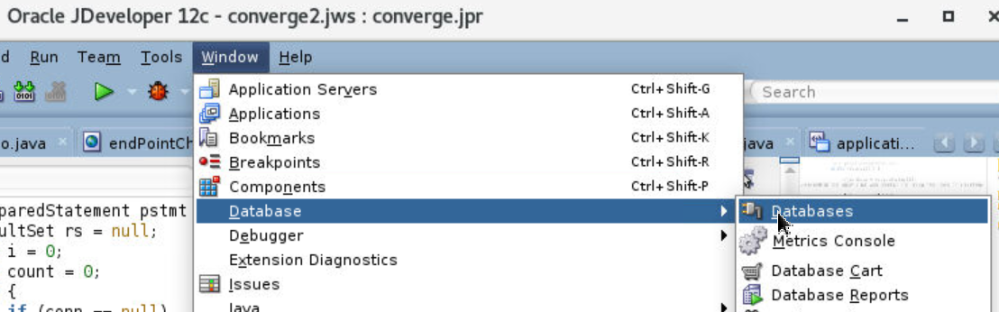

3.	Click on the green **+** icon under the **Databases** tab on Left-Hand side Navigation to “Create Database Connection”.
Provide the fields with the following values:

    - **Connection Name**: xml
    - **Connection Type**: Oracle(JDBC)
    - **Username**: appxml
    - **Password**: Oracle_4U
    - **Hostname**: localhost
    - **Service Name**: JXLPDB

    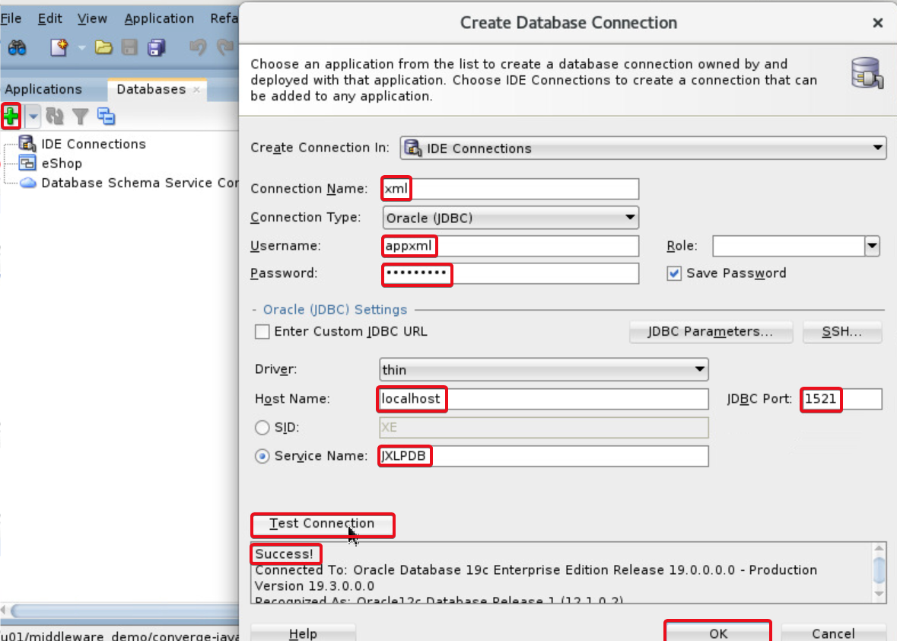

4.	Click on **Test Connection** and upon **Success!** message, Click **OK**.

## Task 2: Sample XML Data

1.	In the Menu bar, click on **SQL** dropdown and select **xml**.

    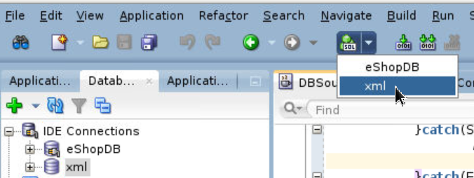

2.	A worksheet for connection **xml** opens up ,execute your query commands.

    ```
    <copy>
    CREATE TABLE XML_TYPE(doc XMLTYPE);
    </copy>
    ```

3.	Select the Text and Click on the Green **Play** Icon.

4.	You will see the **Table Created** message in the **Script Output** section below:

    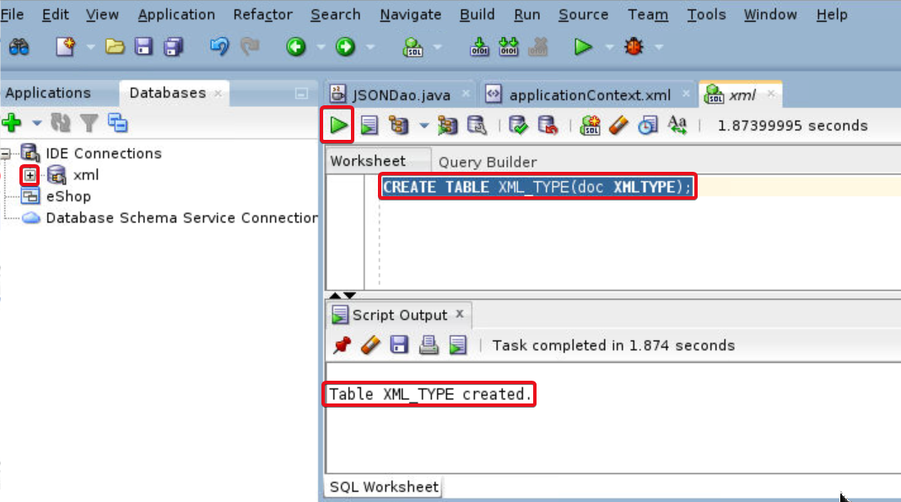

5.	Right Click on **Tables (Filtered)** on Left-Hand side and click **Refresh** to see the table created.

    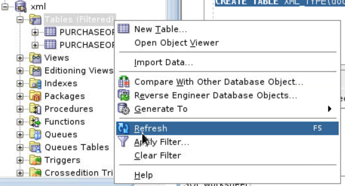

6.	Once you see the table **XML_TYPE** on the left-hand side of the worksheet, in a new line, key in the query below:

    ```
    <copy>
    select * from xml_type;
    </copy>
    ```

7.	Select the query line and again click the green **Play** button to execute the query to see no result.

    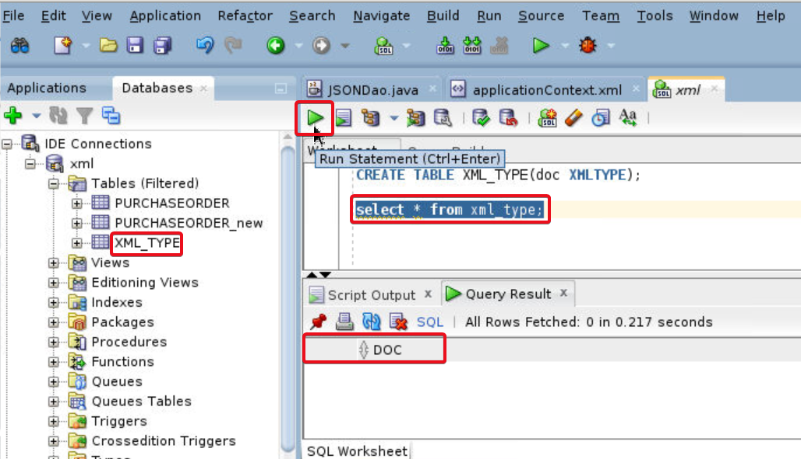

8.	In the worksheet, execute the below Insert statement to create sample xml data into database table xml_type. Select the statement and click on the green **Play** Icon to execute the insert statement.  

    ```
    <copy>
    insert into xml_type values ('<order><id>1</id><name>Java Developer 01</name><address><street>Oracle ParkWay</street><pincode>12345</pincode></address></order>');
    </copy>
    ```

    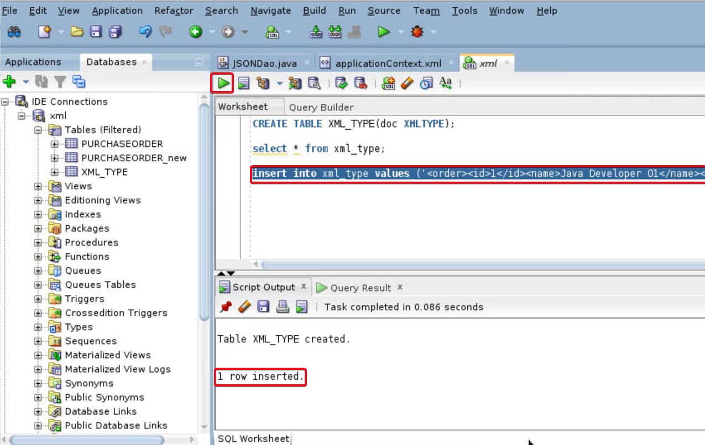

## Task 3: Modify JEE code for XML

1.	Under the Projects in **Applications** tab on the left Navigation, expand **`converge -> Resources`** and double click on **applicationContext.xml** to open the configuration xml to add the new datasource bean. Add the code below the **`</bean>`** tag of **converge.oracle.spatialAnalytics** and before ending **`</beans>`** tag.

    ```
    <copy>
    <bean id="xmldsbean" class="org.springframework.jndi.JndiObjectFactoryBean">
    <property name="jndiName" value="convergeddb.jsonxmlds"/>
    </bean>
    </copy>
    ```

    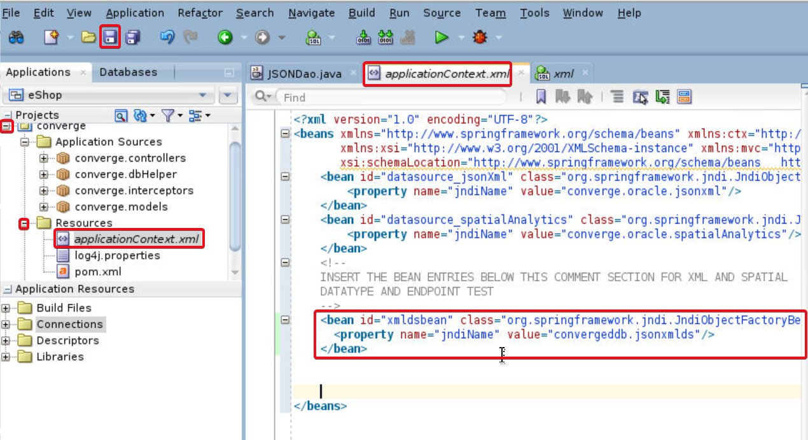

2.	Click on the **Save** Button.

3.	Similarly, open the **DBSource.java** file under **`Projects -> converge -> Application Sources`** -> **converge.dbHelper** by double clicking the file.

    Search for **getXMLDS** and navigate to the existing empty getXMLDS function. Copy and Paste the function **code** in the code file.  The java code for the function is as below:  

    ```
    <copy>
    public  Connection getXMLDS() throws SQLException {
        LOG.debug("Reached to get xml Connection");
        Connection con = null;
        ApplicationContext context = new ClassPathXmlApplicationContext("applicationContext.xml");
        xmlds = (DataSource) context.getBean("xmldsbean");

        try {
            con = xmlds.getConnection();
            con.setAutoCommit(false);
            LOG.info("Success connection");
        }catch(SQLException ex) {
            LOG.error(ex);
        }catch(Exception e) {
            LOG.error(e);
        }

        return con;
    }
    </copy>
    ```

    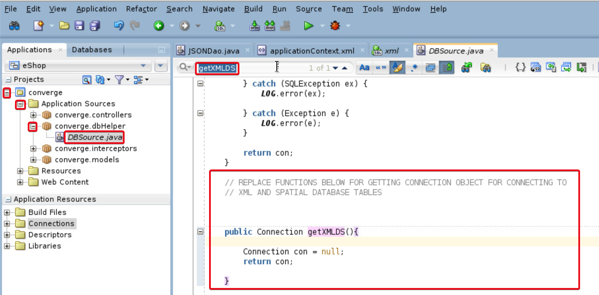

4.	Click on the **Save** icon to save the file.

    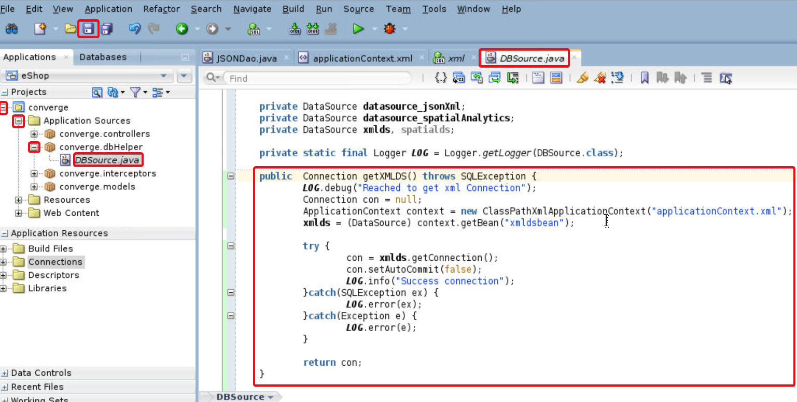

    It is assumed that the names of the DataSource parameters, function names and JNDI names to be the same as mentioned in the workshop manual and have coded the XmlController.java and the XMLDao.java having the business logic to retrieve the xml datatype from the `xml_type` table from the Oracle Converged Database in the PDB JXLPDB.

    The logic is so designed that the tags `<order><id></id></order>` is mandatory with `<id>` to have a numeric value.

    If you change any of it, the code may not compile and lead to errors.  Request you to stick to the naming conventions.

5.	Right Click on **Converge** under **Projects**.

6.	Click on **`Run Maven -> redeploy`**.

    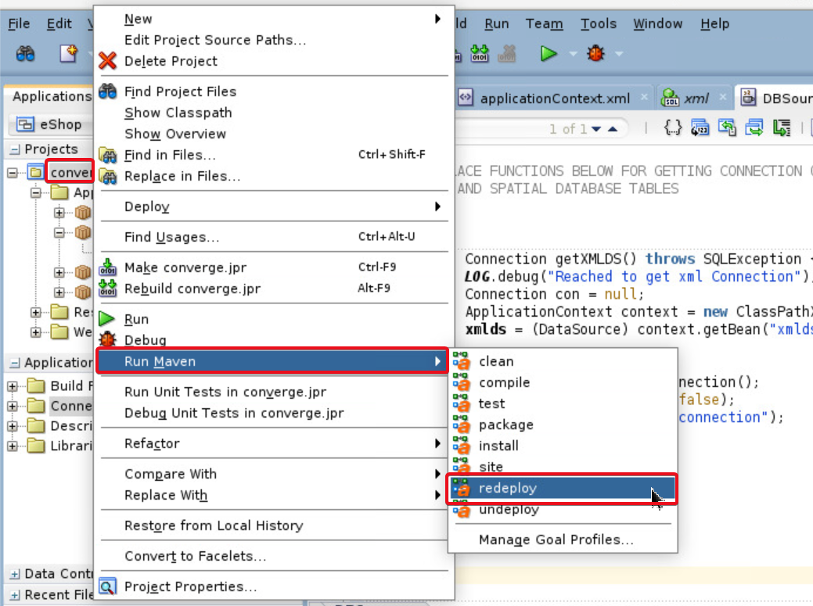

7.	In the JDeveloper Log message area, you will see the successful redeployment.

    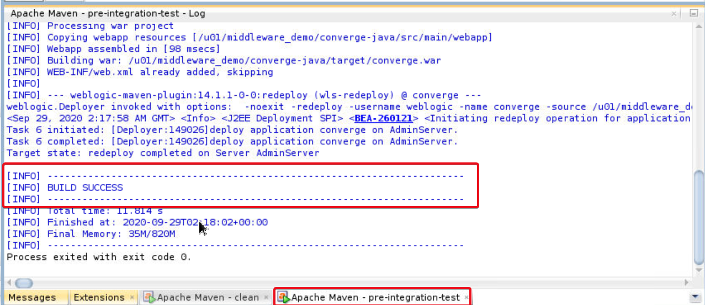

## Task 4: Read XML in tool

1.	On the web browser window on the right, navigate to *`http://localhost:7101/resources/html/endPointChecker.html`*.

2.	Click on the drop-down to see the list of datatypes shown in workshop.

3.	Select **XML** datatype and click on **Change View** button to change.

    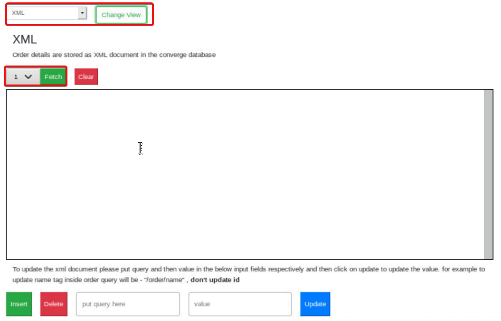

4.	You will see the only xml item inserted to the xml table with **ID 1** listed in the dropdown to fetch the details.

5.	Click on **Fetch** button select 1 from the dropdown.

    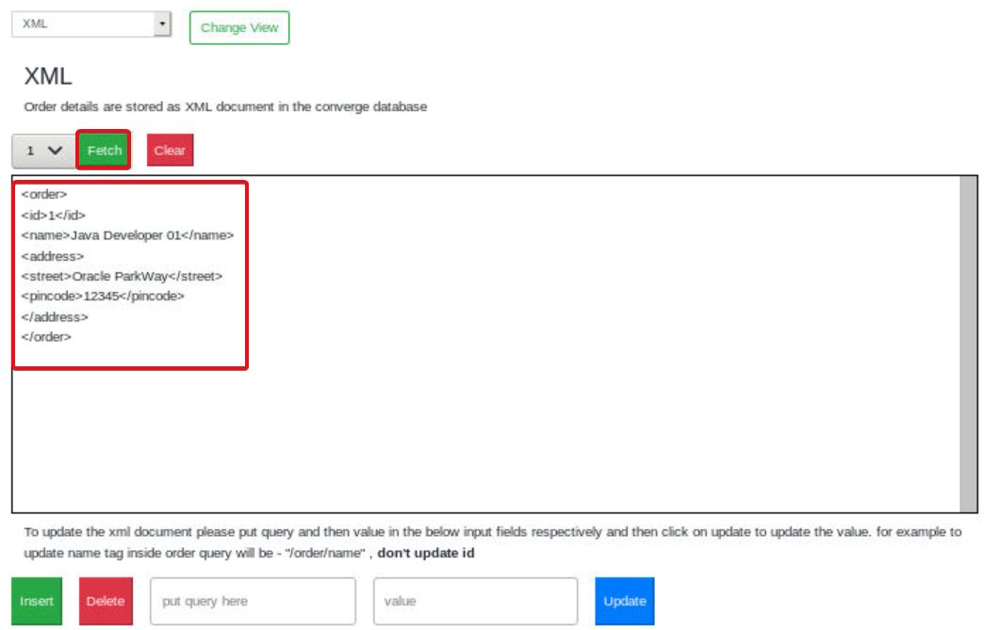

6.	Navigate back to JDeveloper and open **XMLDao.java** under **`converge -> Application Sources -> converge.controllers`**.

    

    The results are obtained by using the query under READ_XML string in XMLDao.java which has a built in functions offered for xml type handling called **XMLCAST** and **XMLQUERY**.

    **XMLQUERY** lets you query XML data in SQL statements. It takes an XQuery expression as a string literal, an optional context item, and other bind variables and returns the result of evaluating the XQuery expression using these input values. XQuery string is a complete XQuery expression, including prolog.

    **XMLCAST** casts `value_expression` to the scalar SQL datatype specified by datatype. The `value_expression` argument is a SQL expression that is evaluated. The datatype argument can be of datatype NUMBER, VARCHAR2, and any of the datetime datatypes.

## Task 5: XML REST end-point

1.	In JDeveloper, open **XMLController.java** under **`converge -> Application Sources -> converge.controllers`**. Search for **fetchXML** and check the function code.  The request mapping is done as **`/read/{id}`**.  The base rest end point being **`/xml`** for the code declared at the class level. Also see **`getXmlIds()`** function fetching all data by ID with rest end point **`/ids`**.

    

2.	On the web browser window on the right, open the URL `http://localhost:7101/xml/read/1` Data is retrieved by the fetchXml() method in XmlController.java.

    

3.	To retrieve all IDs, Open the URL `http://localhost:7101/xml/ids` Data is retrieved by the **getXmlIds()** method in XmlController.java.

    


## Task 6: Insert XML data

1.	Navigate back to **endpointchecker** tool to insert a xml record.

2.	Paste the text below as content in the text area and click on green **Insert** button.

    ```
    <copy>
    <order>
    <id>2</id>
    <name>Your Name</name>
    <address>
    <pincode>572102</pincode>
    </address>
    </order>
    </copy>
    ```

    

3.	The xml will be inserted and in the dropdown, you will see the newly added ID.

    

## Task 7: Update XML data

1.	**Fetch** the xml with **ID 2** to update it.

2.	In the **text box** next to **Delete** button specify the tag element you need to update and in the corresponding text box specify the value to which the tag item needs to be updated.

    Example, update the pincode value by providing `/order/address/pincode` as first parameter and 0000000  as the value.

    

3.	Click on the blue **Update** button to update record for **pincode**. You will see a confirmation message.    

    

4.	To confirm the update retrieve the xml with **ID 2** using the **Fetch** button. Check the updated pincode in data.

    

5.	Navigate back to JDeveloper and open **XMLDao.java**. Check the query under **UPDATE_XML** STRING.

    

    The Query uses updateXML function which is pre-built in database to support updates to data of xml datatype.

    **UPDATEXML** takes as arguments an XMLType instance and an XPath-value pair and returns an XMLType instance with the updated value. If `XPath_string` is an XML element, then the corresponding `value_expr` must be an XMLType instance.

## Task 8: Delete XML data

1.	Navigate back to **Data Type Demonstration Tool** and fetch the XML with **ID 2** from the dropdown.

2.	Click on **Delete**.

    

3.	Data with **ID 2** is disappeared from the dropdown and a deletion success message is shown.

    

    You have seen how easy it is to query the data points with in XML using the Oracle Converged Database’s built-in functions for XML data type.

## Summary
To summarize, you created a table to store XML data-type, performed CRUD operations on XML data-type stored in the converged database. You also got familiar with out of box functions provided by Oracle database to handle XML data-type, modified SQL queries in java code to access XML as data over REST.

You may now *proceed to the next lab*.

## Appendix: Data Type Demonstration Tool for XML - Issues
- You may not find any values in the drop down while trying to access XML data using this tool if XML data insertion is not complete.
- If your xml is not valid, the record will not be inserted.

## Learn More
- [XML](https://docs.oracle.com/en/database/oracle/oracle-database/19/adjsn/index.html)


## Acknowledgements
- **Authors** - Pradeep Chandramouli, Nishant Kaushik, Balasubramanian Ramamoorthy, Dhananjay Kumar, AppDev & Database Team, Oracle, October 2020
- **Contributors** - Robert Bates, Daniel Glasscock, Baba Shaik, Meghana Banka, Rene Fontcha
- **Last Updated By/Date** - Rene Fontcha, LiveLabs Platform Lead, NA Technology, December 2020
