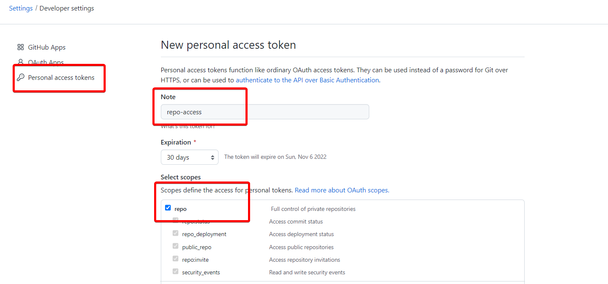

# Integrate GitHub with Jenkins for Liquibase with SQLcl Use Case

## Introduction

This lab will demonstrate how to integrate Jenkins and GitHub Repository using Github Branch Source Plugin for Liquibase with SQLcl Use Case.

Estimated Time:  10 minutes

### Objectives

* Complete GitHub Configuration
* Complete Jenkins Configuration
* Configure a Multibranch Pipeline
  
### Prerequisites

* This lab presumes you have already completed Lab 1 and all the required resources like Oracle ATP database, Jenkins, Kubernetes were successfully installed.
* As this is a demonstration of Jenkins/GitHub integration for CI/CD, **you must use your own GitHub account to run it.** We assume you completed this step in Setup lab.

## Task 1: Generate the GitHub Personal Access Token (PAT).

1. On your GitHub Account, click on your profile photo in the upper-right corner, then click Settings.

     

2. In the left sidebar, scroll down and click on Developer settings.

     

3. Under Developer Settings, navigate to Personal access tokens, and click on Generate new token.

     > **Note:** Do not select `repo` option for scope.

4. Personal access tokens function like ordinary OAuth access tokens. They can be used instead of a password for Git over HTTPS. In creating a new personal access token, you can add a Note to help you remember what the token is for. For example, you can set:

     ```bash
     <copy>
     repo-access
     </copy>
     ```

5. At the bottom of the page, click Generate token to complete the step and generate the token.

     
 
     > **Note:**  Copy and record your GitHub Personal Access Token in your note for later configuration steps.

## Task 2: Create the GitHub App

1. Login into your GitHub account. In your Github account, navigate to Settings -> Developer settings -> GitHub Apps.

    

2.  In the left sidebar, scroll down and click on Developer setting -> New Github App. 

    

3. Select `New GitHub App` (Confirm Password, if prompted).

    

4. Register a new GitHub Application and, unless other specified below, leave the defaults.

     GitHub App name: `Jenkins - < Github Account Name >`

      

     Homepage URL: Link to your GitHub Page

      

     Webhook URL: Link to your Jenkins Server

      

     > **Note:** Replace `jenkins.example.com` with public IP address of the Jenkins Compute Instance. **The trailing slash is important**
     > For Example: `http://192.168.58.189/github-webhook/`

     Update the following Repository permissions:

      * Commit statuses - Read and Write

        

      * Contents: Read-only

        

      * Pull requests: Read-only

        

      * Subscribe to events: Select All

        

     For `Where can this GitHub App be installed?` setting, check `Only on this account` option and click on `Create GitHub App`

      

     > **Note:** Record the App ID  in your note for later configuration steps.

5. Scroll down to `Private keys` and generate a private key by clicking `Generate a private key` button (will be prompted to save, save it to a safe location).

     

6. Scroll back up the page and click `Install App` and click `Install` next to your GitHub account name.

     

     On the next screen, choose `Only select repositories` options and pick `<your GitHub Repository Name>/microservices-datadriven` from the drop-down list.

      

7. On the next screen, click "App settings" and record the App ID for later use.

## Task 3: Convert the Private Key

1. Jenkins uses the private key which was saved in the previous step, convert it using the following command (replace the key name with the key name you saved):

     ```bash
     <copy>
     openssl pkcs8 -topk8 -inform PEM -outform PEM -in <key-in-your-downloads-folder.pem> -out converted-github-app.pem -nocrypt
     </copy>
     ```

     > **Note:** If openssl is not installed on your local machine, you can use OCI Cloud Shell to convert.

2. Open Cloud Shell from the OCI Console and change the directory to your home directory.

    

3. Either drag and drop the file from your local machine into the Cloud Shell window, or use the `Upload` button from the Cloud Shell hamburger menu.

    

4. Run the above openssl command in the Cloud Shell - it will create a converted private key converted-github-app.pem in your home directory you can use later for configuring Jenkins.

## Task 4: Add Jenkins Credentials

1. Open a new browser tab and login into your Jenkins console (Jenkins URL is being created during infrastructure setup and used in the previous lab) as ADMIN user and the password specified.

     `https://jenkins.example.com`

2. Navigate to `Manage Jenkins` and then click `Manage Credentials`.

     

3. Under `Stores scoped to Jenkins`, click `System`.

     

4. Click `Global credentials (unrestricted)`.

     

5. Click `Add Credentials` in the left-hand navigation bar.

     

     * Kind: `GitHub App`
     * ID: `GitHubAppDemo`
     * App ID: < App ID > (Recorded above in Task 2: Create the GitHub App )
     * Key: < Contents of converted-github-app.pem created above >

6. Click `Test Connection` which should be successful.

     

7. Click `OK`.

## Task 5: Add Database Credentials

1. On Jenkins dashboard, navigate to `Manage Jenkins` and click on `Manage Credentials`.

     

2. Under `Stores scoped to Jenkins`, click `System`.

     

3. Click `Global credentials (unrestricted)`.

     

4. Click `Add Credentials` in the left-hand navigation bar.

     

     * Kind: `Username with password`
     * Username: `ADMIN`
     * Password: `<Password for ADB Admin Account>`
     * ID: `ADB_ADMIN`

5. Click `Create`.

## Task 6: Add Global Variable for Database

1. In the OCI Console, navigate to Oracle Database -> Autonomous Database

2. Click on "DB2"

3. Record the value of "Database Name:"

4. On Jenkins dashboard, navigate to `Manage Jenkins` and click on `Configure System`.

5. Scroll down to "Global Properties", tick the "Environment variables" box, and click "Add"

    * Name:  ADB_NAME
    * Value: `<DB Name as found in OCI>`

6. Click "Apply"

## Task 7: Add a Multibranch Pipeline

1. On Jenkins dashboard, click on `New Item` and enter the name for the item: `Demonstration`.

2. Select `Multibranch Pipeline` and click `OK`.

     

3. Configure the following.

     

     * Display Name: `Demonstration`
     * Branch Source: `GitHub`
     * Credentials: `GitHubAppDemo`
     * Repository HTTPS URL: < Link to GitHub Repo; example: `https://github.com/<your GitHub Repository Name>/microservices-datadriven`

4. Click `Validate` under the `Repository HTTPS URL` field.

5. Response should be: `Credentials ok. Connected to <GitHub Repo>.`

6. Under "Build Configuration" update:
     * Script Path: workshops/dcms-cicd/jenkins/jenkinslab2/Jenkinsfile

7. Scroll down and `Save`.

8. A `Scan Repository Log` screen will appear with `Finished: SUCCESS`.

You may now **proceed to the next lab.**.

## Acknowledgements

* **Authors** - John Lathouwers, Developer Evangelist; Irina Granat, Consulting Member of Technical Staff, Oracle MAA and Exadata
* **Last Updated By/Date** - Irina Granat, July 20th, 2022
