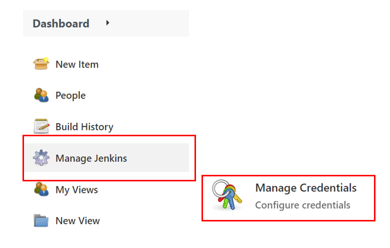
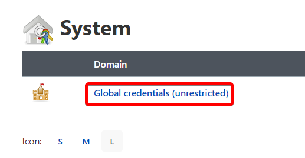

# Integrate Jenkins with GitHub and Oracle Cloud Infrastructure

## Introduction

This lab will demonstrate how to integrate Jenkins with GitHub and Oracle Cloud Infrastructure Services and build a pipeline.

GitHub provides webhook integration, so Jenkins starts running automated builds and tests after each code check-in. A sample web application Grabdish is modified and re-deployed as part of the CI/CD pipeline, which end users can access from the Container Engine for the Kubernetes cluster.

Estimated Time: 15 minutes

### Objectives

* Execute GitHub Configuration
* Execute Jenkins Configuration
* Configure a Pipeline

### Prerequisites

* This lab presumes you have already completed the earlier labs.
* As this is a demonstration of Jenkins/GitHub integration for CI/CD, **you must use your own GitHub account to run it.** We assume you completed this step in Setup lab.

## Task 1: Configure Jenkins Pipeline

1. A service account is needed to allow Jenkins to update the grabdish Kubernetes cluster. To create a service account, connect to the cloud shell and execute the following command.

     ```bash
     <copy>
     kubectl apply -f $DCMS_CICD_SETUP_DIR/kubernetes/service-account.yaml
     </copy>
     ```

     Kubernetes will create a secret token bound to the service account. Using below command retrieve the secret:

     ```bash
     <copy>
     kubectl -n kube-system describe secret $(kubectl -n kube-system get secret | grep kube-cicd | awk '{print $1}')
     </copy>
     ```

     Copy the secret token - you will use it in the next steps when creating a secret credential.

2. Open a new browser tab and login into your Jenkins console (Jenkins URL is being created during infrastructure setup).

     Retrieve Jenkins IP address through the OCI console. Check the public VM's public IP otherwise or check the Load Balancer jenkins-load-balancer's public IP if a load balancer was provisioned.

     Login into Jenkins console using username `admin` and password you created in the Setup lab.

     `https://jenkins.example.com`

3. Navigate to `Manage Jenkins` and then click `Manage Credentials`.

     

4. Under `Stores scoped to Jenkins`, click `Jenkins`.

     

5. Click `Global credentials (unrestricted)`.

     

6. Click `Add Credentials` in the left hand navigation bar.

     

     Kind: `Secret text`
     Scope: `Global`
     Secret: < Paste content of service account secret token created above >
     Click `OK`

    Add another credential by clicking **Add Credentials** in the left hand navigation bar.

     Kind: `Username with password`
     Username: Set Username
     Password: < Paste auth token as password - you can either retrieve the docker auth token through logs >
     Click `OK`

     > **Note:** Note the "Username with password" credential's ID for the next steps.

## Task 2: Configure Maven Tool

1. Navigate to `Manage Jenkins` and then click on `Global Tools Configuration`

     

     Under `Maven > Maven Installation`, add Maven with name **maven3**
     Click `Save`

## Task 3: Create a New Pipeline

1. On Jenkins Dashboard, click on `New Item` and enter the name for the item: `Demo`.

2. Select `Pipeline` and click `OK`.

     

3. Under `Build Triggers`, select `GitHub hook trigger for GITScm polling`.

4. Copy and Paste Jenkinsfile from the repository workshops/dcms-cicd/jenkins/Jenkinsfile

     

     Under `environment` section of Jenkinsfile, supply the missing values:

        ocir_credentials_id = ""
        region = ""
        namespace = ""

## Task 4: Add GitHub WebHook

1. Log into GitHub and click on the repository which has been integrated with Jenkins. Navigate to Settings -> Webhooks.

     

2. On GitHub settings - add a WebHook with the IP address of Jenkins console: `http://jenkins.example.com/github-webhook/`

> **Note:** Replace the Jenkins example with Jenkins public IP address. **The trailing slash is important**

You may now **proceed to the next lab.**.

## Acknowledgements

* **Authors** - Irina Granat, Consulting Member of Technical Staff, Oracle MAA and Exadata; Norman Aberin, Member of Technical Staff
* **Last Updated By/Date** - Irina Granat, June 2022
