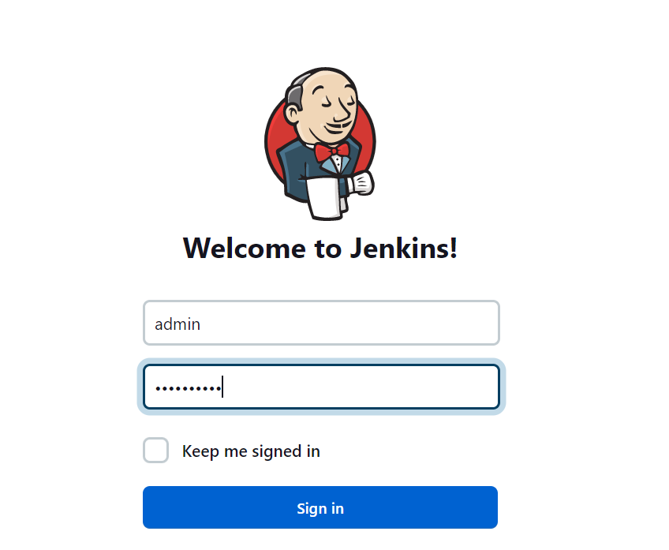
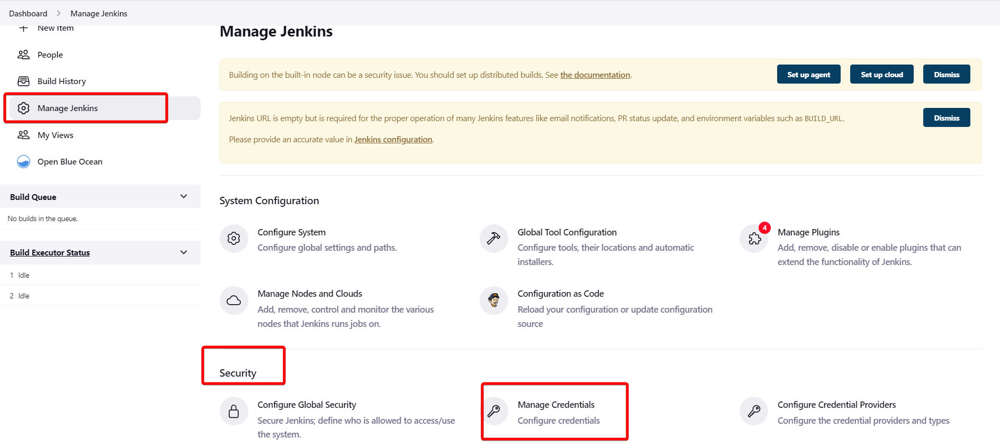
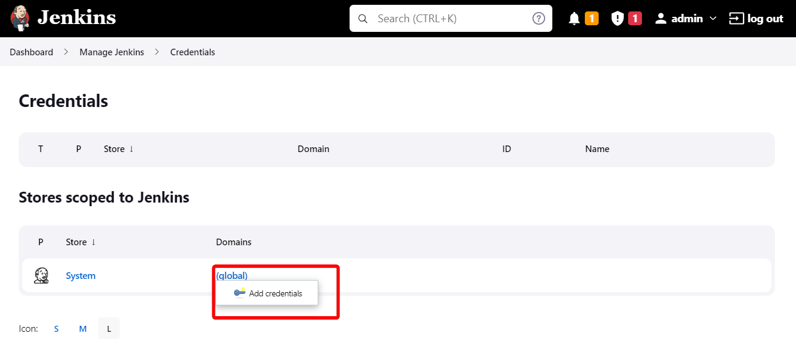
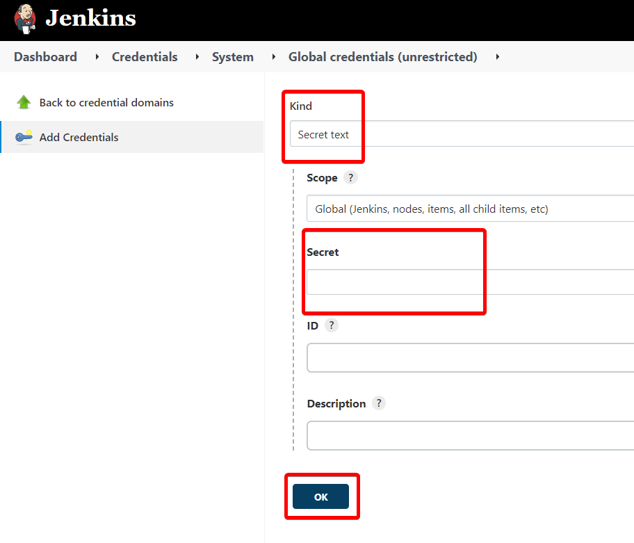
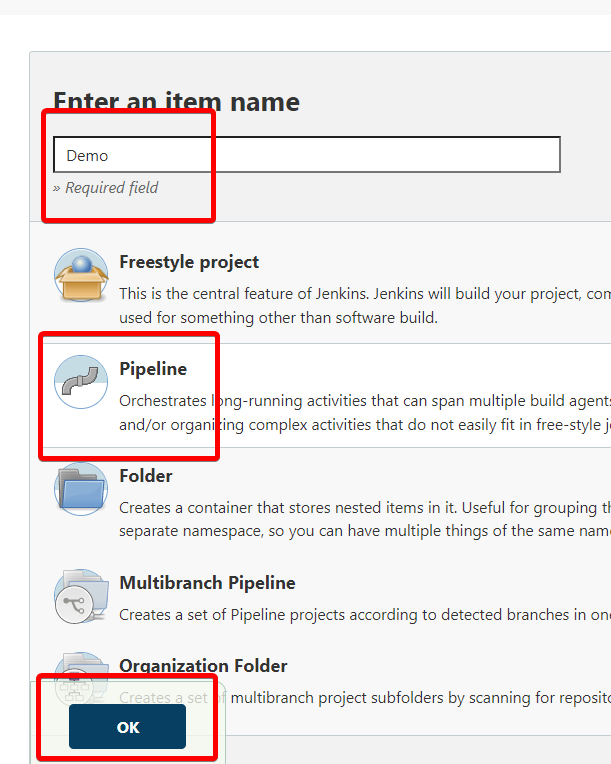
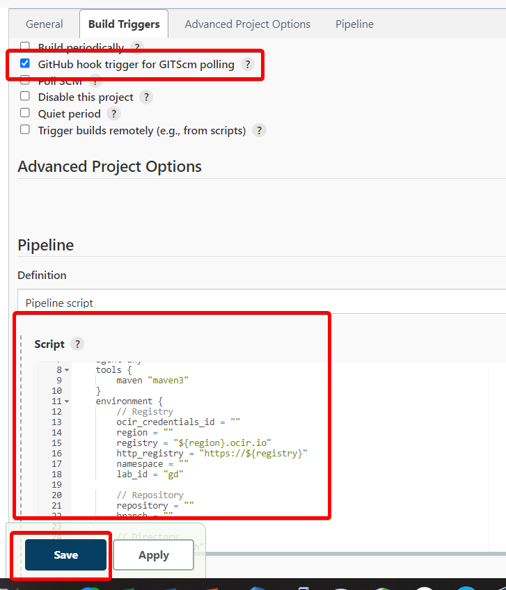
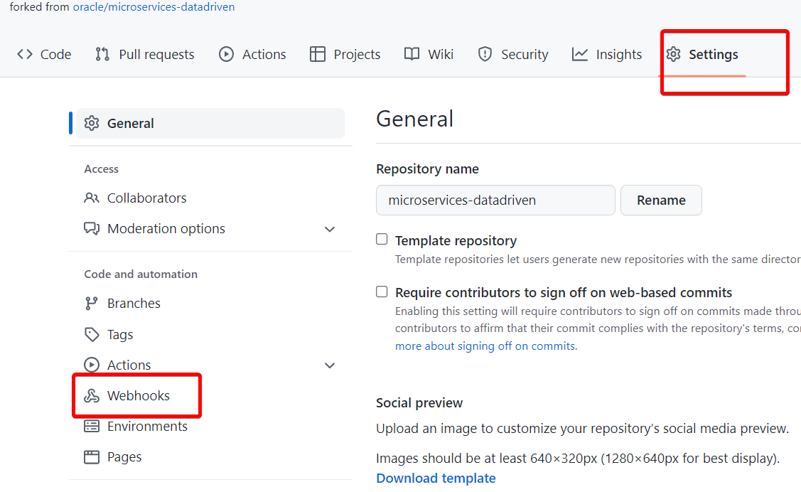

# Integrate Jenkins with GitHub and Oracle Cloud Infrastructure

## Introduction

This lab will demonstrate how to integrate Jenkins with GitHub and Oracle Cloud Infrastructure Services and build a pipeline.

GitHub provides webhook integration, so Jenkins starts running automated builds and tests after each code check-in. A sample web application Grabdish is modified and re-deployed as part of the CI/CD pipeline, which end users can access from the Container Engine for the Kubernetes cluster.

Estimated Time: 15 minutes

### Objectives

* Execute GitHub Configuration
* Execute Jenkins Configuration
* Configure a Pipeline

### Prerequisites

* This lab presumes you have already completed the earlier labs.
* As this is a demonstration of Jenkins/GitHub integration for CI/CD, **you must use your own GitHub account to run it.** We assume you completed this step in Setup lab.

## Task 1: Configure Jenkins Pipeline

1. A service account is needed to allow Jenkins to update the grabdish Kubernetes cluster. To create a service account, connect to the cloud shell and execute the following command.

    ```bash
    <copy>
    kubectl apply -f $DCMS_CICD_SETUP_DIR/kubernetes/service-account.yaml
    </copy>
    ```

    Kubernetes will create **a secret token** bound to the service account. Using below command retrieve the secret:

    ```bash
    <copy>
    kubectl -n kube-system get secret $(kubectl -n kube-system get secret | grep kube-cicd | awk '{print $1}') -o jsonpath='{.data.token}' | base64 -d
    </copy>
    ```

     Copy the secret token - you will use it in the next steps when creating a secret credential.

2. Open a new browser tab and login into your Jenkins console as ADMIN user using Jenkins Public IP from **Lab 2: Task 1** and the password you supplied during Jenkins setup run: `https://jenkins.example.com`

   

3. Navigate to the Jenkins credentials store to create credentials

      1. From the Home page, click on `Manage Jenkins`.

        

      2. From the Manage Jenkins page, Under Security, click `Manage Credentials`.

      3. Hover over (`global`), the domain for the Jenkins Store (under Stores scoped to Jenkins).

      4. Click on the dropdown.

4. Create Service Account Token credentials
   This credential will be used to connect to OCI OKE cluster

      1. Click on `Add Credentials` and add the secret text credentials

        

        

        ```bash
        Kind: `Secret text`
        Scope: `Global`
        Secret: <Paste content of service account secret token created above>
        ID:  `CLUSTER_TOKEN`
        Click `Create`
        ```
        > **Note:** Keep CLUSTER_TOKEN as the credential ID and save it in your notes for the next steps.

5. Create OCI Registry credential
   
   This credential will be used to connect to your container registry. The credential contains your auth token and OCI username value.The auth token is being used to connect to your OCI Registry.
 
      1. Retrieve the auth token       
         
        Open cloud shell and run the following command:

        ```bash
        <copy>
        cat $DCMS_CICD_LOG_DIR/../../dcms-oci-run/vault/vault/DOCKER_AUTH_TOKEN
        </copy>
        ``` 

      2. Retrieve OCI tenancy namespace
      
        Run the following command via Cloud Shell:
        
        ```bash
        <copy>
        oci os ns get | jq -r .data
        </copy>
        ```
       
        > **Note:** You also can retrieve OCI tenancy name vi OCI Console.

      3. Add OCI Registry credential by clicking **Add Credentials** in the left hand navigation bar.

        ```bash
        Kind: `Username with password`
        Username: <tenancy_namespace>/oracleidentitycloudservice/username>
        Password: <Paste auth token as the password created during infra setup - you can retrieve the docker auth token value from the step above >
        ID: `OCIR_CREDENTIAL`
        Click `Create`
        ```

        > **Note:** If you login into your tenancy as a federated user, use this format <tenancy-namespace>/oracleidentitycloudservice/<username> for your username value. Otherwise, use <tenancy-namespace>/<username>

## Task 2: Configure Maven Tool

1. Navigate to `Manage Jenkins` and then click on `Global Tools Configuration`

     

     Under `Maven > Maven Installation`, add Maven with name **maven3**
     Click `Save`

## Task 3: Create a New Pipeline

1. On Jenkins Dashboard, create a new Pipeline by clicking on `New Item` and enter the name for the item: `Demo`.

2. Select `Pipeline` and click `OK`.

     

3. Under `Build Triggers`, select `GitHub hook trigger for GITScm polling`.

4. Copy and Paste Jenkinsfile from the repository workshops/dcms-cicd/jenkins/jenkinslab1/


     

     Under `environment` section of Jenkinsfile, provide the values for the following variables:

      ```bash
      ocir_credentials_id = ""
      region = ""
      namespace = ""
      kube_cluster_credentials_id = ""
      kube_cluster_server_url = ""
      kube_cluster_name = ""
      repository = ""
      branch = ""
      ```
      1. For `ocir_credentials_id value`, please enter `OCIR_CREDENTIAL` ID created in the previous step

      2. For `region` value, execute the following command via Cloud Shell:

        ```bash
        <copy>
        echo $OCI_REGION
        </copy>
        ```
     
      3. For namespace, use the namespace value retrieved i the previous step.

      4. For `kube_cluster_credentials_id` value, please enter `CLUSTER_TOKEN` ID created in the previous step

      5. For `kube_cluster_server_url`value, execute the following command via Cloud Shell

        ```bash
        <copy>
        kubectl config view --minify -o jsonpath='{.clusters[0].cluster.server}{"\n"}'
        </copy>
        ```
      
      6. For `kube_cluster_server_url`value, execute the following command via Cloud Shell

        ```bash
        <copy>
        kubectl config view --minify -o jsonpath='{.clusters[0].name}{"\n"}'
        </copy>
        ```
      7.  For `repository` value, use your repository URL: `https://github.com/<username>/microservices-datadriven`
      
      8. For `branch` value, use `main`

    Here is an example of how the values should look like:

      ```bash
      ocir_credentials_id = "OCIR_CREDENTIAL"
      region = "us-ashburn-1"
      namespace = "XXXXXXX"
      kube_cluster_credentials_id = "CLUSTER_TOKEN"
      kube_cluster_server_url = "https://XXX.XXX.XXX.XX:XXX"
      kube_cluster_name = "cluster_XXXXXXX"
      repository = "https://github.com/irinagranat/microservices-datadriven"
      branch = "main"
      ```
5. Click Save

   With the pipeline configured, build the pipeline initially to enable Jenkins to register all pipeline parameters and settings. Once you press Save, Jenkins will navigate automatically to that specific pipeline.

## Task 4: Add GitHub WebHook

1. Log into GitHub and click on the repository which has been integrated with Jenkins. Navigate to Settings -> Webhooks.

     

2. On GitHub settings - add a WebHook with the IP address of Jenkins console: `http://jenkins.example.com/github-webhook/`

   > **Note:** Replace the Jenkins example with Jenkins public IP address. **The trailing slash is important**

You may now **proceed to the next lab.**.

## Acknowledgements

* **Authors** - Irina Granat, Consulting Member of Technical Staff, Oracle MAA and Exadata; Norman Aberin, Member of Technical Staff
* **Last Updated By/Date** - Irina Granat, June 2022
