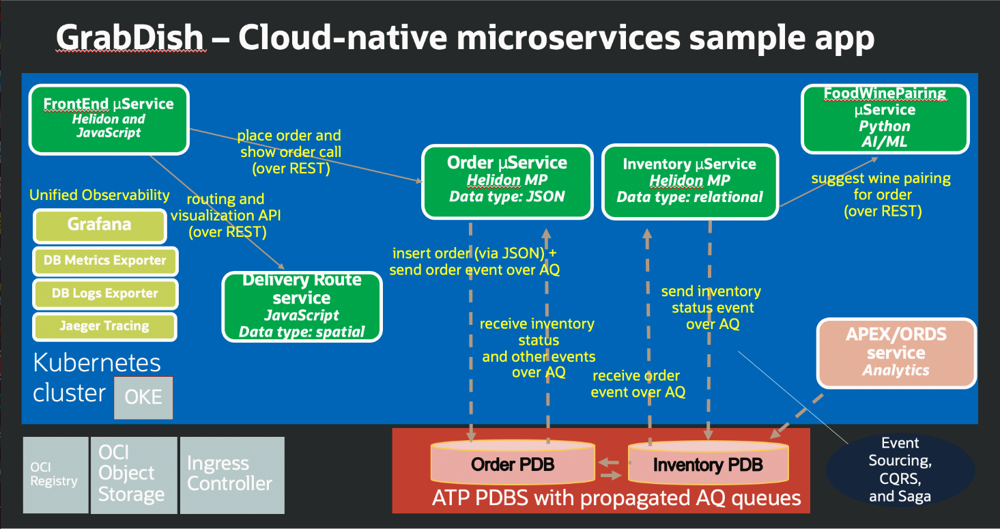

# Introduction

## About this Workshop

CI/CD is a key ingredient for agile application development and deployment on the cloud. Technical tools like Github and Jenkins give DevOps team members the ability to automate an entire end-to-end CI/CD pipeline, and Oracle Database Developer Tools address the database change management challenges.

This workshop illustrates how you can leverage the services like Autonomous Database together with tools such as Jenkins and Liquibase to provide end-to-end continuous integration and delivery experience.

Estimated Workshop Time: 75 minutes

### About Product/Technology

Helidon microservices with Javascript front-end will be deployed on Oracle Cloud Infrastructure Kubernetes cluster (OKE) and access pluggable Oracle Autonomous Transaction Processing databases. 

Jenkins is hosted on Oracle Cloud Infrastructure to centralize build automation and scale the deployment by using Oracle Cloud Infrastructure Registry and Container Engine for Kubernetes. GitHub is being for source code management.

### Objectives

- Learn how to automate the continuous integration (CI) and continuous delivery and deployment (CD) pipelines for your application development using Jenkins.
- Learn how to host it on Oracle Cloud Infrastructure to centralize build automation and scale the deployment by using Oracle Cloud Infrastructure Registry and Container Engine for Kubernetes. 
- Learn how Oracle Database addresses the change management challenges with its tools like SQLcl and Liquibase for managing database change tracking.

### Prerequisites

 - An Oracle Cloud Account - Please view this workshop's LiveLabs landing page to see which environments are supported.

  > **Note:** If you have a **Free Trial** account, when your Free Trial expires your account will be converted to an **Always Free** account. You will not be able to conduct Free Tier workshops unless the Always Free environment is available.
 **[Click here for the Free Tier FAQ page.](https://www.oracle.com/cloud/free/faq.html)**

 The "GrabDish" application and related infrastructure used in the Simplify Microservices with converged Oracle Database Workshop and shown below will be reused for this workshop, however, the focus will be on observability.

 We encourage you to check out the other workshop if you are interested in learning more about the technical capabilities inside and outside the Oracle converged database to support scalable data and event-driven microservices architectures, polyglot microservices, data and transaction patterns, etc.

 

 You may now **proceed to the next lab.**

## Want to Learn More?

* [Multitenant Database–Oracle 19c](https://www.oracle.com/database/technologies/multitenant.html)
* [Oracle Advanced Queuing](https://docs.oracle.com/en/database/oracle/oracle-database/19/adque/aq-introduction.html)
* [Microservices Architecture with the Oracle Database](https://www.oracle.com/technetwork/database/availability/trn5515-microserviceswithoracle-5187372.pdf)
* [https://developer.oracle.com/](https://developer.oracle.com/)

## Acknowledgements
* **Authors** - Irina Granat, Consulting Member of Technical Staff, Oracle MAA and Exadata
* **Last Updated By/Date** - Irina Granat, June 2022
