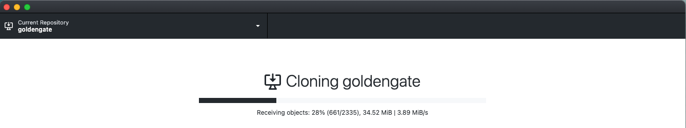

# Build CI/CD Pipeline by Using Jenkins and Oracle Cloud Infrastracture

## Introduction

This lab will walk you through CI/CD workflow using the pipeline built in the previous lab.
Estimated Time: 20 minutes

### Objectives

* CI/CD Workflow Walkthrough
  
### Prerequisites

* This lab presumes you have already completed the earlier labs and setup a workshop repository in your own GitHub account.
* Oracle Cloud Infrastructure Services, like OKE cluster, OCIR and the Autonomous Transaction Processing databases, GitHub and Jenkins that you created and configred in earlier labs
* The latest version of Git, GitHub Desktop (https://desktop.github.com/) and your preferred editor, such as Visual Studio Code, or IntelliJ Idea installed locally on your computer.

a clone is a copy of your forked repository that lives on your local computer instead of on GitHub Web UI.

## Task 1: Clone Forked Repository

A clone is a copy of your forked repository that lives on your local computer instead of on GitHub Web UI. When you clone your forked repository, you can edit the files in your preferred editor, such as  Visual Studio Code, or IntelliJ Idea and use the GitHub Desktop client to keep track of your changes without having to be online.

To clone the forked repository:

1. Open your GitHub Desktop application and log in using your GitHub account.

2. Click File > Clone repository to display the Clone a Repository dialog box.

   

3. Select your repository such as your account/repo from your epositories. In this example, select arabellayao/goldengate. Under Local Path, select the local path on your machine where the repository is going to be cloned (copied). This is where the repository files get copied to your local file system. Click Clone.

    

4. The cloning process may take several minutes.

    

5. When asked how you plan to use the fork, select To contribute to the parent project. Click Continue.

     

6. The repository files (in this case, microservices-datadriven) appear in the local path you just specified. You can now start working on the next task!

> **Note:** The local cloned repository is connected to the remote fork version. You can push your local clone changes to the remote fork version when you are online to keep them in sync.

When you make a clone, you can create your project folder, edit the files in your preferred editor, such as Visual Studio Code or IntelliJ Idea, and use GitHub Desktop to keep track of your changes without having to be online.

You can use Github Desktop to synchronize the changes that you have made in your local file system to the forked content on your GitHub repo.

   

## Task 2: CI/CD Workflow Walkthrough 
 
1. Update the grabdish/frontend-helidon/...version.txt
3. Save all
4. Open Github Desktop
5. Check Repository Setting - https://github.com/renagranat/microservices-datadriven.git
6. Save and Push to github Repository
7. Check Jenkins pipeline, observe Jenkins job created – review the log

  
You may now **proceed to the next lab.**.

## Acknowledgements

* **Authors** - Irina Granat, Consulting Member of Technical Staff, Oracle MAA and Exadata; Norman Aberin, Member of Technical Staff
* **Last Updated By/Date** - Irina Granat, June 2022
