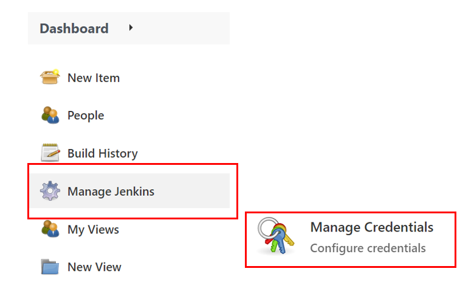
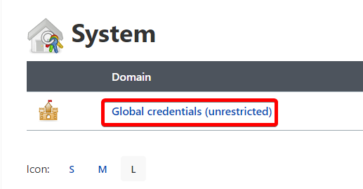

# Build CI/CD Pipeline by Using Jenkins and Oracle Cloud Infrastracture

## Introduction

This lab will demonstrate how to integrate Jenkins with Oracle Kubernetes and build a pipeline.

GitHub provides web hook integration, so Jenkins starts running automated builds and tests after each code check-in. A sample web application Grabdish is modified and re-deployed as part of CI/CD pipeline, which end users can access from the Container Engine for Kubernetes cluster. 

Estimated Time: 20 minutes

### Objectives

* Execute GitHub Configuration
* Execute Jenkins Configuration
* Configure a Pipeline
* CI/CD Workflow Walkthrough
  
### Prerequisites

This lab presumes you have already completed the earlier labs.

As this is a demonstration of Jenkins/GitHub integration for CI/CD, **you must use your own GitHub account to run it. Please fork or copy the microservices repository into your own GitHub account before continuing https://github.com/oracle/microservices-datadriven.**

## Task 1: Configure Jenkins Pipeline

1. A service account is needed to allow Jenkins to update the grabdish kubernetes cluster. To create a service account, connect to cloud shell and execute the following command:
    
     ```
     <copy>
     kubectl apply -f $DCMS_CICD_SETUP_DIR/kubernetes/service-account.yaml
     </copy>
     ```

   - Kubernetes will create a secret token bound to the service account. Using below command retrieve the secret:

     ```
     <copy>
     kubectl -n kube-system describe secret $(kubectl -n kube-system get secret | grep kube-cicd | awk '{print $1}')
     </copy>
     ```
     - Copy the secret token - you will use in the next steps while creating a secret credential.

2. Open a new browser tab and login into your Jenkins console (Jenkins URL is being created during infrastructure setupb). 
   
   - Retrieve Jenkins IP address through the console:
   - Check the public VM's public IP otherwise or check the Load Balancer jenkins-load-balancer's public IP if a load balancer was provisioned. 
   - Login into Jenkins console using username `admin` and password you created in the setup lab.

    `https://jenkins.example.com`

3. Navigate to `Manage Jenkins` and then click `Manage Credentials`.

     

4. Under `Stores scoped to Jenkins`, click `Jenkins`.

     
     
5. Click `Global credentials (unrestricted)`.

     

6. Click `Add Credentials` in the left hand navigation bar.

     

     - Kind: `Secret text`
     - Scope: `Global`
     - Secret: < Paste content of service account secret token created above >
     - Click `OK`

   Add another credential by clicking `Add Credentials` in the left hand navigation bar.

     - Kind: `Username with password`
     - Username: Set Username
     - Password: < Paste auth token as password - Retrieve docker auth token through logs >
     - Click `OK`

     > **Note:** Note the "Username with password" credential's ID for the next steps.

## Task 2: Configure Maven Tool

1. Navigate to `Manage Jenkins` and then click on `Global Tools Configuration`

     

     - Under `Maven > Maven Installation`, add Maven with name "maven3"
     - Click `Save`

## Task 3: Create a New Pipeline

1. Under Build Triggers, Select GitHub hook trigger for GITScm polling
  Copy and Paste Jenkinsfile from the repository workshops/dcms-cicd/jenkins/Jenkinsfile
  Supply the missing values under environment
  Add GitHub WebHook
  On GitHub settings - add a WebHook with the IP address of Jenkins console: http://<ip-address>/github-webhook/

## Task 4: CI/CD Workflow Walkthrough

1. Connect to cloud shell
 kubectl get pods --all-namespaces
 kubectl get services --all-namespaces

@cloudshell:grabdish (us-sanjose-1)$ kubectl get pods --all-namespaces

 You are ready to access the frontend page. Open a new browser tab and enter the external IP URL:
 https://<EXTERNAL-IP>
 Note: For convenience a self-signed certificate is used to secure this https address and so it is likely you will be prompted by the browser to allow access.
 You will be prompted to authenticate to access the Front End microservices. The user is grabdish and the password is the one you entered in Lab 1.
 Make Application Changes (DevOps experience)
  Open Visual Studio Code
  Navigate to grabdish/frontend-helidon/...spatial.html
 <p class="oj-text-color-secondary oj-typography-subheading-xs">Data-driven Microservices with Converged Oracle Databases</p>
 </div>
 
2. Update the grabdish/frontend-helidon/...version.txt
3. Save all
4. Open Github Desktop
5. Check Repository Setting - https://github.com/renagranat/microservices-datadriven.git
6. Save and Push to github Repository
7. Check Jenkins pipeline, observe Jenkins job created – review the log

  
You may now **proceed to the next lab.**.

## Acknowledgements
* **Authors** - Irina Granat, Consulting Member of Technical Staff, Oracle MAA and Exadata
* **Last Updated By/Date** - Irina Granat, June 2022
