# Integrating GitHub Repository with Jenkins for Liquibase with SQLcl Use Case

## Introduction

This lab will demonstrate how to integrate Jenkins and GitHub Repository using Github Branch Source Plugin

Estimated Time:  15 minutes

### Objectives

* Execute GitHub Configuration
* Execute Jenkins Configuration
* Configure a Multibranch Pipeline
  
### Prerequisites

This lab presumes you have already completed the earlier labs. 

## Task 1: Log in to the GitHub Account

1. Log in into your GitHub Account.

## Task 2: Create the GitHub App

1. In your Github Account, navigate to Settings -> Developer settings -> GitHub Apps.

  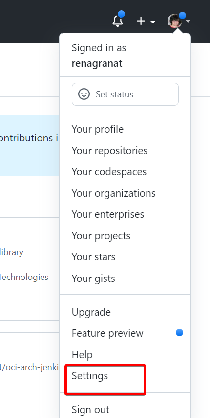

2. Select "New GitHub App" (Confirm Password, if prompted).

  

3. Register a new GitHub Application and, unless other specified below, leave the defaults.

     GitHub App name: Jenkins - < Github Account Name >

      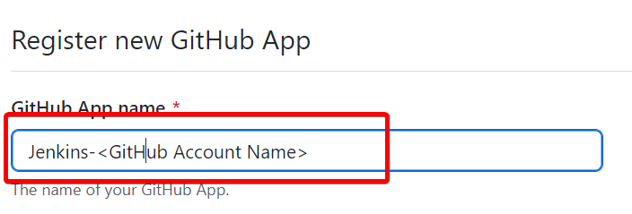

     Homepage URL: Link to your GitHub Page
     
      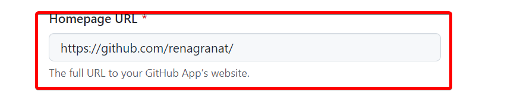

     Webhook URL: Link to your Jenkins Server
     
      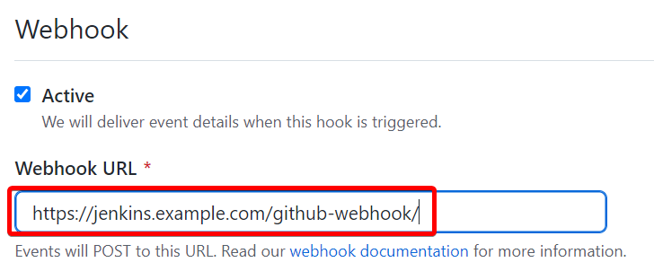

     > **Note:** Replace the Jenkins example with Jenkins public IP address. **The trailing slash is important**

     Update the following Repository permissions:

      - Commit statuses - Read and Write

        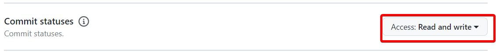 

      - Contents: Read-only

        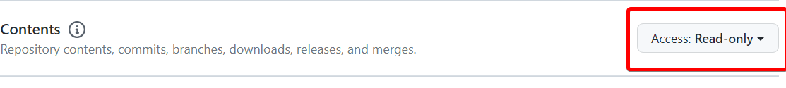

      - Pull requests: Read-only

        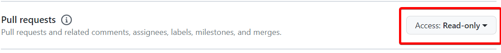

      - Subscribe to events: Select All

        

     For "Where can this GitHub App be installed?" setting, check "Only on this account" option and click on "Create GitHub App"

      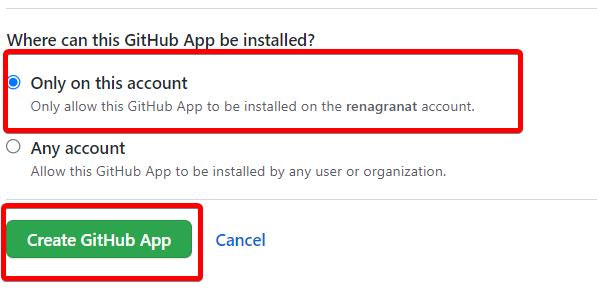

     > **Note:** Record the App ID to be used later.

6. Scroll down to "Private keys" and generate a private key by clicking "Generate a private key" button (will be prompted to save, save it to a safe location).

     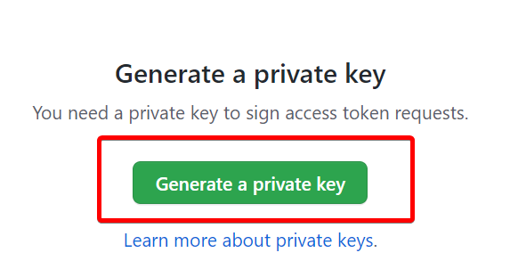

7. Scroll back up the page and click "Install App" and click "Install" next to your GitHub account name.

     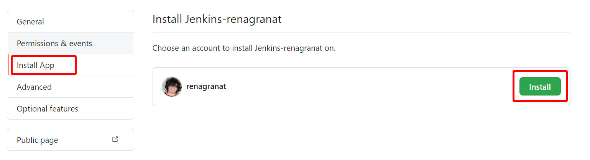

     On the next screen, choose "Only select repositories" options and pick <your GitHub Repository Name>/<repo_name> from the drop down list.

      
       
## Task 2: Convert the Private Key

1. In order for Jenkins to use the private key, saved in the previous step, convert it using the following command (replace the key name with the key name you saved): 

     ```
     <copy>
     openssl pkcs8 -topk8 -inform PEM -outform PEM -in <key-in-your-downloads-folder.pem> -out converted-github-app.pem -nocrypt
     </copy>
     ```
        
     > **Note:** If openssl is not installed on your local machine, you can use OCI Cloud Shell to convert.

2. Open Cloud Shell from the OCI Console and change directory to your home directory.

  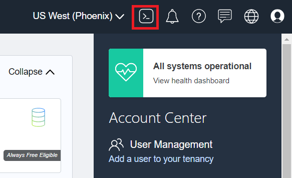

3. Either drag and drop the file from your local machine into the Cloud Shell window, or use the "Upload" button from the Cloud Shell hamburger menu.

  

4. Run the above openssl command in the Cloud Shell - it will create a converted private key converted-github-app.pem in your home directory you can use later for configuring Jenkins.

## Task 3: Add Jenkins Credential

1. Open a new browser tab and login into your Jenkins Controller (Jenkins URL is being created during infrastructure setup and used in the previous lab) as ADMIN user and the password specified.
   
     `https://jenkins.example.com`

2. Navigate to: Manage Jenkins > Manage Credentials.

     

3. Under "Stores scoped to Jenkins", click "Jenkins".

     
     
4. Click "Global credentials (unrestricted)".

     

5. Click "Add Credentials" in the Left Hand Navigation bar.

     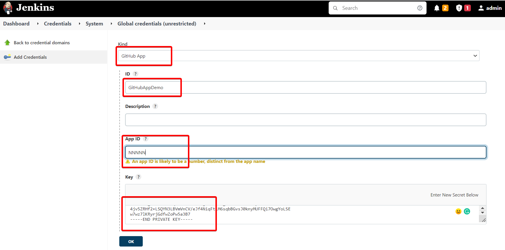

     - Kind: GitHub App
     - ID: GitHubAppDemo
     - App ID: < App ID > (Recorded above)
     - Key: < Contents of converted-github-app.pem created above >

6. Click "Test Connection" which should be successful.

     

7. Click "OK".

## Task 4: Add Database Credentials

1. On Jenkins Dasboard, navigate to: Manage Jenkins > Manage Credentials.

     

2. Under "Stores scoped to Jenkins", click "Jenkins".

     
     
3. Click "Global credentials (unrestricted)".

     

4. Click "Add Credentials" in the Left Hand Navigation bar.

     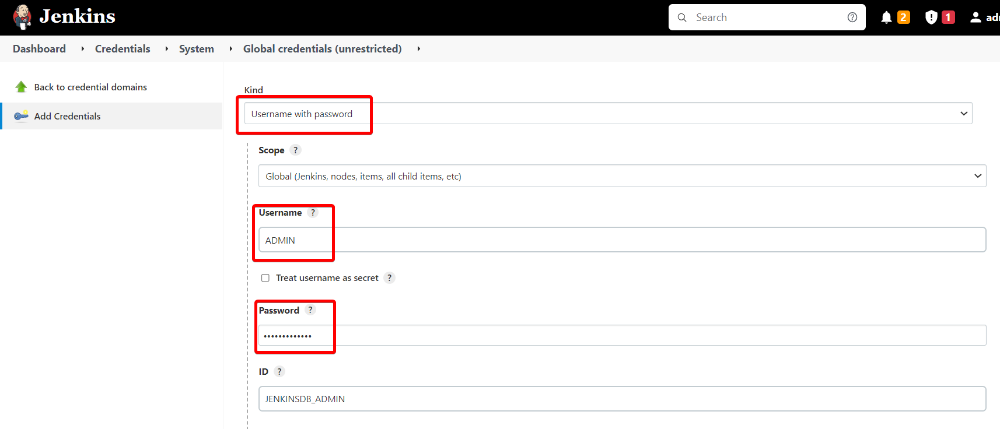

     - Kind: Username with password
     - Username: ADMIN
     - Password: <Password for ADB Admin Account>
     - ID: JENKINSDB_ADMIN

9. Click "OK".

## Task 5: Add an Multibranch Pipeline

1. On Jenkins Dasboard, click on "New Item" and enter the name for the item: "Demonstration".

2. Select "Multibranch Pipeline" and click "OK".

     

3. Configure the following.

     

     - Display Name: Demonstration
     - Branch Source: GitHub
     - Credentials: GitHubAppDemo
     - Repository HTTPS URL: < Link to GitHub Repo; example: https://github.com/<your GitHub Repository Name>/oci-liquibase-jenkins>

4. Click "Validate" under the "Repository HTTPS URL" field.

5. Response should be: "Credentials ok. Connected to <GitHub Repo>."

6. Scroll down and "Save".

7. A "Scan Repository Log" screen will appear with "Finished: SUCCESS".
   
You may now **proceed to the next lab.**.

## Acknowledgements
* **Authors** - Irina Granat, Consulting Member of Technical Staff, Oracle MAA and Exadata
* **Last Updated By/Date** - Irina Granat, June 2022
