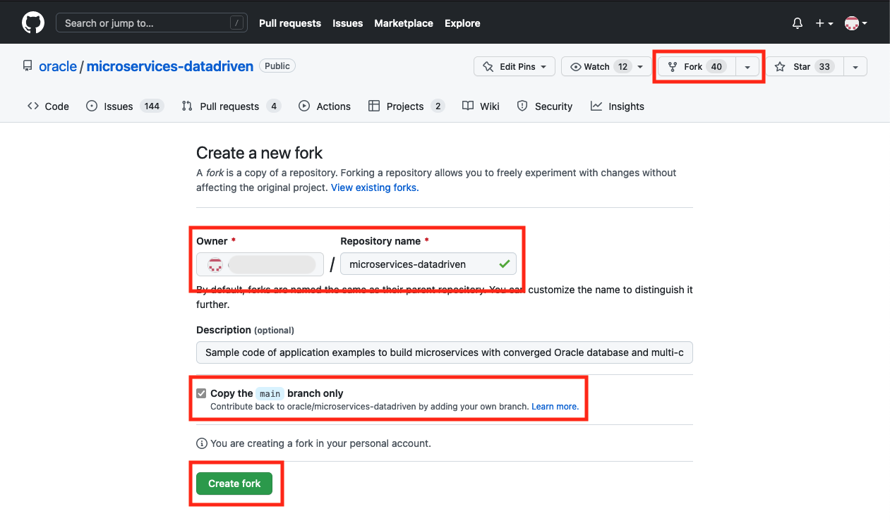
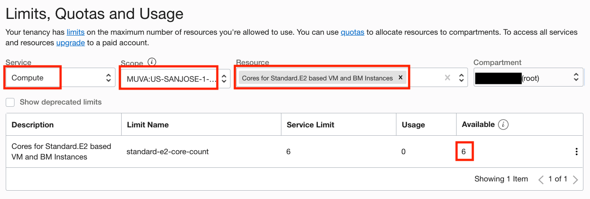
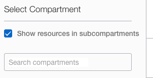
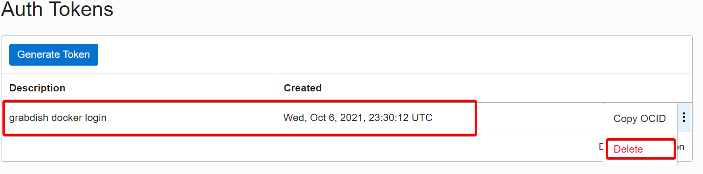

# Setup

## Introduction

In this lab, we will provision and setup the reference architecture.

In this reference architecture, Jenkins is hosted on Oracle Cloud Infrastructure to centralize build automation and scale the deployment by using Oracle Cloud Infrastructure Registry, Oracle Kubernetes and Oracle Converged Database. GitHub is used to manage source code. 

Estimated Time: 25 minutes

Watch the video below for a quick walk-through of the lab.
[Setup](videohub:1_5jb8cvo8)

### Objectives

* Fork and clone the the workshop repository
* Optional: Setup OCI group with the appropriate permissions to run the setup
* Setup and provision the workshop resources

**Note:** It is recommended that you keep all credentials and important information in your notes.

### Prerequisites

* This lab requires completion of the Get Started section in the Contents menu on the left.
* GitHub Account  - as this is a demonstration of Jenkins/GitHub integration for CI/CD, **you must use your own GitHub account to run it. Please fork the workshop repository into your own GitHub account**.

## Task 1: Fork the workshop microservices repository into your own GitHub account

1. Fork the workshop repository

   Open a browser and navigate to workshop repository [here](https://github.com/oracle/microservices-datadriven). You can also find the link below if you would like to copy-paste the link instead on your browser:

    ```bash
    <copy>
    https://github.com/oracle/microservices-datadriven.git
    </copy>
    ```

    

    Since this workshop will require you to make changes to the code, you will need to fork the main repo into your own GitHub account.
    
    * Click on the Fork button at the top right.
    * Select your account as the owner and keep the repository name the same.
    * Ensure "Copy the main branch only" is selected.
    * Click on Create fork and save the URL for the fork in your repository for later tasks.

    
    
## Task 2: Log in to the Oracle Cloud Console

1. If you haven't already, sign in to your Oracle Cloud Infrastructure account

## Task 3: Select the Home Region

1. Be sure to select the **home region** of your tenancy. Setup will only work in the home region

   

## Task 4: (Optional) Create Group and Policies

> **Note:** If you have admin privileges in your account, you may skip the below steps and continue with Task 5. Otherwise, please continue.

If you are not a tenancy administrator, you must insure that additional policies have been added to the group you are a member of or ask your admin to create a separate group for you with additional policies. This group should have policies for creating and managing the resources within the compartment that will be created by workshop setup scripts.

A user's permissions to access services comes from the groups to which they belong. The permissions for a group are defined by policies. Policies define what actions members of a group can perform, and in which compartments. Users can access services and perform operations based on the policies set for the groups of which they are members.

Here are the steps for creating a new group and assigning security policies required for this workshop:

1. Click the Navigation Menu in the upper left, navigate to Identity & Security and select Groups

   

2. Create a New Group by clicking on the button Create Group

3. Set the name and the description of the group to any name you can easily identify.

   

4. Add your user to the group that you have just created by selecting the name of the group you have created and selecting Add User to Group

   

5. Navigate to Policies

   

6. Make sure you are in the root compartment and click on Create Policy

   

7. Provide a meaningful policy name and description, and add the following policies under Policy Builder by enabling Manual Editor
   
    ```bash
    <copy>
    Allow group <group_name> to use cloud-shell in tenancy
    Allow group <group_name> to manage users in tenancy
    Allow group <group_name>to manage all-resources in tenancy
    </copy>
    ```

    If you named your group microservicesadmin similar to the image above, you can use the following policies instead.

    ```bash
    <copy>
    Allow group microservicesadmin to use cloud-shell in tenancy
    Allow group microservicesadmin to manage users in tenancy
    Allow group microservicesadmin to manage all-resources in tenancy
    </copy>
    ```
   
    

## Task 5: Check Your Tenancy Service Limits

If you have a **fresh** free trial account with credits then you can be sure that you have enough quota and you can proceed to the next step.

If, however, you have already used up some quota on your tenancy, perhaps while completing other workshops, there may be insufficient quota left to run this workshop. The most likely quota limits you may reach are summarized in the following table.

| Service          | Scope  | Resource                                             | Available | Free Account Limit |
|------------------|:------:|------------------------------------------------------|:---------:|:------------------:|
| Compute          | AD-1   | Cores for Standard.E2 based VM and BM Instances      | **3**     | 6                  |
| Container Engine | Region | Cluster Count                                        | **1**     | 1                  |
| Database         | Region | Autonomous Transaction Processing Total Storage (TB) | **2**     | 2                  |
|                  | Region | Autonomous Transaction Processing OCPU Count         | **4**     | 8                  |
| LbaaS            | Region | 100Mbps Load Balancer Count                           | **3**     | 3                  |

1. Quota usage and limits can be check through the console: **Limits, Quotas and Usage** in the **Governance & Administration** section , For example:

   

2. The Tenancy Explorer is used to locate existing resources: **Governance & Administration** --> **Governance** --> **Tenancy Explorer**. Use the "Show resources in subcompartments" feature to locate all the resources in your tenancy:

   

  It may be necessary to delete some resources to make space to run the workshop. Once you have enough space you may proceed to the next step.

## Task 6: Launch Cloud Shell

Cloud Shell is a small virtual machine running a "bash" shell which you access through the Oracle Cloud Console. Cloud Shell comes with a pre-authenticated command line interface in the tenancy region. It also provides up-to-date tools and utilities.

1. Click the Cloud Shell icon in the top-right corner of the Console.

  

  > **Note:** Cloud Shell uses websockets to communicate between your browser and the service. If your browser has websockets disabled or uses a corporate proxy that has websockets disabled you will see an error message ("An unexpected error occurred") when attempting to start Cloud Shell from the console. You also can change the browser cookies settings for a specific site to allow the traffic from *.oracle.com

## Task 7: Create a Folder to Contain the Workshop Code

1. Create a directory to contain the workshop code. The directory name is used **to create a compartment of the same name in your tenancy**. The directory name must have between 1 and 13 characters, contain only letters or numbers, and start with a letter. Make sure that a compartment of the same name does not already exist in your tenancy or the setup will fail. For example:

    ```bash
    <copy>
    mkdir ~/grabdish
    </copy>
    ```

   All the resources created by the setup are created in this compartment. This will let you to quickly delete and cleanup afterward.  

2. Change directory to the directory that you have created. The setup will fail if you do not complete this step. For example:

    ```bash
    <copy> 
    cd ~/grabdish
    </copy>
    ```

## Task 8: Make a clone of the Workshop Setup Scripts and Source Code

1. With a working fork of the lab repository under your account, clone the forked repository by running the below command (make sure you completed Task 1 and created a fork).

    ```bash
    git clone <repository-web-url>  
    ```

    > **Note:** Replace <repository-web-url> above with your fork's web URL. The image below shows where to copy the web URL from. Keep this URL in your notes.

    

     Here is an example of git clone step:
     
     You should now see the directory `microservices-datadriven` in the directory that you created.

## Task 9: Start the Setup

1. (IMPORTANT) Setup processes will prompt you for these values

2. Execute the following sequence of commands to start the setup.  The setup process will typically take around 15 minutes to complete. Setup will prompt you to enter the values for OCI Compartment OCID, USER OCID, Database and UI passwords.

    ```bash
    <copy>
    source microservices-datadriven/workshops/dcms-oci/source.env
    </copy>
    ```
    
    ```bash
    <copy>
    setup
    </copy>
    ```

    > **Note:** Cloud shell may disconnect after a period of inactivity. If that happens, you can reconnect and then run the command to resume the setup.

    Here is an example of infra setup run (please follow the steps below on how to determine compartment and user OCID values):
    
    
3. (Conditional) The setup may ask you to confirm that there are no other un-terminated OKE clusters exist in your tenancy:

    ```bash
	<copy>
	You are limited to only one OKE cluster in this tenancy. This workshop will create one additional OKE cluster and so any other OKE clusters must be terminated.
	Please confirm that no other un-terminated OKE clusters exist in this tenancy and then hit [RETURN]?
	</copy>
	```

    To confirm that there are no other un-terminated OKE clusters, click the Navigation Menu in the upper left of Oracle Cloud Console, navigate to Developer Services and click on Kubernetes Clusters (OKE).

    

    

    If there are any un-terminated OKE clusters, please delete them and continue with setup steps.

    

4. The setup will create the workshop resources in a compartment within your tenancy. You will be prompted to enter the compartment information.  You may choose to use an existing compartment or create a new one.

    To use an existing compartment, enter the OCID of the compartment.

    To create a new compartment, enter the name you would like to use.

    If you chose to create a new compartment, you will also be asked to enter the OCID of the parent compartment in which the new compartment is to be created.  Enter the parent compartment OCID or hit enter to use the root compartment of your tenancy.

    To get the OCID of an existing compartment, click on the Navigation Menu in the upper left of Cloud Console, navigate to **Identity & Security** and click on **Compartments**:

    

    Click on the link in the **OCID column** of the compartment, and click **Copy**:

    

5. The setup will ask for you to enter your user's OCID.  

    Be sure to provide the user OCID and not the user name or tenancy OCID. The user OCID will look something like:

    `ocid1.user.oc1....<unique_ID>`

    > **Note:** Notice the format of "ocid1.user" prefix.

    Locate your menu bar in the Cloud Console and click the person icon at the far upper right. From the drop-down menu, select your user's name. Note, sometimes the name link is missing in which case select the **User Settings** link. Do not select the **Tenancy** link.

    

    Click Show to see the details and then click Copy to copy the user OCID to the clipboard, paste in the copied data in console.

    

6. (Conditional) The setup will automatically upload an Auth Token to your tenancy so that docker can log in to the Oracle Cloud Infrastructure Registry. If there is no space for a new Auth Token, the setup will ask you to remove an existing token to make room. This is done through the Oracle Cloud Console.

    Locate your menu bar and click the person icon at the far upper right. From the drop-down menu, select your user's name.

    

    On the User Details console, click Auth Tokens under Resources.

    

    On the Auth Tokens screen, highlight the existing token(s) and delete by clicking Delete from the drop-down menu.

    

7. The setup will ask you to enter an admin password for the databases. For simplicity, the same password will be used for both the order and inventory databases. Database passwords must be 12 to 30 characters and contain at least one uppercase letter, one lowercase letter, and one number. The password cannot contain the double quote (") character or the word "admin".

8. The setup will also ask you to enter a UI password that will be used to enter the microservice frontend user interface. Make a note of the password as you will need it later.  The UI password must be 8 to 30 characters.

10. The status of the builds can be monitored with this command:

    ```bash
    <copy>
    status
    </copy>
    ```

11. Upon **grabdish infra setup completion** (Step 2 above), you can start the setup for CI/CD components. Using your existing Cloud Shell connection, run the following command to start the setup (make sure you are **~/grabdish** folder):  

    ```bash
    <copy>
    cd ~/grabdish
    source microservices-datadriven/workshops/dcms-cicd/source.env
    </copy>
    ```

    ```bash
    <copy>
    jenkins-setup
    </copy>
    ```

    > **Note:** Cloud shell may disconnect after a period of inactivity. If that happens, you can reconnect and then run the command to resume the setup.

10. The setup will ask for you to enter the OCI compartment value (enter OCID of the compartment created in the above step), a value for deployment type and create a password for Jenkins **admin** user and run type.

     > **Note:** There are 3 deployment types in this workshop:

      **Option 1**. Micro-Deployed Jenkins on Public VM - no Bastion Host/no Load Balancer - this option is being offered mainly for a workshop demonstration

      > **Note:** Option 1 setup of Jenkins is NOT built for production purposes and being used for demonstration purposes only.

      **Option 2.** Micro-deployed Jenkins on Private VM - Bastion host + Load Balancer
      **Option 3.** Distributed Builds with Jenkins on Private VM -  Bastion Host + Load Balancer + agent nodes   


    * Please enter the OCI compartment where you would like the workshop resources to be created.
      For an existing compartment, enter the OCID. For a new compartment, enter the name.
      Please specify the compartment: `Enter OCID of the compartment created in the previous step`
    * Please select Jenkins deployment type: `1`
    * Enter the password to be used for Jenkins: `<ADMIN_PASSWORD>`

    The setup process will typically take around 5 minutes to complete.

## Task 10: Monitor the Setup

The setup will provision the following resources in your tenancy:

| Resources              | Oracle Cloud Console Navigation                                               |
|------------------------|-------------------------------------------------------------------------------|
| Object Storage Buckets | Storage --> Object Storage --> Buckets                                        |
| Databases (2)          | Oracle Database -- Autonomous Database -- Autonomous Transaction Processing   |
| OKE Cluster            | Developer Services -- Containers -- Kubernetes Clusters (OKE)                 |
| Registry Repositories  | Developer Services -- Containers -- Container Registry                        |

1. You should monitor the setup progress from a different browser window or tab.  It is best not to use the original browser window or not to refresh it as this may disturb the setup or you might lose your shell session. Most browsers have a "duplicate" feature that will allow you to quickly created a second window or tab.

   

2. From the new browser window or tab, navigate around the console to view the resources within the new compartment. The table includes the console navigation for each resource. For example, here we show the database resources:

   

   > **Note:** Cloud Shell sessions have a maximum length of 24 hours, and time out after 20 minutes of inactivity.

## Task 9: Complete the Setup

1. The setup will provide a summary of the setup status as it proceeds. Once everything has completed you will see the message: **SETUP COMPLETED**.

2. While the background setup jobs are running you can monitor their progress with the following command.

    ```bash
    <copy>
    ps -ef
    </copy>
    ```

3. You can monitor log files located in the workshop log directory.

    ```bash
    <copy>
    ls -al $DCMS_CICD_LOG_DIR
    </copy>
    ```

    Once the setup has completed you are ready to [move on to Lab 2](#next).

    > **Note:** Builds may continue to run even after the setup has completed.

4. The status of the builds can be monitored with this command:

    Grabdish:

    ```bash
    <copy>
    status
    </copy>
    ```

    CI/CD:

    ```bash
    <copy>
    jenkins-status
    </copy>
    ```

 You may now **proceed to the next lab.**

## Acknowledgements

* **Authors** - Irina Granat, Consulting Member of Technical Staff, Oracle MAA and Exadata; Paul Parkinson, Developer Evangelist; Richard Exley, Consulting Member of Technical Staff, Oracle MAA and Exadata
* **Last Updated By/Date** - Irina Granat, June 2022
