# Walkthrough CI/CD Pipeline for Liquibase with SQLcl Integration

## Introduction

This demonstration will walk through a typical schema change request workflow using Liquibase with SQLcl.

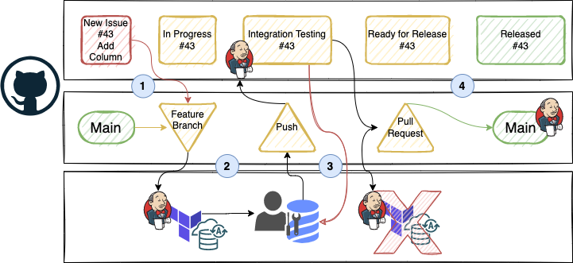

Estimated Time:  25 minutes

### Objectives

* CI/CD Workflow Walkthrough
  
### Prerequisites

This lab presumes you have already completed the earlier labs. At this stage, you should have a Jenkins Multibranch Pipeline integrated with your GitHub repository for Schema CI/CD. 

 > **Note:** This demonstration creates an isolated development environment in a different schema on the same database. This is to reduce the infrastructure required to run the demo. Using a different database (incl. OCI Autonomous Database), a different PDB, a Sparse Clone, etc. are interchangeable solutions to the isolated schema approach.

## Task 1: New Issue is Raised

A new issue is created in your GitHub repository to track the lifecycle of the change. This is often a bug report, new feature, or enhancement request.

1. Log into GitHub and click on the forked microservices-datadriven repository which has been integrated with Jenkins.

      Create a New Issue

      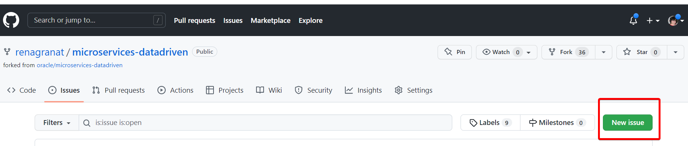

      > **Note:** If you do not see the Issue tab, click on "Settings" and scroll down to "Issues" and check the box. The **Issues** tab will appear.

      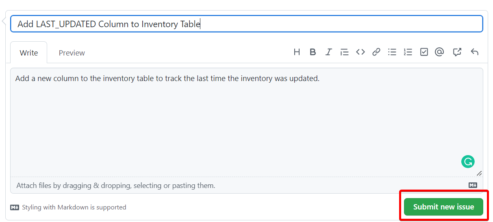

      * Title: Add LAST_UPDATED Column to Inventory Table
      * Write A Comment: Add a new column to the inventory table to track the last time the inventory was updated.
      * Submit Issue  

## Task 2: Issue is Assigned and Branch Created

A DBA/Developer is assigned to the issue. They create a new "feature" branch, as a copy of the main branch, to work on the issue. The creation of the "feature" branch will trigger a new build in Jenkins.
The Jenkins build will create a new schema using Liquibase and code from GitHub. This allows for work on the issue to be in an isolated environment to develop and test any changes.

1. If not already on the New Issue, navigate to **Issues** and click on the issue you just created.

2. Assign the issue to yourself and click on `Create a Branch*`.

    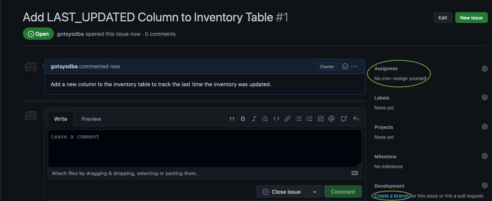

3. On the Pop-Up, leave defaults and `Create Branch`.

    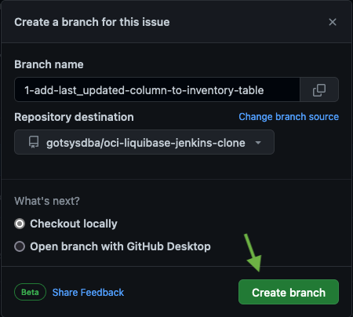

   On the Jenkins Controller, a new build will have been initiated by the creation of the branch. This build will create an isolated development environment to work on the issue in.

4. Click on `Demonstration`.

    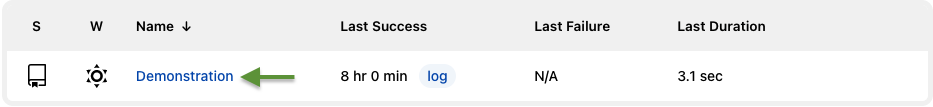

5. Click on the `Feature` branch (1-add-last...).

    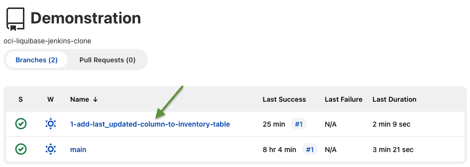
    
6. Click on `Last Build`.

    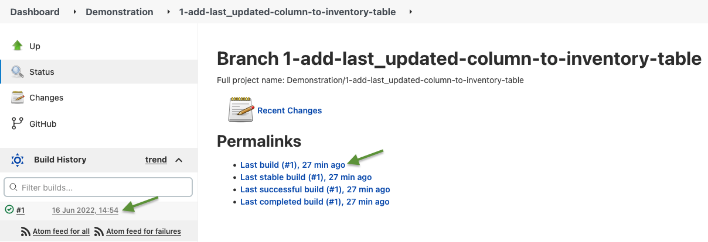

7. Click `Console Output`.

    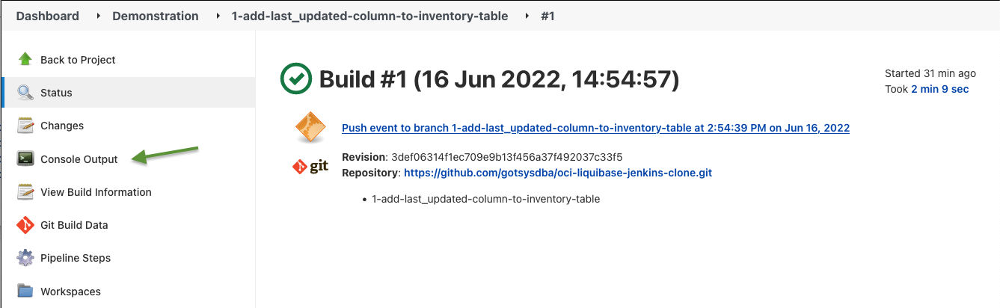

   The Console Output will show that Liquibase created the schema INVENTORYUSER1 and the INVENTORYUSER1.INVENTORY table, and loaded static data into the table.

## Task 3: Development Workflow

The DBA/Developer will work on the issue in the newly created isolated schema. Depending on their preference, this can be done directly in the database or directly in the Liquibase code. Once the developer is happy with the changes, they commit and push them to the remote "feature" branch. The push will trigger a new build in Jenkins. The build will integrate the new code into their schema using Liquibase. Any additional tests, linting, etc. can be run during this build. This process continues until the developer is satisfied with the changes.

1. In the OCI Console, navigate to the Autonomous Database and click on Database Actions > SQL.

    Add the new column and run:

    ```sql
    <copy>
    ALTER TABLE INVENTORYUSER1.INVENTORY ADD LAST_UPDATED TIMESTAMP
    </copy>
    ```

2. Export schema changes:

    In Cloud Shell, navigate to your repository liquibase directory. This directory contains the Liquibase ChangeSets which define the "Production" schema.
    Ensure you are in the git "feature" branch for your change:

    Fetch the new branch:

    ```bash
    <copy>
    git fetch
    </copy>
    ```

    You can review the output from the above command:

    ```bash
    remote: Enumerating objects: 32, done.  
    remote: Counting objects: 100% (32/32), done.  
    remote: Compressing objects: 100% (30/30), done.  
    remote: Total 30 (delta 20), reused 0 (delta 0), pack-reused 0  
    Unpacking objects: 100% (30/30), 6.76 KiB | 576.00 KiB/s, done.  
    From https://github.com/gotsysdba/oci-liquibase-jenkins-clone  
    * [new branch]      1-add-last_updated-column-to-inventory-table -> origin/1-add-last_updated-column-to-inventory-table
    ```

    Checkout the branch:

    ```bash
    <copy>
    git checkout 1-add-last_updated-column-to-inventory-table
    </copy>
    ```

    You can review the output from the above command:

    ```bash
    Branch '1-add-last_updated-column-to-inventory-table' set up to track remote branch '1-add-last_updated-column-to-inventory-table' from 'origin'.
    Switched to a new branch '1-add-last_updated-column-to-inventory-table'
    ```

3. Export the change made in the INVENTORYUSER1 schema into the liquidbase directory of your repository:

    ```bash
    <copy>
    cd liquidbase  
    sql /nolog
    </copy>
    ```

    Generate the Liquibase changeset:

    ```  
    <copy>
    set cloudconfig ../wallet/JENKINSDB_wallet.zip  
    connect INVENTORYUSER1/<password>@JENKINSDB_HIGH  
    lb genschema -split  
    exit
    </copy>
    ```

    After exporting, one file would have changed which will represent the change to the schema:  

    ```bash
    <copy>
    git status
    </copy>
    ```

    Here is the output from the above command:

    ```bash
    <copy> 
    On branch 1-add-last_updated-column-to-inventory-table  
    Your branch is up to date with 'origin/1-add-last_updated-column-to-inventory-table'.  

    Changes are not staged for commit:  
    (use "git add <file>..." to update what will be committed)  
    (use "git restore <file>..." to discard changes in working directory)  
          modified:   table/inventory_table.xml <-- This file has been modified  
    no changes added to commit (use "git add" and/or "git commit -a")
    </copy> 
    ```

4. Commit changes to version control.

    Depending on how you cloned your repository to Cloud Shell, you may need to generate a Personal Access Token (PAT). If the below git push command prompts for a username/password, please follow these instructions to generate a PAT for authentication, ticking "repo" for scope.

    ```bash
    <copy>
    git add .
    git commit -m "Added LAST_UPDATED Column to Inventory Table"
    git push
    </copy>
    ```

    Here is the output from the above command:

    ```bash
    Username for 'https://github.com': git
    Password for 'https://git@github.com': <PAT Token>
    Enumerating objects: 9, done.
    Counting objects: 100% (9/9), done.
    Delta compression using up to 2 threads
    Compressing objects: 100% (4/4), done.
    Writing objects: 100% (5/5), 571 bytes | 571.00 KiB/s, done.
    Total 5 (delta 3), reused 0 (delta 0), pack-reused 0
    remote: Resolving deltas: 100% (3/3), completed with 3 local objects.
    ```

5. Perform integration testing and initiate a failure:

    The above push will cause another build on the "feature" branch in Jenkins to be triggered. This build will test running the change you've made with existing, non-changed changeSets; i.e. integration testing.
   
    On the Jenkins Controller, Navigate to Dashboard > Demonstration. You'll notice that the last build on the "feature" branch has failed:

    Click on `1-add-last_updated-column-to-inventory-table`.

      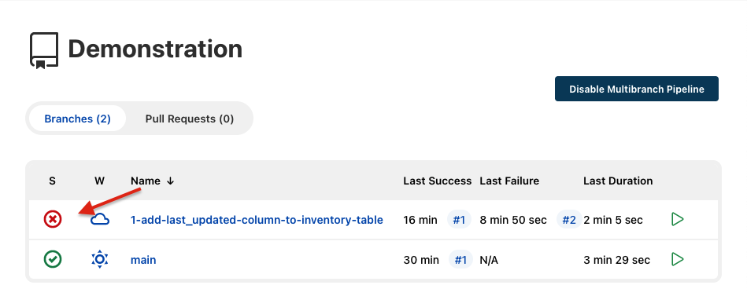

    Click on `Last Build #2...`.

    Click `Console Output`.

    Read the output to determine the failure.
      
      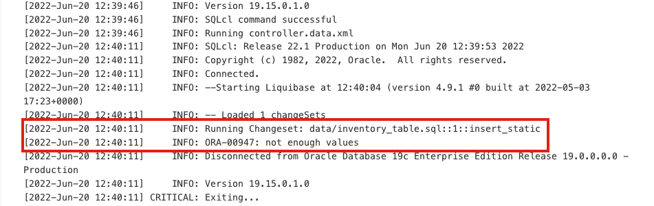
      
   
    The failure is due to the new column preventing the data from being loaded into the table via the data/inventory_table.sql file.   Fortunately this was caught before applying the change to the "main" branch used for Production deployment.  
    
    There are a few ways to fix this problem, but for demonstration purposes, edit the `data/inventory_table.sql` file, increase the changeset insert_static:2, and add "SYSDATE" to the insert statements:

    ```SQL
    <copy>
    -- liquibase formatted sql
    -- changeset insert_static:2 runAlways:true failOnError:true
    TRUNCATE TABLE INVENTORY;
    INSERT into INVENTORY values ('sushi', '1468 WEBSTER ST,San Francisco,CA', 0, SYSDATE);
    INSERT into INVENTORY values ('pizza', '1469 WEBSTER ST,San Francisco,CA', 0, SYSDATE);
    INSERT into INVENTORY values ('burger', '1470 WEBSTER ST,San Francisco,CA', 0, SYSDATE);
    -- rollback TRUNCATE TABLE INVENTORY;
    </copy>
    ```

    Commit/push the change to initiate another build:

    ```bash
    <copy>
    git add .
    git commit -m "Fixed data loading issue after new column"
    git push
    </copy>
    ```

   This will initiate another build on the `feature` branch. The build will succeed and the change can now be reviewed and merged back into the `main` branch.

## Task 4: Review and Merge

When the developer has completed all of the work on the issue, they will open a Pull Request for approval to merge the changes into the main branch for release. The Pull Request will trigger another build in Jenkins that will tear down their `feature` branch isolated environment (schema); it can also run any additional automated tests required.
   
If the teardown and additional automated tests succeed, the **Pull Requestst** is approved and the changes are merged into the main branch for release.

Back in GitHub, a notification that your `feature` branch has had recent pushes with the option to `Compare & pull request`.

1. Click `Compare & pull request`.

    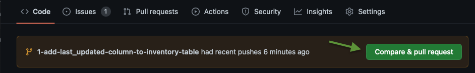

2. The next screen will show the changes you made to the `feature` branch. Notice the changes to the data insert and the new column that was created in the INVENTORYUSER1.INVENTORY table:

    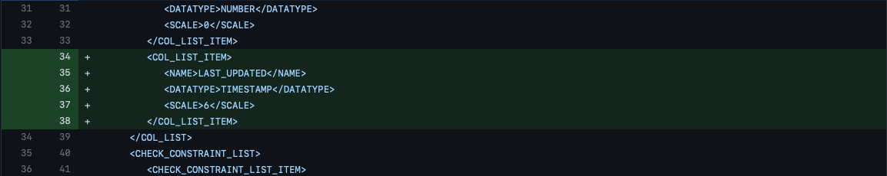

3. Change the base branch to your repositories `main`, and click `Create pull request`.

    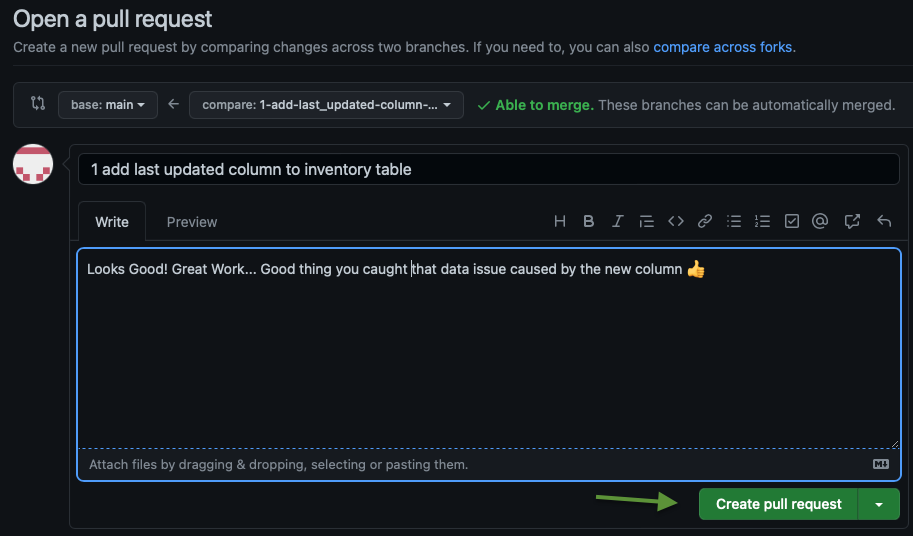

    Let's review pull request pipeline. On the Jenkins Controller, a new build will have been initiated by the Pull Request (PR). This build will drop the isolated development environment. - a new build will have been initiated by the Pull Request (PR).

4. Let's review the pull request pipeline. On the Jenkins Controller, a new build will have been initiated by the Pull Request (PR). This build will drop the isolated development environment. Select the "Pull Request" Tab and Click on the "Name of the PR".

    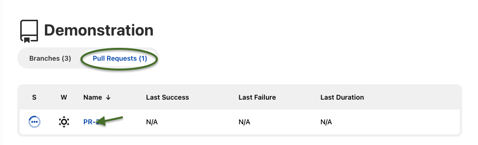

5. Click on "Last Build #1...".
     
6. Click Console Output to review the output.

7. You can verify the INVENTORYUSER1 schema was dropped from the Autonomous Database. In the OCI Console, Navigate to the Autonomous Database and click on Database Actions > SQL:

    ```SQL
    <copy>
    SELECT COUNT(*) FROM DBA_USERS WHERE USERNAME='INVENTORYUSER1';
    </copy>
    ```
  
8. Now, you are ready to merge the changes into the **main** branch. In GitHub, select the Pull Request you just created.

    

9. Merge the Pull Request.

    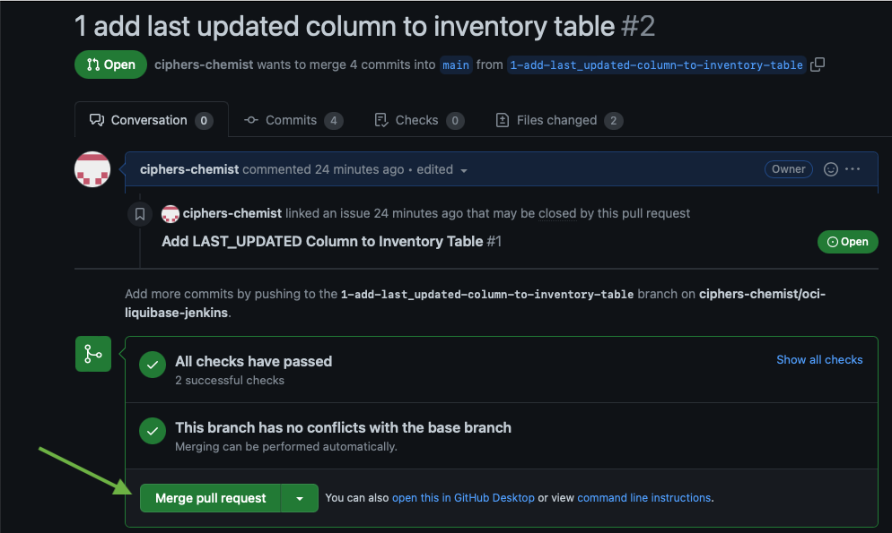

10. Click "Confirm merge".

    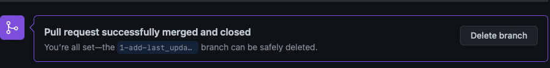

11. Your "feature" branch change is now in the "main" branch. The "feature" branch can be deleted.

    On the Jenkins Controller, a new build will have been initiated by the Merge. This build will implement the change (new LAST_UPDATED column) in the "Production" INVENTORY schema.  

    Once this build has been completed you can verify the change was applied by running the following SQL query against the Autonomous Database in OCI:

    ```SQL
    <copy>
    SELECT * FROM INVENTORYUSER.INVENTORY;
    </copy>
    ```

    You should see the new column populated with the current date in the INVENTORYUSER.INVENTORY table:

    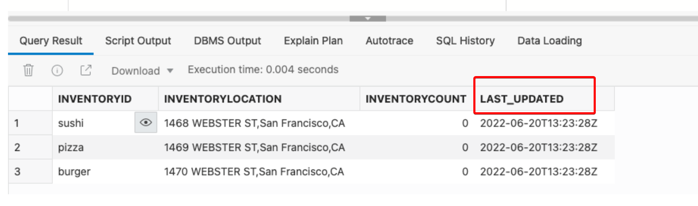

You may now **proceed to the next lab.**.

## Acknowledgements

* **Authors** - John Lathouwers, Developer Evangelist; Irina Granat, Consulting Member of Technical Staff, Oracle MAA and Exadata
* **Last Updated By/Date** - Irina Granat, June 2022
