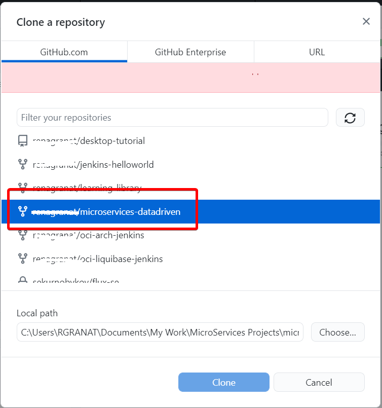
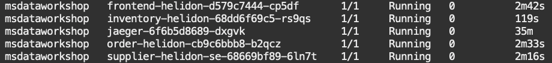

#  Walkthrough CI/CD Pipeline for Jenkins Integration with Oracle Cloud Infrastracture

## Introduction

This lab will walk you through CI/CD workflow using the pipeline built in the previous lab.


Estimated Time: 20 minutes

### Objectives

* CI/CD Workflow Walkthrough
  
### Prerequisites

* Oracle Cloud Infrastructure Services, like OKE cluster, OCIR and the Autonomous Transaction Processing databases, GitHub and Jenkins that you created and configured in earlier labs
* The latest version of Git, [GitHub Desktop] (https://desktop.github.com/) and your preferred editor, such as Visual Studio Code, or IntelliJ Idea installed locally on your computer.
* This lab presumes you setup a workshop repository in your own GitHub account.

> **Note:** As this is a demonstration of Jenkins/GitHub integration for CI/CD, **you must use your own GitHub account to run it. Please fork or copy [Oracle Microservices GiHub repository](https://github.com/oracle/microservices-datadriven) into your own GitHub account**.

## Task 1: Clone the Forked Repository

A clone is a copy of your forked repository that lives on your local computer instead of on GitHub Web UI. When you clone your forked repository, you can edit the files in your preferred editor, such as  Visual Studio Code, or IntelliJ Idea and use the GitHub Desktop client to keep track of your changes without having to be online.

To clone the forked repository:

1. Open your GitHub Desktop application and log in using your GitHub account.

2. Click File > Clone repository to display the Clone a Repository dialog box.

   

3. Select your repository such as your account/repo from your repositories. In this example, select <your_name>/microservices-datadriven. Under Local Path, select the local path on your machine where the repository is going to be cloned (copied). This is where the repository files get copied to your local file system. Click Clone.

   

4. The cloning process may take several minutes.

   

5. When asked how you plan to use the fork, select To contribute to the parent project. Click Continue.

   

6. The repository files (in this case, microservices-datadriven) appear in the local path you just specified. You can now start working on the next task!

> **Note:** The local cloned repository is connected to the remote fork version. You can push your local clone changes to the remote fork version when you are online to keep them in sync.

When you make a clone, you can create your project folder, edit the files in your preferred editor, such as Visual Studio Code or IntelliJ Idea, and use GitHub Desktop to keep track of your changes without having to be online.

You can use Github Desktop to synchronize the changes that you have made in your local file system to the forked content on your GitHub repo.

   

## Task 2: CI/CD Workflow Walkthrough 
 
1. Launch IntelliJ IDEA (or Visual Studio Code) on your computer and select `miroservices-datadriven`project in your local path.

2. Under miroservices-datadriven folder, navigate to grabdish > frontend-helidon > src > resources > web folder.

   

3. Open spatial.html file and navigate to the following area of the code
 
   

4. Change the following text from **Data-driven Microservices with converged Oracle Database** to **Datadriven Microservices with Converged Oracle Database** and save your changes.

   

5. Under miroservices-datadriven folder, navigate to grabdish > frontend-helidon folder and open **version.txt** file.

   

6. Increase the version number and save your changes

   

7. Start your Github Desktop client. Confirm that your `Current repository` points to your  `<your_name>/microservices-datadriven GitHub repository`.

   

8. Under the `Changes`, you should see 2 changed files:

   

   

9. In the `Summary (required)` text box on the left side, enter the summary of your changes.

10. Click `Commit to main`. This saves your changes in your local clone.

   

12. Click `Push origin`. This pushes the updated content from your clone into the origin of this clone, that is, your fork.

   

13. The updates in the previous step commited to your [https://github.com/oracle/microservices-datadriven] repository will initiate Jenkins flow.

14. To review the pipeline flow, login into Jenkins console using username `admin` and password you created in the Setup lab.

15. Check Jenkins pipeline and observe Jenkins job created – review the log.

   You can review the code for pipeline stages in the Jenkins file located in your repo - workshops > dcms-cicd > jenkins > jenkinslab1:

   

   Click on Click on `Demo` and then navigate to `Changes` - review the changes that were performed in the previous steps:

   

   Review the console output:

   

16. Check OKE pod status - once pipeline successfully completed, check that the new frontend-helidon pod is being redeployed and is running:

    ```bash
    <copy>kubectl get pods --all-namespaces</copy>
    ```

    

    Or, you can execute the `pods` shortcut command.

17. And finally, check the grabdish application UI for the changes - open a new browser tab and enter the external IP URL you have tested in Lab 2.:

    `https://<EXTERNAL-IP>`

    You will be prompted to authenticate to access the Front End microservices. The user is `grabdish` and the password is the one you entered in Lab 1.

    Navigate to `Spatial` area of the application and observe the title changes - it changed from  **Data-driven Microservices with converged Oracle Database** to **Datadriven Microservices with Converged Oracle Database**  .

You may now **proceed to the next lab.**.

## Acknowledgements

* **Authors** - Irina Granat, Consulting Member of Technical Staff, Oracle MAA and Exadata; Norman Aberin, Member of Technical Staff
* **Last Updated By/Date** - Irina Granat, June 2022
