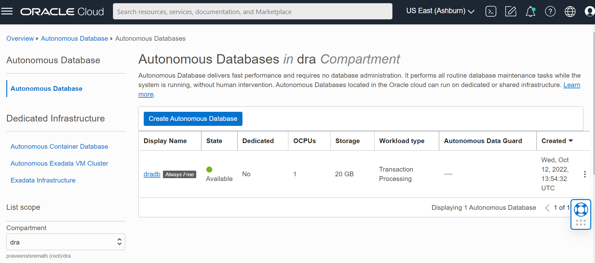
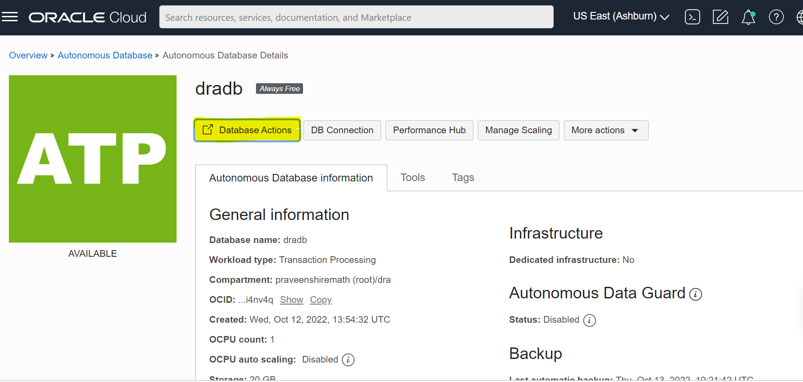
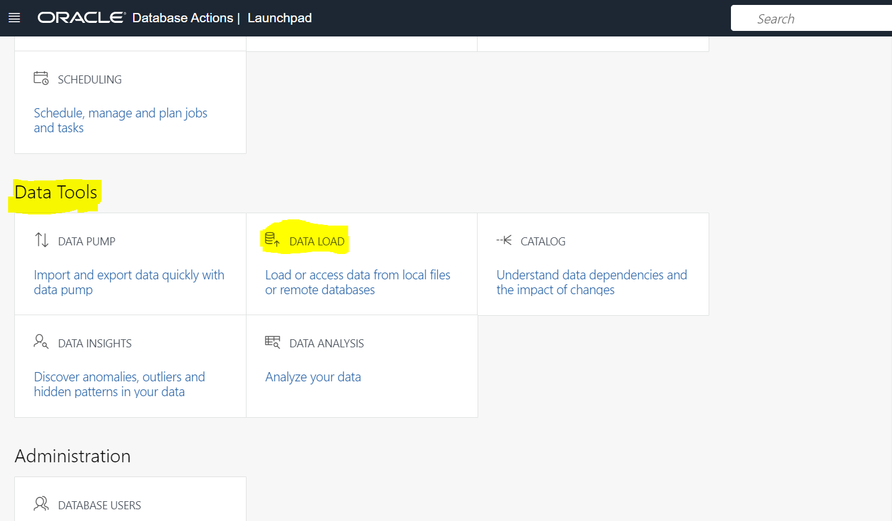
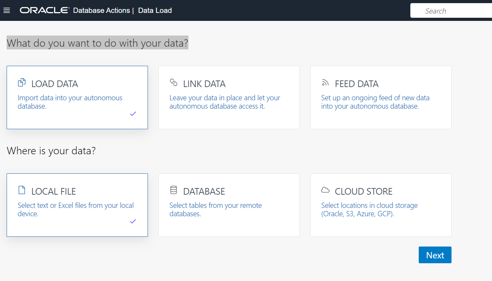
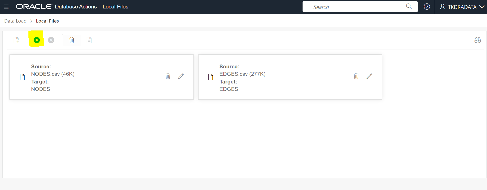

# Determine the affinity between tables

## Introduction

*Describe the lab in one or two sentences, for example:* This lab walks you through the steps to ...

Estimated Lab Time: -- minutes

### About <Product/Technology> (Optional)
Enter background information here about the technology/feature or product used in this lab - no need to repeat what you covered in the introduction. Keep this section fairly concise. If you find yourself needing more than to sections/paragraphs, please utilize the "Learn More" section.

### Objectives

*List objectives for this lab using the format below*

In this lab, you will:
* Create graph metadata tables that contain information about the application tables, and which we will be able to use to create a graph and perform community detection in a later lab
* Compute the affinities between the tables

### Prerequisites (Optional)

This lab assumes you have:
* An Oracle account
* All previous labs successfully completed


## Task 1: Create Graph Metadata Tables

In this task, we will create a set of metadata tables that we will use to store the information we need to perform community detection in the next lab.  We will create one table called `TABLESET_TABLES` that will contain a list of all of the tables that were used in the workload capture and how many times each table was accessed and/or participated in a join.  A second table called `TABLE_MAP` will be used to store the affinities between pairs of tables.  Later, when we create a graph, the first table will describe the vertices and the second table will describe the edges.

1. Create the graph metadata tables by running the following statements - make sure you run these in your `TKDRADATA` SQL Worksheet (not the `ADMIN` user's worksheet):

    ```
    <copy>drop table tableset_tables;
    drop table table_map;

    create table tableset_tables 
    ( table_set_name       varchar2(128)
    , schema               varchar2(128)
    , table_name           varchar2(128)
    , total_sql            number(10)
    , total_executions     number(10)
    , tables_joined        number(10));

    create table table_map 
    ( table_set_name       varchar2(128)
    , table1               varchar2(128)
    , schema1              varchar2(128)
    , table2               varchar2(128)
    , schema2              varchar2(128)
    , join_count           number(10)
    , join_executions      number(10)
    , static_coefficient   decimal(10,5)
    , dynamic_coefficient  decimal(10,5)
    , total_affinity       decimal(10,5));</copy>
    ```

    **Note**: This code is provided in the file `create-graph-tables.sql`.

2. In this step, we will populate the `TABLESET_TABLES` table, which will become the vertices in our graph.  Execute the following commands to populate the table:

    ```
    <copy>truncate table tableset_tables;

    insert into tableset_tables (table_set_name, schema, table_name, total_sql, total_executions) 
    select table_set_name, table_owner, table_name, count(distinct sql_id), sum(executions)
    from ( 
        select distinct table_set_name, table_owner, table_name, sql_id, executions 
        from (
            select 'tkdradata' table_set_name,
                case when v.operation='INDEX' then v.TABLE_NAME
                     when v.operation='TABLE ACCESS' then v.object_name
                     else NULL end table_name,
                v.object_owner as table_owner,
                v.sql_id,
                v.executions
            from (
                select p.object_name, p.operation, p.object_owner, 
                    p.sql_id, p.executions, i.table_name
                from dba_sqlset_plans p, all_indexes i
                where p.object_name=i.index_name(+) 
                and sqlset_name='tkdradata'
                and object_owner = upper('tkdradata')
            ) v  
        )
    ) 
    group by table_set_name, table_owner, table_name
    having table_name is not null;</copy>
    ```

    **Note**: This code is provided in the file `load-graph-tables.sql`.

3. We will also create a helper view that we will use in the affinity calculation.  Execute the following command to create the view:

    ```
    <copy>create view tableset_sql as 
    select distinct table_name, sql_id 
    from (
        select 'tkdradata' table_set_name,
        case when v.operation='INDEX' then v.TABLE_NAME
            when v.operation='TABLE ACCESS' then v.object_name
            else NULL end table_name,
        v.object_owner as table_owner,
        v.sql_id,
        v.executions
        from ( 
            select p.object_name, p.operation, p.object_owner,
                p.sql_id, p.executions, i.table_name
            from dba_sqlset_plans p, all_indexes i
            where p.object_name=i.index_name(+) 
            and sqlset_name='tkdradata' 
            and object_owner = 'TKDRADATA'
        ) v
    );</copy>
    ```

    **Note**: This code is provided in the file `create-helper-view.sql`.

## Task 2: Compute Affinities

1. Create the procedure to compute the affinities between tables.  This is the procedure we will use to compute the affinities.  This procedure reads the information from the SQL Tuning Set that we created in the previous lab and calculates the affinity between tables based on how many times they are used in SQL statements together, and how they are used.  The procedure does the following:

    For each table in the set that we are interested in, which was accessed during the workload capture:
    * Get a list of the SQL statements that used that table, either by reading an index or the table itself,
    * For each table that table was joined with, i.e. each pair of tables, work out how many times that pair were joined,
    * Work out what fraction of statements this pair was joined in,
    * Apply weights for joins and executions (50% each) and calculate the total affinity between the tables,
    * Work out how many other tables it was joined to in total.

    After running this procedure, we have data similar to this in the `TABLE_MAP` table (some rows and columns omitted):

    | TABLE1 | TABLE2 |  JOIN_COUNT | JOIN_EXECUTIONS | STATIC_COEFFICIENT | DYNAMIC_COEFFICIENT | TOTAL_AFFINITY 
    | --- | --- | --- | --- | --- | --- | --- 
    | DRA_36	| DRA_19	| 2	| 4	| 0.28571	| 0.28571	| 0.28571 
    | DRA_36	| DRA_20	| 2	| 4	| 0.25	| 0.25 |	0.25
    | DRA_36	| DRA_21	| 2	| 4	| 0.4	| 0.4	| 0.4
    | DRA_36	| DRA_22	| 2	| 4	| 0.33333	| 0.33333	| 0.33333
    | DRA_36	| DRA_24	| 1	| 2	| 0.125	| 0.125	| 0.125

    The first row, for example, tells us that the table `DRA_36` was joined to `DRA_19` twice, and that those two tables were joined in 28.571% of all statements involving either one of those tables.

    Execute the following statements to create the procedure:

    ```
    <copy>create or replace procedure compute_affinity_tkdra as
    cursor c is
    select table_name, schema from tableset_tables;
    tblnm varchar2(128);
    ins_sql varchar2(4000);
    upd_sql varchar2(4000);
    begin
        for r in c loop
            ins_sql:= q'{
                insert into tkdradata.table_map 
                ( table_set_name
                , table1
                , schema1
                , table2
                , schema2
                , join_count
                , join_executions
                , static_coefficient
                , dynamic_coefficient
                , total_affinity) 
                select 
                    'tkdradata' table_set_name,
                    tbl1, 
                    'tkdradata', 
                    tbl2, 
                    'tkdradata', 
                    join_count, 
                    join_executions, 
                    round(join_count/(all_sql-join_count),5) static_coefficient, 
                    round(join_executions/(all_executions-join_executions),5) dynamic_coefficient, 
                    (round(join_count/(all_sql-join_count),5)*0.5 + 
                     round(join_executions/(all_executions-join_executions),5)*0.5) total_affinity
                from (
                    select 
                        v2.tbl1, 
                        v2.tbl2, 
                        (select sum(total_sql) 
                            from tableset_tables 
                            where table_name=v2.tbl1 
                            or table_name=v2.tbl2 ) all_sql,
                        (select sum(total_executions) 
                            from tableset_tables 
                            where table_name=v2.tbl1 
                            or table_name=v2.tbl2 ) all_executions,
                        v2.join_count, 
                        v2.join_executions 
                    from (
                        select 
                            v1.tbl1, 
                            v1.tbl2, 
                            count(distinct v1.sql_id) join_count, 
                            sum(v1.executions) join_executions 
                        from (
                            select distinct 
                                v.tbl1, 
                                case when v.operation='INDEX' then v.TABLE_NAME  
                                    when v.operation='TABLE ACCESS' then v.tbl2 
                                    else NULL end tbl2,
                                sql_id,
                                executions 
                            from ( 
                                select 
                                    '}'||r.table_name||q'{' tbl1, 
                                    s.object_name tbl2, 
                                    i.table_name table_name, 
                                    sql_id, 
                                    operation, 
                                    executions 
                                from dba_sqlset_plans s, all_indexes i 
                                where sqlset_name='tkdradata' 
                                and object_owner=upper('tkdradata') 
                                and s.object_name = i.index_name(+) 
                                and sql_id in (
                                    select distinct sql_id 
                                    from dba_sqlset_plans 
                                    where sqlset_name='tkdradata' 
                                    and object_name='}'||r.table_name||q'{' 
                                    and  object_owner=upper('tkdradata')
                                ) 
                            ) v 
                        ) v1  
                        group by v1.tbl1, v1.tbl2   
                        having v1.tbl2 is not null 
                        and v1.tbl1 <> v1.tbl2 
                    ) v2 
                )
            }';
            execute immediate ins_sql;

            upd_sql:= q'{
                update tkdradata.tableset_tables 
                set tables_joined=(select count(distinct table_name) 
                from (
                    select 
                        'tkdradata' table_set_name,
                        case when v.operation='INDEX' then v.TABLE_NAME 
                            when v.operation='TABLE ACCESS' then v.object_name 
                            else NULL end table_name,
                        v.object_owner as table_owner,
                        v.sql_id, 
                        v.executions 
                    from ( 
                        select 
                            p.object_name, 
                            p.operation, 
                            p.object_owner, 
                            p.sql_id, 
                            p.executions, 
                            i.table_name 
                        from dba_sqlset_plans p, all_indexes i 
                        where p.object_name=i.index_name(+) 
                        and sqlset_name='tkdradata' 
                        and sql_id in (
                            select sql_id 
                            from tableset_sql 
                            where table_name='}'||r.table_name||q'{') 
                            and object_owner = upper('tkdradata')
                        ) v
                    )
                ) where table_name ='}' || r.table_name || q'{'
            }';
            execute immediate upd_sql;
        end loop;

    end;
    /</copy>
    ```

    **Note**: This code is provided in the file `compute-affinity.sql`.

2. Run the procedure to compute affinities.

    ```
    <copy>exec compute_affinity_tkdra();</copy>
    ```

    This may take a few minutes to complete.  Once it is done, we can see the output in our two graph metadata tables, for example:

    ```
    <copy>select * from table_map where table1 = 'DRA_1';</copy>
    ```

Once this has been completed you are ready to **proceed to the next lab.**

## Task 3: Alternative to running STS and determine affinities

Skip Task 1, Task 2 and Run the Task 3 instructions if you don't have the STS/don't want to simulate data. We are going to load the data w.r.t medical field. The data exists in 2 CSV files. 
	1. NODES.csv - Where we have table names.
	2. EDGES.csv - Where we have source(TABLE1) and destination(TABLE2) columns with the edge weights(TOTAL_AFFINITY) column.

1. Go to the compartment which we have created in the during the setup. In our case the compartment name is "dra". click on the "dradb" which also created during the setup.
	
	
	
2. Click on the Database Actions
	
	
	
3. Make sure you run these in your `TKDRADATA` SQL Worksheet (not the `ADMIN` user's worksheet). 
	In the 'Data Tools' Section, Click on 'Data load'. You will see the below screen.
	
	
	
	Select 'Load Data' and 'Local File' as shown in below image and Click 'Next'.
	
	
	
	Drag and drop the resources/NODES.csv and resources/EdGES.csv file and click on 'start' highlighted in below image. Run the Data Load Job. It will process in few seconds.

	
	
4. Verify whether the data is loaded into the Database successfully.
	
	2 tables NODES and EDGES should be created. Where NODES table with 974 rows and EDGES table with 3500 rows.
	
	```
	SELECT COUNT(1) FROM NODES;
	SELECT COUNT(1) FROM EDGES;
	```
	
3. Adding the constraints for the newly created data. Where TABLE1 and TABLE2 Columns of EDGES table are foreign keys referencing to the TABLE_NAME column of NODES table
  
	~~~
	alter table NODES add primary key (TABLE_NAME);
	alter table EDGES add primary key (table_map_id);
	alter table EDGES modify TABLE1 references NODES (TABLE_NAME);
	alter table EDGES modify TABLE2 references NODES (TABLE_NAME);
	commit;
	~~~

	


## Learn More

## Acknowledgements
- **Author** - Mark Nelson, Developer Evangelist
- **Contributors** - Mark Nelson, Praveen Hiremath
- **Last Updated By/Date** - Praveen Hiremath, Developer Advocate, October 2022
