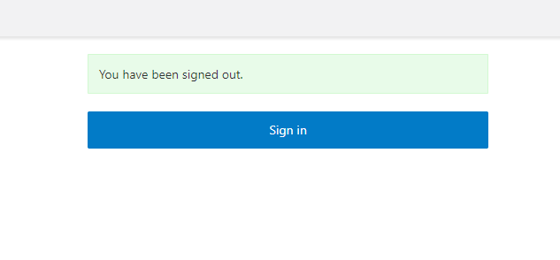

# Collect details of the application using SQL Tuning Sets

## Introduction

This lab walks you through the steps to create the sample tables and generate some simulated workload that we can use as the inputs for the rest of this workshop.

Estimated Lab Time: 10 minutes

## Objectives

In this lab, you will:

* Create a set of application tables
* Create an SQL Tuning Set
* Simulate workload running against the application tables
* Load the workload data into the SQL Tuning Set

## Prerequisites (Optional)

This lab assumes you have:

* An Oracle account
* All previous labs successfully completed

## Task 1: Log in to the SQL Worksheet

When you ran the `setup.sh` script in the previous lab, it created a database user called `TKDRADATA` for you and granted that user the necessary permissions to complete the rest of the labs.

1. Navigate to the Details page of the Autonomous Database that was provisioned by the `setup.sh` script.  In this example, the database name is "DRADB."  Click **Database Actions**.

  

2. In the Development section of the Database Actions page, click the SQL card to open a new SQL worksheet:

  

1. In the top right corner you can see that you are logged in as the `ADMIN` user.  We want to use the `TKDRADATA` user for the rest of this workshop.  Click on the `ADMIN` to open the user menu and select **Sign Out**.

  

4. On the next screen, click **Sign in**.

  

5. Enter the username `TKDRADATA` and the password you defined when you ran the `setup.sh` script.

6. This will open a new SQL worksheet as the `TKDRADATA` user.

7. Enter your commands in the worksheet. You can use the shortcuts [Control-Enter] or [Command-Enter] to run the command and view the Query Result (tabular format). Clear your worksheet by clicking the trash:

    

## Task 2: Prepare the application schema

1. Create the application tables by running this command.  You can just copy this and paste it into the SQL Worksheet and then hit the **Run Command** button.  You will do the same thing to run all of the other commands presented in this workshop.

 ```
    <copy>begin
        for i in 1..100 loop
            execute immediate
                'create table dra_' || i || '
                ( col' || i || ' varchar2(256) )
                ';
        end loop;
    end;
 
    /</copy>
    ```

    **Note**:  This command is provided in the file `create-tables.sql`.

2. You can validate the tables with this command, which should show you ten tables names `DRA_x` where `x` is a number:

    ```
    <copy>select table_name
    from user_tables
    fetch first 10 rows only;</copy>
    ```

## Task 3: Prepare the SQL Tuning Set

We do have sql scripts and other files related to this lab in 'microservices-data-refactoring/livelabs/datacollector-sts'. You can use it for reference and executions.

When you ran the `setup.sh` script in the previous lab, it created a database user called `TKDRADATA` for you and granted that user the necessary permissions to complete the rest of the labs.  We will create an SQL Tuning Set that we can use to capture details of the application workload.

1. Create a new SQL Tuning Set called `tkdradata` using the following command:

    ```
    <copy>begin
      dbms_sqltune.create_sqlset (
          sqlset_name => 'tkdradata', 
          description => 'SQL data from tkdradata schema'
      );
    end;
    /</copy>
    ```

    **Note**: This command is provided in the file `create-sts.sql`.

## Task 4: Simulate application workload

Now we will create some simulated application workload.  In a real-world scenario, you could actually capture real workload, perhaps for an extended period like two days or a week.  For the purposes of this lab, we will just simulate workload in a very short time so we can continue to the next steps.

1. Simulate workload by running the provided SQL script.  

    The file `simulate-workload.sql` contains about one hundred SQL commands.  Copy the contents of this file into you SQL Worksheet and click on the **Run script** button.  If you do not recall where the button is, please refer back to Task 1, Step 7 for a reminder.

    ```
    <copy>

 -- Copyright (c) 2022, Oracle and/or its affiliates.
 -- Licensed under the Universal Permissive License v 1.0 as shown at <https://oss.oracle.com/licenses/upl>.

 -------------------------------------------
 --Printing the sql statements for cluster 5...
 select *from tkdradata.dra_95, tkdradata.dra_90, tkdradata.dra_98;
select* from tkdradata.dra_81, tkdradata.dra_93, tkdradata.dra_94, tkdradata.dra_97;
 select *from tkdradata.dra_82, tkdradata.dra_84, tkdradata.dra_81, tkdradata.dra_100, tkdradata.dra_86, tkdradata.dra_93, tkdradata.dra_88;
select* from tkdradata.dra_96, tkdradata.dra_93, tkdradata.dra_88, tkdradata.dra_97;
 select *from tkdradata.dra_96, tkdradata.dra_88, tkdradata.dra_84, tkdradata.dra_82, tkdradata.dra_92, tkdradata.dra_93, tkdradata.dra_97, tkdradata.dra_99;
select* from tkdradata.dra_83, tkdradata.dra_92, tkdradata.dra_100, tkdradata.dra_93, tkdradata.dra_88, tkdradata.dra_87, tkdradata.dra_98;
 select *from tkdradata.dra_89, tkdradata.dra_83, tkdradata.dra_86, tkdradata.dra_93, tkdradata.dra_99, tkdradata.dra_81;
select* from tkdradata.dra_96, tkdradata.dra_85, tkdradata.dra_97, tkdradata.dra_86, tkdradata.dra_100, tkdradata.dra_83, tkdradata.dra_93, tkdradata.dra_80;
 select *from tkdradata.dra_94, tkdradata.dra_90, tkdradata.dra_93, tkdradata.dra_91, tkdradata.dra_96, tkdradata.dra_83, tkdradata.dra_88, tkdradata.dra_84, tkdradata.dra_85;
select* from tkdradata.dra_90, tkdradata.dra_82, tkdradata.dra_96, tkdradata.dra_81, tkdradata.dra_97, tkdradata.dra_91, tkdradata.dra_84, tkdradata.dra_99, tkdradata.dra_88;
 select *from tkdradata.dra_99, tkdradata.dra_94, tkdradata.dra_96, tkdradata.dra_97, tkdradata.dra_92;
select* from tkdradata.dra_86, tkdradata.dra_98, tkdradata.dra_100, tkdradata.dra_89, tkdradata.dra_87, tkdradata.dra_83, tkdradata.dra_91, tkdradata.dra_81, tkdradata.dra_93;
 select *from tkdradata.dra_98, tkdradata.dra_82, tkdradata.dra_94, tkdradata.dra_91;
select* from tkdradata.dra_93, tkdradata.dra_88, tkdradata.dra_83, tkdradata.dra_92;
 select *from tkdradata.dra_92, tkdradata.dra_86, tkdradata.dra_82, tkdradata.dra_80;
select* from tkdradata.dra_88, tkdradata.dra_93, tkdradata.dra_92, tkdradata.dra_81;
 select *from tkdradata.dra_82, tkdradata.dra_87, tkdradata.dra_99, tkdradata.dra_84, tkdradata.dra_90, tkdradata.dra_97, tkdradata.dra_89, tkdradata.dra_81;
select* from tkdradata.dra_89, tkdradata.dra_83, tkdradata.dra_100, tkdradata.dra_86;
 select *from tkdradata.dra_81, tkdradata.dra_92, tkdradata.dra_96, tkdradata.dra_100, tkdradata.dra_89, tkdradata.dra_88, tkdradata.dra_80, tkdradata.dra_98, tkdradata.dra_93, tkdradata.dra_82;
select* from tkdradata.dra_88;
 select * from tkdradata.dra_81, tkdradata.dra_96, tkdradata.dra_95, tkdradata.dra_97, tkdradata.dra_90, tkdradata.dra_94, tkdradata.dra_91, tkdradata.dra_85, tkdradata.dra_87, tkdradata.dra_100;

 --Printing the sql statements for cluster 4...
 select *from tkdradata.dra_63, tkdradata.dra_72, tkdradata.dra_57, tkdradata.dra_60, tkdradata.dra_61, tkdradata.dra_64;
select* from tkdradata.dra_67, tkdradata.dra_66, tkdradata.dra_76, tkdradata.dra_78;
 select *from tkdradata.dra_76, tkdradata.dra_69, tkdradata.dra_70, tkdradata.dra_74, tkdradata.dra_63, tkdradata.dra_73, tkdradata.dra_62;
select* from tkdradata.dra_59, tkdradata.dra_60;
 select *from tkdradata.dra_70, tkdradata.dra_69, tkdradata.dra_71;
select* from tkdradata.dra_73, tkdradata.dra_62, tkdradata.dra_74, tkdradata.dra_63, tkdradata.dra_78;
 select *from tkdradata.dra_61, tkdradata.dra_62, tkdradata.dra_68, tkdradata.dra_73, tkdradata.dra_57, tkdradata.dra_64, tkdradata.dra_70, tkdradata.dra_72, tkdradata.dra_77;
select* from tkdradata.dra_63, tkdradata.dra_76, tkdradata.dra_69, tkdradata.dra_71, tkdradata.dra_61, tkdradata.dra_65, tkdradata.dra_58;
 select *from tkdradata.dra_74, tkdradata.dra_78, tkdradata.dra_59, tkdradata.dra_75;
select* from tkdradata.dra_68, tkdradata.dra_76, tkdradata.dra_67, tkdradata.dra_59;
 select *from tkdradata.dra_65, tkdradata.dra_62, tkdradata.dra_58, tkdradata.dra_60, tkdradata.dra_69, tkdradata.dra_77;
select* from tkdradata.dra_78, tkdradata.dra_71, tkdradata.dra_66, tkdradata.dra_72;
 select *from tkdradata.dra_74, tkdradata.dra_77, tkdradata.dra_75, tkdradata.dra_68, tkdradata.dra_59, tkdradata.dra_57, tkdradata.dra_72, tkdradata.dra_65;
select* from tkdradata.dra_60, tkdradata.dra_72, tkdradata.dra_59, tkdradata.dra_77, tkdradata.dra_75, tkdradata.dra_69, tkdradata.dra_73, tkdradata.dra_76;
 select *from tkdradata.dra_60, tkdradata.dra_76, tkdradata.dra_66, tkdradata.dra_68, tkdradata.dra_57, tkdradata.dra_64, tkdradata.dra_74;
select* from tkdradata.dra_73, tkdradata.dra_59, tkdradata.dra_57, tkdradata.dra_78, tkdradata.dra_67, tkdradata.dra_74, tkdradata.dra_60, tkdradata.dra_66, tkdradata.dra_64;
 select *from tkdradata.dra_65, tkdradata.dra_59;
select* from tkdradata.dra_61, tkdradata.dra_71, tkdradata.dra_74, tkdradata.dra_75, tkdradata.dra_62, tkdradata.dra_65, tkdradata.dra_77;
 select *from tkdradata.dra_78, tkdradata.dra_66, tkdradata.dra_68, tkdradata.dra_67, tkdradata.dra_62, tkdradata.dra_63, tkdradata.dra_72, tkdradata.dra_58, tkdradata.dra_65;
select* from tkdradata.dra_68, tkdradata.dra_75, tkdradata.dra_62, tkdradata.dra_66, tkdradata.dra_78, tkdradata.dra_60;
 select *from tkdradata.dra_74, tkdradata.dra_77, tkdradata.dra_72;
select* from tkdradata.dra_72, tkdradata.dra_70, tkdradata.dra_73, tkdradata.dra_71, tkdradata.dra_58, tkdradata.dra_78, tkdradata.dra_65;
 select * from tkdradata.dra_62, tkdradata.dra_61, tkdradata.dra_69, tkdradata.dra_71, tkdradata.dra_66, tkdradata.dra_65, tkdradata.dra_67, tkdradata.dra_78, tkdradata.dra_70, tkdradata.dra_58;

 --Printing the sql statements for cluster 3...
 select *from tkdradata.dra_40, tkdradata.dra_54, tkdradata.dra_48;
select* from tkdradata.dra_50, tkdradata.dra_49, tkdradata.dra_56, tkdradata.dra_44, tkdradata.dra_55, tkdradata.dra_47;
 select *from tkdradata.dra_41, tkdradata.dra_48, tkdradata.dra_49, tkdradata.dra_54, tkdradata.dra_55, tkdradata.dra_52;
select* from tkdradata.dra_40, tkdradata.dra_42;
 select *from tkdradata.dra_42, tkdradata.dra_46, tkdradata.dra_47, tkdradata.dra_43, tkdradata.dra_40, tkdradata.dra_41, tkdradata.dra_52;
select* from tkdradata.dra_53, tkdradata.dra_49, tkdradata.dra_46, tkdradata.dra_39, tkdradata.dra_55;
 select *from tkdradata.dra_50, tkdradata.dra_45, tkdradata.dra_49, tkdradata.dra_48, tkdradata.dra_43;
select* from tkdradata.dra_47, tkdradata.dra_49, tkdradata.dra_42, tkdradata.dra_55, tkdradata.dra_38, tkdradata.dra_53, tkdradata.dra_40;
 select *from tkdradata.dra_55, tkdradata.dra_43, tkdradata.dra_40, tkdradata.dra_51, tkdradata.dra_44, tkdradata.dra_50;
select* from tkdradata.dra_40;
 select *from tkdradata.dra_56, tkdradata.dra_40;
select* from tkdradata.dra_49, tkdradata.dra_56;
 select *from tkdradata.dra_41, tkdradata.dra_43, tkdradata.dra_45, tkdradata.dra_53, tkdradata.dra_52, tkdradata.dra_47;
select* from tkdradata.dra_46, tkdradata.dra_53, tkdradata.dra_44, tkdradata.dra_38, tkdradata.dra_50;
 select *from tkdradata.dra_44, tkdradata.dra_47, tkdradata.dra_52, tkdradata.dra_41, tkdradata.dra_50, tkdradata.dra_53;
select* from tkdradata.dra_46, tkdradata.dra_53, tkdradata.dra_51, tkdradata.dra_47;
 select *from tkdradata.dra_52, tkdradata.dra_40, tkdradata.dra_49, tkdradata.dra_41, tkdradata.dra_42;
select* from tkdradata.dra_54, tkdradata.dra_49, tkdradata.dra_47, tkdradata.dra_45, tkdradata.dra_48, tkdradata.dra_56, tkdradata.dra_51;
 select *from tkdradata.dra_40, tkdradata.dra_39, tkdradata.dra_42, tkdradata.dra_44, tkdradata.dra_51, tkdradata.dra_54, tkdradata.dra_41;
select* from tkdradata.dra_55, tkdradata.dra_38, tkdradata.dra_46, tkdradata.dra_43, tkdradata.dra_54, tkdradata.dra_49, tkdradata.dra_42, tkdradata.dra_52;

 --Printing the sql statements for cluster 2...
 select *from tkdradata.dra_21, tkdradata.dra_29, tkdradata.dra_20, tkdradata.dra_19, tkdradata.dra_22, tkdradata.dra_26, tkdradata.dra_30, tkdradata.dra_27, tkdradata.dra_36;
select* from tkdradata.dra_30, tkdradata.dra_35, tkdradata.dra_34, tkdradata.dra_28;
 select *from tkdradata.dra_25, tkdradata.dra_26, tkdradata.dra_33, tkdradata.dra_30, tkdradata.dra_24, tkdradata.dra_35, tkdradata.dra_22, tkdradata.dra_27, tkdradata.dra_19;
select* from tkdradata.dra_21;
 select *from tkdradata.dra_35, tkdradata.dra_32, tkdradata.dra_29;
select* from tkdradata.dra_33, tkdradata.dra_19, tkdradata.dra_34, tkdradata.dra_31, tkdradata.dra_23, tkdradata.dra_26, tkdradata.dra_18;
 select *from tkdradata.dra_26, tkdradata.dra_36, tkdradata.dra_24, tkdradata.dra_22, tkdradata.dra_20, tkdradata.dra_31, tkdradata.dra_35, tkdradata.dra_21, tkdradata.dra_19;
select* from tkdradata.dra_25, tkdradata.dra_27, tkdradata.dra_20;
 select *from tkdradata.dra_22, tkdradata.dra_31, tkdradata.dra_33, tkdradata.dra_28, tkdradata.dra_24, tkdradata.dra_25, tkdradata.dra_23;
select* from tkdradata.dra_29, tkdradata.dra_30, tkdradata.dra_28;
 select *from tkdradata.dra_23, tkdradata.dra_22, tkdradata.dra_35, tkdradata.dra_31;
select* from tkdradata.dra_24, tkdradata.dra_19, tkdradata.dra_34, tkdradata.dra_31, tkdradata.dra_23, tkdradata.dra_20;
 select *from tkdradata.dra_28, tkdradata.dra_31, tkdradata.dra_19, tkdradata.dra_21, tkdradata.dra_32, tkdradata.dra_34, tkdradata.dra_27, tkdradata.dra_29;
select* from tkdradata.dra_28, tkdradata.dra_25, tkdradata.dra_34, tkdradata.dra_27, tkdradata.dra_26, tkdradata.dra_24, tkdradata.dra_20, tkdradata.dra_32, tkdradata.dra_33, tkdradata.dra_29;
 select *from tkdradata.dra_18, tkdradata.dra_20;
select* from tkdradata.dra_28, tkdradata.dra_34, tkdradata.dra_21, tkdradata.dra_24, tkdradata.dra_25, tkdradata.dra_26, tkdradata.dra_29;
 select *from tkdradata.dra_32, tkdradata.dra_34;
select* from tkdradata.dra_27, tkdradata.dra_20, tkdradata.dra_26;
 select * from tkdradata.dra_27, tkdradata.dra_22, tkdradata.dra_19, tkdradata.dra_18, tkdradata.dra_30, tkdradata.dra_20, tkdradata.dra_28, tkdradata.dra_25, tkdradata.dra_24;

 -------------------------------------------
 --Printing the sql statements for cluster 1...
 select *from tkdradata.dra_2, tkdradata.dra_15, tkdradata.dra_9, tkdradata.dra_17, tkdradata.dra_3, tkdradata.dra_7, tkdradata.dra_11, tkdradata.dra_1, tkdradata.dra_4;
select* from tkdradata.dra_11, tkdradata.dra_14, tkdradata.dra_16;
 select *from tkdradata.dra_9, tkdradata.dra_7, tkdradata.dra_1, tkdradata.dra_5, tkdradata.dra_17, tkdradata.dra_6, tkdradata.dra_4, tkdradata.dra_14, tkdradata.dra_10;
select* from tkdradata.dra_4, tkdradata.dra_5, tkdradata.dra_11, tkdradata.dra_13, tkdradata.dra_14;
 select *from tkdradata.dra_7, tkdradata.dra_13, tkdradata.dra_3, tkdradata.dra_16, tkdradata.dra_14;
select* from tkdradata.dra_1;
 select *from tkdradata.dra_3, tkdradata.dra_12, tkdradata.dra_2, tkdradata.dra_13, tkdradata.dra_4, tkdradata.dra_11, tkdradata.dra_9, tkdradata.dra_7;
select* from tkdradata.dra_9, tkdradata.dra_14;
 select *from tkdradata.dra_10, tkdradata.dra_11, tkdradata.dra_15, tkdradata.dra_3, tkdradata.dra_14, tkdradata.dra_12;
select* from tkdradata.dra_7, tkdradata.dra_15, tkdradata.dra_12, tkdradata.dra_9, tkdradata.dra_14, tkdradata.dra_3;
 select *from tkdradata.dra_7, tkdradata.dra_8, tkdradata.dra_16, tkdradata.dra_4, tkdradata.dra_2, tkdradata.dra_11, tkdradata.dra_12, tkdradata.dra_5, tkdradata.dra_17, tkdradata.dra_10;
select* from tkdradata.dra_12, tkdradata.dra_7, tkdradata.dra_9, tkdradata.dra_2, tkdradata.dra_10, tkdradata.dra_13, tkdradata.dra_11, tkdradata.dra_3, tkdradata.dra_1;
 select *from tkdradata.dra_11;
select* from tkdradata.dra_10;
 select *from tkdradata.dra_17, tkdradata.dra_12, tkdradata.dra_5, tkdradata.dra_10, tkdradata.dra_1, tkdradata.dra_8, tkdradata.dra_13, tkdradata.dra_2;
select* from tkdradata.dra_11, tkdradata.dra_9, tkdradata.dra_12, tkdradata.dra_15, tkdradata.dra_16;
 select * from tkdradata.dra_7, tkdradata.dra_2, tkdradata.dra_4;
    /</copy>
    ```

## Task 5: Load the SQL Tuning Set

**Note**: The commands in this task **must** be run as the `ADMIN` user.  To open an SQL Worksheet for the `ADMIN` user, repeat steps 1 and 2 in Task 1.

1. Being careful to ensure you run this command as the `ADMIN` user, not `TKDRADATA`, load the workload data into the SQL Tuning Set using this command:

    ```
    -- run this as the ADMIN user
    <copy>DECLARE
      cur DBMS_SQLTUNE.SQLSET_CURSOR;
    BEGIN
      OPEN cur FOR
        SELECT VALUE(P)
          FROM table(
            DBMS_SQLTUNE.SELECT_CURSOR_CACHE(
              'parsing_schema_name=upper(''tkdradata'') and sql_text not like ''%OPT_DYN%''',
                NULL, NULL, NULL, NULL, 1, NULL,
              'ALL', 'NO_RECURSIVE_SQL')) P;
    
      DBMS_SQLTUNE.LOAD_SQLSET(sqlset_name => 'tkdradata',
                              populate_cursor => cur,
                              sqlset_owner => 'tkdradata');      
    END;
    / </copy>
    ```

    **Note**: This command is provided in the file `load-sts.sql`.

2. You can check that data was loaded using this command:

    ```
    <copy>select sqlset_name, count(distinct sql_id) 
    from dba_sqlset_plans 
    group by sqlset_name;</copy>
    ```

    This should return a non-zero value in the `tkdradata` row.  There may be other rows, but you can safely ignore them.  If you get zero, then please go back over the previous steps to make sure you did not miss a step.

Once this has been completed you are ready to **proceed to the next lab.**

## Learn More

## Acknowledgements

* **Author** - Mark Nelson, Developer Evangelist

* **Contributors** - Mark Nelson, Praveen Hiremath
* **Last Updated By/Date** - Praveen Hiremath, Developer Advocate, October 2022
