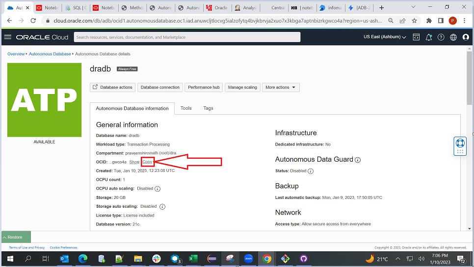
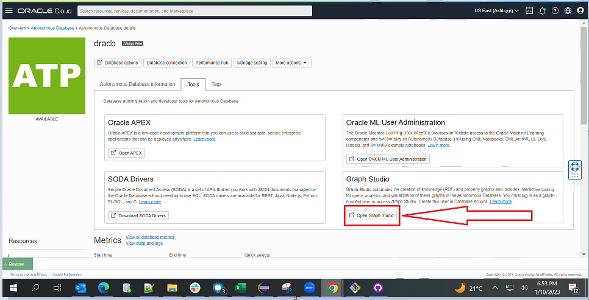
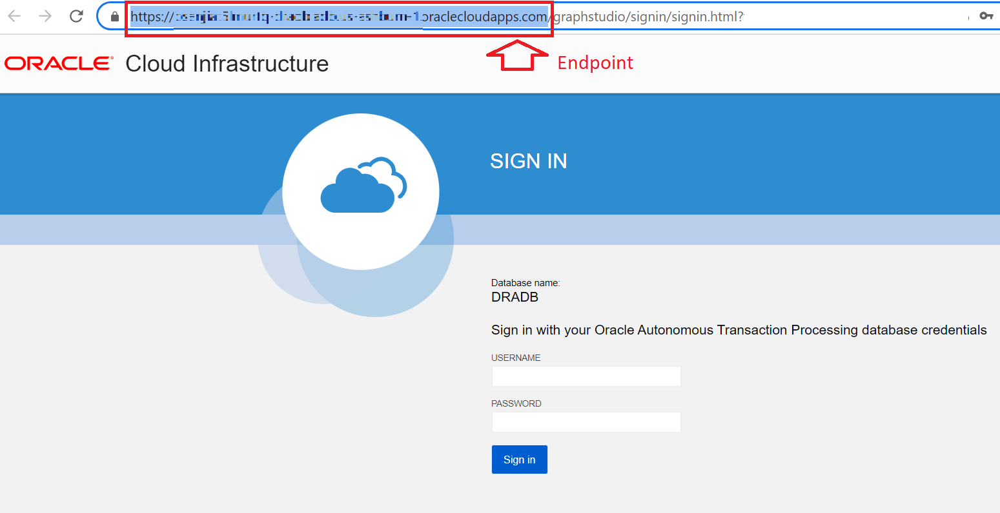

# Run Community Detection

## Introduction

In this lab, using the graphs created in the previous labs, we applied the community detection algorithm, which identifies the communities within the graphs. The community detection algorithm takes the input graphs, identifies strong connectivity within graphs, and forms multiple smaller communities. Infomap is used for community detection in this lab.

Estimated Time: 10 minutes

### Objectives

In this lab, you will:

* Create a graph in Graph Studio from the Graph Client.
* Detect the communities using the Infomap.

### Prerequisites

This lab assumes you have the following:

* You are running on Java 10+ in OCI Console.
* All previous labs were completed successfully.

## Task 1: Change the graph properties

1. Make sure you are on the same session of cloud shell. If not, set the required environment variables as we did in the setup.

    ```text
   <copy>
    export DRA_HOME=${HOME}/microservices-data-refactoring
   </copy>
   ```

2. Navigate to the project

    ```text
   <copy>
    cd ${HOME}/microservices-data-refactoring/dra-graph-client
   </copy>
   ```

3. Update the src/main/resources/db-config.properties file.

    ```text
   <copy>
    vi src/main/resources/db-config.properties
   </copy>
   ```

   Update the value for the below properties.

    ```text
    tenant   - tenant OCID
	cloud_db_ocid - Cloud Database OCID
    database - Name of the Database(Here it is 'dradb')
    username - Username to login into the database(Here it is 'TKDRADATA')
    password - Password to login into the database for the above username.
    endpoint - Endpoint for connecting to Autonomous Database instance (Ex: https://<hostname-prefix>.adb.<region>.oraclecloudapps.com/)
    ```

	Copy the value for `cloud_db_ocid` as shown in the Autonomous Database Details Screen.

    
	
	You can also get the value of `endpoint` as shown below. From the Oracle Cloud Console, choose the Autonomous Database instance(`dradb`), then Click the **Tools** tab on the details page menu below. 

     
   
   Click on **Open Graph Studio**. You will see the below login screen. Copy the URL till `oraclecloudapps.com` from the browser's address bar.
   
   
	
   Save and exit(:wq) from the `db-config.properties` file.

4. Update the src/main/resources/graph-config.properties file.

    ```text
   <copy>
    vi src/main/resources/graph-config.properties
   </copy>
   ```

    Update the value for the below properties. No update is required if you have followed the same steps and specified the graph name during the creation of the graph in Lab 4.

    ```text
    graph_name: Name of the graph created in Graph Studio.
    vertex_property_column: Column name of Tables
    edge_property_source_column: Source Column name of the Edge
    edge_property_destination_column: Destination Column name of the Edge
    edge_property_weight_column: Column name of Edge weight

    ```

    Save and exit(:wq) from the `graph-config.properties` file.

## Task 2: Compile and Run the Community Detection

1. Compile the maven project

    ```text
   <copy>
    mvn compile
   </copy>
   ```

2. Execute the project to see the identified clusters using the Infomap algorithm

    ```text
   <copy>
   mvn exec:java -Dexec.mainClass=com.oracle.ms.app.InfomapGraphClient -Dexec.args="5"
   </copy>
   ```

   Where
   * com.oracle.ms.app.InfomapGraphClient - The main class loads the graph and runs the Infomap to identify the Clusters.
   * 5 is MaxNumberOfIterations for Infomap Algorithm. You can change it to any positive integer.

   Output

   Job Details:

    ```text
   name=Environment Creation - 18 GBstype= ENVIRONMENT_CREATION created_by= ADMIN
   Graph : PgxGraph[name=DRA_MEDICAL_RECS_G, N=98, E=1604, created=1664544333468]
   ```

    The table names with the same community Ids formed the clusters below.
    ```text		
	+------------------------+
	| Community | TABLE_NAME |
	+------------------------+
	| 0         | DRA_72     |
	| 0         | DRA_76     |
	| 0         | DRA_67     |
	| 0         | DRA_63     |
	| 0         | DRA_77     |
	| 0         | DRA_58     |
	| 0         | DRA_61     |
	| 0         | DRA_71     |
	| 0         | DRA_75     |
	| 0         | DRA_70     |
	| 0         | DRA_69     |
	| 0         | DRA_57     |
	| 0         | DRA_74     |
	| 0         | DRA_66     |
	| 0         | DRA_59     |
	| 0         | DRA_62     |
	| 0         | DRA_73     |
	| 0         | DRA_64     |
	| 0         | DRA_68     |
	| 0         | DRA_65     |
	| 0         | DRA_60     |
	| 0         | DRA_78     |
	| 1         | DRA_34     |
	| 1         | DRA_35     |
	| 1         | DRA_32     |
	| 1         | DRA_28     |
	| 1         | DRA_19     |
	| 1         | DRA_21     |
	| 1         | DRA_22     |
	| 1         | DRA_25     |
	| 1         | DRA_27     |
	| 1         | DRA_30     |
	| 1         | DRA_20     |
	| 1         | DRA_24     |
	| 1         | DRA_29     |
	| 1         | DRA_26     |
	| 1         | DRA_31     |
	| 1         | DRA_33     |
	| 1         | DRA_36     |
	| 1         | DRA_23     |
	| 1         | DRA_18     |
	| 2         | DRA_84     |
	| 2         | DRA_89     |
	| 2         | DRA_94     |
	| 2         | DRA_93     |
	| 2         | DRA_96     |
	| 2         | DRA_99     |
	| 2         | DRA_90     |
	| 2         | DRA_80     |
	| 2         | DRA_83     |
	| 2         | DRA_100    |
	| 2         | DRA_86     |
	| 2         | DRA_97     |
	| 2         | DRA_92     |
	| 2         | DRA_98     |
	| 2         | DRA_87     |
	| 2         | DRA_95     |
	| 2         | DRA_81     |
	| 2         | DRA_85     |
	| 2         | DRA_91     |
	| 2         | DRA_88     |
	| 2         | DRA_82     |
	| 3         | DRA_2      |
	| 3         | DRA_7      |
	| 3         | DRA_3      |
	| 3         | DRA_10     |
	| 3         | DRA_6      |
	| 3         | DRA_16     |
	| 3         | DRA_11     |
	| 3         | DRA_9      |
	| 3         | DRA_13     |
	| 3         | DRA_15     |
	| 3         | DRA_1      |
	| 3         | DRA_8      |
	| 3         | DRA_5      |
	| 3         | DRA_17     |
	| 3         | DRA_4      |
	| 3         | DRA_12     |
	| 3         | DRA_14     |
	| 4         | DRA_48     |
	| 4         | DRA_42     |
	| 4         | DRA_44     |
	| 4         | DRA_49     |
	| 4         | DRA_45     |
	| 4         | DRA_52     |
	| 4         | DRA_46     |
	| 4         | DRA_50     |
	| 4         | DRA_47     |
	| 4         | DRA_53     |
	| 4         | DRA_54     |
	| 4         | DRA_38     |
	| 4         | DRA_41     |
	| 4         | DRA_40     |
	| 4         | DRA_39     |
	| 4         | DRA_55     |
	| 4         | DRA_51     |
	| 4         | DRA_43     |
	| 4         | DRA_56     |
	+------------------------+
    ```

## Task 3: Adjust constraints and reform the communities

1. For example, we consider the node named `DRA_1` and want to move from cluster with community-id 3 to target cluster with community-id 2(Here, the tables from `DRA_80` to `DRA_100`).

2. Get the nodes of the target cluster to which we want to move node `DRA_1` and check for the edges from `DRA_1` to nodes of the target cluster and update the `TOTAL_AFFINITY` of those edges to 1.

    NOTE: We must have an edge from the source node to the nodes of the target cluster.

    Go to SQL developer and execute the below query.

    ```text
   <copy>
	UPDATE EDGES SET TOTAL_AFFINITY = 1 WHERE TABLE_MAP_ID IN 
	(SELECT DISTINCT(TABLE_MAP_ID) AS MATCHED_IDS_OF_EDGES_TO_BE_UPDATED FROM EDGES
	WHERE (TABLE1 = 'DRA_1' AND TABLE2 IN ('DRA_80','DRA_81','DRA_82','DRA_83','DRA_84','DRA_85','DRA_86','DRA_87','DRA_88','DRA_89','DRA_90','DRA_91','DRA_92','DRA_93','DRA_94','DRA_95','DRA_96','DRA_97','DRA_98','DRA_99','DRA_100'))
	OR (TABLE2 = 'DRA_1' AND TABLE1 IN ('DRA_80','DRA_81','DRA_82','DRA_83','DRA_84','DRA_85','DRA_86','DRA_87','DRA_88','DRA_89','DRA_90','DRA_91','DRA_92','DRA_93','DRA_94','DRA_95','DRA_96','DRA_97','DRA_98','DRA_99','DRA_100')));
    </copy>
    ```

3. Rerun the Infomap algorithm on the updated data. Follow the same steps from Task 2, and verify whether the required node is moved to the intended target cluster. 

If you are doing this on the simulated data, then **you are done with the DRA Livelab.**

## Acknowledgements

* **Author** - Praveen Hiremath, Developer Advocate
* **Contributors** -  Praveen Hiremath, Developer Advocate
* **Last Updated By/Date** - Praveen Hiremath, Developer Advocate, October 2022
