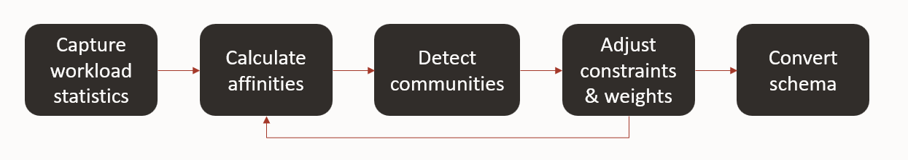
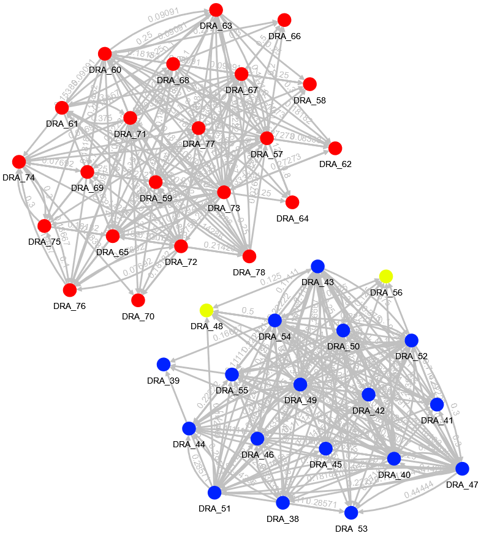

# Introduction

## About this Workshop

This workshop will help you understand a technique for refactoring data stores for microservices. 

- Estimated Time: 90 minutes

### About Product/Technology

SQL Tuning Sets, PL/SQL and Oracle Graph Studio examples will be demonstrated.

### Objectives

- Learn about refactoring data stores for microservices architecture using a sample dataset.

### Prerequisites

- An Oracle Cloud Account- Please view this workshop's LiveLabs landing page to see which environments are supported.

>**Note:** If you have a **Free Trial** account, when your Free Trial expires, your account will be converted to an **Always Free** account. You will not be able to conduct Free Tier workshops unless the Always Free environment is available.
**[Click here for the Free Tier FAQ page.](https://www.oracle.com/cloud/free/faq.html)**

**What is Data Refactoring?**

Developers are often faced with refactoring their monolith applications into microservices. Won't it be great to have a tool that automates the data collection of access affinity to the tables and objects in the database schema? By analyzing the affinity closely, and applying graph clustering techniques using the Oracle Graph Database, advise for schema refactoring is provided. It is an iterative process to arrive at a meaningful cluster that the development team can take advantage of by defining bounded contexts in coding the applications. Splitting the schema and bounding access of a cluster of tables and objects to microservices results in the use of APIs or messaging to communicate between microservices.

**Why refactor our data for microservices?**

Application and data architecture is evolving.  Microservices architecture is increasingly being adopted by developers, and it introduces different requirements for the data and database architecture.  Developers want to refactor their data stores as they move to microservices.

*Microservices* have their own data stores (domain, bounded context) and to communicate only by APIs.  The data store is part of the service's implementation and is private.  Data is exposed indirectly by the service's API.  This helps to promote loose coupling and strong contracts.

Projects are implemented using software developers are most comfortable with.  Developers introduce new technologies for structured, unstructured, graph, spatial, ML, etc.  Proliferation of containerization facilitates this trend and DevOps encourages decentralization, but organizations recognize the challenges of decentralized data architecture and want to minimize risk.

Decentralized data archictures can introduce exponential costs due to lifecycle management and patching of several different technology stacks, data duplication, data quality issues, the challenges of moving data, maintaining non-complimentary skill sets, and so on.  Oracle’s approach is to provide the separation required for microservices in the converged database – a "best of both worlds" approach – using PDB's or schema.

*Monolithic applications* typically have a large, shared database, which makes it easy for different parts of the application to access whatever data they need, but this tends to create increasingly complex interdependencies, makes it difficult to refactor the application or the data model and obscures data (domain) ownership.

Data Refactoring Advisor helps identify bounded contexts based on how the data are used.  It collects information about actual usage patterns (e.g. how often tables are joined) in SQL Tuning Sets, calculates the affinity of each pair of tables based on usage, uses the Infomap algorithm (in Graph Studio) to identify communities/clusters and provides a way to adjust constraints and ulimately to convert the monolithic schema into separate bounded contexts.  The diagram below illustrates this process:

**Introduction to community detection**

An important part of this process is the community detection.  Community detection is a process for finding which things belong together.  In our case, the 'things' we are interested in are tables in the database. We will use the frequency of joins as the main criteria for calculating the 'affinity' between tables.

Once we have that data, we will use the Infomap algorithm to detect communities.  This is a very common and widely used algorithm for detecting communities. It works by trying to maximize the 'modularity' which is a measure of the density of the links inside communities compared to the links between communities. In our case, this means that tables that are frequently joined to each other are likely to end up in the same community, and tables that are seldom joined will be likely to end up in different communities.  The image below shows two such communities and the tables that belong in them.  The nodes/vertices represent tables and the arrows/edges represent the affinity between the tables.
 

You may now **proceed to the next lab.**

## Want to Learn More?

- [Oracle Graph Database](https://www.oracle.com/database/graph/)
- [PL/SQL Packages and Types Reference](https://docs.oracle.com/en/database/oracle/oracle-database/19/arpls/)
- [https://developer.oracle.com/microservices](https://developer.oracle.com/microservices)

## Acknowledgements

* **Author** - Mark Nelson, Developer Evangelist
* **Contributors** - Mark Nelson, Praveen Hiremath
* **Last Updated By/Date** - Praveen Hiremath, Developer Advocate, October 2022
