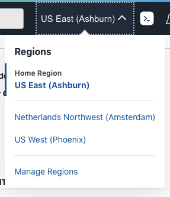

# Set up the environment

## Introduction

In this tutorial, you'll provision and set up the resources to execute workshop in your tenancy.  

Estimated Time: 15 minutes

### Objectives

- Clone the workshop repository.
- Execute environment setup.

### Prerequisites

An Oracle Cloud paid account or free trial. To sign up for a trial account with $300 in credits for 30 days, click [Sign Up](http://oracle.com/cloud/free).

## Task 1: Log in to the Oracle Cloud Console and Launch the Cloud Shell

If you haven't already, sign in to your account.

## Task 2: Select the Home Region

Be sure to select the **home region** of your tenancy. Setup will only work in the home region.

  

## Task 3: Check Your Tenancy Service Limits

If you have a **fresh** free trial account with credits then you can be sure that you have enough quota and you can proceed to the next step.

If, however, you have already used up some quota on your tenancy, perhaps while completing other workshops, there may be insufficient quota left to run this workshop. The most likely quota limits you may reach are summarized in the following table.

| Service          | Scope  | Resource                                             | Available | Free Account Limit |
|------------------|:------:|------------------------------------------------------|:---------:|:------------------:|
| Database         | Region | Autonomous Transaction Processing Total Storage (TB) | **1**     | 2                  |
|                  | Region | Autonomous Transaction Processing OCPU Count         | **2**     | 8                  |

Quota usage and limits can be check through the console: **Limits, Quotas and Usage** in the **Governance & Administration** section , For example:

  

The Tenancy Explorer is used to locate existing resources: **Governance & Administration** --> **Governance** --> **Tenancy Explorer**. Use the "Show resources in subcompartments" feature to locate all the resources in your tenancy:

  

It may be necessary to delete some resources to make space to run the workshop. Once you have enough space you may proceed to the next step.

## Task 4: Launch Cloud Shell

Cloud Shell is a small virtual machine running a "bash" shell which you access through the Oracle Cloud Console. Cloud Shell comes with a pre-authenticated command line interface in the tenancy region. It also provides up-to-date tools and utilities.

1. Click the Cloud Shell icon in the top-right corner of the Console.

  

> **Note:** Cloud Shell uses *websockets* to communicate between your browser and the service. If your browser has websockets disabled or uses a corporate proxy that has websockets disabled you will see an error message ("An unexpected error occurred") when attempting to start Cloud Shell from the console. You also can change the browser cookies settings for a specific site to allow the traffic from *.oracle.com

## Task 5: Make a Clone of the Workshop Setup Script and Source Code

To work with the application code, you need to make a clone from the GitHub repository.  

1. Execute the following sequence of commands into cloud shell:

    ```bash
    <copy>
    git clone https://github.com/oracle/microservices-datadriven.git
    cp -r ./microservices-datadriven/workshops/microservices-data-refactoring $HOME;     
    rm -r -f microservices-datadriven; 
    cd microservices-data-refactoring;
    </copy>
    ```

2. You should now see the directory `microservices-data-refactoring` in the directory that you clone.

## Task 6: Start the Setup

1. Execute the below command into cloud shell to start the setup.
  
    ```bash
    <copy>
	cd livelabs/datacollector-sts/
    source setup.sh
    </copy>
    ```
  
2. Enter the password to be used for database connection and wait for the ATP provisioning when you will see the message: **"Action completed. Waiting until the resource has entered state: ('AVAILABLE',)".**

3. The setup process will typically take around 5 minutes to complete.

> **Note:** Cloud shell may disconnect after a period of inactivity. If that happens, you can reconnect and then re-run the above command to resume the setup.

## Task 7: Complete the Setup

Once the majority of the setup has been completed the setup will periodically provide a summary of the setup status. Once everything has been completed you will see the message: **SETUP COMPLETED**.

1. If any of the background setup jobs are still running you can monitor their progress with the following command into cloud shell.

    ```bash
    <copy>
    ps -ef | grep "$DRA_HOME" | grep -v grep
    </copy>
    ```

> **Note:**  Cloud Shell sessions have a maximum length of 24 hours, and time out after 20 minutes of inactivity.

Once the setup has been completed you are ready to **proceed to the next lab.**

## Acknowledgements

- **Author** - Mark Nelson, Developer Evangelist
- **Contributors** - Mark Nelson, Praveen Hiremath
- **Last Updated By/Date** - Praveen Hiremath, Developer Advocate, October 2022
