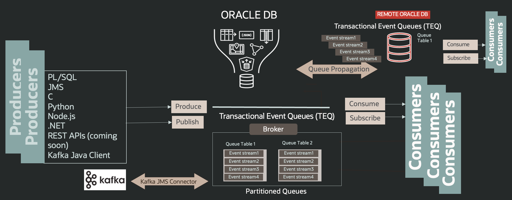
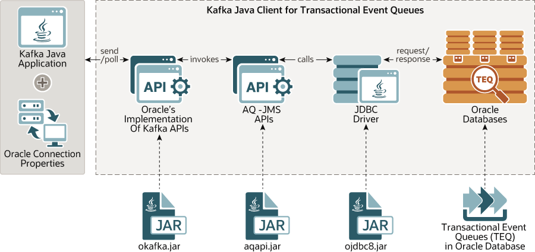
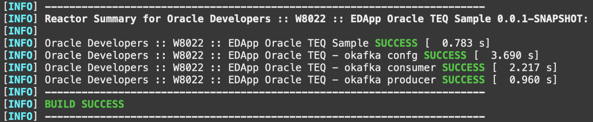
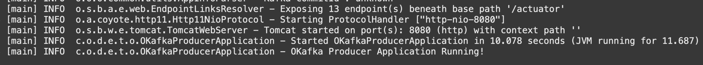

# Build Spring Boot microservices with Oracle Transactional Event Queues

## Introduction

This laboratory helps you know how to build an Event-driven architecture based on Spring Boot microservices that “communicate” asynchronously using Oracle Transactional Event Queues (TEQ). The laboratory have two microservices, a producer and a consumer, built using Spring Boot framework that connect with an Oracle Transactional Event Queue (TEQ) to exchange events, and use okafka library tthat contains Oracle specific implementation of Kafka Client Java APIs.

Estimated Time: 15 minutes

### Objectives

- Learn about Oracle Transactional Event Queues (TEQ) and okafka library
- Create an Oracle TEQ Topic
- Deploy and access the Oracle TEQ Producer Microservice
- Deploy and access the Oracle TEQ Consumer Microservice
- Learn how they work

### Prerequisites

- *[Optional]* An Oracle Cloud paid account or free trial. To sign up for a trial account with $300 in credits for 30 days, click [Sign Up](http://oracle.com/cloud/free).
- The Oracle Autonomous Transaction Processing database.
- A Docker Engine accessible.

## Overview of the Oracle Transactional Event Queues (TEQ)

Oracle Transactional Event Queues (TEQ) is a robust and feature-rich event streaming platform integrated with the Oracle database used to collect, process, store, and integrate data at scale. TEQ that are highly optimized implementation of AQ previously called AQ Sharded Queues, also AQ, address the requirements from data-driven and event-driven architectures in modern enterprise applications, including numerous use cases as distributed streaming, stream processing, data integration, and pub/sub messaging.

You can adopt Transactional Event Queues with one event stream (to preserve total ordering in the queue) or consider taking advantage of multiple event streams where messages are ordered within each event stream. This is similar to Apache Kafka's Topics approach consisting of multiple partitions from which producers and consumers can publish or subscribe.

Oracle Transactional Event Queues (TEQ) are a high-performance partitioned implementation with multiple event streams per queue that store messages persistently and propagate messages between queues on different databases. Because TEQs are implemented in database tables, all high availability, scalability, and reliability operational benefits are also applicable to queue data. TEQ supports standard database features such as recovery, restart, and security. You can use standard database development and management tools to monitor queues. Like other database tables, queue tables can be imported and exported. Similarly, *TEQ queues are supported by Oracle Data Guard for high availability, which can be critical to preserving messages when using a stateless middle tier*.

By being in the database, enqueues and dequeues can be incorporated in database transactions without requiring distributed transactions. And, messages can be queried using standard SQL. You can use SQL to access the message properties, the message history, and the payload. With SQL access, you can also audit and track messages. All available SQL technology, such as in-memory latches and table indices, optimize access to messages in TEQ.



Oracle TEQ can be accessed through polyglot programmatic interfaces since PL/SQL code til C, Python, Javascript, and Java could be used to create Consumers and producers. For example, this workshop is offered using the Spring Boot framework, one of the most important and adopted Java frameworks.

### Kafka Java Client for Transactional Event Queues

Oracle introduces Kafka Java Client for Oracle Transactional Event Queues Kafka (OKafka), a open source library that allow application compatibility with Oracle database. This provides easy migration for Kafka Java applications to Transaction Event Queues (TEQ). The Kafka Java APIs can now connect to Oracle database server and use TEQ as a messaging platform.



The figure shows OKafka library, which contains Oracle specific implementation of Kafka's Java APIs. This implementation internally invokes AQ-JMS APIs which in turn uses JDBC driver to communicate with Oracle Database.

Developers can now migrate an existing Java application that uses Kafka to the Oracle database. Oracle Database 20c provides client side library which allows Kafka applications to connect to Oracle Database instead of Kafka cluster and use TEQ's messaging platform transparently.

## **Task 1:** Create TEQ Topic

The setup phase provisioned an Oracle Autonomous Transaction Processing Database instance and we will use it now. This lab starts by creation of a TEQ Topic. As aforementioned, TEQ taking advantage of multiple event streams is similar to Apache Kafka's approach of Topics consisting of multiple partitions to which producers and consumers can publish to or subscribe from. So, let's create the TEQ "Topic" that will be used to persist events of this Lab.

To create the TEQ "Topic" execute the following command:

```bash
<copy>
teq-add-topic LABTEQTOPIC1
</copy>
```

This command will request the *Topic Name* and the Database user password supplied by you during workshop setup. It will try to create the TEQ "Topic", and if succeed, it will modify the configuration of producer and consumer microservices to point to this new topic created.

```bash
Created topic LABTEQTOPIC1
Configuring TEQ Producer to produce on topic LABTEQTOPIC1.
Configuring TEQ Consumer to consume from topic LABTEQTOPIC1.
```

## **Task 2:** Build TEQ producer and consumer microservices

Likewise the previous Lab, we adopted the microservices architecture and coded the producer and consumer also using the Spring Boot framework but different now we have to connect with TEQ and exchanged from spring-kafka to okafka library. Also, Maven is the dependency management tool, and to build our code, you have to execute the following commands:

```bash
<copy>
cd $LAB_HOME/springboot-oracleteq
./teq-ms-build
</copy>
```

As a result of the Maven build task, you should obtain the following lines showing that both Consumer and Producer were successfully built.



## **Task 3:** Produce events with TEQ producer microservice

1. Deploy TEQ producer microservice

    Now that we have the applications successfully built, we can deploy them and test them. Let's start with the Producer. Run these commands to build the image and deploy the Producer inside the Docker Engine:

    ```bash
    <copy>
    cd $LAB_HOME/springboot-oracleteq
    ./teq-ms-deploy-producer
    </copy>
    ```

    If the deployment task is successful, you will receive the messages below:

    ```bash
    Executing TEQ producer microservice deployment!
    TEQ producer microservices deployment succeeded!
     Step 1/8 : FROM ghcr.io/graalvm/graalvm-ce:ol8-java11 -- Successfully built c2e8cd47b003 Successfully tagged oracle-developers-teq-producer:0.0.1-SNAPSHOT
    TEQ_MS_PRODUCER_DEPLOYED completed
    ```

    > **Note:** If the deployment task did not complete correctly, you can investigate the deployment task logs at "$LAB_LOG"/teq-ms-producer-deployment.log

2. Launch a TEQ producer microservice

    Once you have deployed the producer microservice image, you will be able to launch a container and execute the producer microservice. Issue the follwoing commands:

    ```bash
    <copy>
    cd $LAB_HOME/springboot-oracleteq
    ./teq-ms-launch-producer
    </copy>
    ```

    If the deployment task is successful, you will receive the messages "TEQ producer microservice is running!". Yet it is possible to evaluate the logs from the producer issuing the following command to list the late six lines from the container log:

    ```bash
    <copy>container-logs teq-producer 6</copy>
    ```

    

3. Test the TEQ producer microservice

    The producer exposes a REST API through which events can be submitted to be handled, that is, in this simple case inserted into TEQ Topic. The producer expects API requests to be in JSON format and to make an API request, for simplicity, we will make a direct HTTP request using cURL tool.

    ```bash
    <copy>
    curl -X POST -H "Content-Type: application/json"  \
         -d '{ "id": "id1", "message": "teq message1" }'  \
         http://localhost:8090/placeMessage | jq
    </copy>
    ```

    The result should be

    ```bash
    {
        "id": "0",
        "statusMessage": "Successful"
    }
    ```

## **Task 4:** Consume events with TEQ consumer microservice

Now that we have Producer running and publishing events inside the TEQ Broker, you will do the same with Consumer.

1. Deploy TEQ consumer microservice

    We can deploy Consumer microservice running the following commands to build the image and deploy the it inside the Docker Engine:

    ```bash
    <copy>
    cd $LAB_HOME/springboot-oracleteq
    ./teq-ms-deploy-consumer
    </copy>
    ```

    If the deployment task is successful, you will receive the messages below:

    ```bash
    Executing TEQ consumer microservice deployment!
    TEQ consumer microservices deployment succeeded!
    Successfully built 8cd3a837ad94 Successfully tagged oracle-developers-teq-consumer:0.0.1-SNAPSHOT grep: /home/paulo_simo/teqodb/microservices-datadriven/work 
    TEQ_MS_CONSUMER_DEPLOYED completed
    ```

    > **Note:** If the deployment task did not complete correctly, you can investigate the deployment task logs at "$LAB_LOG"/teq-ms-consumer-deployment.log

2. Launch a TEQ consumer microservice

    Once you have deployed the consumer microservice image, you will be able to launch a container and execute it. Issue the follwoing commands:

    ```bash
    <copy>
    cd $LAB_HOME/springboot-oracleteq
    ./teq-ms-launch-consumer
    </copy>
    ```

    If the deployment task is successful, you will receive the messages "TEQ consumer microservice is running!".

    ```bash
    Launching TEQ consumer microservice!

    5e3ad25e39365606244ce5a4f91cce9ec4d0acd748245697176b0cc9d1b68525
    Thu Aug  4 13:29:19 UTC 2022: Waiting for consumer running!

    TEQ consumer microservice is running!
    ```

3. Test the TEQ consumer microservice

    The Consumer microservice after start try to dequeue the messages from the TEQ Broker. If it succeeds in dequeuing the events, we can see in the log the events that were sent by the producer issuing the following command to list the late six lines from the container log:

    ```bash
    <copy>container-logs teq-consumer 100</copy>
    ```

    The result inside logs of Consumer will be:

    ```bash
    .   ____          ___ __
    /\\ / __*'* __ _ *(*)_ ____ _\ \ \ \
    ( ( )\___ | '_ | '*| | '* \/ _` | \ \ \ \
    \\/  __*)| |*)| | | | | || (_| |  ) ) ) )
    '  |____| .__|*| |*|_| |_\__, | / / / /
    =========|_|==============|__*/=/*/_/_/
    :: Spring Boot ::                (v2.6.6)

    13:29:25.234 [main] INFO  c.o.d.o.o.OKafkaConsumerApplication - Starting OKafkaConsumerApplication v0.0.1-SNAPSHOT using Java 11.0.16 on 5e3ad25e3936 with PID 1 (/app/oracle-developers-okafka-consumer-0.0.1-SNAPSHOT.jar started by root in /app)
    ......
    13:29:31.185 [main] INFO  o.a.c.c.C.[Tomcat].[localhost].[/] - Initializing Spring embedded WebApplicationContext
    13:29:31.185 [main] INFO  o.s.b.w.s.c.ServletWebServerApplicationContext - Root WebApplicationContext: initialization completed in 5602 ms
    Installing Oracle PKI provider.
    13:29:32.199 [main] INFO  c.o.d.o.o.c.c.OKafkaConsumerConfig - OKafkaConsumerConfig::consumerConfig started and Oracle Instance is teqodb_tp.
    ......
    13:29:33.857 [main] INFO  o.s.b.w.e.tomcat.TomcatWebServer - Tomcat started on port(s): 8081 (http) with context path ''
    13:29:34.236 [main] INFO  c.o.d.o.o.OKafkaConsumerApplication - Started OKafkaConsumerApplication in 11.775 seconds (JVM running for 14.391)
    13:29:34.624 [main] INFO  o.o.o.c.consumer.ConsumerConfig - ConsumerConfig values:
            auto.commit.interval.ms = 10000
            auto.offset.reset = latest
            ......
            ......
            tns.alias = teqodb_tp
            value.deserializer = class org.oracle.okafka.common.serialization.StringDeserializer

    13:29:34.753 [main] WARN  o.o.o.common.utils.AppInfoParser - Error while loading kafka-version.properties :inStream parameter is null
    13:29:34.754 [main] INFO  o.o.o.common.utils.AppInfoParser - Kafka version : unknown
    13:29:34.755 [main] INFO  o.o.o.common.utils.AppInfoParser - Kafka commitId : unknown
    13:29:45.448 [main] INFO  c.o.d.o.o.s.OKafkaConsumerService - message received {"id": "0", "message": "teq message1"}. using key 0. sending to processing: Thread id 1
    ```

    **With this result, assuming that processing was successful, we could produce and consume events from TEQ Broker.**

## **Extra 1:** Verify Microservices configurations (optional)

The okafka library contains Oracle specific implementation of Kafka Client Java APIs. Its implementation is built on AQ-JMS APIs; thus, it is required to have the connection details.

The Database is generated during setup based on your environment and the workshop scripts fill the parameters from each microservices informing the correct data to the connection (Oracle Database TNS Name, Service Name, and Host Name and Port). These properties are stored in the *application.yaml* file from each microservices and you can review them acessing the Oracle Database data at step 1 and the applications properties on step 2 and 3.

1. Obtain JMS connection information

    Configuring a JMS connection is straightforward; you have to get the information about the Database instance and how we should follow to connect from the security perspective. We use Oracle Autonomous Transaction Processing (ATP) in this lab; we have to use a wallet. Again, the setup already brings us the wallet to facilitate this laboratory.

    To obtain the connection information at the Oracle Cloud Infrastructure Console. Locate your navigation menu on the left top corner, click on Oracle Database and select the Autonomous Transaction Processing option.

    In Oracle Autonomous Transaction Processing (ATP) section, select the compartment created by the lab (ex: lab8022) to load the Database created by our setup script. You will find your Oracle Autonomous Transaction Processing (ATP) as bellow:

    

    Clicking on the database name (ex: ab8022_ATP) will open our database details, where you will have the DB Connection button. This button opens the DB Connection window with detailed information about the ways to connect with Oracle Database.

    

    For example, we can click the *tp* option to copy the connection string and access details that we need for the okafka client configuration. Bellow one sample:

    ```text
    (description= (retry_count=20)(retry_delay=3)(address=(protocol=tcps)(port=1522)(host=adb.us-ashburn-1.oraclecloud.com))(connect_data=(service_name=xxxxxxxxxxxxxxx_lab8022_tp.adb.oraclecloud.com))(security=(ssl_server_cert_dn="CN=adwc.uscom-east-1.oraclecloud.com, OU=Oracle BMCS US, O=Oracle Corporation, L=Redwood City, ST=California, C=US")))
    ```

2. Setup Producer microservices properties

    The Producer microservice properties required connection properties, which at the end are the JDBC connection string, are filling with the Oracle Database Instance Name, Service Name, TNS Name, Bootstrap Servers (e.g. Oracle Database endpoint and port), and the Oracle TEQ Topic Name.

    ```bash
    <copy>
    vi $LAB_HOME/springboot-oracleteq/okafka-producer/src/main/resources/application.yaml
    </copy>
    ```

    ```text
    okafka-server-config:
    oracle-instance-name: <Oracle Autonomous Transaction Processing database TNS Name, e.g. labdb_tp>
    oracle-service-name: <Oracle Autonomous Transaction Processing database Service Name, e.g. xxxxxxxxxxxxxxx_labdb_tp.adb.oraclecloud.com>
    oracle-net-tns_admin: /home/appuser/wallet
    tns-alias: <Oracle Autonomous Transaction Processing database TNS Name, e.g. labdb_tp>
    security-protocol: SSL
    bootstrap-servers: <Host Name:Port>

    okafka-topic-config:
    topic-name: <TEQ TOPIC>
    num-of-partitions: 3
    replication-factor: 1
    ```

3. Setup Consumer microservices properties

    You have same configuration fill into the Consumer microservice properties.

    View the consumer configuration where were filling the Oracle Database Instance Name, Service Name, TNS Name, Bootstrap Servers (e.g., Oracle Database endpoint and port), the Oracle TEQ Topic Name. However, you have an additional field, the **Group ID**, that represents the subscriber agent created to allow dequeue from the TOPIC/QUEUE.

    ```bash
    <copy>
    vi $LAB_HOME/springboot-oracleteq/okafka-consumer/src/main/resources/application.yaml
    </copy>
    ```

    ```text
    okafka-server-config:
    oracle-instance-name: <Oracle Autonomous Transaction Processing database TNS Name, e.g. labdb_tp>
    oracle-service-name: <Oracle Autonomous Transaction Processing database Service Name, e.g. xxxxxxxxxxxxxxx_labdb_tp.adb.oraclecloud.com>
    oracle-net-tns_admin: /home/appuser/wallet
    tns-alias: <Oracle Autonomous Transaction Processing database TNS Name, e.g. labdb_tp>
    security-protocol: SSL
    bootstrap-servers: <Host Name:Port>

    okafka-topic-config:
    topic-name: <TEQ TOPIC>
    num-of-partitions: 3
    replication-factor: 1

    okafka-consumer-config:
    key-deserializer: org.oracle.okafka.common.serialization.StringDeserializer
    value-deserializer: org.oracle.okafka.common.serialization.StringDeserializer
    group-id: <TEQ TOPIC SUBSCRIBER>
    enable-auto-commit: true
    auto-commit-interval-ms: 10000
    max-poll-records: 100 
    ````

## **Extra 2:** Deep diving in the Code (optional)

Now, we invite you to compare the codes for Kafka and okafka Microservices and see that minor modifications make it possible to use almost the Kafka microservice code to build the TEQ / okafka microservices. For example:

Look at *KafkaProducerService class*.

```java

 import org.springframework.kafka.core.KafkaTemplate;

 public void send(ProducerRecord<String, String> producer) {
 LOG.info("Sending message='{}' to topic='{}'", producer.value(), producer.topic());
 ListenableFuture<SendResult<String, String>> kafkaResultFuture =
 kafkaTemplate.send(producer);
 }
```

Comparing with the same method in *OKafkaProducerService* we can verify that we have precisely the same construction with the difference that in the first one, we can use KafkaTemplate, a class from Spring Kafka framework that encapsulates KafkaProducer. Second, as we don't have a similar library from the Spring project, we call the OKafka Producer directly.

```java
 import org.oracle.okafka.clients.producer.KafkaProducer;
 ...
 public void send(ProducerRecord<String, String> prodRec) {
 LOG.info("Sending message='{}' to topic='{}'", prodRec.value(), prodRec.topic());
 kafkaProducer.send(prodRec);
 }
```

You may now **proceed to the next lab**

## Want to Learn More?

- [Oracle Transactional Event Queues](https://docs.oracle.com/en/database/oracle/oracle-database/21/adque/index.html)
- [Kafka Java Client for Oracle Transactional Event Queues](https://github.com/oracle/okafka)).
- [https://developer.oracle.com/](https://developer.oracle.com/)

## Acknowledgements

- **Authors** - Paulo Simoes, Developer Evangelist; Paul Parkinson, Developer Evangelist; Richard Exley, Consulting Member of Technical Staff, Oracle MAA and Exadata
- **Contributors** - Mayank Tayal, Developer Evangelist; Andy Tael, Developer Evangelist; Corrado De Bari, Developer Evangelist; Sanjay Goil, VP Microservices and Oracle Database
- **Last Updated By/Date** - Paulo Simoes, Aug 2022
