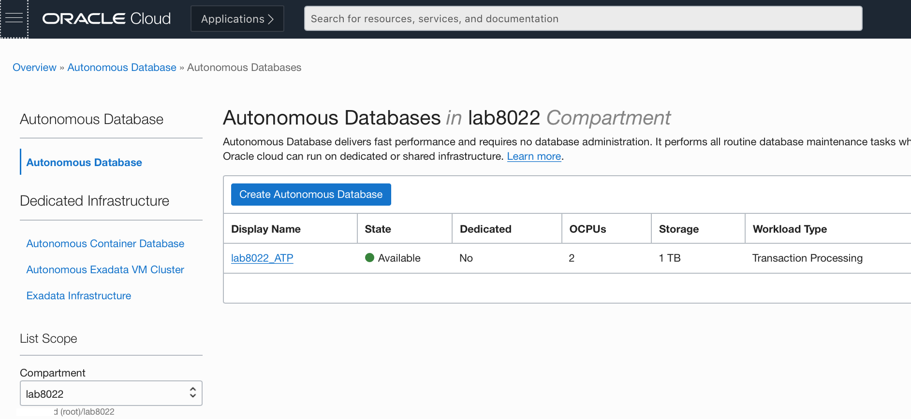
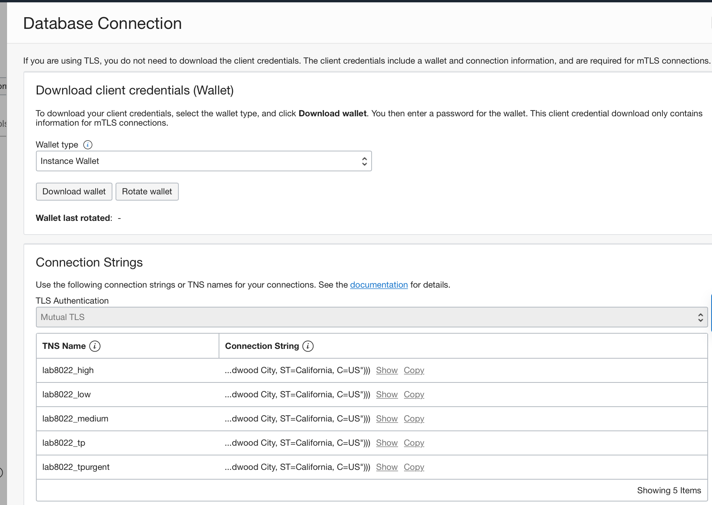
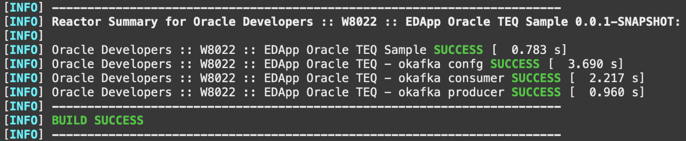

# Build Spring Boot microservices with Oracle Transactional Event Queues

## Introduction

This laboratory helps you know how to build an Event-driven architecture based on Spring Boot microservices that “communicate” asynchronously using Oracle Transactional Event Queues (TEQ). The laboratory have two microservices, a producer and a consumer, built using Spring Boot framework that connect with an Oracle Transactional Event Queue (TEQ) to exchange events, and use okafka library tthat contains Oracle specific implementation of Kafka Client Java APIs.

Estimated Time: 15 minutes

### Objectives

- Learn about Oracle Transactional Event Queues and okafka library
- Deploy and access the Oracle TEQ/okafka Producer Microservice
- Deploy and access the Oracle TEQ/okafka Consumer Microservice
- Learn how they work

### Prerequisites

- *[Optional]* An Oracle Cloud paid account or free trial. To sign up for a trial account with $300 in credits for 30 days, click [Sign Up](http://oracle.com/cloud/free).
- The Oracle Autonomous Transaction Processing database.
- A Docker Engine accessible.

## Overview of the Oracle Transactional Event Queues (TEQ) Provisioning

The Oracle Transactional Event Queues (TEQ) and its subscriber agent were provisioned while running the configuration (setup phase). Below is a description of the steps taken to make these assets available.

1. Create Oracle Transactional Event Queues (TEQ):

    A user was created, and some privileges were granted to create and manage Oracle TEQ.

    ```sql
    <copy>
    create user <username> identified by <password>
    grant connect, resource to user
    grant execute on dbms_aqadm to user
    grant execute on dbms_aqin to user
    grant execute on dbms_aqjms to user
    grant aq_user_role to user
    grant select_catalog_role to user
    </copy>
    ```

    Once the user is available, the Transactional Event Queue was created using PL/SQL script. Only upper case Topic/queue names are allowed for this preview release.

    ```sql
    <copy>
    BEGIN
    sys.dbms_aqadm.create_sharded_queue(queue_name=>'LAB8022_TOPIC', multiple_consumers => TRUE);
    sys.dbms_aqadm.start_queue('LAB8022_TOPIC');
    END;
    / 
    </copy>
    ```

2. Once successfully executed, the subscriber agent was added:

    To enable production for a Transactional Event Queue, it is required to register a subscriber agent. The bellow script creates this agent.

    ```sql
    <copy>
    --- Create the subscriber agent
    DECLARE
    subscriber sys.aq$_agent;
    BEGIN
    subscriber := sys.aq$_agent('LAB8022_SUBSCRIBER', NULL, NULL);
    DBMS_AQADM.ADD_SUBSCRIBER(queue_name => 'LAB8022_TOPIC', subscriber => subscriber);
    END;
    /
    </copy>
    ```

## **Task 1:** Verify configurations and build applications

The Oracle Transactional Event Queues is a robust messaging backbone offered by the converged Oracle Database that allows you to build an enterprise-class data-centric microservices architecture. The okafka library contains Oracle specific implementation of Kafka Client Java APIs. Its implementation is built on AQ-JMS APIs; thus, it is required to have the connection details.

As the Database is generated during setup based on your environment, you will need to adjust the parameters from each microservices informing the correct data to the connection (Oracle Database TNS Name, Service Name, and Host Name and Port). These properties are stored in the *application.yaml* file from each microservices.

1. Obtain JMS connection information

    Configuring a JMS connection is straightforward; you have to get the information about the Database instance and how we should follow to connect from the security perspective. We use Oracle Autonomous Transaction Processing (ATP) in this lab; we have to use a wallet. Again, the setup already brings us the wallet to facilitate this laboratory.

    To obtain the connection information at the Oracle Cloud Infrastructure Console. Locate your navigation menu on the left top corner, click on Oracle Database and select the Autonomous Transaction Processing option.

    In Oracle Autonomous Transaction Processing (ATP) section, select the compartment created by the lab (ex: lab8022) to load the Database created by our setup script. You will find your Oracle Autonomous Transaction Processing (ATP) as bellow:

    

    Clicking on the database name (ex: ab8022_ATP) will open our database details, where you will have the DB Connection button. This button opens the DB Connection window with detailed information about the ways to connect with Oracle Database.

    

    For example, we can click the *tp* option to copy the connection string and access details that we need for the okafka client configuration. Bellow one sample:

    ```text
    (description= (retry_count=20)(retry_delay=3)(address=(protocol=tcps)(port=1522)(host=adb.us-ashburn-1.oraclecloud.com))(connect_data=(service_name=xxxxxxxxxxxxxxx_lab8022_tp.adb.oraclecloud.com))(security=(ssl_server_cert_dn="CN=adwc.uscom-east-1.oraclecloud.com, OU=Oracle BMCS US, O=Oracle Corporation, L=Redwood City, ST=California, C=US")))
    ```

2. Setup Producer microservices properties

    You have to review the Producer microservice properties to fill the required connection properties, which at the end are the JDBC connection string and Oracle TEQ Topic Name.

    Edit the producer configuration filling the Oracle Database Instance Name, Service Name, TNS Name, Bootstrap Servers (e.g. Oracle Database endpoint and port), and the Oracle TEQ Topic Name.

    ```bash
    <copy>
    vi $LAB_HOME/springboot-oracleteq/okafka-producer/src/main/resources/application.yaml
    </copy>
    ```

    ```text
    okafka-server-config:
    oracle-instance-name: <Oracle Autonomous Transaction Processing database TNS Name, e.g. lab8022_tp>
    oracle-service-name: <Oracle Autonomous Transaction Processing database Service Name, e.g. xxxxxxxxxxxxxxx_lab8022_tp.adb.oraclecloud.com>
    oracle-net-tns_admin: /home/appuser/wallet
    tns-alias: <Oracle Autonomous Transaction Processing database TNS Name, e.g. lab8022_tp>
    security-protocol: SSL
    bootstrap-servers: <Host Name:Port>

    okafka-topic-config:
    topic-name: LAB8022_TOPIC
    num-of-partitions: 3
    replication-factor: 1
    ```

3. Setup Consumer microservices properties

    You have to do the same edition to the Consumer microservice to fill the required connection properties.

    Edit the consumer configuration filling the Oracle Database Instance Name, Service Name, TNS Name, Bootstrap Servers (e.g., Oracle Database endpoint and port), the Oracle TEQ Topic Name. However, you have an additional field, the **Group ID**, that represents the subscriber agent created to allow dequeue from the TOPIC/QUEUE.

    ```bash
    <copy>
    vi $LAB_HOME/springboot-oracleteq/okafka-consumer/src/main/resources/application.yaml
    </copy>
    ```

    ```text
    okafka-server-config:
    oracle-instance-name: <Oracle Autonomous Transaction Processing database TNS Name, e.g. lab8022_tp>
    oracle-service-name: <Oracle Autonomous Transaction Processing database Service Name, e.g. xxxxxxxxxxxxxxx_lab8022_tp.adb.oraclecloud.com>
    oracle-net-tns_admin: /home/appuser/wallet
    tns-alias: <Oracle Autonomous Transaction Processing database TNS Name, e.g. lab8022_tp>
    security-protocol: SSL
    bootstrap-servers: <Host Name:Port>

    okafka-topic-config:
    topic-name: LAB8022_TOPIC
    num-of-partitions: 3
    replication-factor: 1

    okafka-consumer-config:
    key-deserializer: org.oracle.okafka.common.serialization.StringDeserializer
    value-deserializer: org.oracle.okafka.common.serialization.StringDeserializer
    group-id: LAB8022_TOPIC_SUBSCRIBER
    enable-auto-commit: true
    auto-commit-interval-ms: 10000
    max-poll-records: 100 
    ````

4. Build the Applications

    Likewise the previous lab, we used Maven to build the applications Producer and Consumer and the configuration module. Run this command to build them:

    ```bash
    <copy>
    cd $LAB_HOME/springboot-oracleteq
    </copy>
    ```

    ```bash
    <copy>
    mvn clean install -DskipTests
    </copy>
    ```

    As a result, all modules were built with success.

    

## **Task 2:** Deploy and Test Spring Boot Oracle TEQ Producer

Now that we have the applications successfully built, we can deploy them and test them. Let's start with the Producer.

1. Deploy Oracle TEQ Producer microservice

    Run the following sequence of commands to build the container image and deploy it to the Docker Engine:

    ```bash
    <copy>
    cd $LAB_HOME/springboot-oracleteq/okafka-producer
    </copy>
    ```

    ```bash
    <copy>
    ./build.sh
    </copy>
    ```

2. Run the Oracle TEQ Producer microservice container

    After create and register the container image with your Producer microservices, you can run it executing the following command:

    ```bash
    <copy>
    docker run --detach --name=okafka-producer -p 8090:8080 oracle-developers-okafka-producer:0.0.1-SNAPSHOT
    </copy>
    ```

    We can check the logs and see the Producer running and waiting for requests:

    ```bash
    <copy>
    docker logs okafka-producer
    </copy>
    ```

    

3. Test the Oracle TEQ Producer microservice

    To test your microservices just submit a message to its REST endpoint using a cURL command:

    ```bash
    <copy>
    curl -X POST -H "Content-Type: application/json" -d '{ "id": "id1", "message": "okafka message 1" } ' http://localhost:8090/placeMessage | jq
    </copy>
    ```

    The result should be

    ```bash
    {
        "id": "0",
        "statusMessage": "Successful"
    }
    ```

## **Task 3:** Deploy and Test Spring Boot Oracle TEQ Consumer

Now that you have Producer running and publishing events inside the Oracle TEQ Topic, you will do the same with Consumer.

1. Deploy Oracle TEQ Consumer microservice

    Run the following sequence of commands to build the container image and deploy it to the Docker Engine:

    ```bash
    <copy>
    cd $LAB_HOME/springboot-oracleteq/okafka-consumer
    </copy>
    ```

    ```bash
    <copy>
    ./build.sh
    </copy>
    ```

2. Run the Oracle TEQ Consumer microservice container

    ```bash
    <copy>
    docker run --detach --name=okafka-consumer oracle-developers-okafka-consumer:0.0.1-SNAPSHOT
    </copy>
    ```

    You  can check the logs and see the Consumer running:

    ```bash
    <copy>
    docker logs -f okafka-consumer
    </copy>
    ```

    

3. Check message consumption by Oracle TEQ Consumer microservice

    And finally, you can check the consumption of messages published in Oracle TEQ by analyzing the microservice logs.

    

## **Task 4:** Stop Oracle TEQ Consumer

As the following laboratory will require that messages produced in Oracle TEQ stay there, please stop the Oracle TEQ Consumer microservice.

```bash
 <copy>
 docker stop okafka-consumer
 </copy>
```

## **Task 5:** Deep diving in the Code (optional)

Now, we invite you to compare the codes for Kafka and okafka Microservices and see that minor modifications make it possible to use almost the Kafka microservice code to build the TEQ / okafka microservices. For example:

Look at *KafkaProducerService class*.

```java

 import org.springframework.kafka.core.KafkaTemplate;

 public void send(ProducerRecord<String, String> producer) {
 LOG.info("Sending message='{}' to topic='{}'", producer.value(), producer.topic());
 ListenableFuture<SendResult<String, String>> kafkaResultFuture =
 kafkaTemplate.send(producer);
 }
```

Comparing with the same method in *OKafkaProducerService* we can verify that we have precisely the same construction with the difference that in the first one, we can use KafkaTemplate, a class from Spring Kafka framework that encapsulates KafkaProducer. Second, as we don't have a similar library from the Spring project, we call the OKafka Producer directly.

```java
 import org.oracle.okafka.clients.producer.KafkaProducer;
 ...
 public void send(ProducerRecord<String, String> prodRec) {
 LOG.info("Sending message='{}' to topic='{}'", prodRec.value(), prodRec.topic());
 kafkaProducer.send(prodRec);
 }
```

You may now **proceed to the next lab**

## Want to Learn More?

- [Oracle Transactional Event Queues](https://docs.oracle.com/en/database/oracle/oracle-database/21/adque/index.html)
- [Kafka Java Client for Oracle Transactional Event Queues](https://github.com/oracle/okafka)).
- [https://developer.oracle.com/](https://developer.oracle.com/)

## Acknowledgements

- **Authors** - Paulo Simoes, Developer Evangelist; Paul Parkinson, Developer Evangelist; Richard Exley, Consulting Member of Technical Staff, Oracle MAA and Exadata
- **Contributors** - Mayank Tayal, Developer Evangelist; Sanjay Goil, VP Microservices and Oracle Database
- **Last Updated By/Date** - Paulo Simoes, February 2022
