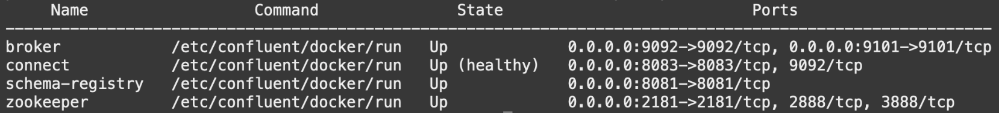

# Setup the connection between Kafka and Oracle Transactional Event Queues

## Introduction

This laboratory will show you the interoperability of Transactional Event Queues with Apache Kafka. Oracle Transactional Event Queues (TEQ) makes it easy to implement event-based applications, as we experienced in the previous lab. It is also highly integrated with Apache Kafka supporting bi-directional information flow between TEQ and Kafka so that changes are available in TEQ or Kafka as soon as possible in near-real-time.

Estimated Time: 10 minutes

### Objectives

- Setup Kafka Connect
- Produce messages in Kafka broker
- Consume these messages in Oracle TEQ
- Learn how they work

### Prerequisites

- This laboratory assumes you have already completed the earlier laboratories.
    1. Kafka Broker: Confluent Platform 3.3.0 or above, or Kafka 0.11.0 or above
    2. Oracle Transactional Event Queues
- Connect: Confluent Platform 4.1.0 or above, or Kafka 1.1.0 or above
- Java 1.8+
- Oracle TEQ JMS 1.1+ Client Jars

## **Task 1:** Setup Kafka Connect

This task will use the Apache Kafka Connect, a framework included in Apache Kafka that integrates Kafka with other systems. Oracle TEQ will provide a standard JMS package and related JDBC, Transaction packages to establish the connection and complete the transactional data flow.

To simplify the deployment of a Kafka Connect, as done in Lab 2, we are using the container made available by [Confluent Apache Kafka Quick Start](https://developer.confluent.io/quickstart/kafka-docker/) and already installed during Lab 1. 

You will configure the connection between the Kafka broker and the Oracle TEQ submitting the setup to Kafka [Connect REST API](https://docs.confluent.io/platform/current/connect/references/restapi.html).

The kafka2teq-connect-configuration.json file below has the configuration required to create a Connect Sync agent. The topics is already filled with Kafka Topic created during Lab 2, if it was changed, you need change this configuration too.

```bash
<copy>
cat $LAB_HOME/kafka-connect-teq/kafka2teq-connect-configuration.json
</copy>
```

```json
{
  "connector.class": "io.confluent.connect.jms.JmsSinkConnector",
  "tasks.max": "1",
  "topics": "LAB8022_TOPIC",
  "java.naming.factory.initial": "oracle.jms.AQjmsInitialContextFactory",
  "java.naming.provider.url": "<connection string>",
  "db_url": "<connection string>",
  "java.naming.security.principal": "<username>",
  "java.naming.security.credentials": "<password>",
  "jndi.connection.factory": "javax.jms.XAQueueConnectionFactory",
  "jms.destination.type": "topic",
  "jms.destination.name": "<teq topic name>",
  "key.converter":"org.apache.kafka.connect.storage.StringConverter",
  "value.converter":"org.apache.kafka.connect.storage.StringConverter",
  "confluent.topic.bootstrap.servers": "<kafka broker address>",
  "confluent.topic.replication.factor": "1"
}
```

1. First, verify if Kafka Components are still running. Execute the following commands:

    ```bash
    <copy>
    cd $LAB_HOME/cloud-setup/confluent-kafka
    </copy>
    ```

    ```bash
    <copy>
    ./docker-compose ps
    </copy>
    ```

    The output should be a list of four containers running each one an Kafka components with state Up.

    

    > **Note:** If the Kafka components are not running, you have to rebuild them executing the instructions from [Task 4](#task4reinstallkafkacomponentsoptional).

2. Execute the following command providing the Oracle Database password. It will fill the parameters based on your previous created assets and set up the Connect Sync between the Kafka Topic from Lab 2 and Oracle TEQ from Lab 3:

    ```bash
    <copy>
    cd $LAB_HOME/kafka-connect-teq
    </copy>
    ```

    ```bash
    <copy>
    ./setup-kafka2teq-connect.sh 
    </copy>
    ```

3. Once successfully executed, check that the connect are running:

    ```bash
    <copy>
    docker logs -f connect
    </copy>
    ```

    You will see the logs from Connect Sync similar with bellow snippet.

    ```Plain Text
    [2022-01-15 00:50:01,737] INFO JmsSinkConnectorConfig values: 
        character.encoding = UTF-8
        confluent.license = 
        confluent.topic = _confluent-command
        confluent.topic.bootstrap.servers = [broker:29092]
        confluent.topic.replication.factor = 1
        connection.factory.name = ConnectionFactory
        java.naming.factory.initial = oracle.jms.AQjmsInitialContextFactory
        jms.producer.time.to.live.ms = 0
        (io.confluent.connect.jms.JmsSinkConnectorConfig)
    [2022-01-15 00:50:01,737] INFO Copying 'jndi.connection.factory' to HashTable for InitialContext. (io.confluent.connect.jms.DefaultJmsConnection)
    [2022-01-15 00:50:01,737] INFO Connection established: ExecutionCompletedEvent
    ........
    [result=oracle.jms.AQjmsConnectionFactory@469214ed, failure=null] (io.confluent.connect.jms.JmsConnection)
    [2022-01-15 00:50:01,737] INFO Creating JMS Connection. (io.confluent.connect.jms.JmsConnection)
    [2022-01-15 00:50:01,737] INFO Connecting as LAB8022_USER (io.confluent.connect.jms.JmsConnection)
    ```

4. Check the Connect Sync status:

    You also can check the Connect Synk status using the REST API:

    ```bash
    <copy>
        curl -Ss http://localhost:8083/connectors/JmsConnectSync_lab8022/status | jq
    </copy>
    ```

    The result should be:

    ```json
    {
        "name": "JmsConnectSync_lab8022",
        "connector": {
            "state": "RUNNING",
            "worker_id": "connect:8083"
        },
        "tasks": [],
        "type": "sink"
    }
    ```

## **Task 2:** Enqueueing messages on Kafka Broker

Now that you have the Connector running, you can produce some messages and test the message transfer. The messages would be enqueued by the Kafka Producer and dequeued from the Oracle TEQ. We can use the Kafka Producer Microservice built during Lab 2 or operate Kafka producer inside the container to enqueue messages.

1. Enqueueing using Kafka Producer Microservice.

    With Kafka producer microservices running, you can submit a message using cURL command to producer API.

    ```bash
        <copy>
            curl -X POST -H "Content-Type: application/json" -d '{ "id": "sync1", "message": "Sync Message from Kafka to TEQ #1" } ' http://localhost:8080/placeMessage | jq
        </copy>
    ```

    The result should be like

    ```bash
        {
            "id": "1",
            "statusMessage": "Successful"
        }
    ```

2. Enqueueing with Kafka Producer inside container.

    As an alternative to enqueue, we can use the producer console client present in Confluent broker container. Executing the following command:

    ```bash
    <copy>
    docker exec --interactive --tty broker \
           kafka-console-producer --bootstrap-server broker:9092 \
           --topic LAB8022_TOPIC
    </copy>
    ```

    You will get the prompt to write your messages and to finish your should press CTRL+D:

    ```bash
    >Sync Message from Kafka to TEQ #2
    >Sync Message from Kafka to TEQ #3
    >Sync Message from Kafka to TEQ #4
    ```

## **Task 3:** Dequeue messages from Oracle TEQ

After produce some messages, the expected behavior is the Connect Sync agent consume messages from Kafka Topic and enqueue them on Oracle TEQ. And, you will be able to dequeue them from Oracle TEQ using okafka consumer microservice or a PL/SQL procedure, for example.

1. Dqueue message from Oracle TEQ

    To ilustrate the polyglot approach, this lab provide a PL/SQL procedure to dequeue messages, Execute the following command providing the Oracle Database User password:

    ```bash
        <copy>
        cd $LAB_HOME/kafka-connect-teq
        </copy>
    ```

    ```bash
        <copy>
        source dequeue_oracle_teq.sh
        </copy>
    ```

    As a result you will something like this:

    ```bash
    TEQ message: {"id": "0", "message": "message1"}

    PL/SQL procedure successfully completed.
    ```

    ```bash
    TEQ message: {"id": "1", "message": "Sync Message from Kafka to TEQ #1"}

    PL/SQL procedure successfully completed.
    ```

2. As an alternative you also can query the TEQ topic table:

    To issue sql commands you can use Oracle SQLcl tool and know connection information. Bellow, we provide an example:

    ```sql
    sql /nolog

    SQLcl: Release 21.4 Production on Tue Jan 25 00:10:07 2022

    Copyright (c) 1982, 2022, Oracle.  All rights reserved.

    SQL> set cloudconfig <wallet location>/wallet.zip

    SQL> connect LAB8022_USER@lab8022_tp
    Password? (**********?)****************
    Connected.

    SQL> select MSGID, ENQUEUE_TIME from LAB8022_TOPIC WHERE ROWNUM<20 ORDER BY ENQUEUE_TIME DESC;

                                MSGID                           ENQUEUE_TIME

    ___________________________________ ______________________________________
    00000000000000000200000001660400    21-MAR-22 08.50.38.953964000 PM GMT
    00000000000000000200000001660300    21-MAR-22 08.50.31.738645000 PM GMT
    00000000000000000200000001660200    21-MAR-22 08.50.29.545642000 PM GMT
    00000000000000000200000001660100    21-MAR-22 08.49.04.080323000 PM GMT
    00000000000000000200000001660000    21-MAR-22 08.47.47.158314000 PM GMT
    00000000000000000000000001660000    21-MAR-22 08.42.29.565761000 PM GMT

    6 rows selected.

    ```

## **Task 4:** Reinstall Kafka Components (optional)

If you disconnect from Cloud Shell for a long time, you may need to reinstall Kafka components because the local docker was cleaned up. This task helps you to perform this rebuild.

1. Enable environment and state functions executing the following commands:

    ```bash
        <copy>
        source $LAB_HOME/cloud-setup/env.sh
        source $LAB_HOME/cloud-setup/utils/state-functions.sh
        </copy>
    ```

2. Clean the two flags to allow rebuild executing:

    ```bash
        <copy>
        rm $LAB_HOME/cloud-setup/state/KAFKA_SETUP
        rm $LAB_HOME/cloud-setup/state/CFLCONNECT_IMAGE
        </copy>
    ```

3. Rebuild Kafka Cluster including Customised Connect image

    ```bash
    <copy>
    cd $LAB_HOME/cloud-setup/confluent-kafka
    source kafka-setup.sh
    </copy>
    ```

4. Execute the following sequence of commands to start the Kafka cluster and connect Broker to Lab8022 Network:

    ```bash
    <copy>
    cd $LAB_HOME/cloud-setup/confluent-kafka
    ./docker-compose up -d
    docker network connect lab8022network broker
    </copy>
    ```

5. Connect broker to Lab8022 Network (Docker internal)

    1. check if lab8022network exist

        ```bash
        <copy>
        docker network ls
        </copy>
        ```

    2. if network not exist, execute the following command to create it.

        ```bash
        <copy>
        docker network create lab8022network
        </copy>
        ```

    3. And, finally, connect broker to lab8022 network

        ```bash
        <copy>
        docker network connect lab8022network broker
        </copy>
        ```

## Wrap up

In this Lab, you learned how to build a bridge between two different event brokers, expanding the possibilities of your decoupled architecture enabling the processing of messages per best-of-the-breed tools. That is the getting start of the Event Mesh concept.

The following animation describe what we builded in this workshop especially in this laboratory.

[](youtube:wDRIMzlYh9U)

You may now **proceed to the next lab**

## Acknowledgements

- **Authors** - Paulo Simoes, Developer Evangelist; Paul Parkinson, Developer Evangelist; Richard Exley, Consulting Member of Technical Staff, Oracle MAA and Exadata
- **Contributors** - Mayank Tayal, Developer Evangelist; Sanjay Goil, VP Microservices and Oracle Database
- **Last Updated By/Date** - Paulo Simoes, February 2022
