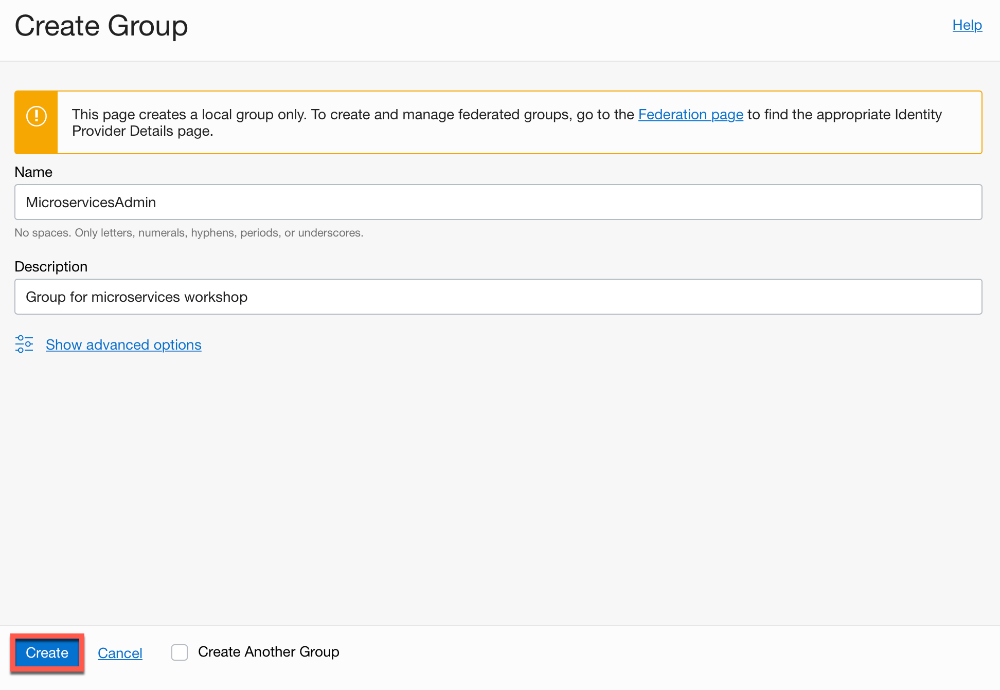
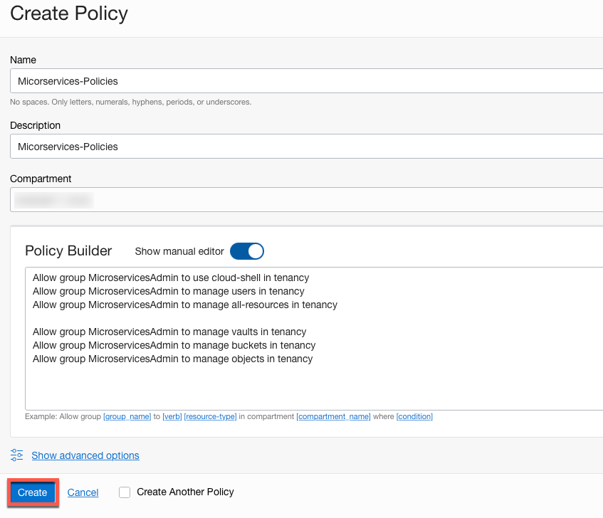
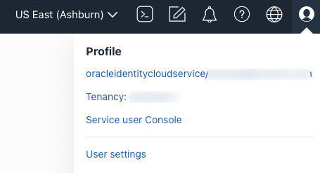
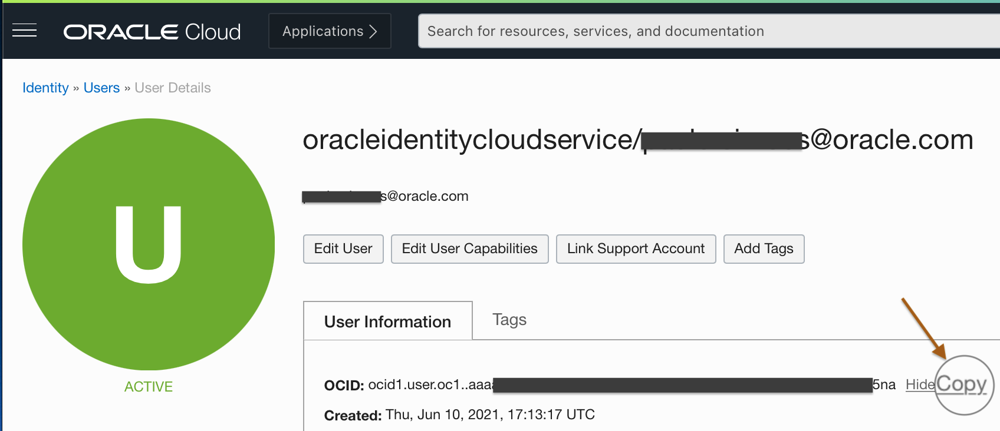
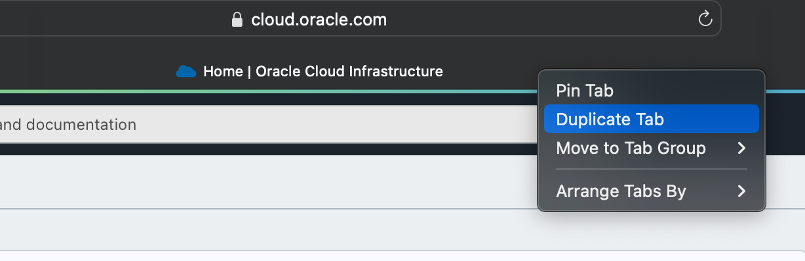

# Workshop setup

## Introduction

In this laboratory, we will provision and setup the resources to execute microservices in your tenancy.  

Estimates Time: 15 minutes

### Objectives

- Clone the workshop repository.
- Execute environment setup.

### Prerequisites

An Oracle Cloud paid account or free trial. To sign up for a trial account with $300 in credits for 30 days, click [Sign Up](http://oracle.com/cloud/free).

## **Task 1:** Log in to the Oracle Cloud Console

If you haven't already, sign in to your account.

## **Task 2:** Select the Home Region

Be sure to select the **home region** of your tenancy.  Setup will only work in the home region.

  

## **Task 3:** Create group and IAM policies

A user's permissions to access services comes from the groups to which they belong. The permissions for a group are defined by policies. Policies define what actions members of a group can perform, and in which compartments. Users can access services and perform operations based on the policies set for the groups of which they are members.

If you are not an administrator on your tenancy, you must insure that additional policies have been added to the group you are a member of or ask your admin to create a separate group for you with additional policies. This group will have IAM policies for creating and managing the resources within the compartment that will be created by workshop setup scripts.

Here are the steps for creating a new group and assigning security policy required for this workshop (only a user with the admin account will be able to perform the below steps):

1. Click the Navigation Menu in the upper left, navigate to Identity & Security and select Groups.

   

2. Click Create Group.

   

3. In the Create Group dialog box, enter the following:

    - **Name**: Enter a unique name for your group, such as "MicroservicesAdmin”. The group name cannot contain spaces.
    - **Description**: Enter a description (for example, “New group for microservices workshop”).
    - Click **Create**.

    

    

4. Now, create a security policy that gives the group permissions to execute the setup steps for this workshop, entering a name, such as "Microservices-Policies".

    

    Using **Edit Policy Statement** option, add the below statements to the policy created above.

    ```text
      <copy>
      Allow group MicroservicesAdmin to use cloud-shell in tenancy
      Allow group MicroservicesAdmin to manage users in tenancy
      Allow group MicroservicesAdmin to manage all-resources in tenancy

      Allow group MicroservicesAdmin to manage vaults in tenancy
      Allow group MicroservicesAdmin to manage buckets in tenancy
      Allow group MicroservicesAdmin to manage objects in tenancy
      </copy>
    ```

    

5. And finally, make sure your user account has been added to the group created in step#2.

## **Task 4:** Check Your Tenancy Service Limits

If you have already used up some quota on your tenancy, perhaps while completing other workshops, there may be insufficient quota left to run this workshop. The most likely quota limits you may exceed are summarized in the following table.

| Service          | Scope  | Resource                                             | Available | Free Account Limit |
|------------------|:------:|------------------------------------------------------|:---------:|:------------------:|
| Database         | Region | Autonomous Transaction Processing Total Storage (TB) | **1**     | 2                  |
|                  | Region | Autonomous Transaction Processing OCPU Count         | **2**     | 8                  |

Quota usage and limits can be check through the console: **Governance & Administration** -- **Governance** -- **Limits, Quotas and Usage**, For example:

  

The Tenancy Explorer may be used to locate existing resources: **Governance & Administration** --> **Governance** --> **Tenancy Explorer**. Use the "Show resources in subcompartments" feature to locate all the resources in your tenancy:

  

It may be necessary to delete some resources to make space to run the workshop.  Once you have sufficient space you may proceed to the next step.

## **Task 5:** Launch the Cloud Shell

Cloud Shell is a small virtual machine running a "bash" shell which you access through the  'Oracle Cloud Console. Cloud Shell comes with a pre-authenticated command line interface which is set to the  'Oracle Cloud Console' tenancy region. It also provides up-to-date tools and utilities.

1. Click the Cloud Shell icon in the top-right corner of the Console.

  

  > **Note:** Cloud Shell uses websockets to communicate between your browser and the service. If your browser has websockets disabled or uses a corporate proxy that has websockets disabled you will see an error message ("An unexpected error occurred") when attempting to start Cloud Shell from the console. You also can change the browser cookies settings for a specific site to allow the traffic from *.oracle.com

## **Task 6:** Create a Folder to Contain the Workshop Code

1. Create a directory to contain the workshop code. The directory name is used to create a compartment of the same name in your tenancy. The directory name must have between 1 and 13 characters, contain only letters or numbers, and start with a letter. Make sure that a compartment of the same name does not already exist in your tenancy or the setup will fail. For example:

    ```bash
    <copy>mkdir lab8022</copy>
    ```

   All the resources created by the setup are created using the directory name, for example the compartment is created with the same name. This will let you to quickly delete and cleanup afterward.  

2. Change directory to the directory that you have created. The setup will fail if you do not complete this step. For example:

    ```bash
    <copy>cd lab8022</copy>
    ```

## **Task 7:** Make a Clone of the Workshop Setup Script and Source Code

1. To work with the application code, you need to make a clone from the GitHub repository using the following command.  
[//]: #

    ```bash
    <copy>git clone -b 22.4.2 --single-branch https://github.com/oracle/microservices-datadriven.git</copy>
    ```

   You should now see the directory `microservices-datadriven` in the directory that you created.

2. Run the following command to edit your .bashrc file so that you will have the workshop directory (LAB_HOME) setting up when you connect to cloud shell in the future.

    ```bash
    <copy>
    echo "# LiveLab Setup -- BEGIN" >>${HOME}/.bashrc
    echo "export LAB_HOME=${HOME}/lab8022/microservices-datadriven/workshops/oracleteq-kafka" >>${HOME}/.bashrc
    export JAVA_HOME=${HOME}/graalvm-ce-java11-22.0.0.2
    echo "export JAVA_HOME=${HOME}/graalvm-ce-java11-22.0.0.2" >>${HOME}/.bashrc
    echo "export PATH=$JAVA_HOME/bin/:$PATH" >>${HOME}/.bashrc
    echo "# LiveLab Setup -- END" >>${HOME}/.bashrc
    source ${HOME}/.bashrc
    </copy>
    ```

## **Task 8:** Start the Setup

1. Execute the following commands to start the setup.  

    ```bash
    <copy>
    source $LAB_HOME/cloud-setup/env.sh
    </copy>
    ```

    ```bash
    <copy>
    source $LAB_HOME/cloud-setup/setup.sh
    </copy>
    ```

    > **Note:** Cloud shell may disconnect after a period of inactivity. If that happens, you can reconnect and then run this command to resume the setup:

    >   ```bash
    >
        <copy>source $LAB_HOME/cloud-setup/setup.sh</copy>
        ```

    The setup process will typically take around 10 minutes to complete.  

2. The setup will ask for you to enter your User OCID.  

   Be sure to provide the user OCID and not the user name or tenancy OCID.

   User information is available in the Oracle Cloud Infrastructure Console.

   The user OCID will look something like `ocid1.user.oc1..aaaaaa==========l4oi======fasdf===f4===bta`. Pay attention to the "ocid1.user" prefix.

   Sometimes the name link is missing in which case select the `User Settings` link. Do not select the "Tenancy" link.

   a. Locate your menu bar and click the person icon at the far upper right. From the drop-down menu, select your user's name.

      

   b. Click Show to see the details and then click Copy to copy the user OCID to the clipboard, paste in the copied data in console.

      

3. The setup will ask you to enter an admin password for the database. Database passwords must be 12 to 30 characters and contain at least one uppercase letter, one lowercase letter, and one number. The password cannot have the double quote (") character or the word "admin."

> **Note:** The passwords typed are not displayed and don't forget your database password because you will have to provide it again during the labs.

## **Task 9:** Monitor the Setup

The setup will provision the following resources in your tenancy:

| Resources              | Oracle Cloud Console Navigation                                               |
|------------------------|-------------------------------------------------------------------------------|
| Object Storage Buckets | Storage -- Object Storage -- Buckets                                          |
| Database               | Oracle Database -- Autonomous Database -- Autonomous Transaction Processing   |

1. Duplicate browser tab

    You should monitor the setup progress from a different browser window or tab.  It is best not to use the original browser window or not to refresh it as this may disturb the setup or you might lose your shell session. Most browsers have a "duplicate" feature that will allow you to quickly created a second window or tab.

    

2. Navigate to Database resources

    From the new browser window or tab, navigate around the console to view the resources within the new compartment. The table includes the console navigation for each resource. For example, here we show the database resources:

    

3. Check the Docker images

    Also, the setup will pull a GraalVM CE java11 to your Cloud Shell (local) Docker Repository. Run the following command to check your local docker repository:

      ```bash
      <copy>docker images</copy>
      ```

    As result you will see the following:

      ```bash
      REPOSITORY                        TAG                 IMAGE ID            CREATED             SIZE
      cp-kafka-connect-custom           0.1.0               b7c09d1ca0c1        6 minutes ago       1.43GB
      ghcr.io/graalvm/graalvm-ce        ol8-java11          87c0795cf942        5 days ago          1.34GB
      confluentinc/cp-kafka-connect     7.0.1               ce86628e990d        6 weeks ago         1.39GB
      confluentinc/cp-server            7.0.1               81fddf506c55        6 weeks ago         1.54GB
      confluentinc/cp-schema-registry   7.0.1               43303c1d5097        6 weeks ago         1.64GB
      confluentinc/cp-zookeeper         7.0.1               3a7ea656f1af        6 weeks ago         780MB
      ```

> **Note:** Cloud Shell sessions have a maximum length of 24 hours, and time out after 20 minutes of inactivity.

## **Task 10:** Complete the Setup

Once the majority of the setup has been completed the setup will periodically provide a summary of the setup status. Once everything has completed you will see the message: **SETUP_VERIFIED completed**.

  1. Check the backgroud running tasks:
    If any of the background setup jobs are still running you can monitor their progress with the following command.

      ```bash
      <copy>ps -ef | grep "$LAB_HOME/cloud-setup/utils" | grep -v grep</copy>
      ```

  2. View the processes logs. Their are located in the $LAB_LOG directory.

      ```bash
      <copy>ls -al $LAB_LOG</copy>
      ```

You may now **proceed to the next lab**

## Acknowledgements

- **Authors** - Paulo Simoes, Developer Evangelist; Paul Parkinson, Developer Evangelist; Richard Exley, Consulting Member of Technical Staff, Oracle MAA and Exadata
- **Contributors** - Mayank Tayal, Developer Evangelist; Sanjay Goil, VP Microservices and Oracle Database
- **Last Updated By/Date** - Paulo Simoes, February 2022
