# Enable API Gateway

## Overview

This task show how to setup an API Gateway, the OCI service that will be between the REST client and ORDS/ADB-S, to provide request rate limitation and protection on ORDS access.

### Objectives

* API Gateway setup

### Prerequisites

* The OCI Load Balancer and ORDS have been provisioned and running.
* Get the **&ltabrv\>** code with the command `echo $TF_VAR_proj_abrv` and replace in the following steps.

**NOTE**: if you lose connection in Cloud Shell, and you need to recreate the environment variables, please run :

```bash
<copy>
source ./terraform-env.sh
source ./env-refresh.sh
</copy>
```

## Task 1: Set API GW Policies and Networking

* As tenant owner, get the name of the group in which you are with administrator role, looking in **Identity & Security**/**Groups**, for example <**Administrators**>, and set a variable env replacing **group_name** in this command:

    ```bash
    <copy>
    export ADM_GROUP=<group_name>
    </copy>
    ```

    and fix TF_VAR for next steps:

    ```bash
    <copy>
    export TF_VAR_proj_abrv=$(echo ${TF_VAR_proj_abrv}| tr '[:lower:]' '[:upper:]')
    export TF_VAR_size=$(echo ${TF_VAR_size}| tr '[:lower:]' '[:upper:]')
    </copy>
    ```

    With the following command get the compartment name provided during **Lab 1: Setup**, in order to set the required IAM Policies to enable and use API Gateway:

    ```bash
        <copy>
        export COMP_NAME=$(oci iam compartment get --compartment-id $TF_VAR_compartment_ocid --query data.name --raw-output)
        </copy>
    ```

* in **Compartment**, set **Policy** needed for API GW for the <**group-name**> found at the previous step in which tenancy user is:

    ```text
        Allow group <group-name> to manage api-gateway-family in compartment <compartment-name>
        Allow group <group-name> to manage virtual-network-family in compartment <compartment-name>
    ```

    i.e. execute these commands:

    ```bash
        <copy>
        export statement="[\"Allow group ${ADM_GROUP} to manage api-gateway-family in compartment ${COMP_NAME}\",\"Allow group ${ADM_GROUP} to manage virtual-network-family in compartment ${COMP_NAME}\"]";
        echo "${statement}"  >statement.json;
        oci iam policy create --compartment-id $TF_VAR_compartment_ocid --name apigw_policy --description 'test APIGW policies' --statements file://./statement.json;
        rm ./statement.json;
        </copy>
    ```

Now let's setup networking rules to enable API GW in front of Load Balancer for ORDS.

* First get the Load Balancer IP and its OCID:

    ```bash
        <copy>
            export load_balancer_id=$(oci lb load-balancer list --compartment-id $TF_VAR_compartment_ocid --query 'data[0]."id"' --raw-output )
        </copy>
    ```

  * Create a security group for API GW.
    * Get network name and new Network Security Group (NSG) with this command:

        ```bash
        <copy>
        printf "\nnetwork: $TF_VAR_proj_abrv-vcn \nNSG: $TF_VAR_proj_abrv-security-group-apigw\n" 
        </copy>
        ```

        something like *dcms*-**vcn** and *dcms*-**security-group-apigw**
      * Select under **Networking/Virtual Cloud Networks** the network name got at previous step and click on **Resources**/**Network Security Groups**.
        * Click on **Create Network Security Group** button
        * input in the field **Name** the NSG name printed before, for example **dmcs-security-group-apigw**, and click **Next** button
          * Add 3 rules:
            * **Direction**:**Ingress**, **Stateless**:uncheck, **Source Type**: **CIDR**, **Source CIDR**: 0.0.0.0/0, **IP Protocol**: **TCP**, **Source Port Range**: **All**, **Destination Port Range**: 443;
            * **Direction**:**Ingress**, **Stateless**:uncheck, **Source Type**: **CIDR**, **Source CIDR**: 0.0.0.0/0, **Protocol**: **TCP**, **Source Port Range**: **All**, **Destination Port Range**: 80;
            * **Direction**:**Egress**, **Stateless**:uncheck, **Source Type**: **CIDR**, **Source CIDR**: **0.0.0.0/0**, **Protocol**: **TCP**, **Source Port Range**: **All**, **Destination Port Range**: All;

            

    * Or you can do the same via oci-cli:

        ```bash
            <copy>
            export vcn_ocid=$(oci network vcn list --compartment-id $TF_VAR_compartment_ocid --display-name $TF_VAR_proj_abrv-vcn --query 'data[0]."id"'  --raw-output);

            export nsg_id=$(oci network nsg create --display-name $TF_VAR_proj_abrv-security-group-apigw --compartment-id $TF_VAR_compartment_ocid --vcn-id $vcn_ocid --query data.id --raw-output --wait-for-state AVAILABLE);

            oci network nsg rules add --nsg-id $nsg_id --from-json file://apigw/sec_rules_apigw.json;
            </copy>     
        ```

## Task 2: API GW provisioning

* Create Gateway in Public VCN. Under **Developer Services**/**API Management**/**Gateways** click on **Create Gateway** button, considering that you have to find **&ltcompartment-name\>** and **&ltnetwork-vcn\>**  actual values:
      * **Name**: **ordsGW**

      * **Type**: **Public**

      * Choose **Compartment**: if you don't remember, get it with command `echo $COMP_NAME` the name to choose
      * Network
        * Choose **Virtual cloud network in &ltcompartment-name\>**: <network-vcn\> defined
        * Select **Subnet in &ltcompartment-name\>**: public subnet under <network-vcn\> 
        * check **Enable network &ltcompartment-name\>** and choose **Network security group in &ltcompartment-name\>** created at the step before, for example: *dcms*-**security-group-apigw**.
        * NOTE: you can use an own certificate for API Gateway front-end. In this case we use the default certificate provided by the gateway.

        

      * or via command-line:
        ```
        <copy>
        export TF_VAR_subnet_public=$(oci network subnet list --compartment-id $TF_VAR_compartment_ocid --display-name $TF_VAR_proj_abrv-subnet-public --query 'data[0]."id"' --raw-output);
        export TF_VAR_nsg_apigw=$(oci network nsg list --compartment-id $TF_VAR_compartment_ocid --display-name $TF_VAR_proj_abrv-security-group-apigw --query 'data[0]."id"' --raw-output);
        echo '["'$TF_VAR_nsg_apigw'"]' >>nsg_apigw.json;
        oci api-gateway gateway create  --compartment-id $TF_VAR_compartment_ocid --endpoint-type PUBLIC --subnet-id $TF_VAR_subnet_public --display-name ordsGW --network-security-group-ids file://nsg_apigw.json --wait-for-state SUCCEEDED;
        rm ./nsg_apigw.json;
        </copy>
        ```

* Get ApiGW OCID and base URL end-point:

    ```bash
        <copy>
        export api_gw_id=$(oci api-gateway gateway list --compartment-id $TF_VAR_compartment_ocid --query 'data.items[0]."id"' --raw-output --all); 
        echo $api_gw_id;
        export api_gw_base_url=$(oci api-gateway gateway list --compartment-id $TF_VAR_compartment_ocid --query 'data.items[0]."hostname"' --raw-output --all); 
        echo $api_gw_base_url;
        </copy>
    ```

* Create Deployment under Gateway to bypass the ORDS Load Balancer end-point and expose another REST endpoint. We'll hide the access to APEX console and any other services than under /ords/ordtest path, protecting ORDS server from unwanted access, clicking on **Create deployment** button:

    

  * choose **From scratch**

  * Basic information:
    * **Name**: **full**
    * **Path prefix**: **/ords**

    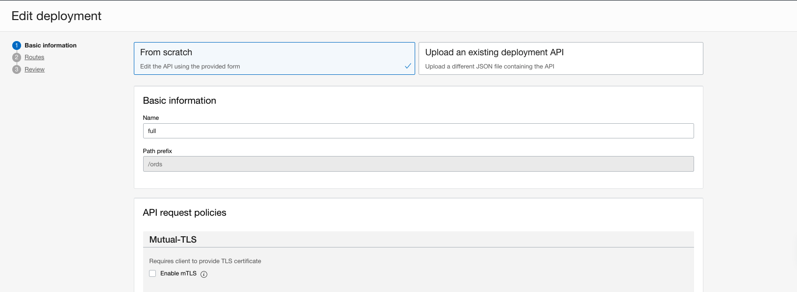

  * Rate Limiting:
    * **Number of requests per second**: **50**
    * **Type of rate limit**: **Per client (IP)**

    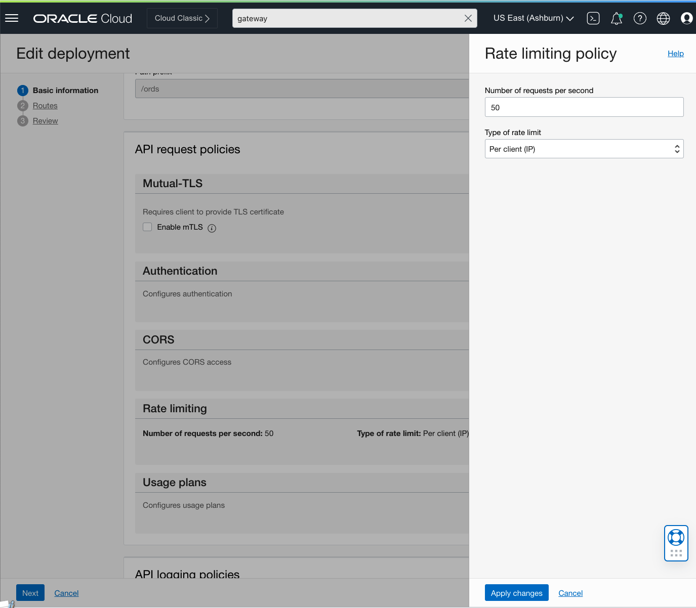

  * Click on **Next** Button
    * **Routes**:
    First get the Load Balancer IP in front of ORDS server:

        ```bash
            <copy> 
            export LB=$(terraform output -json lb_address | jq -r '.'); 
            echo $LB;
            </copy>
        ```

    and use it in the following setting:
    * **Path**: /ordstest/{generic_welcome*}
    * **Methods**: ANY
    * **Type**: HTTP
    * **URL**: set the actual [LB] IP address in <https://[LB]/ords/ordstest/${request.path[generic_welcome]}>
    * **Connection establishment**: 10
    * **Request transmit timeout in seconds**: 10
    * **Reading response timeout in seconds**: 10
    * **Disable SSL verification** (because it has been used a self signed certificate)

* To do the previous steps using command-line tool:

    ```bash
        <copy>
        sed "s/LB_URL/$LB/" ./apigw/specification.json.temp >./apigw/specification.json;
        oci api-gateway deployment create --compartment-id $TF_VAR_compartment_ocid --gateway-id $api_gw_id --path-prefix /ords --display-name full --specification file://./apigw/specification.json --wait-for-state SUCCEEDED

        </copy>
    ```

   and get finally the API Gateway URL for API protected in $gw_url:

    ```bash
        <copy>
            export api_gw_deploy=$(oci api-gateway deployment list  --compartment-id $TF_VAR_compartment_ocid --query 'data.items[0]."id"' --raw-output --all); 
            echo $api_gw_deploy;
            export api_gw_deploy_path=$(oci api-gateway deployment get --deployment-id $api_gw_deploy --query 'data.specification.routes[0]."path"' --raw-output); 
            echo $api_gw_deploy_path;
            export gw_url=$(oci api-gateway deployment get --deployment-id $api_gw_deploy --query data.endpoint --raw-output); 
            echo $gw_url;
            export gw_url_emp=$gw_url'/ordstest/examples/employees/'; 
            echo $gw_url_emp;
        </copy>
    ```

* From SQL Developer Web, as ORDSTEST user, run this SQL command to update the callback URL:

    ```sql
    <copy>
        BEGIN
            OAUTH.DELETE_CLIENT(p_name            => 'Authorization Code Example');
            OAUTH.CREATE_CLIENT(
                    p_name            => 'Authorization Code Example'
                    ,p_grant_type      => 'authorization_code'
                    ,p_owner           => 'Example Inc.'
                    ,p_description     => 'Sample for demonstrating Authorization Code Flow'
                    ,p_redirect_uri    => 'http://<api_gw_base_url>/auth/code/example/'
                    ,p_support_email   => 'support@example.org'
                    ,p_support_uri     => 'http://example.org/support'
                    ,p_privilege_names => 'example.employees'
            );
            COMMIT;
        END;
        /
    </copy>
    ```

    and get the new credentials:

    ```sql
    <copy>
        SELECT client_id, client_secret 
        FROM user_ords_clients 
        WHERE name = 'Authorization Code Example';
    </copy>
    ```

## Task 3: Close access to LB front-end to ORDS

* From **API Gateway / Gateways**, on **ordsGW details**, get the IP address:

* or via oci-cli:

    ```bash
    <copy>
    export api_gw_id=$(oci api-gateway gateway list --compartment-id $TF_VAR_compartment_ocid --query 'data.items[0]."id"' --raw-output --all);

    export api_gw_ip=$(oci api-gateway gateway get --gateway-id ${api_gw_id} --query 'data."ip-addresses"[0]."ip-address"' --raw-output);
    echo $api_gw_ip
    </copy>
    ```

* In **Networking / Virtual Cloud Networks**, choose the network details, for example  something like *dcms*-**vcn**. Click on **Resources** / **Network Security Groups**:

  * Click on security group for load balancer, something like  *dcms***-security-group-lb**, to update the ingress rules.
  * Select the two ingress rules, **Ingress** rule for **Destination Port Rage: 443** and **Ingress** rule for **Destination Port Rage: 80** and click on **Edit** button:
  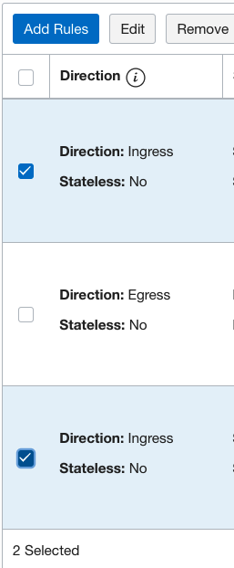
  * report the Gateway IP, for example **141.148.10.121**, with a CIDR of **141.148.10.121/32** and click on **Save changes** :
  
From this moment LB is no more accessible from Internet. Check connection doesn't work via a curl command:

    ```bash
        <copy>
            curl https://$LB/ords/ordstest/examples/employees/
        </copy>
    ```

* Now set header for Load Balancer to API GW:
  * from **Networking**/**Load Balancers**, click on load balancer name, something like *dcms***-lb**, and under **Resources / Rule Sets**, click on **Create Rule Set**:
  

  * Set rule with following parameters, replacing <api\_gw\_base\_url\> with the content of:

    ```bash
    <copy>
        echo $api_gw_base_url
    </copy>
     ```

    * In the following parameters:
        * **Name**: **force_header**
        * Select **Specify Request Header Rules**
        * Action: **Add Request Header** / **Header: host** / **Value** : <api\_gw\_base\_url\>

        

    * Apply Rules to listener.
    From **Networking**/**Load Balancers**,click on load balancer name, something like *dcms* **-lb** and under **Resources / Listeners**, edit properties of one like  *dcms***-lb-listener-443**:
        

    * and add **Additional Rule Set**:
        

      selecting **force_header** and save changes:
        

## Task 4: OAuth 2.0, Third Party OAuth 2.0-Based AuthN

* Set the ORDS to provide OAuth 2.0-Based AuthN, getting from the final step of ORDS setup task the **CLIENT\_ID** and **CLIENT\_SECRET** to perform the authentication (Lab 3 - Task 5).

* Test:

    Get the OAuth access token using client credentials Request an access token from the token endpoint.

    * Get from the GUI the url end-point for OAuth2.0 token:

    

    * Get the **access_token** replacing <clientId\> and <clientSecret\> in the following command:

        ```bash
        <copy>
        curl -k -0 -i --user <clientId>:<clientSecret> --data "grant_type=client_credentials" https://$api_gw_base_url/ords/ordstest/oauth/token
        </copy>
        ```

    * you should get something like:

        ```bash
        {"access_token":"FZnQHruEhGr8v8OT7wvjOw","token_type":"bearer","expires_in":3600}
        ```

    * use the **access_token** and replace the <\> in the command to access final resource:

        ```bash
        <copy>
            curl -k -0 -i -H"Authorization: Bearer <access_token>" https://$api_gw_base_url/ords/ordstest/examples/employees/
        </copy>
        ```

        to get something like:

        ```http
            HTTP/1.1 200 OK
            Content-Type: application/json
            Connection: close
            Date: Thu, 16 Jun 2022 10:26:40 GMT
            ETag: "22nzvQkTcraKX5kdK1VRFqMeod9Vbh/C/5TYvsWNYx5Gr/ec1I7+K+jZ4OLxNXPollitrKJyoagQ5le4WZc3qw=="
            Server: Oracle API Gateway
            content-length: 713
            X-Frame-Options: sameorigin
            X-XSS-Protection: 1; mode=block
            opc-request-id: /2A9486DD7E373F886B0E7099C1604D94/0889F2867669123D151CCD2B05D297A7
            X-Content-Type-Options: nosniff
            Strict-Transport-Security: max-age=31536000

            {"items":[{"empno":7566,"ename":"JONES","job":"MANAGER","mgr":7839,"hiredate":"1981-04-02T00:00:00Z","sal":2975,"comm":null,"deptno":20},{"empno":7521,"ename":"WARD","job":"SALESMAN","mgr":7698,"hiredate":"1981-02-22T00:00:00Z","sal":1250,"comm":500,"deptno":30},{"empno":7499,"ename":"ALLEN","job":"SALESMAN","mgr":7698,"hiredate":"1981-02-20T00:00:00Z","sal":1600,"comm":300,"deptno":30}],"hasMore":false,"limit":7,"offset":0,"count":3,"links":[{"rel":"self","href":"https://141.148.6.139/ords/ordstest/examples/employees/"},{"rel":"describedby","href":"https://141.148.6.139/ords/ordstest/metadata-catalog/examples/employees/"}
        ```

## Task 5: OAuth 2.0, Three-Legged OAuth 2.0-Based AuthN

You could proceed in two way to test the OAuth 2.0, 3-Legged. The easier it's via [Postman](https://www.postman.com/downloads/), or via curl as usual done in task 6 of Lab 3.
In any case, you need to get <CLIENT\_ID\> and <CLIENT\_SECRET\> for OAuth2.0 3-legged, and set two variables to hold:

```bash
    export CLIENT_ID=&ltCLIENT_ID>
    export CLIENT_SECRET=&ltCLIENT_SECRET>
```

* Open a browser page in incognito mode, and ask for authorization asking the URL coming from this command:

    ```bash
    <copy>
        echo "https://"$api_gw_base_url"/ords/ordstest/oauth/auth?response_type=code&client_id="$CLIENT_ID"&state=3668D7A713E93372E0406A38A8C02171"
    </copy>
    ```

* Sign in with user **hr_admin** as in task 6 of Lab 3.
* Get the value of **code** in returning page:

    ```http
        http://[api_gw_base_url]/auth/code/example/?code=Y7ue-kEO7jZV6HgLU4vkaw&state=3668D7A713E93372E0406A38A8C02171
    ```

  and set in <AUTHORIZATION\_CODE\> curl command:

    ```bash
    <copy>
    curl -k -0 --user ${CLIENT_ID}:${CLIENT_SECRET} --data "grant_type=authorization_code&code=<AUTHORIZATION_CODE>" https://${api_gw_base_url}/ords/ordstest/oauth/token
    </copy>
    ```

* from the response, get the **access_token** value and put in the following curl request:

    ```bash
    <copy>
    curl -k -0 -i -H"Authorization: Bearer <ACCESS_TOKEN>" https://${api_gw_base_url}/ords/ordstest/examples/employees/
    </copy>
    ```

* for next task, stress test, save in an environment variable the ACCESS_TOKEN:

    ```bash
    <copy>
    export ACCESS_TOKEN=<ACCESS_TOKEN>
    </copy>
    ```

* With Postman, use **hr_admin1** user to watch all the authorization phases because **hr\_admin** user has been already approved at the previous step:
  * import the [Collection](https://raw.githubusercontent.com/oracle/microservices-datadriven/main/workshops/dcms-ords-sec/apigw/APIORDS.postman_collection.json) provided, in Postman:

    

  * clicking on **Upload Files**:

    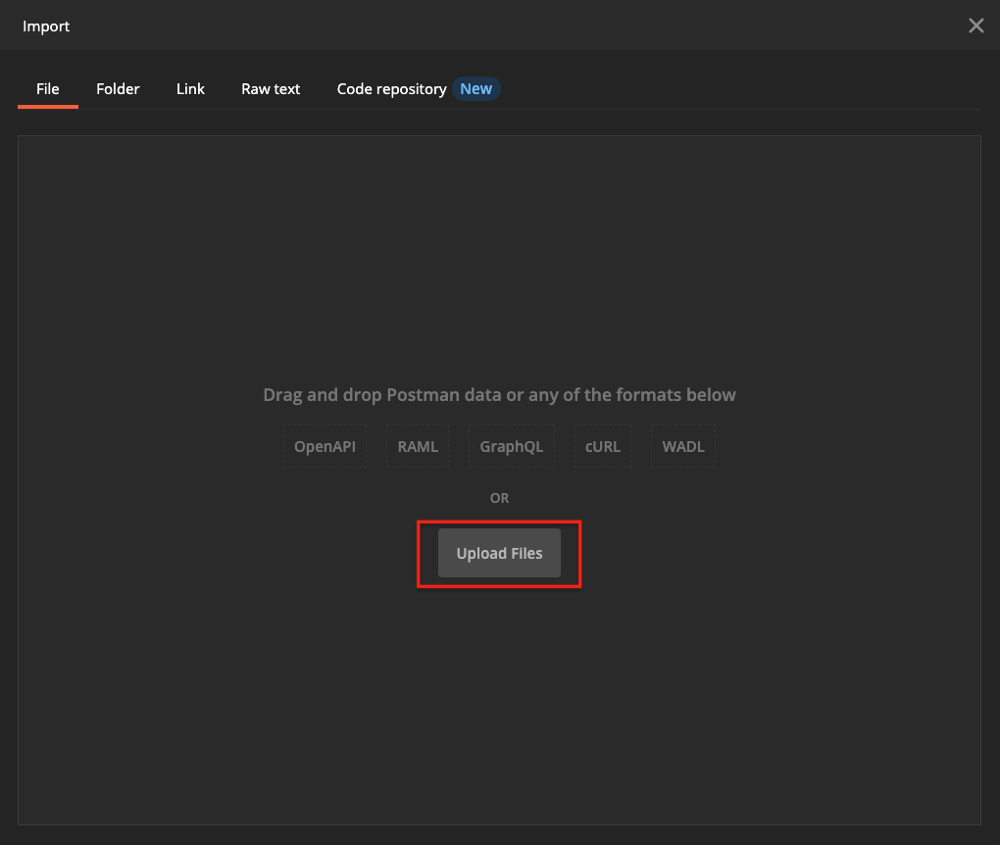

  * you will have the new **APIORDS** collection, with a GET action, on which you can access as shown below:

    

  * in this collection have been defined environment variables that must be imported and updated with the actual values before using. To do this, click on **Manage Environments** button:

    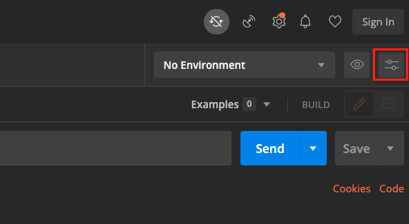

    and click on **Import** button:

    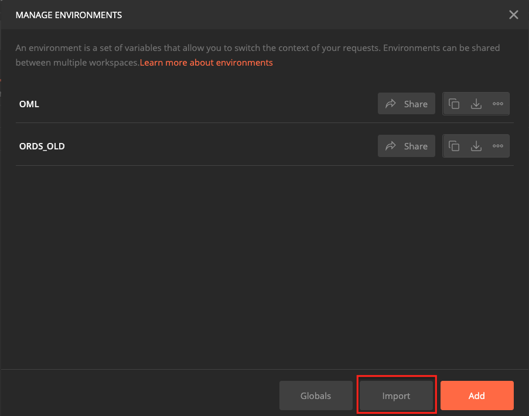

    loading the empty [env export](https://raw.githubusercontent.com/oracle/microservices-datadriven/main/workshops/dcms-ords-sec/apigw/ENV_Empty.postman_environment.json) provided.

  * Now you have on list the **ORDSENV** environment variable, and clicking on it:

    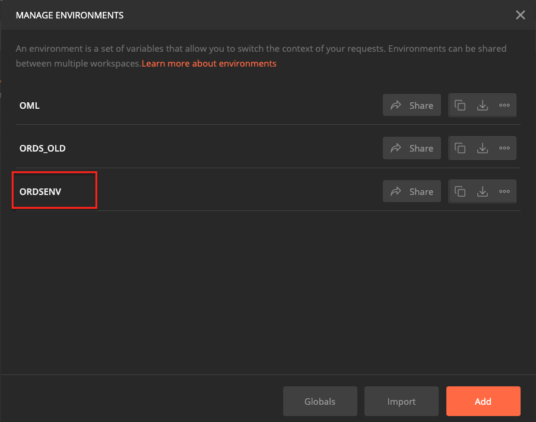

    you can set the actual values on each env variable:

    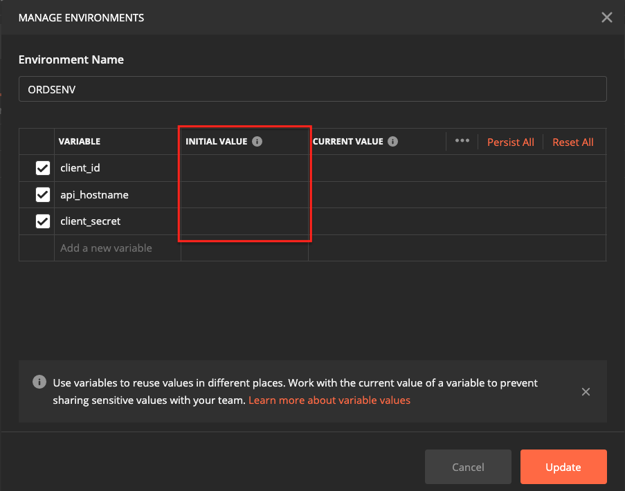

  * Now you have to select this pull of variables to be used in the GET request:

    

  * Clicking on **Authorization** tab, and eventually choosing the **TYPE** as **OAuth 2.0**, you should see the variables correctly exposed in red, that confirms have been correctly found in the env, and you can run the request, and change the **State** value. First you have to ask for **Get New Access Token** clicking the button:

    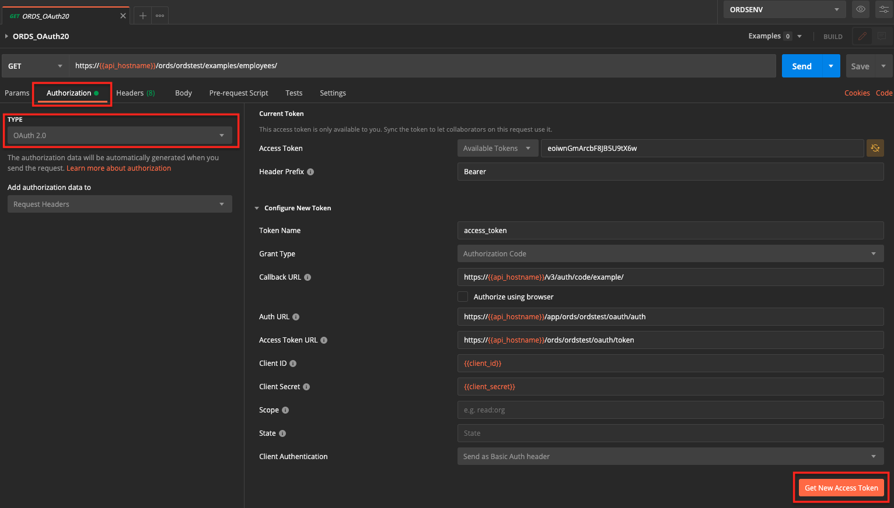

  * you will result **Unauthorized**:

    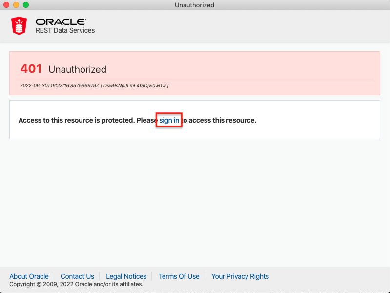

    and, to proceed, click on the link to be authenticated, that will be followed by an approval step:

    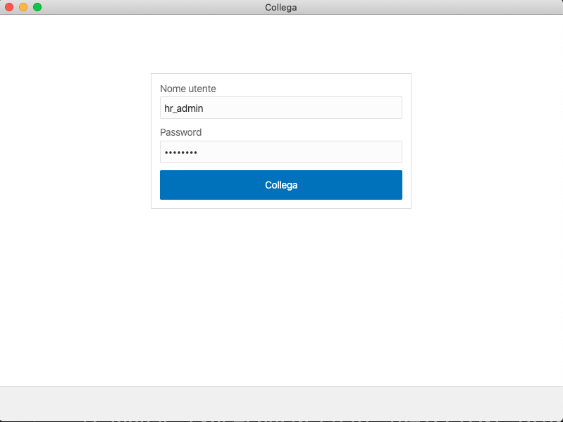

  * After few seconds, a popup windows it will appear, showing the **Access Token** provided by Authorization server (ORDS in our case), asking to use in the actual REST service request.

    

  * Finally, clicking on **Send** button, we will get the table in JSON format:

    

## Task 6: Test Rate Limit

* Load Test via K6, generating more than Request Limit set on 400 per second, with a script to be run by K6: [script](https://raw.githubusercontent.com/oracle/microservices-datadriven/main/workshops/dcms-ords-sec/apigw/apigw-stress-script.js).

* Here is an example of how to install the k6 tool (licensed under AGPL v3). Download and install K6 in shell Linux:

    ```bash
    <copy>
    mkdir k6;cd k6; 
    wget https://github.com/loadimpact/k6/releases/download/v0.27.0/k6-v0.27.0-linux64.tar.gz; 
    tar -xzf k6-v0.27.0-linux64.tar.gz; 
    ln k6-v0.27.0-linux64/k6 k6;
    cd ..
    </copy>
    ```

* You'll find a [script](https://raw.githubusercontent.com/oracle/microservices-datadriven/main/workshops/dcms-ords-sec/apigw/apigw-stress-script.js) to load with 400 RPS for 1 second. You could change the rate,duration,etc. modifying **scenarios: {}** parameters in the script:

    ```script
    <copy>
       import { check } from 'k6';
        import http from 'k6/http';
        const params = {
            headers: {
              'Authorization': 'Bearer '+`${__ENV.TOKEN}`,
            },
          };
        export const options = {
            userAgent: 'Mozilla/5.0 (Macintosh; Intel Mac OS X 10_15_7) AppleWebKit/537.36 (KHTML, like Gecko) Chrome/102.0.0.0 Safari/537.36',
        scenarios: {
            constant_request_rate: {
            executor: 'constant-arrival-rate',
            rate: 400,
            timeUnit: '1s', // 400 iterations per second, i.e. 400 RPS
            duration: '1s',
            preAllocatedVUs: 100, // how large the initial pool of VUs would be
            maxVUs: 200, // if the preAllocatedVUs are not enough, we can initialize more
            },
        },
        }
        export default function () {
        const res = http.get(`${__ENV.MY_HOSTNAME}`,params);
            check(res, {
                'is status 200': (r) => r.status === 200,
                'is status 300': (r) => (r.status >= 300 && r.status < 400 ), 
                'is status 400': (r) => (r.status >= 400 && r.status < 500 ) ,
            });
        }
    </copy>
    ```

* then change in the WORKSHOP dir and run to test if APIGW is blocking the requests up the rate limit of 50:

    ```bash
    <copy>
       ./k6/k6 run -e MY_HOSTNAME=https://$api_gw_base_url/ords/ordstest/examples/employees/ -e TOKEN=$ACCESS_TOKEN ./apigw/apigw-stress-script.js --insecure-skip-tls-verify
    </copy>
    ```

    With a 400 RPS, and a limit of 50 x IP, are passed around 19% of requests:

   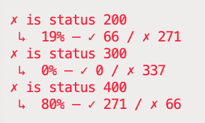

* let's check with no bearer access token what's happen, running:

    ```bash
    <copy>
        ./k6/k6 run -e MY_HOSTNAME=https://$api_gw_base_url/ords/ordstest/examples/employees/ ./apigw/apigw-stress-script.js --insecure-skip-tls-verify
    </copy>
    ```

  The result is that 100% of requests have been rejected:
  

* (Alternatively) Use Artillery in a OCI Cloud Shell or in any desktop environment with Docker installed, running the following script:

    ```bash
    <copy>
    cd ./apigw;
    source ./artillery.sh 
    </copy>
    ```

   containing:

    ```bash
       TRIMMEDURL=${api_gw_base_url}
       echo $TRIMMEDURL
       sed "s/TOKEN/$ACCESS_TOKEN/" ./stress.yaml.temp &>./stress1.yaml
       sed "s/API_GW_BASE_URL/$TRIMMEDURL/" ./stress1.yaml &>./stress.yaml
       rm ./stress1.yaml
       docker run --rm -it -v ${PWD}:/scripts artilleryio/artillery:latest run /scripts/stress.yaml
       rm ./stress.yaml
    ```

    as you can see, in 5 seconds, around 30 requests per second have been processed:

    

You may now proceed to the next lab.

## Learn More

* Ask for help and connect with developers on the [Oracle DB Microservices Slack Channel](https://bit.ly/oracle-database-microservices-slack)  
Search for and join the `oracle-db-microservices` channel.

## Acknowledgements

* **Author** - Andy Tael, Developer Evangelist;
               Corrado De Bari, Developer Evangelist;
               Fabrizio Zarri, EMEA Security Advisor
* **Last Updated By/Date** - Corrado De Bari, July 2022
