# Enable Oracle Data Safe and monitor the Autonomous DB on private endpoint

## Overview

This lab will show you how to monitor, from security point of view, the ADB-S behind ORDS server with a private-endpoint, in order to audit through a dashboard threats like, for example, failures in users logon. This just a basic employment of Data Safe, that allow administrators to make self-assessment on DBs registered, on-premises and Cloud, detects wrong configurations, and many other tasks. This is a beginner tutorial to show step-by-step how to implement the private endpoint access at a ADS-S in a private subnet, and leverage the pre-defined policies, as the Logon Failures, that could be a sign of suspicious activity on DB.

For an in depth approach to Data Safe, please refer to the LiveLab: [Get Started with Oracle Data Safe Fundamentals](https://apexapps.oracle.com/pls/apex/dbpm/r/livelabs/view-workshop?wid=598), which explore all the service functionalities.

Estimated Time: 20 minutes

### Objectives

* Create an Dashboard with standard Audit Policies deployed by default on an ADB-S instance and detect logon failures.

### Prerequisites

* Tenant admin role
* The Oracle Autonomous Transaction Processing database named in a way like **&ltabrv>DB_XS** (created in Lab 1: Deployment)
* Cloud shell open to submit oci-cli commands, with environment variables coming from initial Terraform setup available.
* Get the **&ltabrv>** code with the command `echo $TF_VAR_proj_abrv` and replace in the following steps

## Task 1: Register and Monitor an ADB instance

* Set the environment variables

```bash
<copy>
source ./terraform-env.sh
</copy>
```

* Get compartment OCID:

 ```bash
    <copy>
    export COMP_NAME=$(oci iam compartment get --compartment-id $TF_VAR_compartment_ocid --query data.name --raw-output)
    </copy>
```

* From Cloud Shell first check if Data Safe it's enabled in your tenancy and Region:

```bash
    <copy>
    oci data-safe service get --compartment-id $TF_VAR_tenancy_ocid
    </copy>
```

* if already enabled, you should see `is-enabled=TRUE` in the response. In positive case, you can skip next steps related to Data Safe activation at region/tenant level.


* In the case Oracle Data Safe hasn't been activate previously in the region of your tenancy, you could do manually from Web Console, under **Oracle Database**/**Data Safe** menu, click on **Enable Data Safe** button:


* or via oci-cli:

```bash
    <copy>
       oci data-safe service enable --is-enabled true 
    </copy>
 ```

* You should see after the button turned in **Data Safe Dashboard**:


* from **Identity & Security**/**Policies** main menu, click on button **Create Policy**, and set:

    * **Name**: datasafe_policy
    * **Description**: test data safe policies
    * **Compartment**: choose the Lab Compartment
    * Select **Show manual editor**, and copy following policies, replacing <compartment_name\> and <group-name\> with Administrator role:

    ```text
    <copy>
    Allow group <group-name> to manage data-safe-family in compartment <compartment_name>
    Allow group <group-name> to manage autonomous-database in compartment <compartment_name>
    Allow group <group-name> to manage target-databases in compartment <compartment_name>
    </copy>
    ```

    **NOTE**: you could do the same task executing these oci-cli commands. Replace <ADM_GROUP\> with the group-name you want the policies to be applied to.

    ```bash
    <copy>
    export ADM_GROUP=<ADM_GROUP> 
    export statement="[\"Allow group ${ADM_GROUP} to manage data-safe-family in compartment ${COMP_NAME}\",\"Allow group ${ADM_GROUP} to manage autonomous-database in compartment ${COMP_NAME}\",\"Allow group ${ADM_GROUP} to manage target-databases in compartment ${COMP_NAME}\"]";
    echo "${statement}"  >statement.json;
    oci iam policy create --compartment-id $TF_VAR_compartment_ocid --name datasafe_policy --description 'test datasafe policies' --statements file://./statement.json;
    rm ./statement.json;
    </copy>
    ```

* Under **Oracle Database**/**Data Safe**, click on **Target Databases** and then, under **Connectivity Options** on **Private Endpoints** menu. For further info about: [private endpoint](https://docs.oracle.com/en/cloud/paas/data-safe/admds/create-oracle-data-safe-private-endpoint.html#GUID-B601106D-563A-42BE-BEBC-FCC2E97ACFF0)
* Click on **Create Private Endpoint**:
 
* Set the following parameters:
    * **Name**: **PE\_&ltabrv\>DB\_XS**
    * **Compartment**: choose your [compartment_name]
    * **Virtual Cloud Network** in [compartment_name]: **&ltabrv\>-vcn**
    * **Subnet** in [compartment_name]: **&ltabrv\>-subnet-private**
    * **Network Security Groups**: choose **&ltabrv\>-security-group-adb**
  as shown in the following picture, where compartment_name is "securityworkshop":

   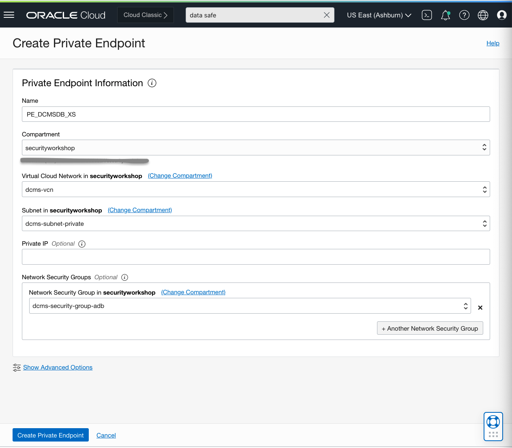

   Click on button **Create Private Endpoint** and after few minutes you should see **Active**:
   

* and clicking on **PE\_<abrv\>DB\_XS**, you can access on the details of private end-point created:
   

   In this way **Data Safe** services has a private channel to access DBs not public accessible.

* From **Data Safe** / **Overview**, we are ready to register Autonomous DB through a wizard:
    

    * **Select Database in** compartment, in our case **&ltabrv\>DB\_XS** target:
    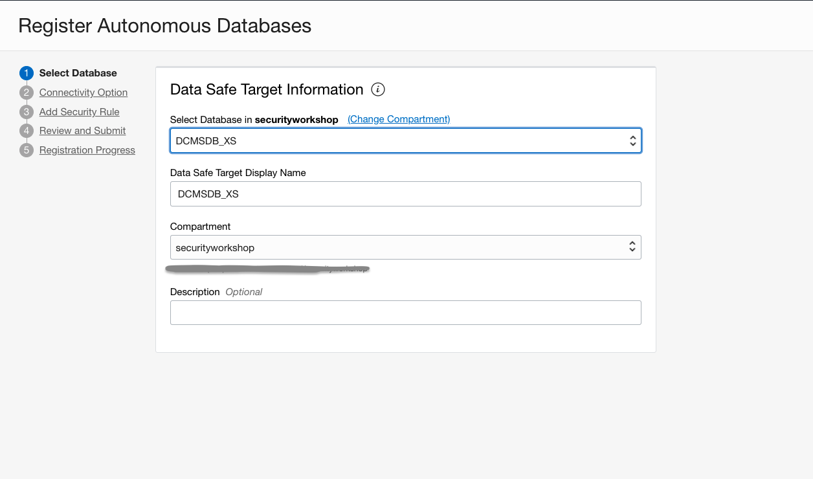

    * Set **Connectivity Option** leveraging Existing Private Endpoint, **PE\_&ltabrv\>DB\_XS**:
    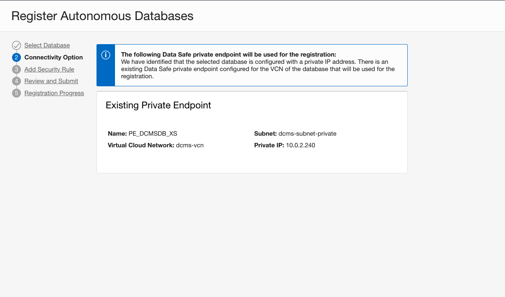

    * Choose to add ingress/egress rules to an existing Network Security Group for ADB-S, i.e. **&ltabrv\>-security-group-adb**:
    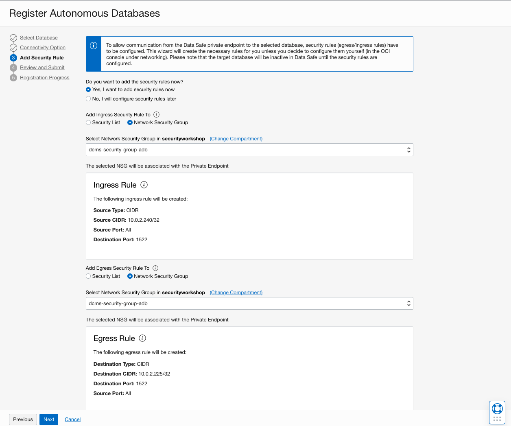

    * **Review and Submit**, and click on **Register** button at the bottom of page:
    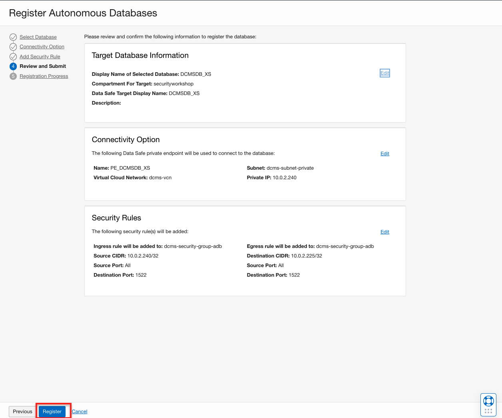

    * at the end of process you should see something like this. This will take a few minutes:
    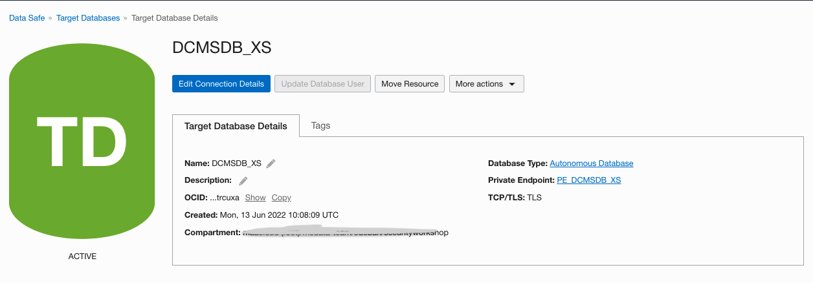

* In ADB-S details, you can check if the DB instance it has been correctly registered to be monitored by Data Safe:


* Under **Oracle Database**/**Data Safe** menu and **Target Database** left menu, on your compartment, you should see under **Target Databases** list the **&ltabrv\>DB_XS** instance it has been just registered:
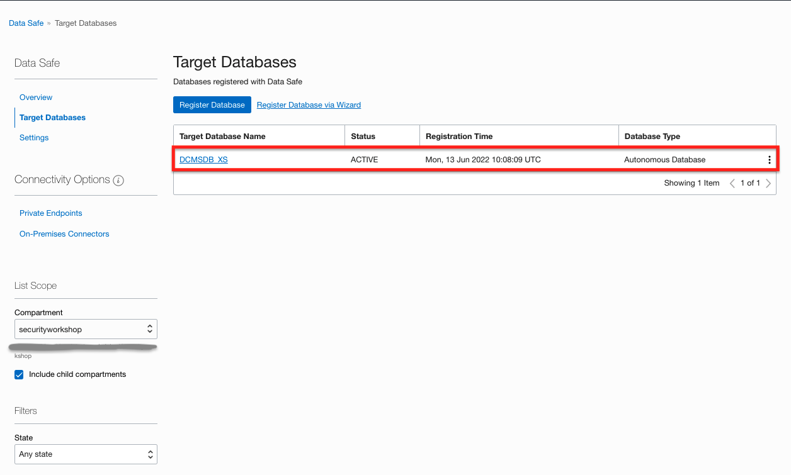

## Task 2: Configure Auditing on registered ADB-S instance

* Click on **Data Safe** main menu, to watch the main dashboard, under **Security Center**/**Dashboard**:
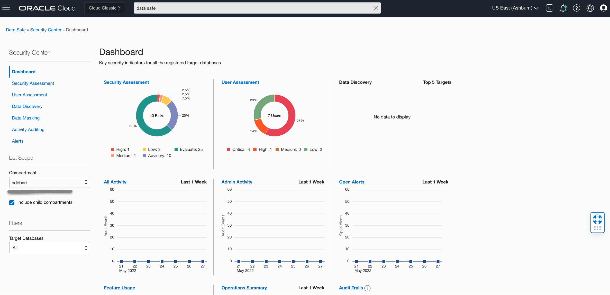

* under **Security Center / Activity Auditing / Audit Profiles** :


    select **&ltabrv\>DB_XS** target details:
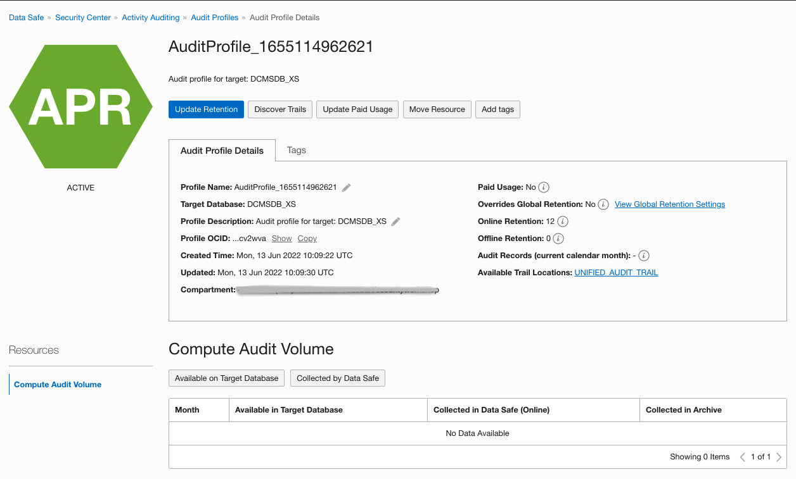

* from **Data Safe / Security Center / Activity Auditing /Audit Policy / Audit Policy Details** , click **Retrieve** Button, to get actual policy pre-deployed on Autonomous instances.

    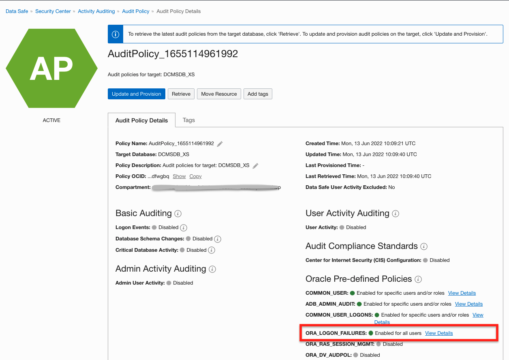

* In **Audit Policy Details**, **ORA\_LOGON\_FAILURES** policy is one of the **Oracle Pre-defined Policies** enabled by Default on Autonomous DB for all users. Click on **View Details** link and leave as already set:


   You could eventually modify the policy to apply it to a restricted number of users. In this case you have to click finally on **Update and Provision** after modified.

* under **Security Center / Activity Auditing / Audit Profiles**:
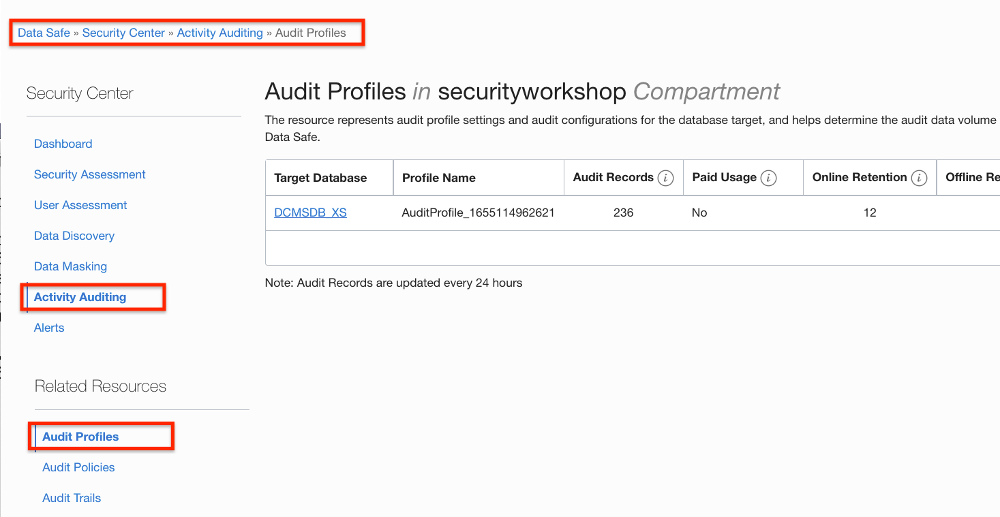

    select **&ltabrv\>DB_XS**:
    

    to see target details:
    [Audit_Trail](./images/audit_trail.png " ")

  * Start Audit Trail: under **Data Safe / Security Center / Activity Auditing / Audit Trails / Audit Trails Details**,
    

* Select **Target Database**: **&ltabrv\>DB_XS**

  * click on **Start** button:
    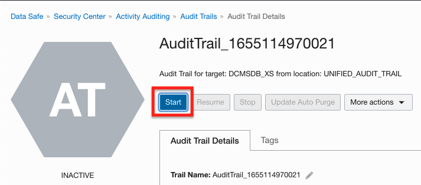

  * and set the current date/time for **Select Start Date**:
    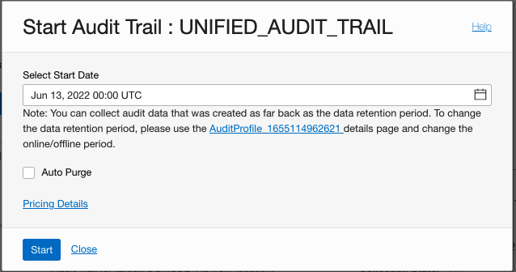

  * At the end Audit Trail page should show **Collection State**: "COLLECTING":
    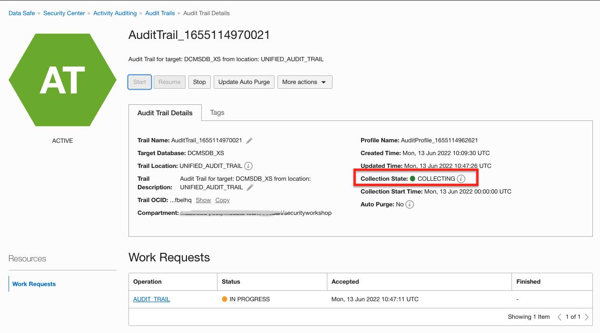

* At this stage, from **Data Safe / Security Center / Dashboard** you can have an overall security status overview, in which you can notice that as started a security assessment on DB instance that shows the first useful advices about **High**/**Medium** risks:

    

## Task 3: Generate logon failure events on Autonomous DB instance

* In a terminal session on local desktop, following the instructions reported in [Access Bastion Service](/workshops/paid/?lab=bastion&nav=new), connect through sql client to ADB-S as admin for 3 times with a wrong password, to simulate the intent to access as Admin to ADB-S, in the highly unlikely hypothesis that all DB access barriers have been breached:

```text
    <copy>
    sql ADMIN/MyWrongPWD@$CONN_string
    </copy>
```

* After few minutes, from **Data Safe / Security Center / Activity Auditing** look at **Failed Login Activity** graph that shows incorrect login attempts done at previous steps:

    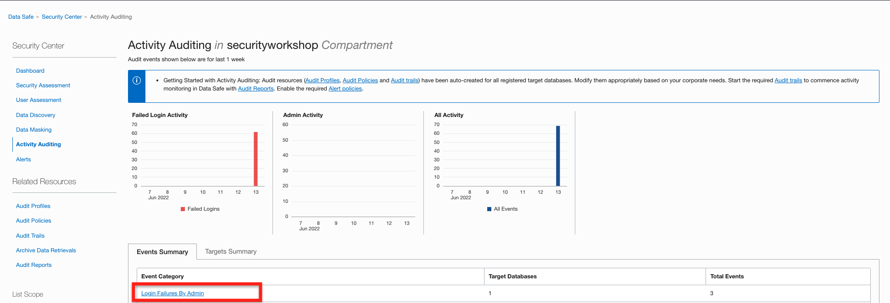

* From **Data Safe / Security Center / Activity Auditing** you will have more details about failed login just done. If you don't see any events, wait a moment to see the effects of previous logon:
    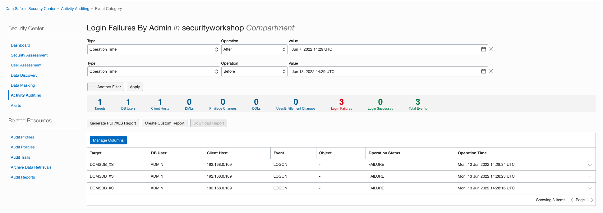

Once the setup and testing of access has been completed you are ready to **Proceed to the next lab.**

## Learn More

* Ask for help and connect with developers on the [Oracle DB Microservices Slack Channel](https://bit.ly/oracle-database-microservices-slack)  
Search for and join the `oracle-db-microservices` channel.
* LiveLab: [Get Started with Oracle Data Safe Fundamentals](https://apexapps.oracle.com/pls/apex/dbpm/r/livelabs/view-workshop?wid=598)

## Acknowledgements

* **Author** - Andy Tael, Developer Evangelist;
               Corrado De Bari, Developer Evangelist
* **Last Updated By/Date** - Andy Tael, August 2022
