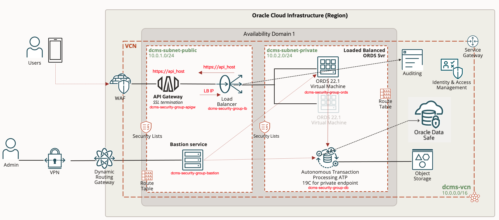
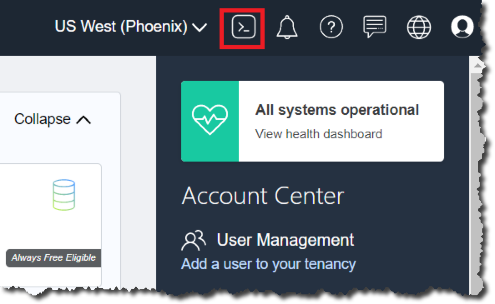
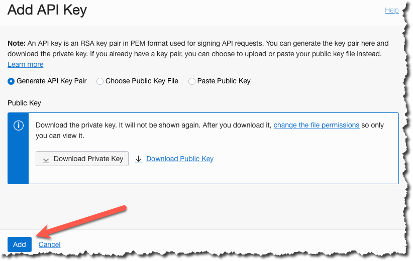
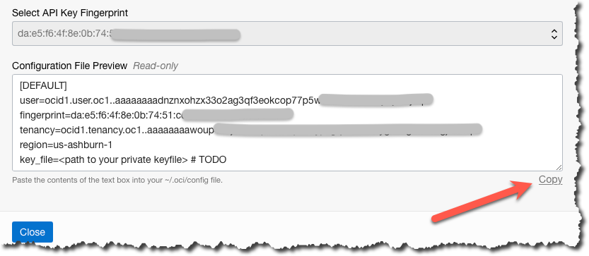

# Workshop Setup

## Introduction

This lab will create a secure OCI infrastructure. Including ADB-S (Oracle Autonomous Database Shared) and ORDS (Oracle REST Data Services) Server on a private network, bastion service, bastion sessions to be able to access the environment. You can choose between using Cloud Shell (preferred method) or a local deployment (tools on your local desktop/laptop).

Estimated Time: 30 minutes

### Objectives

* Clone the workshop repository
* Execute the environment setup

### Prerequisites

This lab requires completion of the Get Started section in the Contents menu on the left.
An Oracle Cloud paid account or free trial. To sign up for a trial account with $300 in credits for 30 days, click [Sign Up](http://oracle.com/cloud/free).

## IAM Policies requirements

If you're running the workshop in your tenancy the assumptions are that you have the right permissions to create the following OCI resources:

* VCNs, NSGs, Security Lists, Load Balancer etc.
* Compute VM
* ADB-S (Oracle Autonomous Database Shared) 19c
* Bastion Service and the associated sessions
* API Gateway
* Oracle Data Safe
* Web Application Firewall (WAF)

## Terminal and browser requirements

You will also need 3 terminal windows open (for Desktop deployment) or 3 Browser tabs for Cloud Shell deployments for the following purposes:

- Running the terraform scripts
- Starting the SSH Tunnel to the ADB-S (Oracle Autonomous Database Shared) instance
- Accessing the ORDS (Oracle REST Data Services) Server and the ADB-S instance via SQLcl

## Architecture and deployment

The Terraform scripts will deploy the infrastructure for this architecture. You will be deploying and configuring and configuring Datasafe and OCI API Gateway manually.


There are two ways to run deploy this architecture. You can not do both unless you teardown the environment and start from scratch.

- Cloud Shell via the OCI Console. This will require that you have multiple browser tabs with Cloud Shell running. [Cloud Shell Deployment](#deployment-using-cloud-shell).
- Using your own computer and locally installed software. [Local Deployment](#deploying-using-local-machine)

Required software for Desktop usage:

- jq (<https://stedolan.github.io/jq/>)
- Postman (<https://www.postman.com>)
- terraform (<https://learn.hashicorp.com/tutorials/terraform/install-cli>)
- OCI CLI (<https://docs.oracle.com/en-us/iaas/Content/API/Concepts/cliconcepts.htm>)
- Terminal software

# Deployment using Cloud Shell - Alternative 1

## Task 1. Log in to Oracle Cloud Console

If you haven't already, sign into your account.

## Task 2. Select the Home Region

Be sure to select the *home region* of your tenancy. Setup will only work in the home region.


## Task 3. Launch Cloud Shell

Cloud Shell is a small virtual machine running a "bash" shell which you access through the Oracle Cloud Console. Cloud Shell comes with a pre-authenticated command line interface in the tenancy region. It also provides up-to-date tools and utilities.

1. Click the Cloud Shell icon in the top-right corner of the Console.


*Note:* Cloud Shell uses websockets to communicate between your browser and the service. If your browser has websockets disabled or uses a corporate proxy that has websockets disabled, you will see an error message ("An unexpected error occurred") when attempting to start Cloud Shell from the console. You also can change the browser cookies settings for a specific site to allow the traffic from *.oracle.com

## Task 4. Make a Clone of the Workshop Setup Script and Source Code

To work with the application code, you need to make a clone from the GitHub repository. Execute the following sequence of commands:

```bash
<copy>
cd $HOME
git clone -b 22.7.3 --single-branch https://github.com/oracle/microservices-datadriven.git;
cp -r ./microservices-datadriven/workshops/dcms-ords-sec $HOME;     
rm -rf microservices-datadriven; 
cd dcms-ords-sec;
</copy>
```

You should now see the directory `dcms-ords-sec` in your home directory.

## Task 5. Setup Environment Variables

Copy the terraform-env-template.sh to terraform-env.sh

```bash
<copy>
cp terraform-env-template.sh terraform-env.sh
</copy>
```

Edit the `terraform-env.sh` file using `vi` and modify the following variables:

```bash
<copy>
export TF_VAR_compartment_ocid="[COMPARTMENT_OCID]"
export TF_VAR_proj_abrv="[ABBRV]"
</copy>
```

The `TF_VAR_proj_abrv` variable needs to be set to something unique in the tenancy as the naming of certain OCI Services must be unique. Use your initials for example. The compartment OCID can be found in the [OCI console](https://cloud.oracle.com/).

When you've set all the variables, source the file with the command `source ./terraform-env.sh`

Use the command `env | grep TF_VAR` to see the variables set by the environment file. It should look something like the following:

```bash
TF_VAR_region=us-ashburn-1
TF_VAR_tenancy_ocid=ocid1.tenancy.oc1...........
TF_VAR_compartment_ocid=ocid1.compartment.oc1...........
TF_VAR_user_ocid=ocid1.user.oc1............
TF_VAR_size=XS
TF_VAR_proj_abrv=at
```

## Task 6. Build the OCI Infrastructures environment using IaC

Execute the following commands to build out the OCI Infrastructure, this will take approximately 20 minutes.

- `terraform init`
- `terraform plan -out=plan.out`
- `terraform apply plan.out`

The `terraform apply` command should end with the following output.

```text
The terraform apply should result in output like this:
Outputs:

ADMIN_Password = "Please change the ADB ADMIN password manually in the OCI console for security"
bastion_ssh_cmd = "ssh -i ./bastion_key -o ProxyCommand='ssh -i ./bastion_key -W %h:%p -p 22 ocid1.bastionsession.oc1.iad....@host.bastion.us-ashburn-1.oci.oraclecloud.com' -p 22 opc@10.0.2.181"
dbconn = "(description= (retry_count=20)(retry_delay=3)(address=(protocol=tcps)(port=1521)(host=ADBPrivateEndpoint.adb.us-ashburn-1.oraclecloud.com))(connect_data=(service_name=blahblah_atdbxs_tp.adb.oraclecloud.com))(security=(ssl_server_dn_match=yes)))"
forward_ssh_cmd = "ssh -i ./bastion_key -v -N -L 1521:10.0.2.89:1521 -p 22 ocid1.bastionsession.oc1.iad....@host.bastion.us-ashburn-1.oci.oraclecloud.com"
lb_address = "129.80.169.11"
```

Make sure that you save the output as you are going to need the values later in the workshop.

**NOTE:** If the `terraform apply plan.out` command fails with the following error:

```bash
Error: 400-InvalidParameter, To create a Managed SSH session, the Bastion plugin must be in the RUNNING state on the target instance, but the plugin is not running on ocid1.instance.oc1.iad...... Enable the Bastion plugin on the target instance before creating the session.
```

The reason is that the Bastion plugin on the Compute VM (used for the Bastion Service Server) hasn't initialized yet and the plugin is required for the Bastion Service. Wait a minute and run the following commands again will resolve the problem:

- `terraform plan -out=plan.out`
- `terraform apply plan.out`

**NOTE:** If the Cloud Shell session times out (Cloud Shell times out after 20 minutes) before finishing, launch Cloud Shell again and do the following:

- `source ./terraform-env.sh`
- `terraform apply plan.out`

## Task 7. Update ADMIN password in the OCI Console

The database password for the ADMIN user is expired and must be changed using the OCI Console. Follow these steps:

1. Login into the OCI Console
2. Search for `DB_XS` in the Search bar and click on the DB_XS link provided:
   
3. Click on the More Actions drop down button and select Administrator Password:
   
4. Update the password.
   

## Task 8. Test access to the ATP-S using APEX and SQL Developer Web

### 1. Accessing APEX (Web)

Find the Load Balancer IP via the OCI Console or execute the following command from the directory containing the IaC code:

```bash
<copy>
terraform output lb_address | jq -r '.'
</copy>
```

Open your favorite browser and access the URL `https://<LOADBALANCER_IP>`. The `LOADBALANCER_IP`. You will get an error regarding the certificate which can be ignored as the workshop uses a selfserved certificate. You will be presented with a login page, login as the ADMIN user and the password that you provided for the ADMIN user.


If you get a 501 error verify that the Load Balancer is healthy. If the **Overall Health** is showing Critical you need to reboot the ORDS Server.


Restart the ORDS server by issuing the following commands and wait a few minutes for the ORDS Server to come back up again and the Load Balancers Health Check clears. The commands will use the DEFAULT profile in the ~/.oci/config file. Change the DEFAULT value to the profile you are using if needed. You can also reboot the Compute VM from the OCI Console.

```bash
<copy>
export instance_id=$(oci compute instance list --compartment-id=${TF_VAR_compartment_ocid} --query "data [?\"display-name\"=='${TF_VAR_proj_abrv}-ords-core'] | [0].id" --raw-output --profile DEFAULT);
oci compute instance action --instance-id ${instance_id} --action SOFTRESET --profile DEFAULT
</copy>
```

You can also reboot the Compute VM from the OCI Console.


### 2. Access SQL Developer Web (Database Actions)

If you haven't already, find the Load Balancer IP via the OCI Console, or the output from the setup, or execute the following command from the directory containing the IaC code:

```bash
<copy>
export LB=$(terraform output lb_address | jq -r '.');
echo https://$LB/ords/sql-developer
</copy>
```

Open your favorite browser and access the URL `https://<LOADBALANCER_IP>/ords/sql-developer`. The `LOADBALANCER_IP`. You will get an error regarding the certificate which can be ignored as the workshop uses a selfserved certificate. You will be presented with a login page, login as the ADMIN user and the password that you provided for the ADMIN user.


SQLDeveloper Web (Database Actions) can be used instead of using the local SQLCl tools for this workshop.

Once the setup and testing of access has been completed you are ready to proceed to the next lab.

# Deploying using Local machine - Alternative 2

## Task 1. Log in to Oracle Cloud Console

If you haven't already, sign into your account.

## Task 2. Select the Home Region

Be sure to select the *home region* of your tenancy. Setup will only work in the home region.


## Task 3. Open a Terminal Window and a Clone of the Workshop Setup Script and Source Code

To work with the application code, you need to make a clone from the GitHub repository. Execute the following sequence of commands:

```bash
<copy>
cd $HOME
git clone -b 22.7.3 --single-branch https://github.com/oracle/microservices-datadriven.git;
cp -r ./microservices-datadriven/workshops/dcms-ords-sec $HOME;     
rm -rf microservices-datadriven; 
cd dcms-ords-sec;
</copy>
```

You should now see the directory `dcms-ords-sec` where in the directory where you launched the terminal.

## Task 4. Generate an API key

Locate your menu bar and click the person icon at the far upper right. From the drop-down menu, select your user's name.


In the lower left corner, click on API Keys followed by clicking on the Add API Key button.


Download the Private Key and make a note of where the key is located on your filesystem (most likely in the Downloads folder). You will need that information in a later step.


Click the Add button to create the API Key Fingerprint.



Copy the Configuration File Preview and save this information. It will be needed in a later step. You can add this information to your ~/.oci/config file but it is not necessary for this workshop.



Click close.

## Task 5. Setup Environment Variables

Copy the terraform-env-template.sh to terraform-env.sh

```bash
<copy>
cp terraform-env-template.sh terraform-env.sh
</copy>
```

Edit the `terraform-env.sh` file using your favorite texteditor and modify the following variables. The [REGION], [TENANCY\_OCID], [FINGERPRINT] and [USER\_OCID] can be found in the Configuration File you saved in an earlier step. The [PATH\_TO\_OCI\_PRIVATE\_KEY] is the full path to the Private Key you downloaded earlier.

```bash
export TF_VAR_region="[REGION]"
export TF_VAR_tenancy_ocid="[TENANCY_OCID]"
export TF_VAR_compartment_ocid="[COMPARTMENT_CID]"
export TF_VAR_user_ocid="[USER_OCID]"
export TF_VAR_proj_abrv="[ABBRV]"
export TF_VAR_fingerprint="[FINGERPRINT]"
export TF_VAR_private_key_path="[PATH_TO_OCI_PRIVATE_KEY]"
```

The `TF_VAR_proj_abrv` variable needs to be set to something unique in the tenancy as the naming of certain OCI Services must be unique. Use your initials for example.

When you've set all the variables, source the file with the command `source ./terraform-env.sh`

Use the command `env | grep TF_VAR` to see the variables set by the environment file. It should look something like the following:

```bash
TF_VAR_region=us-ashburn-1
TF_VAR_tenancy_ocid=ocid1.tenancy.oc1...........
TF_VAR_compartment_ocid=ocid1.compartment.oc1...........
TF_VAR_user_ocid=ocid1.user.oc1............
TF_VAR_size=XS
TF_VAR_proj_abrv=AT
TF_VAR_fingerprint=42:f0:f2:92:3d:58:11:8a:8a:7............
TF_VAR_private_key_path=/Path/.ssh/private_key_file.pem
```

## Task 6. Build the OCI Infrastructures environment using IaC

Execute the following commands from `the security directory` to build out the OCI Infrastructure, this will take approximately 20 minutes.

- `terraform init`
- `terraform plan -out=plan.out`
- `terraform apply plan.out`

The `terraform apply` command should end with the following output.

```text
The terraform apply should result in output like this:
Outputs:

ADMIN_Password = "Please change the ADB ADMIN password manually in the OCI console for security"
bastion_ssh_cmd = "ssh -i ./bastion_key -o ProxyCommand='ssh -i ./bastion_key -W %h:%p -p 22 ocid1.bastionsession.oc1.iad....@host.bastion.us-ashburn-1.oci.oraclecloud.com' -p 22 opc@10.0.2.181"
dbconn = "(description= (retry_count=20)(retry_delay=3)(address=(protocol=tcps)(port=1521)(host=ADBPrivateEndpoint.adb.us-ashburn-1.oraclecloud.com))(connect_data=(service_name=blahblah_atdbxs_tp.adb.oraclecloud.com))(security=(ssl_server_dn_match=yes)))"
forward_ssh_cmd = "ssh -i ./bastion_key -v -N -L 1521:10.0.2.89:1521 -p 22 ocid1.bastionsession.oc1.iad....@host.bastion.us-ashburn-1.oci.oraclecloud.com"
lb_address = "129.80.169.11"
```

Make sure that you save the output as you are going to need the values later in the workshop.

**NOTE:** If the `terraform apply plan.out` command fails with the following error:

```bash
Error: 400-InvalidParameter, To create a Managed SSH session, the Bastion plugin must be in the RUNNING state on the target instance, but the plugin is not running on ocid1.instance.oc1.iad...... Enable the Bastion plugin on the target instance before creating the session.
```

The reason is that the Bastion plugin on the Compute VM (used for the Bastion Service Server) hasn't initialized yet and the plugin is required for the Bastion Service. Wait a minute and run the following commands again will resolve the problem:

- `terraform plan -out=plan.out`
- `terraform apply plan.out`

## Task 7. Update ADMIN password in the OCI Console

The database password for the ADMIN user is expired and must be changed using the OCI Console. Follow these steps:

1. Login into the OCI Console
2. Search for `DB_XS` in the Search bar and click on the DB_XS link provided:
   
3. Click on the More Actions drop down button and select Administrator Password:
   
4. Update the password.
   

## Task 8. Test access to the ATP-S using APEX and SQL Developer Web

### 1. Accessing APEX (Web)

Find the Load Balancer IP via the OCI Console or execute the following command from the directory containing the IaC code:

```bash
<copy>
terraform output lb_address | jq -r '.'
</copy>
```

Open your favorite browser and access the URL `https://<LOADBALANCER_IP>`. The `LOADBALANCER_IP`. You will get an error regarding the certificate which can be ignored as the workshop uses a selfserved certificate. You will be presented with a login page, login as the ADMIN user and the password that you provided for the ADMIN user.


If you get a 501 error verify that the Load Balancer is healthy. If the **Overall Health** is showing Critical you need to reboot the ORDS Server.


Restart the ORDS server by issuing the following commands and wait a few minutes for the ORDS Server to come back up again and the Load Balancers Health Check clears. The commands will use the DEFAULT profile in the ~/.oci/config file. Change the DEFAULT value to the profile you are using if needed.

```bash
<copy>
export instance_id=$(oci compute instance list --compartment-id=${TF_VAR_compartment_ocid} --query "data [?\"display-name\"=='${TF_VAR_proj_abrv}-ords-core'] | [0].id" --raw-output --profile DEFAULT);
oci compute instance action --instance-id ${instance_id} --action SOFTRESET --profile DEFAULT
</copy>
```

You can also reboot the Compute VM from the OCI Console.


### 2. Access SQL Developer Web (Database Actions)

If you haven't already, find the Load Balancer IP via the OCI Console, or the output from the setup, or execute the following command from the directory containing the IaC code:

```bash
<copy>
terraform output lb_address | jq -r '.'
</copy>
```

Open your favorite browser and access the URL `https://<LOADBALANCER_IP>/ords/sql-developer`. The `LOADBALANCER_IP`. You will get an error regarding the certificate which can be ignored as the workshop uses a selfserved certificate. You will be presented with a login page, login as the ADMIN user and the password that you provided for the ADMIN user.


SQLDeveloper Web (Database Actions) can be used instead of using the local SQLCl tools for this workshop.

Once the setup and testing of access has been completed you are ready to **Proceed to the next lab.**

## Acknowledgements

* **Author** - Andy Tael, Developer Evangelist;
               Corrado De Bari, Developer Evangelist
* **Contributors** - John Lathouwers, Developer Evangelist
* **Last Updated By/Date** - Andy Tael, August 2022
