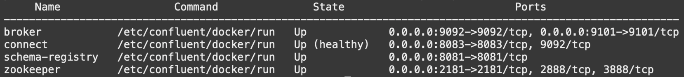
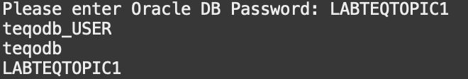

# Setup the connection between Kafka and Oracle Transactional Event Queues

## Introduction

This laboratory will show you the interoperability of Transactional Event Queues with Apache Kafka. Oracle Transactional Event Queues (TxEventQ) makes it easy to implement event-based applications, as we experienced in the previous lab. It is also highly integrated with Apache Kafka supporting bi-directional information flow between TxEventQ and Kafka so that changes are available in TxEventQ or Kafka as soon as possible in near-real-time.

Estimated Time: 10 minutes

Watch the video below for a quick walk-through of the lab.
[Setup the connection between Kafka and Oracle Transactional Event Queues](videohub:1_mp0yxs44)

### Objectives

- Setup Kafka Connect
- Produce messages in Kafka broker
- Consume these messages in Oracle TxEventQ
- Learn how they work

### Prerequisites

- This laboratory assumes you have already completed the earlier laboratories.
    1. Kafka Broker: Confluent Platform 3.3.0 or above, or Kafka 0.11.0 or above
    2. Oracle Transactional Event Queues
- Connect: Confluent Platform 4.1.0 or above, or Kafka 1.1.0 or above
- Java 1.8+
- Oracle TxEventQ JMS 1.1+ Client Jars

## Overview of the Oracle Transactional Event Queues (TxEventQ)

Oracle Transactional Event Queues (TxEventQ) is a robust and feature-rich event streaming platform integrated with the Oracle database used to collect, process, store, and integrate data at scale. TxEventQ that are highly optimized implementation of AQ previously called AQ Sharded Queues, also AQ, address the requirements from data-driven and event-driven architectures in modern enterprise applications, including numerous use cases as distributed streaming, stream processing, data integration, and pub/sub messaging.

You can adopt Transactional Event Queues with one event stream (to preserve total ordering in the queue) or consider taking advantage of multiple event streams where messages are ordered within each event stream. This is similar to Apache Kafka's Topics approach consisting of multiple partitions from which producers and consumers can publish or subscribe.

Oracle Transactional Event Queues (TxEventQ) are a high-performance partitioned implementation with multiple event streams per queue that store messages persistently and propagate messages between queues on different databases. Because TxEventQs are implemented in database tables, all high availability, scalability, and reliability operational benefits are also applicable to queue data. TxEventQ supports standard database features such as recovery, restart, and security. You can use standard database development and management tools to monitor queues. Like other database tables, queue tables can be imported and exported. Similarly, *TxEventQ queues are supported by Oracle Data Guard for high availability, which can be critical to preserving messages when using a stateless middle tier*.

By being in the database, enqueues and dequeues can be incorporated in database transactions without requiring distributed transactions. And, messages can be queried using standard SQL. You can use SQL to access the message properties, the message history, and the payload. With SQL access, you can also audit and track messages. All available SQL technology, such as in-memory latches and table indices, optimize access to messages in TxEventQ.


Oracle TxEventQ can be accessed through polyglot programmatic interfaces since PL/SQL code til C, Python, Javascript, and Java could be used to create Consumers and producers. For example, this workshop is offered using the Spring Boot framework, one of the most important and adopted Java frameworks.

### Kafka Java Client for Transactional Event Queues

Oracle introduces Kafka Java Client for Oracle Transactional Event Queues Kafka (OKafka), a open source library that allow application compatibility with Oracle database. This provides easy migration for Kafka Java applications to Transaction Event Queues (TxEventQ). The Kafka Java APIs can now connect to Oracle database server and use TxEventQ as a messaging platform.


The figure shows OKafka library, which contains Oracle specific implementation of Kafka's Java APIs. This implementation internally invokes AQ-JMS APIs which in turn uses JDBC driver to communicate with Oracle Database.

Developers can now migrate an existing Java application that uses Kafka to the Oracle database. Oracle Database 19c provides client side library which allows Kafka applications to connect to Oracle Database instead of Kafka cluster and use TxEventQ's messaging platform transparently.

## **Task 1:** Setup Kafka Connect

This task will use the Apache Kafka Connect, a framework included in Apache Kafka that integrates Kafka with other systems. Oracle TxEventQ will provide a standard JMS package and related JDBC, Transaction packages to establish the connection and complete the transactional data flow.

To simplify the deployment of a Kafka Connect, as done in Lab 2, we are using the container made available by [Confluent Apache Kafka Quick Start](https://developer.confluent.io/quickstart/kafka-docker/) and already installed during Lab 1.

You will configure the connection between the Kafka broker and the Oracle TxEventQ submitting the setup to Kafka [Connect REST API](https://docs.confluent.io/platform/current/connect/references/restapi.html).

The kafka2txeventq-connect-configuration.json file below has the configuration required to create a Connect Sync agent. The topics is already filled with Kafka Topic created during Lab 2, if it was changed, you need change this configuration too.

```bash
<copy>
cat $LAB_HOME/kafka-connect-txeventq/kafka2txeventq-connect-configuration.json
</copy>
```

```json
{
  "connector.class": "io.confluent.connect.jms.JmsSinkConnector",
  "tasks.max": "1",
  "topics": "LAB_KAFKA_TOPIC",
  "java.naming.factory.initial": "oracle.jms.AQjmsInitialContextFactory",
  "java.naming.provider.url": "jdbc:oracle:thin:@LAB_DB_SVC?TNS_ADMIN=/home/appuser/wallet",
  "db_url": "jdbc:oracle:thin:@LAB_DB_SVC?TNS_ADMIN=/home/appuser/wallet",
  "java.naming.security.principal": "LAB_DB_USER",
  "java.naming.security.credentials": "LAB_DB_PASSWORD",
  "jndi.connection.factory": "javax.jms.XAQueueConnectionFactory",
  "jms.destination.type": "topic",
  "jms.destination.name": "LAB_TXEVENTQ_TOPIC",
  "key.converter":"org.apache.kafka.connect.storage.StringConverter",
  "value.converter":"org.apache.kafka.connect.storage.StringConverter",
  "confluent.topic.bootstrap.servers":"broker:29092",
  "confluent.topic.replication.factor": "1"
}
```

1. First, verify if Kafka Components are still running. Execute the following commands:

    ```bash
    <copy>
    kafka-status
    </copy>
    ```

    The output should be a list of four containers running each one an Kafka components with state Up.

    

    > **Note:** If the Kafka components are not running, you have to rebuild them executing the instructions from [Task 4](#task4reinstallkafkacomponentsoptional).

2. Execute the following command providing the Oracle Database password. It will fill the parameters based on your previous created assets and set up the Connect Sync between the Kafka Topic from Lab 2 and Oracle TxEventQ from Lab 3:

    ```bash
    <copy>
    cd $LAB_HOME/kafka-connect-txeventq
    ./setup-kafka2txeventq-connect.sh
    </copy>
    ```

    

3. Once successfully executed, check that the connect are running:

    ```bash
    <copy>container-logs connect 6</copy>
    ```

    You will see the logs from Connect Sync similar with bellow snippet.

    ```Plain Text
    [2022-01-15 00:50:01,737] INFO JmsSinkConnectorConfig values: 
        character.encoding = UTF-8
        confluent.license = 
        confluent.topic = _confluent-command
        confluent.topic.bootstrap.servers = [broker:29092]
        confluent.topic.replication.factor = 1
        connection.factory.name = ConnectionFactory
        java.naming.factory.initial = oracle.jms.AQjmsInitialContextFactory
        jms.producer.time.to.live.ms = 0
        (io.confluent.connect.jms.JmsSinkConnectorConfig)
    [2022-01-15 00:50:01,737] INFO Copying 'jndi.connection.factory' to HashTable for InitialContext. (io.confluent.connect.jms.DefaultJmsConnection)
    [2022-01-15 00:50:01,737] INFO Connection established: ExecutionCompletedEvent
    ........
    [result=oracle.jms.AQjmsConnectionFactory@469214ed, failure=null] (io.confluent.connect.jms.JmsConnection)
    [2022-01-15 00:50:01,737] INFO Creating JMS Connection. (io.confluent.connect.jms.JmsConnection)
    [2022-01-15 00:50:01,737] INFO Connecting as LAB8022_USER (io.confluent.connect.jms.JmsConnection)
    ```

4. Check the Connect Sync status:

    You also can check the Connect Synk status using the REST API:

    ```bash
    <copy>
    kafka-connect-status
    </copy>
    ```

    The result should be:

    ```json
    {
        "name": "JmsConnectSync_txeventqlab",
        "connector": {
            "state": "RUNNING",
            "worker_id": "connect:8083"
        },
        "tasks": [
         {
            "id": 0,
            "state": "RUNNING",
            "worker_id": "connect:8083"
         }
        ],
        "type": "sink"
    }
    ```

## **Task 2:** Enqueueing messages on Kafka Broker

Now that you have the Connector running, you can produce some messages and test the message transfer. The messages would be enqueued by the Kafka Producer and dequeued from the Oracle TxEventQ.

1. Enqueueing using Kafka Producer Microservice.

    With Kafka producer microservices running, you can submit a message using cURL command to producer API.

    ```bash
    <copy>
    curl -X POST -H "Content-Type: application/json"  \
         -d '{ "id": "sync1", "message": "Sync Message from Kafka to TxEventQ #1" }'  \
         http://localhost:8080/placeMessage | jq
    </copy>
    ```

    The result should be like

    ```bash
        {
            "id": "1",
            "statusMessage": "Successful"
        }
    ```

## **Task 3:** Dequeue messages from Oracle TxEventQ using PL/SQL

After produce some messages, the expected behavior is the Connect Sync agent consume messages from Kafka Topic and enqueue them on Oracle TxEventQ. And, you will be able to dequeue them from Oracle TxEventQ using okafka consumer microservice or a PL/SQL procedure, for example.

1. Dqueue message from Oracle TxEventQ

    To illustrate the polyglot approach, this lab provide a PL/SQL procedure to dequeue messages, Execute the following command providing the Oracle Database User password:

    ```bash
    <copy>txeventq-dequeue</copy>
    ```

    The results from some executions should be something similar to:

    ```bash
    TxEventQ message: {"id": "0", "message": "message1"}

    PL/SQL procedure successfully completed.
    ```

    ```bash
    TxEventQ message: {"id": "1", "message": "Sync Message from Kafka to TxEventQ #1"}

    PL/SQL procedure successfully completed.
    ```

## **Task 4:** Reinstall Kafka Components (optional)

If you disconnect from Cloud Shell for a long time, you may need to reinstall Kafka components because the local docker was cleaned up. This task helps you to perform this rebuild.

1. Enable environment and state functions executing the following commands:

    ```bash
        <copy>
        source $LAB_HOME/cloud-setup/env.sh
        source $LAB_HOME/cloud-setup/utils/state-functions.sh
        </copy>
    ```

2. Clean the environment flags to allow rebuild executing:

    ```bash
        <copy>kafka-env-cleanup</copy>
    ```

3. Rebuild Kafka Cluster including Customised Connect image

    ```bash
    <copy>
    cd $LAB_HOME/cloud-setup/confluent-kafka
    source kafka-setup.sh
    </copy>
    ```

4. Start the Kafka cluster again:

    ```bash
    <copy>kafka-start</copy>
    ```

## Wrap up

In this Lab, you learned how to build a bridge between two different event brokers, expanding the possibilities of your decoupled architecture enabling the processing of messages per best-of-the-breed tools. That is the getting start of the Event Mesh concept.

The following animation describe what we builded in this workshop especially in this laboratory.

[](youtube:wDRIMzlYh9U)

You may now **proceed to the next lab**

## Acknowledgements

- **Authors** - Paulo Simoes, Developer Evangelist; Andy Tael, Developer Evangelist; Paul Parkinson, Developer Evangelist; Richard Exley, Consulting Member of Technical Staff, Oracle MAA and Exadata
- **Contributors** - Mayank Tayal, Developer Evangelist; Corrado De Bari, Developer Evangelist; Sanjay Goil, VP Microservices and Oracle Database
- **Last Updated By/Date** - Andy Tael, Sep 2022
