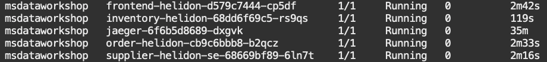
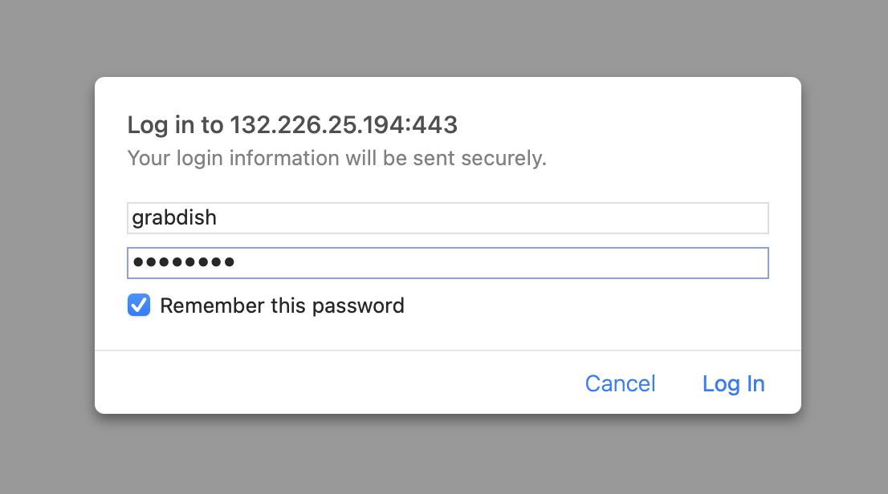
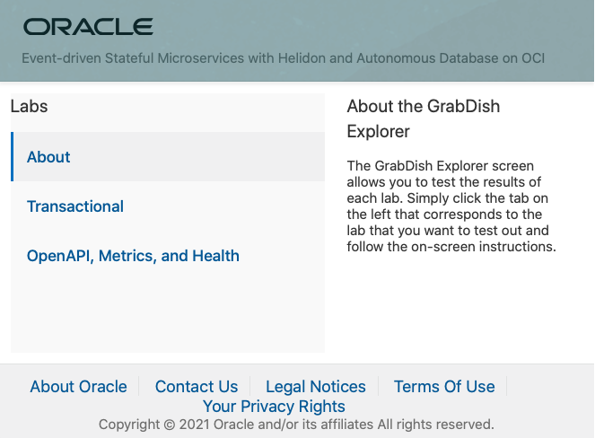
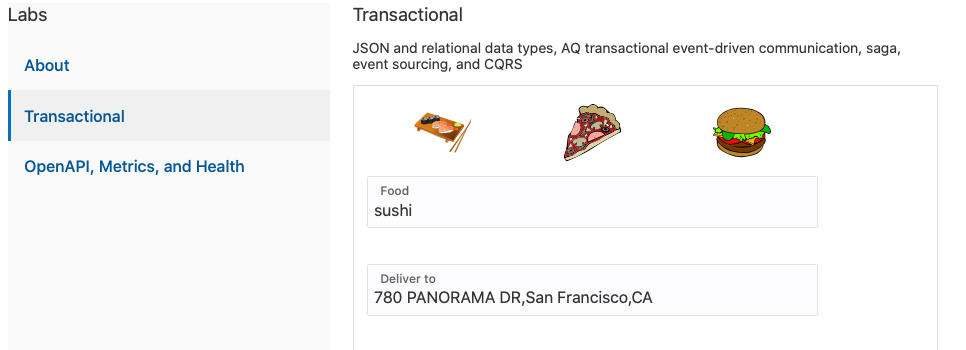
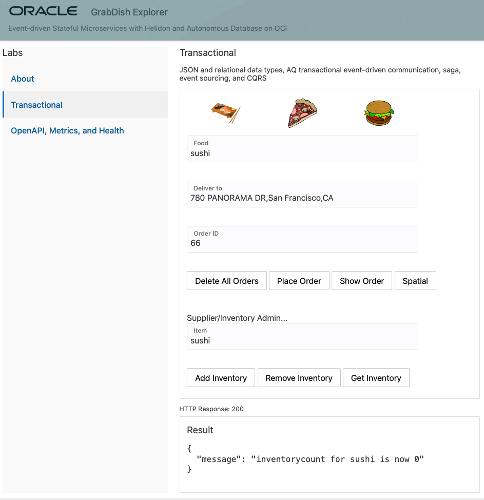
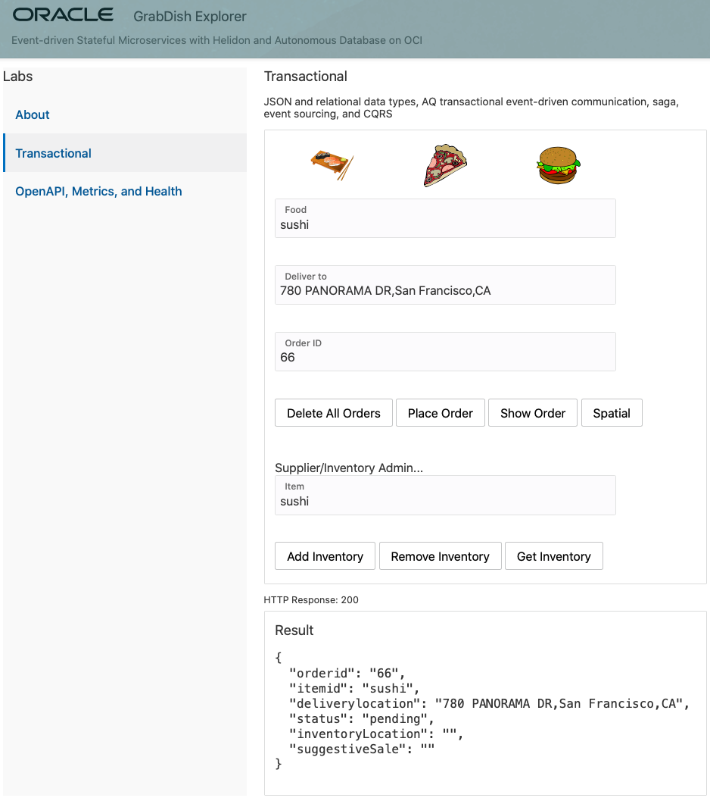
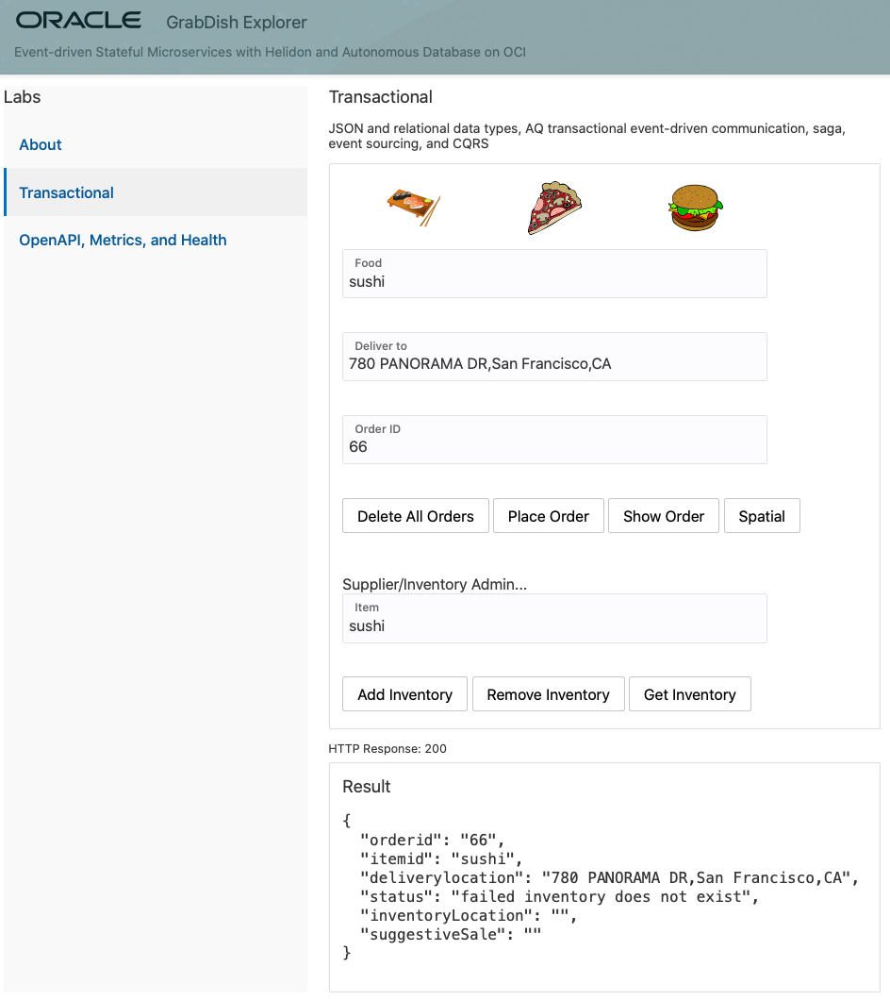
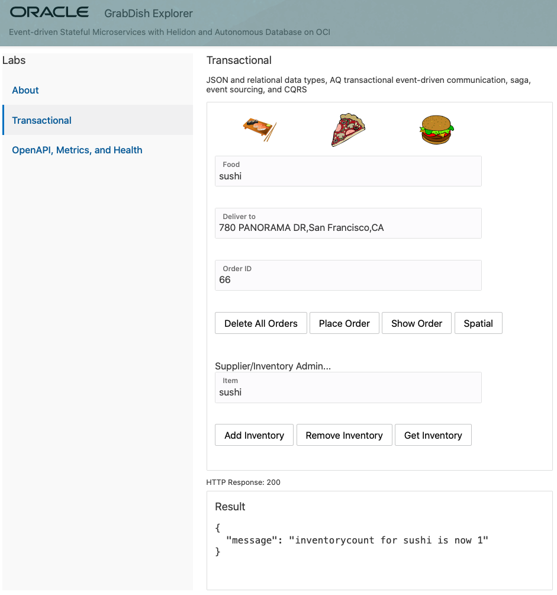
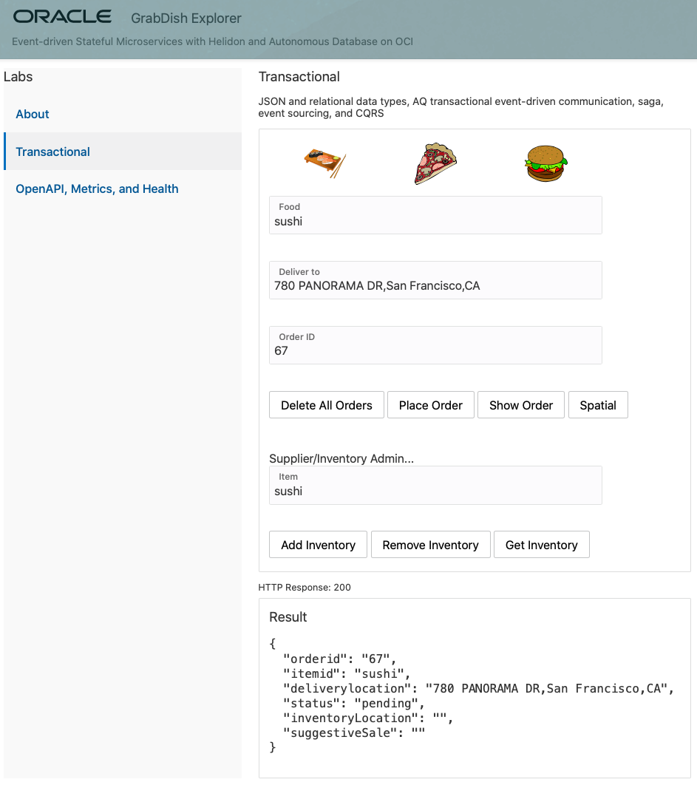
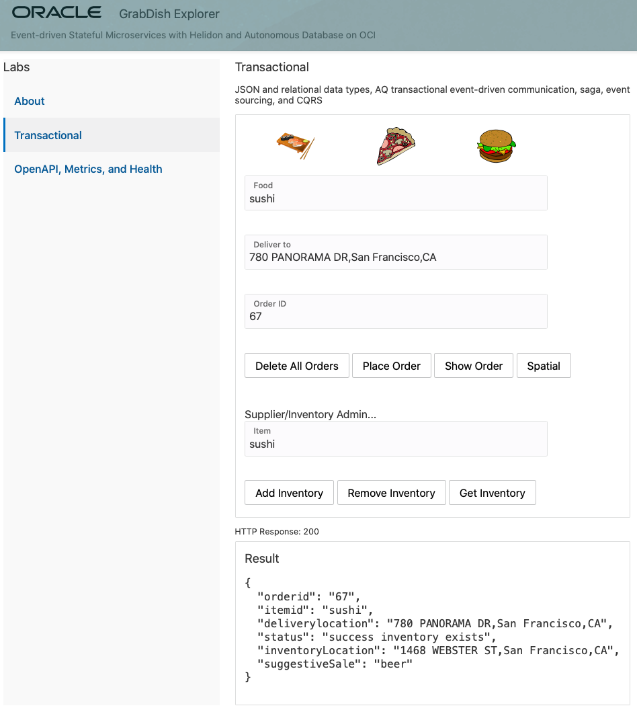

# Deploy and Test Data-centric Microservices Application

## Introduction

This lab will show you how to deploy the microservices on your Kubernetes cluster, walk through the functionality and explain how it works.

Estimated Time:  10 minutes

Quick walk through on how to deploy the microservices on your Kubernetes cluster.

<<<<<<< HEAD
[](youtube:8gMmjbXSR68)
=======
[](youtube:qZeHNUEOpj0) 
>>>>>>> upstream/main

### Objectives

-   Deploy and access the microservices
-   Learn how they work

### Prerequisites

* An Oracle Cloud paid account or free trial. To sign up for a trial account with $300 in credits for 30 days, click [Sign Up](http://oracle.com/cloud/free).
* The OKE cluster and the Autonomous Transaction Processing databases that you created in Lab 1

<<<<<<< HEAD
## Task 1: Deploy all the microservices and the FrontEnd UI

1.  Run the deploy script. This will create the deployment and pod for all the java images in the OKE cluster `msdataworkshop` namespace:

    ```
    <copy>cd $GRABDISH_HOME;./deploy.sh</copy>
=======
## Task 1: Deploy microservices and access application 

1.  Run the deploy script. This will create the deployment, services, etc. for all microservices in the Kubernetes cluster's `msdataworkshop` namespace:

    ```
    <copy>cd $GRABDISH_HOME;./deploy-core-services-only.sh</copy>
>>>>>>> upstream/main
    ```

   

<<<<<<< HEAD
2.  Once successfully created, check that the services are running:
=======
2. Once successfully created, check that the services are running:
>>>>>>> upstream/main

    ```
    <copy>kubectl get pods --all-namespaces</copy>
    ```
<<<<<<< HEAD

  

  Or, you can execute the `pods` shortcut command:

3. Check that the **ingress-nginx-controller** load balancer service is running, and write down the external IP address.

    ```
    <copy>kubectl get services --all-namespaces</copy>
    ```

    


  Or, you can execute the `services` shortcut command.

## Task 2: Access the FrontEnd UI

1.  Open a new browser tab and enter the external IP URL:

    `https://<EXTERNAL-IP>`

2. Note that for convenience a self-signed certificate is used to secure this https address and so it is likely you will be prompted by the browser to allow access.

3. You will be prompted to authenticate to access the Front End microservices. The user is `grabdish` and the password is the one you entered in Lab 1.

    

4. You should then see the Front End home page. You've now accessed your first microservice of the lab!

    


## Task 3: Verify the Order and Inventory functionality of GrabDish store

1. Click **Transactional** under **Labs**.

   

3. Check the inventory of a given item such as sushi, by typing `sushi`
    in the `food` field and clicking **Get Inventory**. You should see the inventory
    count result 0.

   

4. (Optional) If for any reason you see a different count, click **Remove Inventory** to bring back the count to 0.

5. Let’s try to place an order for sushi by clicking **Place Order**.

   

6. To check the status of the order, click **Show Order**. You should see a failed
    order status.

   

   This is expected, because the inventory count for sushi was 0.

7. Click **Add Inventory** to add the sushi in the inventory. You
    should see the outcome being an incremental increase by 1.

   

8. Go ahead and place another order by increasing the order ID by 1 (67) and then clicking **Place Order**. Next click **Show Order** to check the order status.

   

   

   The order should have been successfully placed, which is shown by the order status showing success.

You may now **proceed to the next lab.**.

## Acknowledgements
* **Author** - Paul Parkinson, Architect and Developer Advocate; Richard Exley, Consulting Member of Technical Staff, Oracle MAA and Exadata
* **Adapted for Cloud by** - Nenad Jovicic, Enterprise Strategist, North America Technology Enterprise Architect Solution Engineering Team
* **Documentation** - Lisa Jamen, User Assistance Developer - Helidon
* **Contributors** - Jaden McElvey, Technical Lead - Oracle LiveLabs Intern
* **Last Updated By/Date** - Richard Exley, April 2021
=======
3. Run the `curlpod` shortcut command to start a pod containing `curl`, etc. utilities.

    ```
    <copy>curlpod</copy>
    ```
    
    This will bring you to shell prompt


4. Run the following curl command in the shell prompt to issue a `placeOrder` request to the GrabDish application replace `[REPLACE_WITH_UI_PASSWORD_FROM_SETUP]` as appropriate.

    ```
    <copy>curl -u grabdish:[REPLACE_WITH_UI_PASSWORD_FROM_SETUP] -X POST -H "Content-type: application/json" -d  "{\"serviceName\" : \"order\" , \"commandName\" : \"placeOrder\", \"orderId\" : \"1\", \"orderItem\" : \"sushi\",  \"deliverTo\" : \"101\"}"  "http://frontendnp.msdataworkshop:8080/placeorderautoincrement"</copy>
    ```

   and verify the output

    `
    {"orderid":"66","itemid":"sushi","deliverylocation":"101","status":"pending","inventoryLocation":"","suggestiveSale":""}
    `

5. Run the following curl command in the shell prompt to issue a `showOrder` request to the GrabDish application.

    ```
    <copy>curl -u grabdish:[REPLACE_WITH_UI_PASSWORD_FROM_SETUP] -X POST -H "Content-type: application/json" -d  "{\"serviceName\" : \"order\" , \"commandName\" : \"showorder\", \"orderId\" : \"1\", \"orderItem\" : \"\",  \"deliverTo\" : \"\"}"  "http://frontendnp.msdataworkshop:8080/command"</copy>
    ```

   and verify the output

    `
    {"orderid":"66","itemid":"sushi","deliverylocation":"101","status":"failed inventory does not exist","inventoryLocation":"","suggestiveSale":""}
    `

6. Exit `curlpod` shell.
   
    This can be done by issuing `exit` command or `ctrl+c` for example.

You may now **proceed to the next lab.**.

## Learn More

* Ask for help and connect with developers on the [Oracle DB Microservices Slack Channel](https://bit.ly/oracle-db-microservices-help-slack)   

## Acknowledgements
* **Author** - Paul Parkinson, Architect and Developer Advocate; 
* **Last Updated By/Date** - Paul Parkinson, June 2022
>>>>>>> upstream/main
