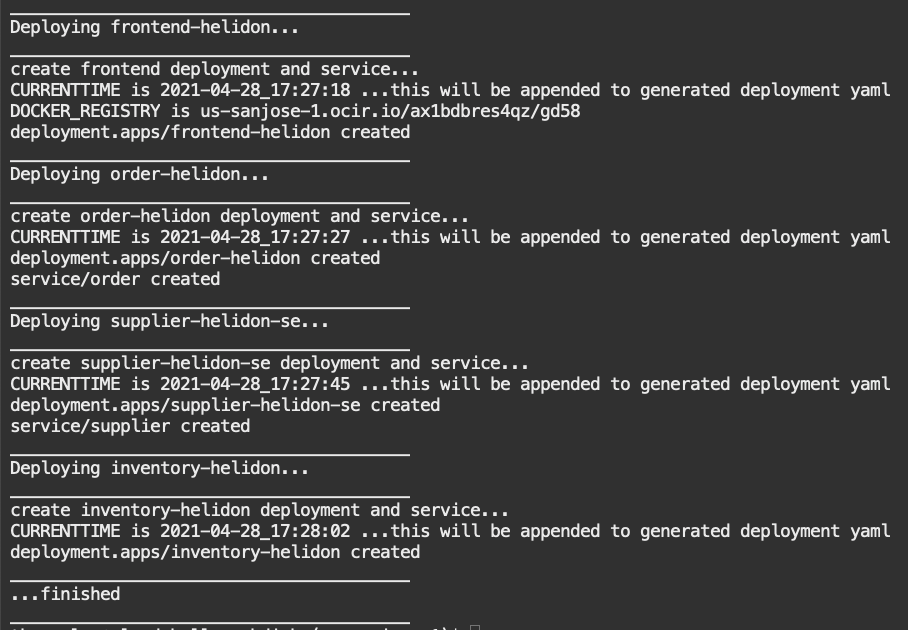

# Deploy and Test Data-centric Microservices Application

## Introduction

This lab will show you how to deploy the microservices on your Kubernetes cluster, walk through the functionality and explain how it works.

Estimated Time:  10 minutes

Quick walk through on how to deploy the microservices on your Kubernetes cluster.

[](youtube:8gMmjbXSR68)

### Objectives

-   Deploy and access the microservices
-   Learn how they work

### Prerequisites

* An Oracle Cloud paid account or free trial. To sign up for a trial account with $300 in credits for 30 days, click [Sign Up](http://oracle.com/cloud/free).
* The OKE cluster and the Autonomous Transaction Processing databases that you created in Lab 1

## Task 1: Deploy microservices and access application 

1.  Run the deploy script. This will create the deployment, services, etc. for all microservices in the Kubernetes cluster's `msdataworkshop` namespace:

    ```
    <copy>cd $GRABDISH_HOME;./deploy-noLB.sh</copy>
    ```

   

2. Once successfully created, check that the services are running:

    ```
    <copy>kubectl get pods --all-namespaces</copy>
    ```
3. Run the `curlpod` shortcut command to start a pod containing `curl`, etc. utilities.

    ```
    <copy>curlpod</copy>
    ```
    
    This will bring you to shell prompt


4. Run the following curl command in the shell prompt to issue a `placeOrder` request to the GrabDish application replace `[REPLACE_WITH_UI_PASSWORD_FROM_SETUP]` as appropriate.

    ```
    <copy>curl -u grabdish:[REPLACE_WITH_UI_PASSWORD_FROM_SETUP] -X POST -H "Content-type: application/json" -d  "{\"serviceName\" : \"order\" , \"commandName\" : \"placeOrder\", \"orderId\" : \"1\", \"orderItem\" : \"sushi\",  \"deliverTo\" : \"101\"}"  "http://frontend.msdataworkshop:8080/placeorderautoincrement"</copy>
    ```

   and verify the output

    `
    {"orderid":"66","itemid":"sushi","deliverylocation":"101","status":"pending","inventoryLocation":"","suggestiveSale":""}
    `

5. Run the following curl command in the shell prompt to issue a `showOrder` request to the GrabDish application.

    ```
    <copy>curl -u grabdish:[REPLACE_WITH_UI_PASSWORD_FROM_SETUP] -X POST -H "Content-type: application/json" -d  "{\"serviceName\" : \"order\" , \"commandName\" : \"showorder\", \"orderId\" : \"1\", \"orderItem\" : \"\",  \"deliverTo\" : \"\"}"  "http://frontend.msdataworkshop:8080/command"</copy>
    ```

   and verify the output

    `
    {"orderid":"66","itemid":"sushi","deliverylocation":"101","status":"failed inventory does not exist","inventoryLocation":"","suggestiveSale":""}
    `

6. Exit `curlpod` shell.
   
    This can be done by issuing `exit` command or `ctrl+c` for example.

You may now **proceed to the next lab.**.

## Learn More

* Ask for help and connect with developers on the [Oracle DB Microservices Slack Channel](https://bit.ly/oracle-db-microservices-help-slack)   

## Acknowledgements
* **Author** - Paul Parkinson, Architect and Developer Advocate; 
* **Last Updated By/Date** - Paul Parkinson, June 2022
