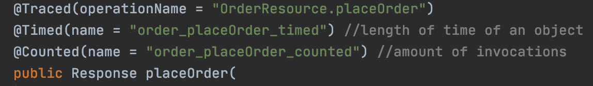
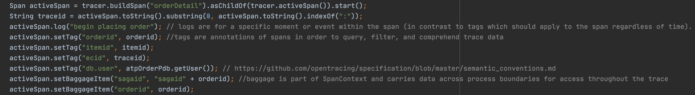
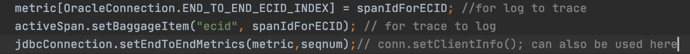

# Better Understand and Modify Metrics, Logging, and Tracing

## Introduction

This lab will take a deeper dive into explaining Metrics, Logging, and Tracing and will show you how extend the observability framework for your own needs and use cases.

You can extend the observability functionality provided here in a number of ways by modifying the metrics, log, and trace exporter config, dashboards, etc.

Estimated Time:  15 minutes

### Objectives

-   Understand the concepts of unified observability and modify the configuration of exporters, etc. in order to see various metrics, logs, and tracing from both the application and database tier.

### Prerequisites

- This lab presumes you have already completed the earlier labs.

## Task 1: Explore the documentation and examples of the open source Observability Exporters on github

1. The Observability Exporters are located at [https://github.com/oracle/oracle-db-appdev-monitoring](https://github.com/oracle/oracle-db-appdev-monitoring)

2. Documentation and configuration examples can be found there.

3. *The observability-exporter image corresponding to the repos at https://github.com/oracle/oracle-db-appdev-monitoring will soon be available at 

## Task 2: Modify metrics, log, and/or exporter configuration

1. Modify and save  
   `$GRABDISH_HOME/observability/db-metrics-exporter/db-metrics-orderpdb-exporter-metrics.toml`
   and/or 
   `$GRABDISH_HOME/observability/db-metrics-exporter/db-metrics-inventorypdb-exporter-metrics.toml`

   You can modify entries for any number of metrics, log, or trace in the same configuration file.
   
2. After making any changes, run the following command(s).   
   ```
   <copy>cd $GRABDISH_HOME/observability/db-metrics-exporter;./update-and-redeploy-order-metrics-exporter.sh</copy>
   ```
   and/or
   ```
   <copy>cd $GRABDISH_HOME/observability/db-metrics-exporter;./update-and-redeploy-inventory-metrics-exporter.sh</copy>
   ```
   You will notice the related configmap is updated and the deployment is reapplied such that they can be observed in the dashboard, etc.

## Task 3: Application tracing

1. There will soon be an Oracle OpenTelemetry javaagent that you can use to attach to your applications to enabled end-to-end tracing from the application into the database without making code modifications.  Until that time, and if additional application tracing is desired, you can following the following instructions for Helidon microservices and similar for Spring Boot and other frameworks.

2. Study the tracing behavior in `$GRABDISH_HOME/order-helidon/src/main/java/io/helidon/data/examples/OrderResource.java` and `OrderServiceEventProducer.java`

3. Notice the `@Traced` MicroProfile annotation for automatically adding tracing spans for this method call.

    


3. Notice the programmatically added spans via `tracer.buildSpan`  logic.

    


4. Notice how the OpenTracing id is set as the ECID for end-to-end tracing across app/Kubernetes tier and database tier.

    

5. Modify and save the source. Then rebuild, and redeploy by deleting the previous pod version (deployments are configured with image-pull=always) using the following command.

    ```
    <copy>cd $GRABDISH_HOME/order-helidon;./build.sh;deletepod order-helidon</copy>
    ```
     
6. Notice the related tracing changes in the dashboard.


You may now **proceed to the next lab.**.

## Learn More

* Ask for help and connect with developers on the [Oracle DB Microservices Slack Channel](https://bit.ly/oracle-db-microservices-help-slack)   

## Acknowledgements
* **Author** - Paul Parkinson, Architect and Developer Advocate;
* **Last Updated By/Date** - Paul Parkinson, June 2022
