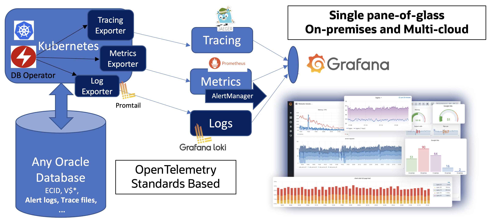

# Introduction

## About this Workshop

This workshop will show you how to automatically configure and use Unified Observability in Grafana to analyze and correlate metrics, logs, and tracing, both in the app-tier and database tier, and all within one "single-pane of glass" (a single Grafana dashboard console).

Estimated Workshop Time: 50 minutes

###About Product/Technology

Examples will be demonstrated as will the ability to configure and customize the framework to suite your own use cases. 

###Objectives

- Learn about Oracle's unique ability to provide unified observability of metrics, logs, and tracing across application and data tiers in a single Grafana console.
- Learn about observability technologies such as Grafana, Prometheus, Promtail, Loki, Jaeger, OpenTracing and OpenTelemetry, and the Oracle DB metric and log exporters.

### Prerequisites

- This workshop assumes you have an Oracle cloud account and have signed in to the account.

As shown in the diagram above, the following popular CNCF and open source technologies and industry standards are used.
 - Prometheus is used for metrics gathering by scraping Kubernetes microservice endpoints and the database exporter endpoint. A Prometheus datasource is used in Grafana.
 - Promtail is used to gathering and push logs from Kubernetes microservice pods and the database exporter pods to Loki. A Loki datasource is used in Grafana.
 - Jaeger is used for tracing (OpenTracing/OpenTelemetry format) in the Kubernetes tier which then correlates to ECID tracing in the database tier. A Jaeger datasource is used in Grafana.
    *More details on this can be found in the `Better Understand and Modify Metrics, Logging, and Tracing` lab.

 Upcoming versions of this workshop will include the following.
 - Use of the database operator for convenient setup of metrics and logs exporters, etc.
 - Examples using additional microservice frameworks and polyglot implementations such as Spring Boot, Micronaut, Quarkus, .NET, JavaScript, Python, Go, etc. 
 - More details on usage and use cases.

The "GrabDish" application and related infrastructure used in the Simplify Microservices with converged Oracle Database Workshop and shown below will be reused for this workshop, however, the focus will be on observability. 

We encourage you to check out the other workshop if you are interested in learning more about the technical capabilities inside and outside the Oracle converged database to support scalable data and event-driven microservices architectures, polyglot microservices, data and transaction patterns, etc.

You may now **proceed to the next lab.**.

## Learn More

* [Oracle Database](https://www.oracle.com/database)

## Acknowledgements
* **Author** - Paul Parkinson, Architect and Developer Advocate;
* **Last Updated By/Date** - Paul Parkinson, June 2022

