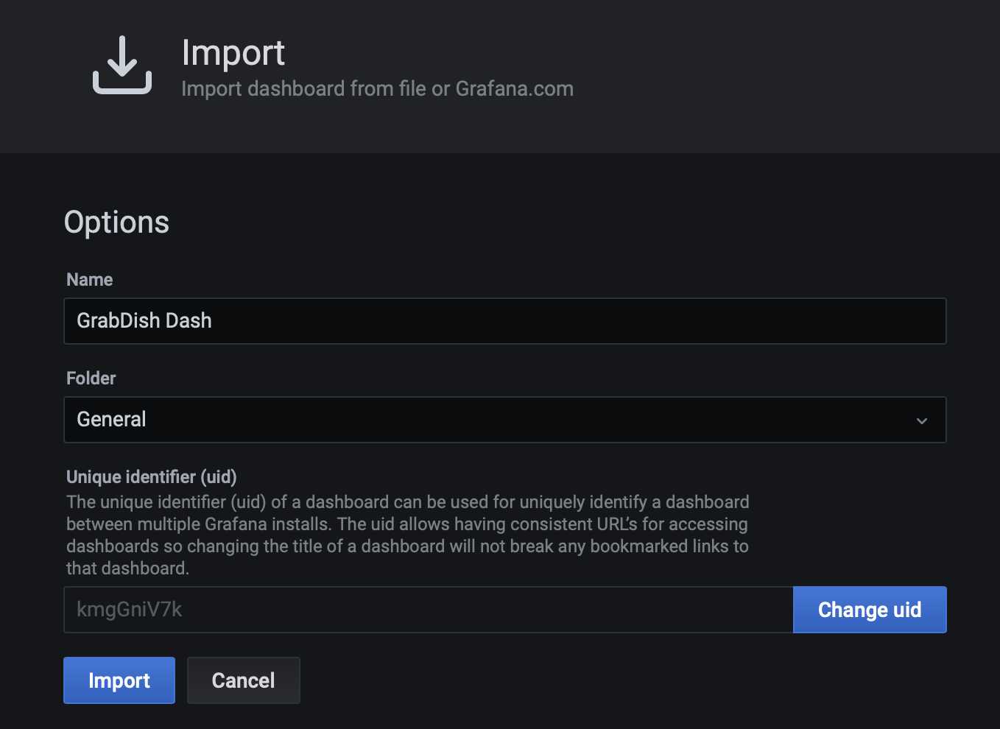

# Unified Observability

## Introduction

This lab will show you how to view and correlate metrics, logs, and tracing of application and data tiers in a single Grafana dashboard.

Please see the  [Unified Observability in Grafana with converged Oracle Database Workshop](http://bit.ly/unifiedobservability) 
for an more in-depth look at this topic including details of the metrics, logs, and tracing exporters.

Estimated Time: 25 minutes

Watch the video below for a quick walk through of the lab.

[](youtube:MuoMHJ54PHE)

### Objectives

* Install and configure Grafana, Prometheus, Loki, Promtail, and Jaeger
* Understand single-pane-of glass unified observability using Grafana to analyze metrics, logs, and tracing of the microservices architecture across the application and Oracle database tier.

### Prerequisites

- This lab presumes you have already completed the earlier labs.
 

## Task 1: Install and Configure Observability Software and Metrics with Log Exporters

1. Run the install script to install Jaeger, Prometheus, Loki, Promtail, Grafana and an SSL secured LoadBalancer for Grafana

    ```
    <copy>cd $GRABDISH_HOME/observability;./install.sh</copy>
    ```

You will see some warning messages related to versions, etc. that may safely be ignored.


2. Run the `/createMonitorsAndExporters.sh` script. This will do the following:
   - Create Prometheus ServiceMonitors to scrape the Frontend, Order, and Inventory microservices.
   - Create Prometheus ServiceMonitors to scrape the Order PDB, and Inventory PDB metric exporter services.
   - Create configmpas, deployments, and services for PDB metrics exporters.
   - Create configmaps, deployments, and services for PDB log exporters.

    ```
    <copy>cd $GRABDISH_HOME/observability;./createMonitorsAndExporters.sh</copy>
    ```

You will see some warning messages related to configmaps not existing, as this is the initial setup, that may safely be ignored.

## Task 2: Configure Grafana

1. Identify the EXTERNAL-IP address of the Grafana LoadBalancer by executing the following command:

       ```
       <copy>services</copy>
       ```

     

     Note, it will take a few minutes for the LoadBalancer to provision during which time it will be in a `pending` state

2. Open a new browser tab and enter the external IP URL:

     `https://<EXTERNAL-IP>`

      Note, for convenience a self-signed certificate is used to secure this https address and so you will be prompted by the browser to allow access.

3. Login using the default username `admin` and password `prom-operator`

      

4. View pre-configured Prometheus data source:

    Select the `Configuration` gear icon on the left-hand side and select `Data Sources`.

      

    Click the Prometheus option.

      

    The URL for Prometheus should be pre-populated

      

    Click `Test` button and verify success.

      

    Click the `Back` button.

5. Select the `Data sources` tab and select `Jaeger`

    Click `Add data source`.

      

    Click the Jaeger option.

      

    Copy and paste the following address in the URL field
    
    ```
    <copy>http://jaeger-query.msdataworkshop:8086/jaeger</copy>
    ```

      

    Click the `Save and test` button and verify successful connection message.
      

    Click the `Back` button.

6. Add and configure Loki data source:

    Click `Add data source`.

      

    Click `select` button of Loki option.

      

    Copy and paste the following address in the URL field
    
       ```
       <copy>http://loki-stack.loki-stack:3100</copy>
       ```

      

    Create the two Derived Fields as shown in the pictures below.
    For each, first set `Internal link` to enabled and select `Jaeger` from the drop-down list.
    Then copy and paste the following values for each field accordingly...
    
    ####First Derived Field (this is for Kubernetes microservice log to trace correlation)

    Name:
    ```
    <copy>traceIDFromSpanReported</copy>
    ```
    Regex:
    ```
    <copy>Span reported: (\w+)</copy>
    ```
    Query:
    ```
    <copy>${__value.raw}</copy>
    ```
    (Optionally to test) Debug log message::
    ```
    <copy>Span reported: dfeda5242866aceb:b5de9f0883e2910e:ac6a4b699921e090:1</copy>
    ```

    ####Second Derived Field (this is for database/ECID log to trace correlation)

    Name:
    ```
    <copy>traceIDFromECID</copy>
    ```
    Regex:
    ```
    <copy>ECID=(\w+)</copy>
    ```
    Query:
    ```
    <copy>${__value.raw}</copy>
    ```
    (Optionally to test) Debug log message::
    ```
    <copy>Debug log message: ECID=dfeda5242866aceb</copy>
    ```
       
      

      

    Click the `Save & Test` button and verify successful connection message.

      

    Click the `Back` button.

7. Install the GrabDish Dashboard

     Select the `+` icon on the left-hand side and select `Import`

      

     Copy the contents of the [GrabDish Dashboard JSON](https://raw.githubusercontent.com/oracle/microservices-datadriven/main/grabdish/observability/dashboards/grabdish-dashboard.json)

     Paste the contents in the `Import via panel json` text field and click the `Load` button
      

     Confirm upload and click `Import` button.
      


## Task 3: Open and Study the Main GrabDish Grafana Dashboard Screen and Metrics

1. Select the four squares icon on the left-hand side and select 'Dashboards'
      

2. In the `Dashboards` panel select `GrabDish Dashboard`

      

3. Notice the collapsible panels for each microservices and their content which includes
    - Metrics about the kubernetes microservice runtime (CPU load, etc.)
    - Metrics about the kubernetes microservice specific to that microservice (`PlaceOrder Count`, etc.)
    - Metrics about the PDB used by the microservice (open sessions, etc.)
    - Metrics about the PDB specific to that microservice (inventory count)
      
      
      

   * Note that you may need to click the metric description(s) at the bottom of a panel in order to see them represented on the graph.
     
   
4. If not already done, place an order using the curl command in `curlpod` as described in Task 1, steps 3 and 4, of the previous `Deploy and Test Data-centric Microservices Application` lab.

5. Select the 'Explore' option from the drop-down menu of any panel to show that metric and time-span on the Explore screen

      
      

## Task 4: Use Grafana to Drill Down on Metrics, Tracing, and Log Correlation and Logs to Trace Feature

1. Click the `Split` button on the Explore screen.
      

2. Click the `Loki` option from the drop-down list on the right-hand panel.
      

3. Click the chain icon on either panel. This will result in the Prometheus metrics on the left and Loki logs on the right are of the same time-span.
      

4. Click the `Log browser` drop-down list on the right-hand panel and select the `app` label under "1. Select labels to search in"
      

5. Select the `order` (microservice) and `db-log-exporter-orderpdb` values under "2. Find values for selected label" and click `Show logs` button.
      
      

6. Select one of the green info log entries to expand it. Notice the `Jaeger` button next to the trace id.
      

7. Click the `Jaeger` to view the corresponding trace information and drill down into detail.
      

## Task 5: Install and Study the AQ/TEQ Dashboard Screen and Metrics

1. Install the AQ/TEQ ("AQ Monitor") Dashboard

   Select the `+` icon on the left-hand side and select `Import`

   

   Copy the contents of the [AQ/TEQ Dashboard JSON](https://raw.githubusercontent.com/oracle/microservices-datadriven/main/grabdish/observability/dashboards/aq-dashboard-basics.json)

   Paste the contents in the `Import via panel json` text field and click the `Load` button, followed by `Import`
   

3. Select the four squares icon on the left-hand side and select 'Dashboards'
   

4. In the `Dashboards` panel select `AQ Monitor`

   

5. Notice the collapsible panels for each microservices and their content which includes metrics about
   - Order and Inventory Queues/Topics propagated across the Order and Inventory PDBs
   - Subscribers
   - Message counts, latency, etc.
   - Enqueue and Dequeue rates

   

You may now proceed to the next lab.

## Learn More

* Ask for help and connect with developers on the [Oracle DB Microservices Slack Channel](https://bit.ly/oracle-db-microservices-help-slack)   

## Acknowledgements
* **Author** - Paul Parkinson, Architect and Developer Advocate;
* **Last Updated By/Date** - Paul Parkinson, June 2022

