# Performance Monitoring Use Case

## Introduction

This lab will show you how to set up alerts for metrics conditions and trigger them so that Slack notifications are sent as appropriate.

<<<<<<< HEAD
Estimated Time:  10 minutes

=======
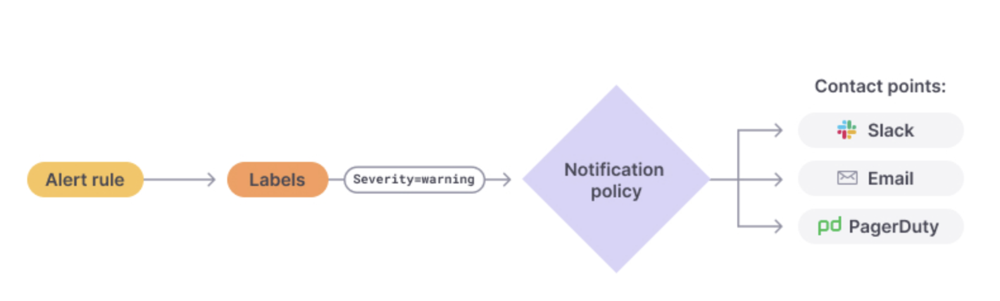

Estimated Time:  10 minutes


>>>>>>> upstream/main
### Objectives

-   Configure alert for when `PlaceOrder` average response time exceeds a given value.
-   Load test the application to induce the alert
-   Notice the health state of the metric in Grafana and the messages sent to Slack channel.
  
  
### Prerequisites

- This lab presumes you have already completed the earlier labs.

## Task 1: Notice perf metrics and create alert for response time threshold

1. Notice `PlaceOrder average time` metric panel in `Order Service` section of the Grabdish dashboard, select the drop down menu of the panel and click `edit`.

    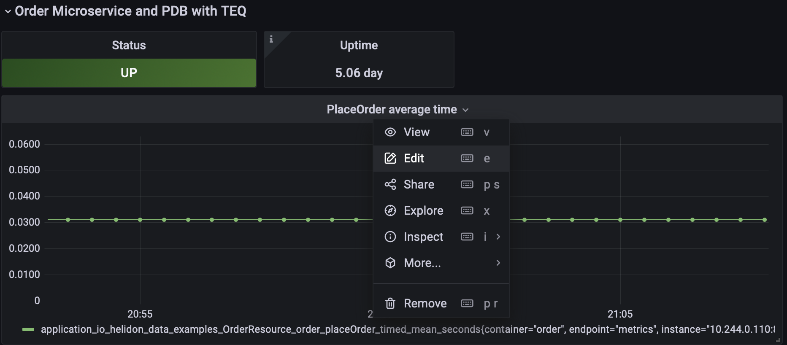
   
<<<<<<< HEAD
2. Select the `alert` tab and click the `create Alert` button

    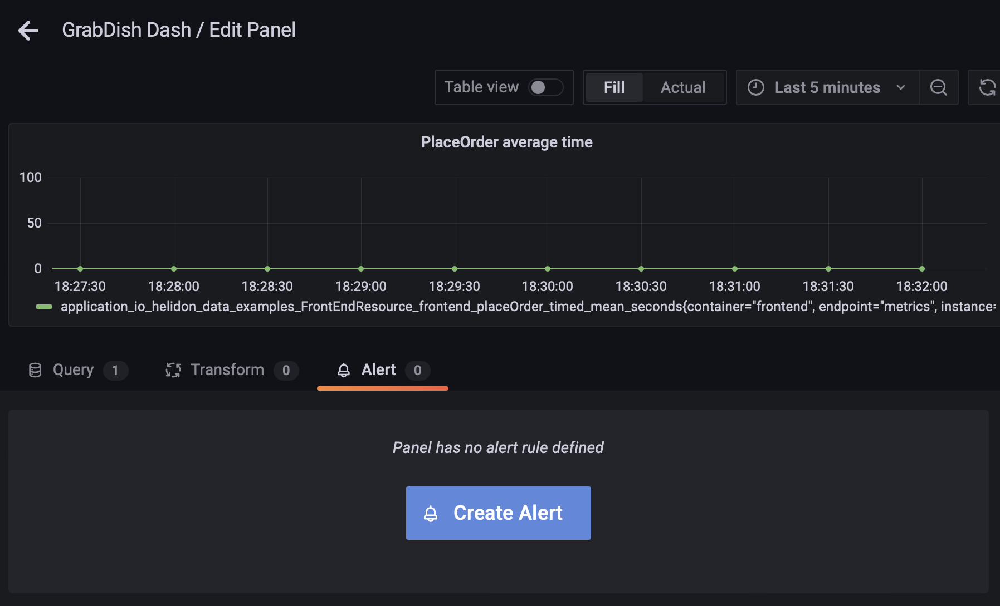
       
3. Set the rule to evaluate every 1m for 5m, add a condition for avg() time above `.01`, and provide a message to be sent for the Slack notification (Slack channel should be the default for `Send to`)

    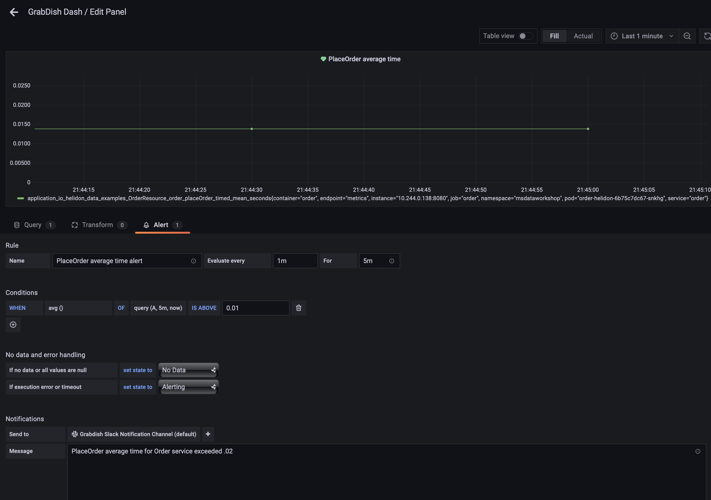
       
3. You can click `Test rule` to verify the rule and then click `Apply` in the upper right corner.

    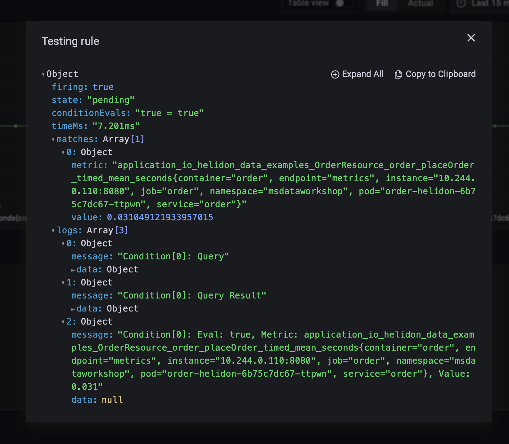


## Task 2:  Install a load testing tool and start an external load balancer for the Order service

1. Start an external load balancer for the order service.

    ```
    <copy>cd $GRABDISH_HOME/order-helidon; kubectl create -f ext-order-ingress.yaml -n msdataworkshop</copy>
    ```

    Check the ext-order LoadBalancer service and make note of the external IP address. This may take a few minutes to start.

    ```
    <copy>services</copy>
    ```

    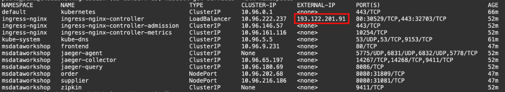

    Set the LB environment variable to the external IP address of the ext-order service. Replace 123.123.123.123 in the following command with the external IP address.

    ```
    <copy>export LB='123.123.123.123'</copy>
    ```


2. Install a load testing tool.  

    You can use any web load testing tool to drive load. Here is an example of how to install the k6 tool ((licensed under AGPL v3). Or, you can use artillery and the script for that is also provided below. To see the scaling impacts we prefer doing this lab with k6.

	```
	<copy>cd $GRABDISH_HOME/k6; wget https://github.com/loadimpact/k6/releases/download/v0.27.0/k6-v0.27.0-linux64.tar.gz; tar -xzf k6-v0.27.0-linux64.tar.gz; ln k6-v0.27.0-linux64/k6 k6</copy>
	```

	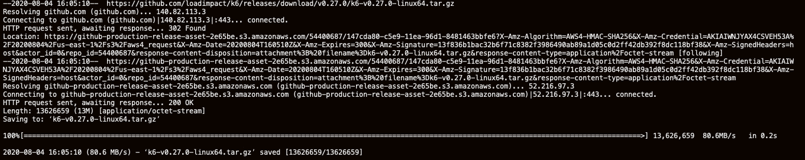

 
## Task 3: Load test 

1.  Execute a load test using the load testing tool you have installed.  

    ```
    <copy>cd $GRABDISH_HOME/k6; test40usersFor5Minutes.sh</copy>
    ```
    
    *Note that you can adjust the alert rule condition(s) (as defined in task 1) as well as the number of users and duration of the load test conducted here as desired.
    The values provided here are generally sufficient to reproduce the performance degradation and trigger the alert as desired.

## Task 4: Notice metrics and Slack message from alert due to rule condition being exceeded.

1. Notice the health/heart of the PlaceOrder panel in Grafana console turn to yellow and then eventually to red.
=======
2. Select the `alert` tab and click the `Create alert rule from this panel` button

    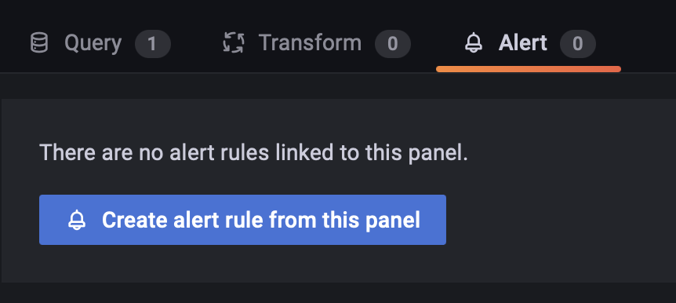
       
3. Enter the rule type fields as shown below.

    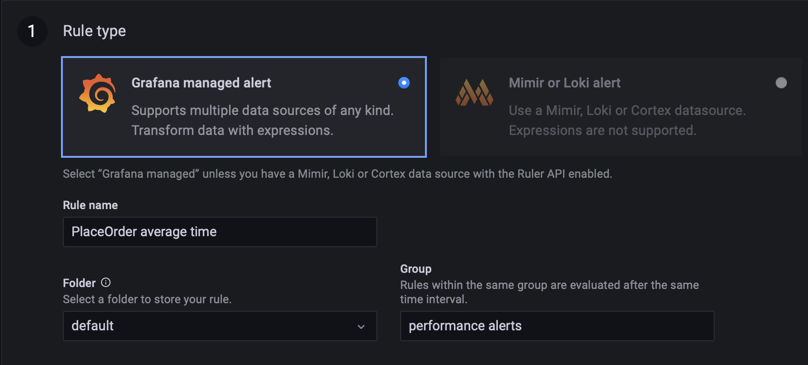
       
4. `Create a query to be alerted on` entering the fields as shown below and click `Run queries` button.

    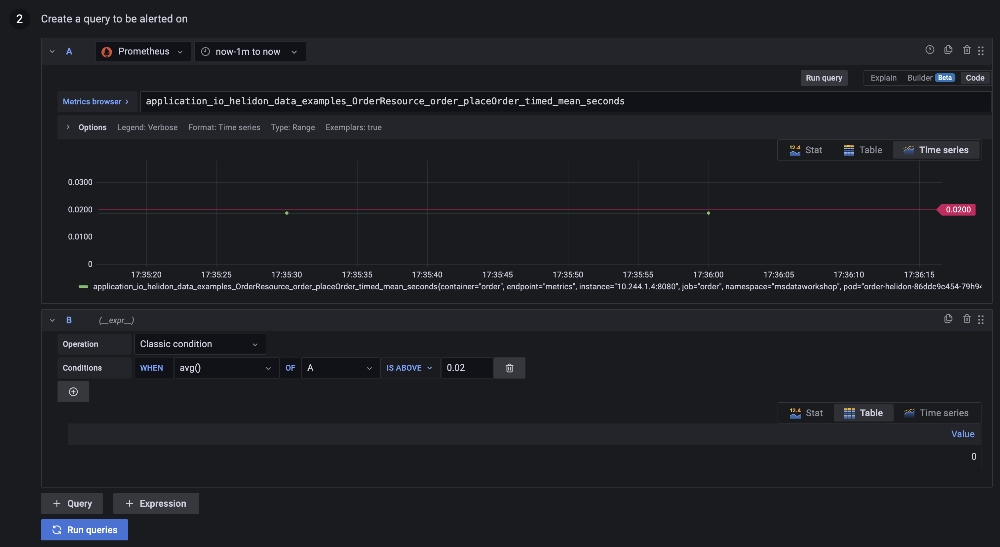

   #### Different environments may have different response times and so it may be necessary to tweak the rules, etc. accordingly to trigger an alert.
   #### Notice the current average placeOrder response time and adjust the rule's `is above` value if necessary such it is greater than the (green) average response time.

   If there is no current average response time (ie green line), even after clicking the icon underneath the graph, re-run a (curl) request to placeOrder as was done in the `Deploy and Test Data-centric Microservices Application` lab.

5. Define the alert conditions as show below (you may reduce the 1m and 5m `Evaluate` values to induce the notification sooner).

    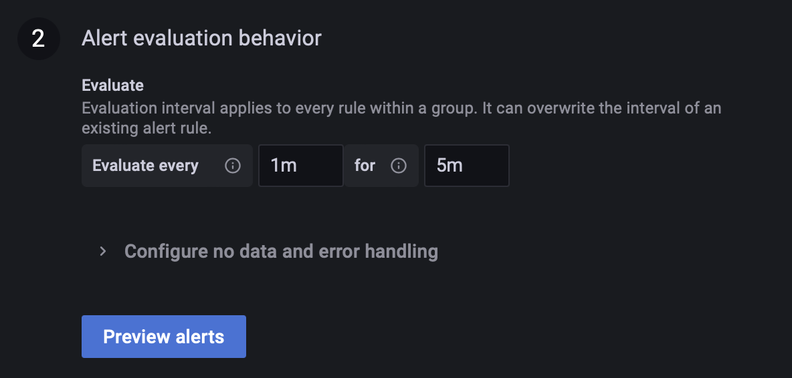

6. Click `Preview alerts` button to test the alert based on the result of the running query.

    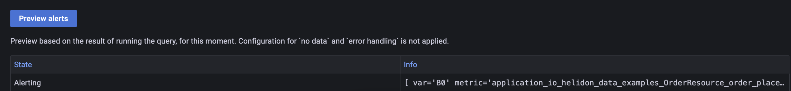

7. Optionally, add details for the alert.

    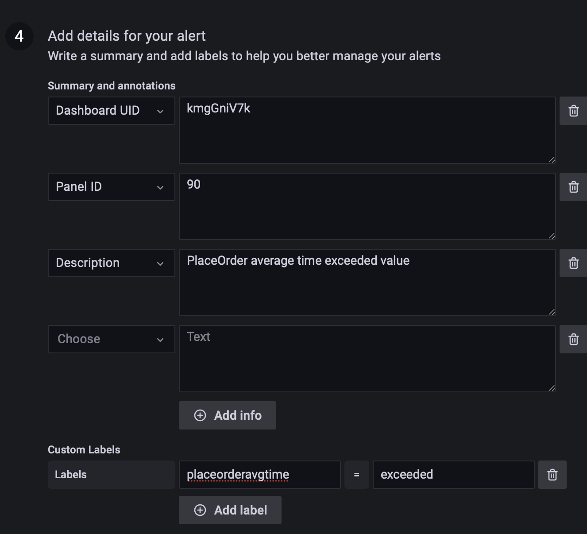
       
8. Click `Save and exit` 


## Task 2:  Run load test. Notice metrics and Slack message from alert due to rule condition being exceeded.

1. Run the `curlpod` command from the Cloud Shell in order to access a shell prompt running within the Kubernetes cluster as was done in the `Deploy and Test Data-centric Microservices Application` lab.  

    ```
    <copy>curlpod</copy>
    ```
    
2. Execute a load test using the following command.  

    ```
    <copy>while true; do curl -u grabdish:[REPLACE_WITH_PASSWORD] -X POST -H "Content-type: application/json" -d  "{\"serviceName\" : \"order\" , \"commandName\" : \"placeOrder\", \"orderId\" : \"66\", \"orderItem\" : \"sushi\",  \"deliverTo\" : \"101\"}"  "http://frontend.msdataworkshop:8080/placeorderautoincrement"; sleep 2; done</copy>
    ```

3. Notice the health/heart of the PlaceOrder panel in Grafana console turn to yellow and then eventually to red.
>>>>>>> upstream/main

   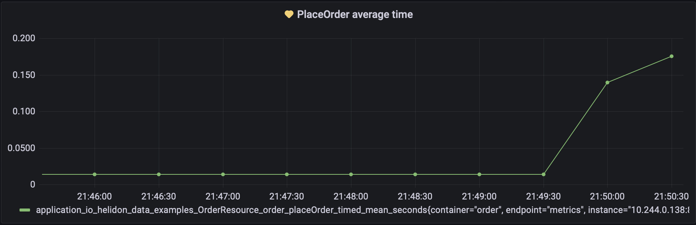
     
   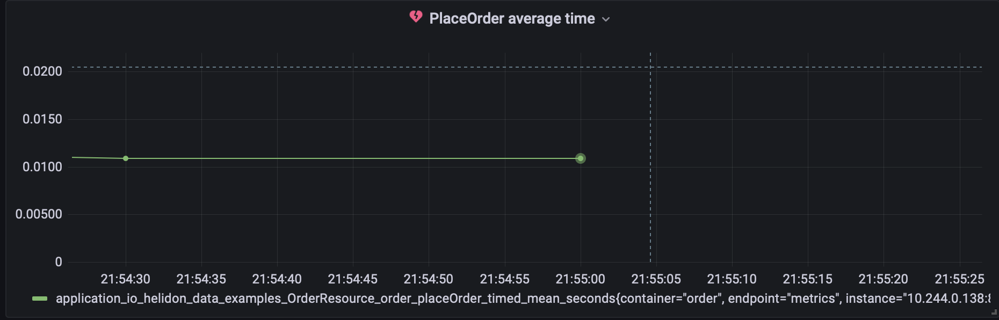
     
<<<<<<< HEAD
 2. Also notice a Slack message being sent with information about the alert.
     
   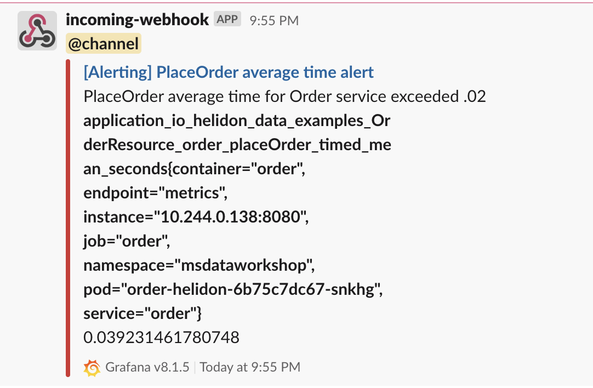

## Task 5: Notice return to healthy state and Slack message sent indicating response time is acceptable.

1. Notice the health/heart of the PlaceOrder panel in Grafana console turn back to green.

   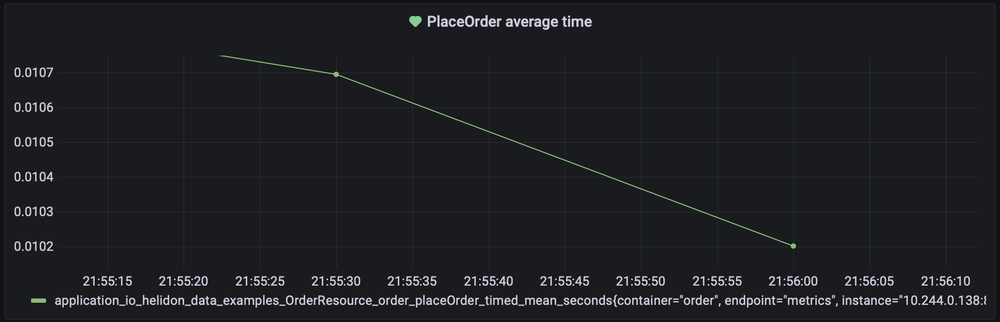
   
2. Also notice a Slack message being sent confirming the condtion is `OK` again.
   
   

You may now **proceed to the next lab.**.

=======
4. Also notice a Slack message being sent with information about the alert.
     
   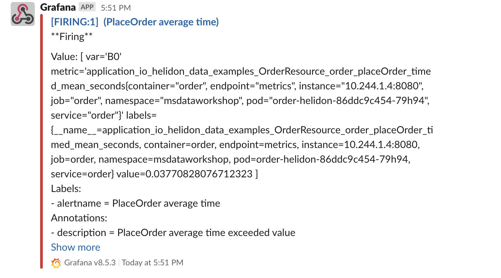

   Optionally the alert can be viewed in dashboard as well as shown here in the `AQ Monitor` dashboard.
   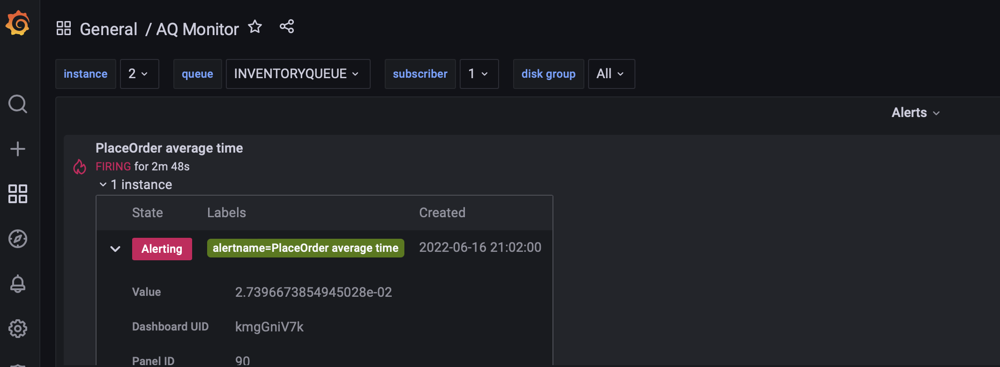

   As well as in `Alerting rules` tab of the `Alerting` page .
   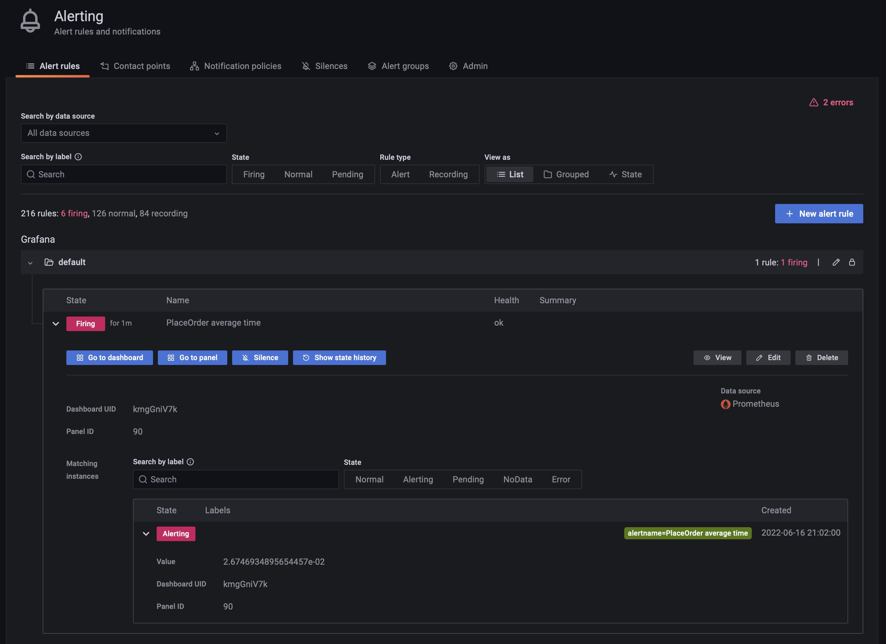

5. It may be necessary to increase the load by either running multiple `curlpod` shells or simply running the curl loop in the background by issuing the following multiple times within the `curlpod` shell.

 ```
 <copy>while true; do curl -u grabdish:[REPLACE_WITH_PASSWORD] -X POST -H "Content-type: application/json" -d  "{\"serviceName\" : \"order\" , \"commandName\" : \"placeOrder\", \"orderId\" : \"66\", \"orderItem\" : \"sushi\",  \"deliverTo\" : \"101\"}"  "http://frontend.msdataworkshop:8080/placeorderautoincrement"; sleep 2; done &</copy>
 ```

## Task 3: Stop load test. Notice return to healthy state and Slack message sent indicating response time is acceptable.

1. Delete `curlpod` with the following shortcut command to insure all load test threads are terminated.

   ```
   <copy>deletepod curlpod</copy>
   ```

2. Start `curlpod` again and issue curl command to delete all existing records.

   ```
   <copy>curlpod</copy>
   ```

   ```
   <copy>curl -u grabdish:[REPLACE_WITH_PASSWORD] -X POST -H "Content-type: application/json" -d  "{\"serviceName\" : \"order\" , \"commandName\" : \"deleteallorders\", \"orderId\" : \"-1\", \"orderItem\" : \"\",  \"deliverTo\" : \"\"}"  "http://frontend.msdataworkshop:8080/command"</copy>
   ```

3. Issue single request(s) as done earlier. 

    ```
    <copy>curl -u grabdish:[REPLACE_WITH_PASSWORD] -X POST -H "Content-type: application/json" -d  "{\"serviceName\" : \"order\" , \"commandName\" : \"placeOrder\", \"orderId\" : \"66\", \"orderItem\" : \"sushi\",  \"deliverTo\" : \"101\"}"  "http://frontend.msdataworkshop:8080/placeorderautoincrement"</copy>
    ```

5. Notice the health/heart of the PlaceOrder panel in Grafana console turn back to green.

   
   
6. Also notice a Slack message being sent confirming the condition is resolved.
   
   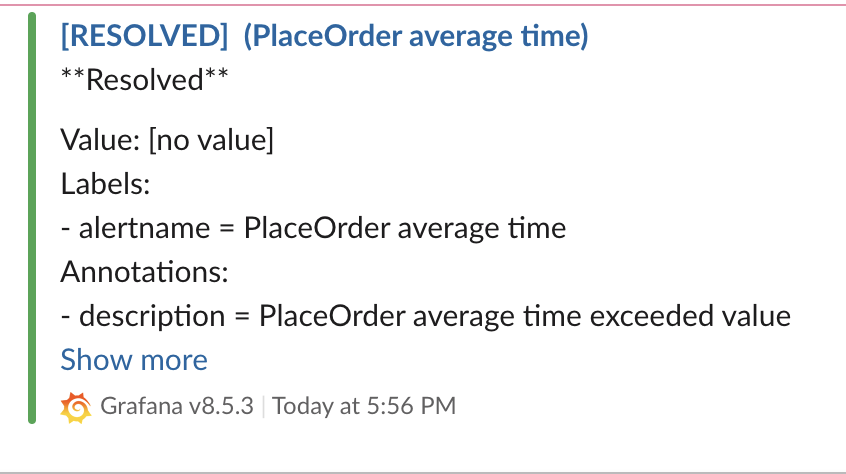

You may now **proceed to the next lab.**.

## Learn More

* Ask for help and connect with developers on the [Oracle DB Microservices Slack Channel](https://bit.ly/oracle-db-microservices-help-slack)   

>>>>>>> upstream/main
## Acknowledgements
* **Author** - Paul Parkinson, Architect and Developer Advocate
* **Last Updated By/Date** - Paul Parkinson, August 2021
