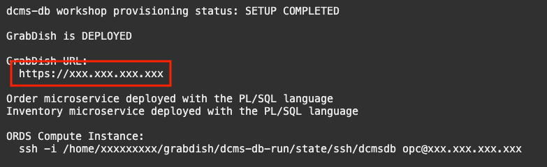

# Deploy the Grabdish Application and Logon

## Introduction

This lab will show you how to deploy the Grabdish microservices on the ORDS server and in the database.

Estimated Time: 5 minutes

### Objectives

-   Deploy the microservices
-   Logon to the GrabDish Application

### Prerequisites

* An Oracle Cloud paid account or free trial. To sign up for a trial account with $300 in credits for 30 days, click [Sign Up](http://oracle.com/cloud/free).
* The Autonomous Transaction Processing database and ORDS compute instance that you created in Lab 1

## Task 1: Deploy All the Microservices

1.  Run the deploy script:

    ```
    <copy>deploy</copy>
    ```

2.  The deploy script will ask you to enter an admin password for the database. Database passwords must be 12 to 30 characters and contain at least one uppercase letter, one lowercase letter, and one number. The password cannot contain the double quote (") character or the word "admin". Make a note of the password as you will need it later.  

3.  The deploy script will also ask you to enter a UI password that will be used to authenticate user access to the frontend user interface. The UI password must be 8 to 30 characters. Make a note of the password as you will need it later.  

4.  The deployment script performs the following actions:
    * Sets the DB password
    * Creates the ORDS schema in the database
    * Configures the ORDS server
    * Deploys the GrabDish Application in the ORDS server
    * Deploys Grabdish in the database
    * Starts the ORDS server

5.  Once the deployment script has successfully completed the **GrabDish is DEPLOYED** status will be displayed.

   

## Task 2: Logon to the Grabdish Application

1.  Get the status of the workshop:

    ```
    <copy>status</copy>
    ```

2.  Click on the **GrabDish URL**.  A new tab will open in your browser.

    

3. You will be prompted for user name and password to authenticate access to the front end. The user is `grabdish` and the password is the one you entered in Task 1 of this lab.

    

3. You should then see the Front End home page.

    

**Note** We created a self-signed certificate to protect the front end service. This certificate will not be recognized by your browser and so a warning is displayed. It will be necessary to instruct the browser to trust this site to display the frontend. In a production implementation a certificate that is officially signed by a certificate authority must be used.

Once you have successfully logged on you are ready to [move on to Lab 3](#next).

## Acknowledgements
* **Author** - Richard Exley, Consulting Member of Technical Staff, Oracle MAA and Exadata
* **Contributors** - Paul Parkinson, Architect and Developer Evangelist;
* **Last Updated By/Date** - Richard Exley, April 2022
