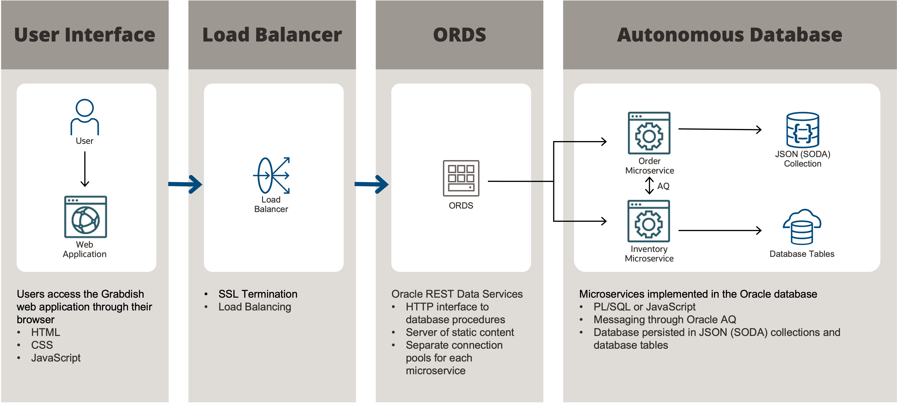

# Introduction

## About this Workshop

This workshop will help you understand the technical capabilities inside the Oracle converged database to support a scalable data and event-driven microservices architecture.

### About Product/Technology

Microservices written in either PL/SQL or JavaScript will be deployed within an Oracle Autonomous Transaction Processing database. Web interfaces and messaging are used for communication. A secure Javascript application, running in the browser, will showcase the microservice functionality. Order data is stored as a JSON collection, and Inventory data is stored on relational tables.

Estimated Workshop Time: 45 mins

### Objectives

- Learn about the Oracle Database's unique ability to provide native support for modern data types, languages, security, and the latest development paradigms such as JSON for document stores, event queues, and loose coupling.
- Learn about a two-tier microservice architecture - the application tier, and the database tier - bringing agility, scalability, and robustness to enterprise applications.

### Prerequisites

 - An Oracle Cloud Account - Please view this workshop's LiveLabs landing page to see which environments are supported.

  > **Note:** If you have a **Free Trial** account, when your Free Trial expires your account will be converted to an **Always Free** account. You will not be able to conduct Free Tier workshops unless the Always Free environment is available.
 **[Free Tier FAQ page.](https://www.oracle.com/cloud/free/faq.html)**

## Want to Learn More?

* [Multitenant Database–Oracle 19c](https://www.oracle.com/database/technologies/multitenant.html)
* [Oracle Advanced Queuing](https://docs.oracle.com/en/database/oracle/oracle-database/19/adque/aq-introduction.html)
* [Microservices Architecture with the Oracle Database](https://www.oracle.com/technetwork/database/availability/trn5515-microserviceswithoracle-5187372.pdf)
* [https://developer.oracle.com/](https://developer.oracle.com/)

## Acknowledgements
* **Authors** - Richard Exley, Consulting Member of Technical Staff;
* **Contributors** - Oracle MAA and Exadata; Rena Granat, Consulting Member of Technical Staff, Oracle MAA and Exadata; Paul Parkinson, Developer Evangelist;
* **Last Updated By/Date** - Richard Exley, March 2022
