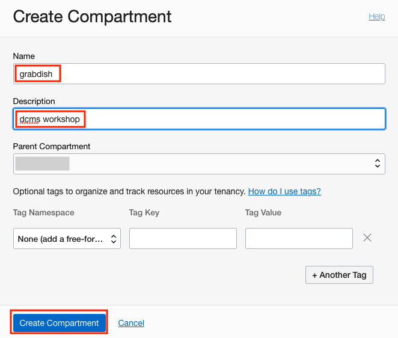
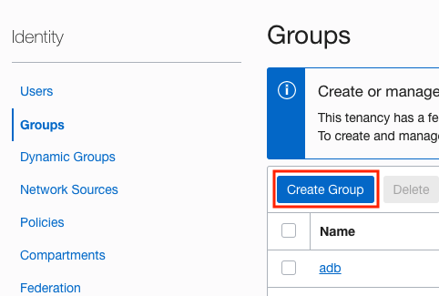
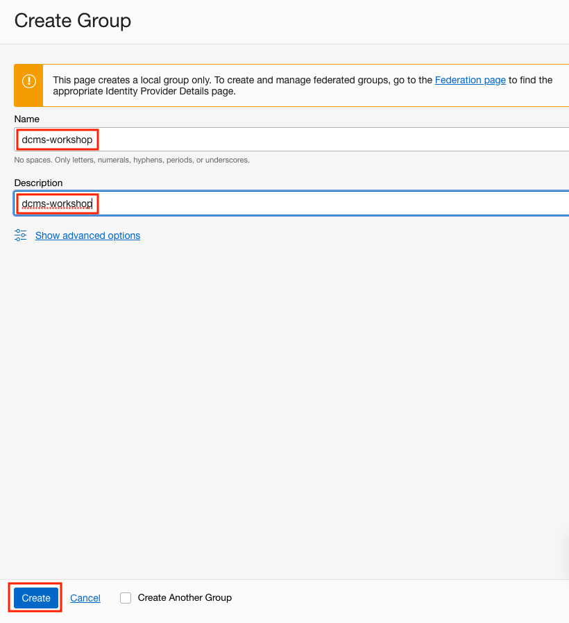
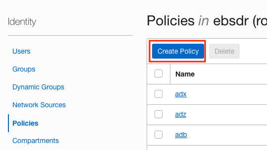
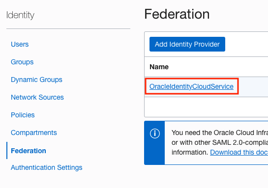
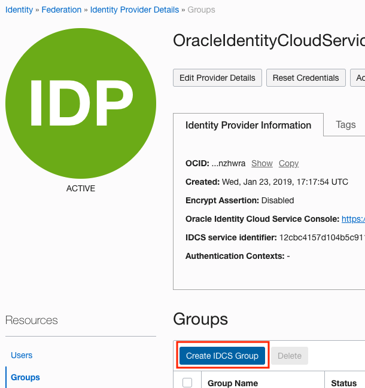
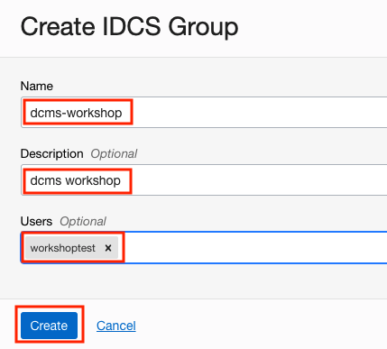
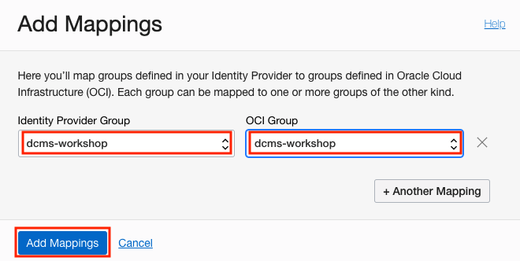

# Additional setup for non-admin tenancy users

## Introduction

In this lab, we will ensure that we have the security policies to run the workshop in your tenancy user.

Estimated Time: 1-10 minutes

### Objectives

* Pre-create the compartment and configure additional security policies for non-admin user

## Task 1: Assess the security policies of your user account

1. If you have a user account with the admin role then you may **proceed to the next lab**, otherwise, **proceed to the next task**.

## Task 2: Ask an administrator to create a compartment and setup security groups and policies for you to run the workshop

Ask an administrator to perform the following steps:

1. Create a compartment in which to run the workshop.  The compartment has the name **grabdish** in this example:

  

  

  Make a copy of the compartment OCID and save for later:

  

2. Create a new group.  The group is called **dcms-workshop** in this example:

   

   

3. Create a policy that grants access to the new compartment and other policy statements necessary to run the workshop.  In the this example the policy is called **dcms-workshop** and refers to the group **dcms-workshop** and compartment **grabdish**:

   

   

   The required policy statements are:

   ```
   <copy>
   Allow group dcms-workshop to use cloud-shell in tenancy
   Allow group dcms-workshop to manage all-resources in compartment grabdish
   Allow group dcms-workshop to inspect tenancies in tenancy where request.permission = 'TENANCY_INSPECT'
   Allow group dcms-workshop to inspect limits in tenancy
   </copy>
   ```

4. Select the federated identity provider, Create a new security group, add the policy, and map to it to you

   

   

   Enter the IDCS group details including selecting you as a member of the group (**workshoptest** is the tenancy user in this example):

   

5. Map the IDCS group to the local group create in step

   

   

   Once the administrator has performed these actions **proceed to the next lab**.

## Acknowledgements

* **Authors** - Richard Exley, Consulting Member of Technical Staff, Oracle MAA and Exadata; Irina Granat, Consulting Member of Technical Staff, Oracle MAA and Exadata; Paul Parkinson, Developer Evangelist;
* **Last Updated By/Date** - Richard Exley, April 2022
