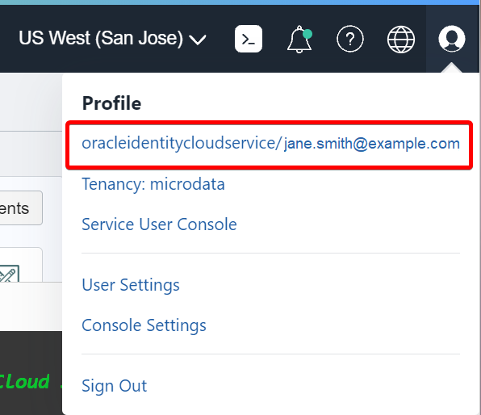

# Setup

## Introduction

In this lab, we will provision and configure the resources to execute microservices in your tenancy.  

Estimated Time: 10 minutes

### Objectives

* Clone the setup and microservice code
* Provision database and compute resources

## Task 1: Log in to the Oracle Cloud Console

1. If you haven't already, sign in to your account.

## Task 2: Select the Home Region

1. Be sure to select the **home region** of your tenancy. Setup will only work in the home region.

  

## Task 3: Launch Cloud Shell

Cloud Shell is a small virtual machine running a "bash" shell that you access through the Oracle Cloud Console. Cloud Shell comes with a pre-authenticated command-line interface in the tenancy region. It also provides up-to-date tools and utilities.

1. Click the Cloud Shell icon in the top-right corner of the Console.

  

  > **Note:** Cloud Shell uses websockets to communicate between your browser and the service. If your browser has websockets disabled or uses a corporate proxy that has websockets disabled you will see an error message ("An unexpected error occurred") when attempting to start Cloud Shell from the console. You also can change the browser cookies settings for a specific site to allow the traffic from *.oracle.com

## Task 4: Create a Folder to Contain the Workshop Code

1. Create a directory to contain the workshop code. For example:

   ```
   <copy>
   mkdir grabdish
   </copy>
   ```

   All the resources created by the setup are created in this compartment. This will let you quickly delete and clean up afterward.  

2. Change the directory to the directory that you have created. For example:

   ```
   <copy>
   cd grabdish
   </copy>
   ```

## Task 5: Make a Clone of the Workshop Setup Script and Source Code

1. To work with the application code, you need to make a clone from the GitHub repository using the following command.  

   ```
   <copy>
   git clone -b 22.7.4 --single-branch https://github.com/oracle/microservices-datadriven.git
   </copy>
   ```
   You should now see the directory `microservices-datadriven` in the directory that you created.

## Task 6: Start the Setup

1. Execute the following sequence of commands to start the setup.  

   ```
   <copy>
   source microservices-datadriven/workshops/dcms-db/source.env
   setup
   </copy>
   ```

   > **Note:** Cloud shell may disconnect after a period of inactivity. If that happens, you can reconnect and then rerun the command to resume the setup.

   The setup process will typically take around 4 minutes to complete.  

2. The setup will create the workshop resources in a compartment within your tenancy. You will be prompted to enter the compartment information.  You may choose to use an existing compartment or create a new one.  If the administrator created a compartment for you in the **Additional setup for non-admin tenancy users** lab then use that compartment OCID here.

  - To use an existing compartment, enter the OCID of the compartment.

  - To create a new compartment, enter the name you would like to use. If you chose to create a new compartment, you will also be asked to enter the OCID of the parent compartment in which the new compartment is to be created.  Enter the parent compartment OCID or hit enter to use the root compartment of your tenancy.

  To get the OCID of an existing compartment, click on the Navigation Menu in the upper left of Cloud Console, navigate to **Identity & Security** and click on **Compartments**:

  

  Click on the link in the **OCID column** of the compartment, and click **Copy**:

  

3. The setup will ask for you to enter your user's OCID.  

  Be sure to provide the user OCID and not the user name or tenancy OCID. The user OCID will appear something like the following:

  `ocid1.user.oc1....<unique_ID>`

  > **Note:** Notice the format of "ocid1.user" prefix.

  Locate your menu bar in the Cloud Console and click the person icon at the far upper right. From the drop-down menu, select your user's name. Note, sometimes the name link is missing in which case select the **User Settings** link. Do not select the **Tenancy** link.

  

  Click Show to see the details and then click Copy to copy the user OCID to the clipboard, and then paste the copied data into the console.

  

## Task 7: Monitor the Setup

The setup will provision the following resources in your tenancy:

| Resources              | Oracle Cloud Console Navigation                                             |
|------------------------|-----------------------------------------------------------------------------|
| Database               | Oracle Database -- Autonomous Database -- Autonomous Transaction Processing |
| Compute                | Compute -- instances                                                        |

1. You should monitor the setup progress from a different browser window or tab.  It is best not to use the original browser window or not to refresh it as this may disturb the setup or you might lose your shell session. Most browsers have a "duplicate" feature that will allow you to quickly created a second window or tab.

   

2. From the new browser window or tab, navigate around the console to view the resources within the new compartment. The table includes the console navigation for each resource. For example, here we show the database resources:

  

  > **Note:** Cloud Shell sessions have a maximum length of 24 hours, and time out after 20 minutes of inactivity.

## Task 8: Complete the Setup

1. The setup will provide a summary of the setup status as it proceeds. Once everything has completed execution you will see the message: **SETUP COMPLETED**.

2. While the background setup jobs are running you can monitor their progress with the following command.

   ```
   <copy>
   ps -ef
   </copy>
   ```

   Once the setup has completed execution you are ready to **proceed to the next lab**.


## Acknowledgements

* **Authors** - Richard Exley, Consulting Member of Technical Staff, Oracle MAA and Exadata; Irina Granat, Consulting Member of Technical Staff, Oracle MAA and Exadata; Paul Parkinson, Developer Evangelist;
* **Last Updated By/Date** - Richard Exley, April 2022
