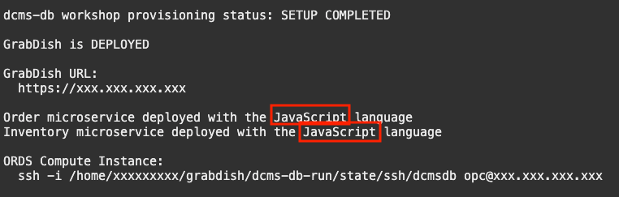

# Switch to the MLE JavaScript microservice implementation

## Introduction

This lab will walk through the Grabdish application functionality written in JavaScript.

Estimated Time: 10 minutes

### Objectives

-   Access the microservices
-   Learn how they work

### Prerequisites

* The Grabdish application you deployed in Lab 2

## Task 1: Switch the Microservices to the JavaScript Implementation

1.  Run the switch script in the cloud shell:

    ```
    <copy>switch js js</copy>
    ```

    **Note** The switch script parameters select the microservice implementation.  The first parameter is the Order microservice implementation - js or plsql.  The second parameter is the Inventory microservice implementation - js or plsql.  All combinations are supported.

2.  The switch script will ask you to enter an admin password for the database that you chose in Lab 2.

3.  The switch script performs the following actions:
    * Deploys the Order microservice in the database
    * Deploys the Inventory microservice in the database

4.  Once the switch script has successfully completed the status will be displayed.

   

## Task 2: Verify the Order and Inventory Functionality of GrabDish Store

   1. Navigate back to the GrabDish UI and confirm that the functionality is the same with the JavaScript implementation.  Use different order numbers this time.

## Task 3: Learn about the JavaScript Implementation

As you expect, the user interface code remains the same when we change the microservice implementation.

When implementing the service interface is JavaScript interface is written in a PL/SQL wrapper and exposed by ORDS using the same Auto PLSQL functionality.  Here is the PL/SQL code that implements the Place Order service interface wrapper (code extract from [order-js-wrapper.sql](https://github.com/oracle/microservices-datadriven/blob/main/workshops/dcms-db/grabdish/order/order-js/order-js-wrapper.sql)):

```sql
create or replace procedure place_order (
  orderid in out varchar2,
  itemid in out varchar2,
  deliverylocation in out varchar2,
  status out varchar2,
  inventorylocation out varchar2,
  suggestivesale out varchar2)
authid current_user
is
  ctx dbms_mle.context_handle_t := order_js.ctx;
  order_jo json_object_t;
  order_string varchar2(1000);
  js_code clob := q'~
// export order
bindings.exportValue(
  "order",
  JSON.stringify(
    placeOrder(
      JSON.parse(
        bindings.importValue("order")))));
~';
begin

  -- construct the order object
  order_jo := new json_object_t;
  order_jo.put('orderid', orderid);
  order_jo.put('itemid',  itemid);
  order_jo.put('deliverylocation', deliverylocation);

  -- pass variables to javascript
  dbms_mle.export_to_mle(ctx, 'order', order_jo.to_string);

  -- execute javascript
  dbms_mle.eval(ctx, 'JAVASCRIPT', js_code);

  -- handle response
  dbms_mle.import_from_mle(ctx, 'order', order_string);

  order_jo := json_object_t(order_string);
  orderid :=           order_jo.get_string('orderid');
  itemid :=            order_jo.get_string('itemid');
  deliverylocation :=  order_jo.get_string('deliverylocation');
```

Each input (in) parameter is mapped to a JSON attribute in the incoming request and the procedure is execute.  In response, a JSON document is constructed with each output (out) parameter corresponding to a JSON attribute.

The wrapper code calls the place order implementation written in JavaScript (code extract from [order.js](https://github.com/oracle/microservices-datadriven/blob/main/workshops/dcms-db/grabdish/order/order-js/order.js)):

```javascript
function placeOrder(order) {
  try {
    order.status = "pending";
    order.inventorylocation = "";
    order.suggestivesale = "";

    // insert the order object
    _insertOrder(order);

    // send the order message
    _enqueueOrderMessage(order);

    // commit
    conn.commit;

    return order;

  } catch(error) {
    conn.rollback;
    throw error;
  }
}

```

The order message consumer code is also implemented in JavaScript (code extract from [inventory.js](https://github.com/oracle/microservices-datadriven/blob/main/workshops/dcms-db/grabdish/inventory/inventory-js/inventory.js)):

```javascript
function orderMessageConsumer() {
  let order = null;
  let invMsg = null;

  // wait for and dequeue the next order message
  order = _dequeueOrderMessage(-1); // wait forever

  if (order === null) {
    conn.rollback;
    return;
  }

  // fulfill the orders
  invMsg = fulfillOrder(order);

  // enqueue the inventory messages
  _enqueueInventoryMessage(invMsg);

  // commit
  conn.commit;
```

As is the fulfillment business logic (code extract from [inventory.js](https://github.com/oracle/microservices-datadriven/blob/main/workshops/dcms-db/grabdish/inventory/inventory-js/inventory.js)):

```javascript
function fulfillOrder(order) {
  let invMsg = {orderid: order.orderid, itemid: order.itemid, suggestiveSale: "beer"};

  // check the inventory
  let result = conn.execute(
    "update inventory set inventorycount = inventorycount - 1 " +
    "where inventoryid = :itemid and inventorycount > 0 " +
    "returning inventorylocation into :inventorylocation",
    {
      itemid: { val: order.itemid, dir: db.BIND_IN, type: db.STRING },
      inventorylocation: { dir: db.BIND_OUT, type: db.STRING }
    }
  );

  if (result.rowsAffected === 0) {
    invMsg.inventorylocation = "inventorydoesnotexist";
  } else {
    invMsg.inventorylocation = result.outBinds.inventorylocation[0];
  }

  return invMsg;
}
```
   You may now [move on to Lab 5](#next).

## Acknowledgements
* **Author** - Richard Exley, Consulting Member of Technical Staff, Oracle MAA and Exadata
* **Contributors** - Paul Parkinson, Architect and Developer Evangelist
* **Last Updated By/Date** - Richard Exley, April 2022
