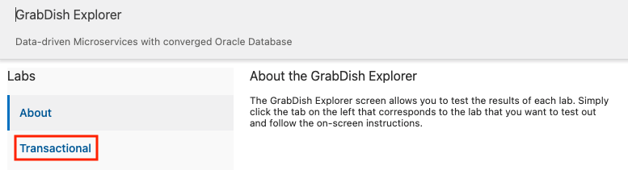
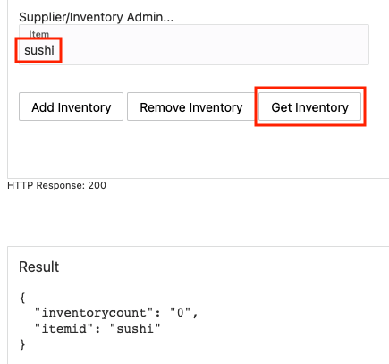
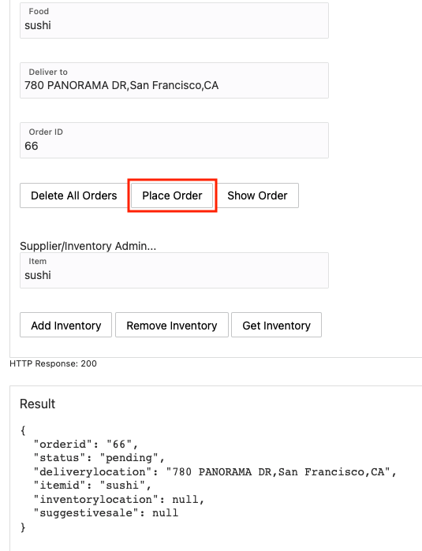
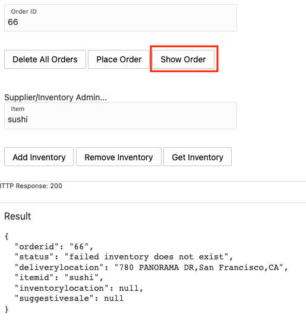
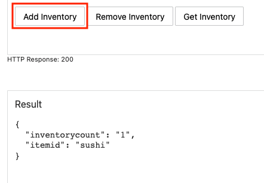
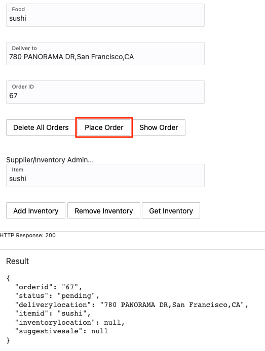
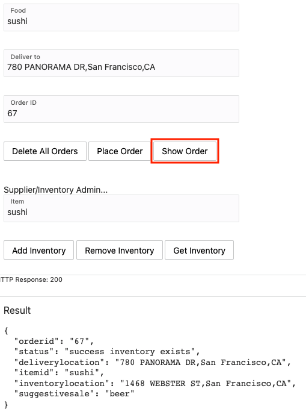

# Walkthrough the grabdish functionality implemented in PL/SQL

## Introduction

This lab will show you how to walk through the Grabdish application functionality written in PL/SQL and explain how it works.

Estimated Time: 10 minutes

### Objectives

-   Access the microservices
-   Learn how they work

### Prerequisites

* The Grabdish application you deployed in Lab 2

## Task 1: Verify the Order and Inventory Functionality of GrabDish Store

1.  Click **Transactional** under **Labs**.

   

2. Check the inventory of a given item such as sushi, by typing `sushi`
    in the `food` field and clicking **Get Inventory**. You should see the inventory
    count result 0.

   

3. (Optional) If for any reason you see a different count, click **Remove Inventory** to bring back the count to 0.

4. Let’s try to place an order for sushi by clicking **Place Order**.

   

5. To check the status of the order, click **Show Order**. You should see a failed
    order status.

   

   This is expected because the inventory count for sushi was 0.

6. Click **Add Inventory** to add the sushi to the inventory. You
    should see the outcome being an incremental increase by 1.

   

7. Go ahead and place another order by increasing the order ID by 1 (67) and then clicking **Place Order**. Next click **Show Order** to check the order status.

   

   

   The order should have been successfully placed, which is shown by the order status showing success.

## Task 2: Learn How it Works


The application is implemented with a two-tier architecture:
* JavaScript User Interface (in the browser)
* Order and Inventory microservices in the database

In this lab, we showcase the microservices written in the PL/SQL programming language.  In the next lab, we show that they can also be written in JavaScript running in the database.

When a button is clicked in the user interface, the appropriate data is composed into a JSON document and a web request is made through the load balancer to a service hosted in ORDS.  Here is the user interface code that makes the web request (code extract from [index.html](https://github.com/oracle/microservices-datadriven/blob/main/workshops/dcms-db/grabdish/web/index.html)):

```JavaScript
<copy>
this.lab9PlaceOrderAction = function (event, vm) {
  vm.inProgress(true);
  var order = {
    orderid: Number.parseInt(vm.lab9OrderId()),
    itemid: vm.lab9Food(),
    deliverylocation: vm.lab9DeliverTo()
  };
  var fetchOptions = {
    method: 'POST',
    headers: { 'Content-Type': 'application/json',
               'Authorization': vm.authorization },
    body: JSON.stringify(order)
  };

  fetch('/ords/order/order/placeorder/', fetchOptions).then(fetchResult => {
    vm.httpCode(fetchResult.status);
    fetchResult.json().then(payload => {
      vm.labResult(JSON.stringify(payload, null, 2));
      vm.inProgress(false);
    });
  });
};
</copy>
```

The place order service interface is written in PL/SQL and exposed by ORDS using a mechanism called Auto PLSQL.  Here is the PL/SQL code that implements the Place Order service interface (code extract from [order-plsql.sql](https://github.com/oracle/microservices-datadriven/blob/main/workshops/dcms-db/grabdish/order/order-plsql/order-plsql.sql)):

```sql
<copy>
create or replace procedure place_order (
  orderid in out varchar2,
  itemid in out varchar2,
  deliverylocation in out varchar2,
  status out varchar2,
  inventorylocation out varchar2,
  suggestivesale out varchar2)
  authid current_user
is
  order_jo json_object_t;
begin
.
.
</copy>
```

Each input (in) parameter is mapped to a JSON attribute in the incoming request and the procedure is executed.  In response, a JSON document is constructed with each output (out) parameter corresponding to a JSON attribute.

Although this might look like a basic transactional mechanic, the difference in the microservices environment is that it’s not using a two-phase XA commit, and is therefore not using distributed locks. In a microservices environment with potential latency in the network, service failures during the communication phase, or delays in long-running activities, an application shouldn’t have locking across the services. Instead, the pattern that is used is called the saga pattern, which instead of defining commits and rollbacks, allows each service to perform its local transaction and publish an event. The other services listen to that event and perform the next local transaction.

The frontend application is communicating with the order service to place an order. The order service is then inserting the order into the order JSON collection, while also sending a message describing that order. This approach is called the event sourcing pattern, which due to its decoupled non-locking nature is prominently used in microservices. The event sourcing pattern entails sending an event message for every unit of work or any data manipulation that is conducted. In this example, while the order was inserted in the order collection, an event message was also created in the Advanced Queue of the Oracle database.

Implementing the messaging queue inside the Oracle database provides a unique capability of performing the event sourcing actions (manipulating data and sending an event message) atomically within the same database transaction. The benefit of this approach is that it provides a guaranteed once delivery, and it doesn’t require writing additional application logic to handle possible duplicate message deliveries, as would be the case with solutions using separate datastores and event messaging platforms(code extract from [order-plsql.sql](https://github.com/oracle/microservices-datadriven/blob/main/workshops/dcms-db/grabdish/order/order-plsql/order-plsql.sql)):

```sql
<copy>
  -- insert the order object
  order_collection.insert_order(order_jo);

  -- send the order message
  order_messaging.enqueue_order_message(order_jo);

  -- commit
  commit;
  </copy>
```

In this example, once the order was inserted into the Oracle database, an event message was also sent to the interested parties, which in this case is the inventory service. The inventory service receives the message and checks the inventory database, modifies the inventory if necessary, and sends back a message if the inventory exists or not. The inventory message is picked up by the order service which based on the outcome message, sends back to the frontend a successful or failed order status.  Here is the order message consumer code which is part of the inventory service (code extract from [inventory-db-plsql.sql](https://github.com/oracle/microservices-datadriven/blob/main/workshops/dcms-db/grabdish/inventory/inventory-plsql/inventory-db-plsql.sql)):

```sql
<copy>
create or replace procedure order_message_consumer
  authid current_user
is
  order_jo json_object_t;
  inv_msg_jo json_object_t;
begin
  loop
    -- wait for and dequeue the next order message
    order_jo := inventory_messaging.dequeue_order_message(-1); -- wait forever

    if order_jo is null then
      rollback;
      continue;
    end if;

    -- fulfill the order
    inv_msg_jo := fulfill_order(order_jo);

    -- send the inventory message in response
    inventory_messaging.enqueue_inventory_message(inv_msg_jo);

    -- commit
    commit;

  end loop;
end;
</copy>
```

And here is the business logic which decides how to fulfill the order (code extract from [inventory-db-plsql.sql](https://github.com/oracle/microservices-datadriven/blob/main/workshops/dcms-db/grabdish/inventory/inventory-plsql/inventory-db-plsql.sql)):

```sql
<copy>
create or replace function fulfill_order(in_order_jo in json_object_t) return json_object_t
  authid current_user
is
  inv_msg_jo json_object_t;
  v_item_id inventory.inventoryid%type;
  v_inventory_location inventory.inventorylocation%type;
begin
  v_item_id := in_order_jo.get_string('itemid');

  -- construct the inventory message
  inv_msg_jo := new json_object_t;
  inv_msg_jo.put('orderid',           in_order_jo.get_string('orderid'));
  inv_msg_jo.put('itemid',            v_item_id);
  inv_msg_jo.put('suggestiveSale',    'beer');

  update inventory set inventorycount = inventorycount - 1
    where inventoryid = v_item_id and inventorycount > 0
    returning inventorylocation into v_inventory_location;

  if sql%rowcount = 0 then
    inv_msg_jo.put('inventorylocation', 'inventorydoesnotexist');
  else
    inv_msg_jo.put('inventorylocation', v_inventory_location);
  end if;

  return inv_msg_jo;
end;
</copy>
```

The services do not talk directly to each other, as each service is isolated and accesses its datastore, while the only communication path is through the messaging PLSQLInsertOrderEnqueueMessage.

This architecture is tied with the Command Query Responsibility Segregation (CQRS) pattern, meaning that the command and query operations use different methods. In our example, the command was to insert an order into the order collection, while the query on the order is receiving events from different interested parties and putting them together (from suggestive sales, inventory, etc). Instead of going to suggestive sales service or inventory service to get the necessary information, the service is receiving events.

You may now **proceed to the next lab**.

## Acknowledgements
* **Author** - Richard Exley, Consulting Member of Technical Staff, Oracle MAA and Exadata
* **Contributors** - Paul Parkinson, Architect and Developer Evangelist
* **Last Updated By/Date** - Richard Exley, April 2022
