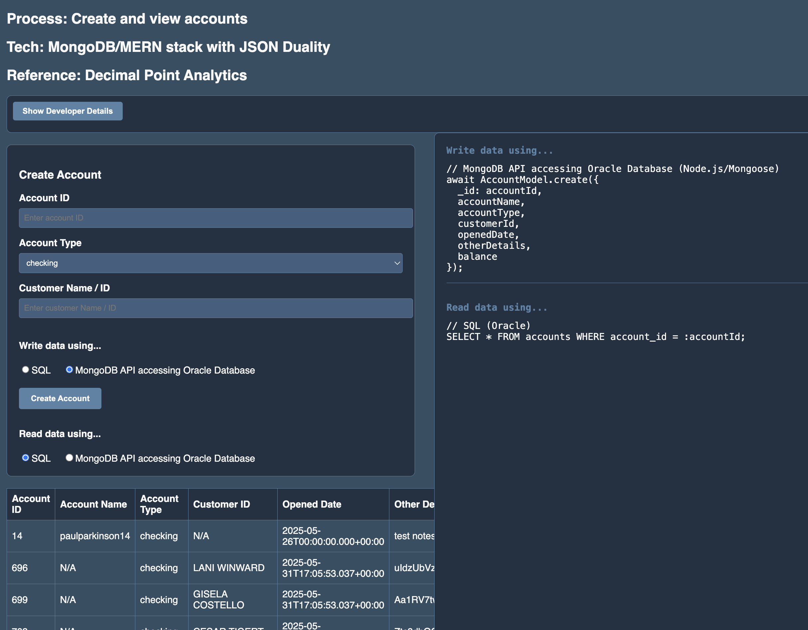

# Create and view accounts using MongoDB adapter/MERN stack and JSON Duality

## Introduction

### Objectives

-  Understand MongoDB adapter/MERN stack and JSON Duality and how it can be used in financial applications and analytics

### Prerequisites

None.

## Task 1: Create/enable Oracle Database with MongoDB Adapter

1. Simply follow the directions here and use the MongoDB URL as you would any other in your MongoDB application

https://docs.oracle.com/en/cloud/paas/autonomous-database/serverless/adbsb/mongo-using-oracle-database-api-mongodb.html

## Task 2: Run the application

1. Follow the steps in the README.md in `financial/bank-account-management-mergn` directory of the Github repos

## Migration

Marco MongoDB migrator here...

## Scaling, Sizing, and Performance

See the following blogs for details...

https://blogs.oracle.com/datawarehousing/post/oracle-database-api-for-mongodb-best-practices

https://juliandontcheff.wordpress.com/2024/07/04/the-json-to-duality-migrator-in-oracle-database-23ai/

You may now proceed to the next lab.

## Learn More

* [Oracle Database](https://bit.ly/mswsdatabase)
* [Workshop: Getting Started With Oracle Database Transactional Event Queues (TxEventQ)](https://apexapps.oracle.com/pls/apex/r/dbpm/livelabs/view-workshop?wid=1016)

## Acknowledgements
* **Authors** - Paul Parkinson, Architect and Developer Advocate
* **Last Updated By/Date** - Paul Parkinson, 2025

