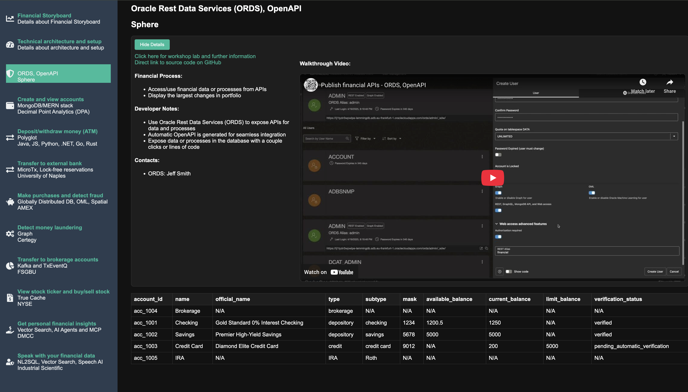

# FinTech/Bank APIs

## Introduction

### Objectives

-  Understand ORDS and how it can be used to easily publish financial data and process API

### Prerequisites

This lab only requires that you have an Oracle Autonomous Database

## Task 1: Enable ORDS Rest endpoint via console or with PL/SQL, expose tables and other objects, add Rest URL to application

# Scaling, Sizing, and Performance

See the following...
* [Cloud Scalability Using Customer Managed Oracle Rest Data Service with Autonomous JSON](https://medium.com/oracledevs/cloud-scalability-using-customer-managed-oracle-rest-data-service-with-autonomous-json-275fa06e8d22)
* [ORDS Best Practices](https://www.oracle.com/database/technologies/appdev/rest/best-practices/)

You may now proceed to the next lab.

## Learn More

* [Oracle Database](https://bit.ly/mswsdatabase)

## Acknowledgements
* **Authors** - Paul Parkinson, Architect and Developer Advocate
* **Last Updated By/Date** - Paul Parkinson, 2025

