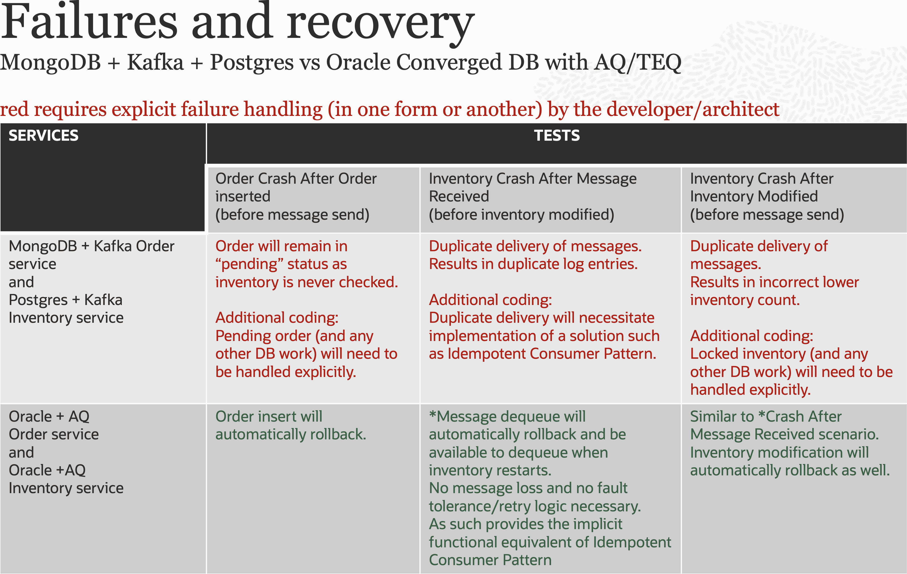

# Transfer to internal and brokerage accounts

## Introduction

*Watch the tutorial video above*

This lab demonstrates asset inventory management using Oracle's Kafka-compatible Transactional Event Queues (TxEventQ). The application showcases how messaging and database operations can be conducted within the same local transaction, eliminating common distributed system challenges.

The demonstration involves two microservices - an order service and an inventory service - that handle both purchases and inventory adjustments. You can select an asset and amount to initiate transfers, allowing you to compare and contrast different messaging approaches. The application provides a side-by-side comparison between traditional Kafka with external databases (like PostgreSQL) versus Oracle's integrated TxEventQ solution.

A key feature of this demonstration is the crash scenario testing. You can intentionally trigger crashes at specific points in the transaction flow, such as after inventory is checked in the inventory service but before the inventory status message is sent back to the order service. This reveals critical differences between the two approaches:

With traditional Kafka and PostgreSQL implementations, crashes can result in duplicate messages that require additional custom code to handle properly. Developers must write extensive error-handling logic to ensure message delivery guarantees and prevent data inconsistencies.

However, with Oracle's TxEventQ, even though the application continues to use the standard Kafka API, the transactional nature of the underlying event queue system automatically handles these crash scenarios. No additional coding is required to manage duplicate messages or ensure consistency, as the database's ACID properties extend to the messaging layer.

This demonstration highlights how Oracle's converged architecture simplifies microservices development by providing reliable messaging capabilities with database-level consistency guarantees, reducing the complexity and potential for errors in distributed financial applications.

### Objectives

-  Understand Oracle TxEventQ and Kafka adapter in the context of financial operations and communication

### Prerequisites

This lab only requires that you have completed the setup lab.

## Task 1: Build and deploy the service

 1. Run `./build_and_deploy.sh` at [this location](https://github.com/paulparkinson/oracle-ai-for-sustainable-dev/tree/main/financial/graph-circular-payments).

## Low-level side by side comparison with alternative

 1. Notice the results of different crash scenarios and the additional actions required by developers when not using Oracle TxEventQ (via JMS or Kafka)
    

## Migration

  1. See the guide [Migrate Apache Kafka applications to Oracle Database blog by Anders Swanson](https://www.linkedin.com/pulse/migrate-apache-kafka-applications-oracledatabase-anders-swanson-fd6vc)

You may now proceed to the next lab.

## Learn More

* [Oracle Database](https://bit.ly/mswsdatabase)

## Acknowledgements
* **Authors** - Paul Parkinson, Architect and Developer Advocate
* **Last Updated By/Date** - Paul Parkinson, 2025
