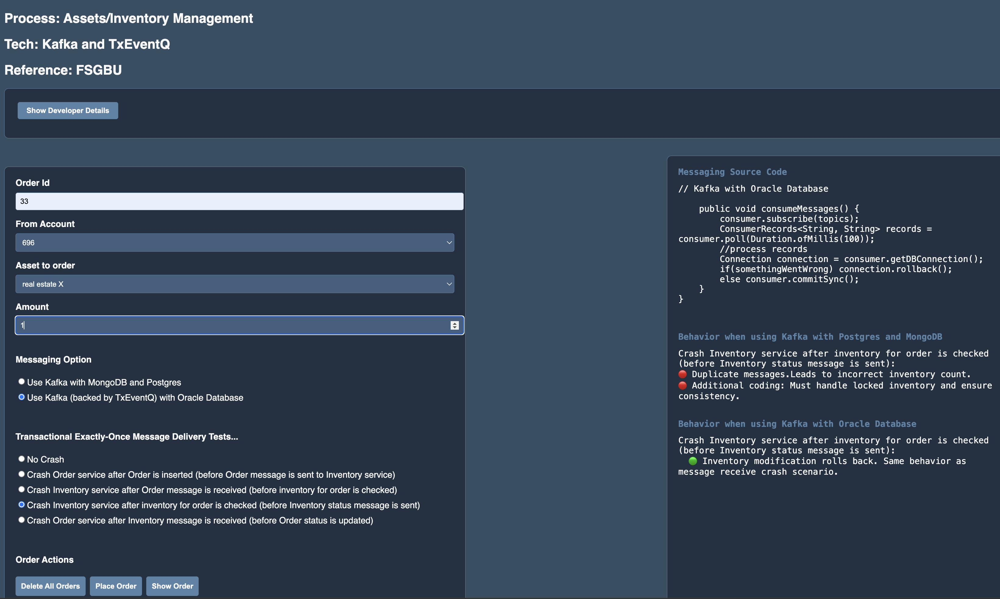

# Transfer to internal and brokerage accounts

## Introduction

### Objectives

-  Understand Oracle TxEventQ and Kafka adapter in the context of financial operations and communication

### Prerequisites

This lab assumes you have already completed the earlier labs.

## Task 1: setup .....

## Task 1: Review source code

1. See source code under `financial/brokerage-transfer-kafka` directory of the Github repos

## Task 2: Run the application

1. Follow the steps in the README.md in the same source directory

## Low-level side by side comparison with alternative

## Migration

   [Migrate Apache Kafka applications to Oracle Database blog by Anders Swanson](https://www.linkedin.com/pulse/migrate-apache-kafka-applications-oracledatabase-anders-swanson-fd6vc)

## Scaling, Sizing, and Performance

1) TxEventQ  - Scalability/Stress Testing Benchmarking - 19c | 70-Q | Single Consumer Qs
   A) Our OCI/On-prem RAC Cluster
   Clocked a Max Messaging throughput of 15-18K Msg/sec using TxEventQ with 2-3 Billion Message Volume sustained across 24-48 Hours
   19.7+MLR - 2N RAC/ASM (Traffic routed to a Single RAC Instance, 2nd instance idle/HA Failover)  on OCI (our On-prem H/w) | 70 Single Consumer Qs |  Single Shard - Global Ordering | Shared Servers
   | Msg Size: 512Bytes -1 KB
   Macro-Perf Stats:
   https://confluence.oraclecorp.com/confluence/display/SHARP/Performance+and+Metrics+details#PerformanceandMetricsdetails-Profilerunstatistics
   https://confluence.oraclecorp.com/confluence/display/SHARP/Performance+and+Metrics+details#PerformanceandMetricsdetails-Reliabilityrunstatistics
   System/Stress Testing Home - https://confluence.oraclecorp.com/confluence/display/SHARP/Responsys+emulated+AQ-JMS+System+Stress+testing#ResponsysemulatedAQJMSSystemStresstesting-TestSetup&SpecialWorkload/Scope
   DB/Q Parameter Tuning - https://confluence.oraclecorp.com/confluence/display/SHARP/Performance+and+Metrics+details#PerformanceandMetricsdetails-InitParameters:
   B) OCI/DBCS (Bare DB Service)
   16-18K Msg/Sec, 2-3B Msg Volume sustained for 48-hours (512B-1K Msg Size)
   https://confluence.oraclecorp.com/confluence/pages/viewpage.action?pageId=1841220906#OCI/DBCSTestingofAQResponsys-TEQPerformanceProfiling-DBCSvsOn-Prem        (Refer to SL# 2.3 and 3.1 )
   C) FS-GBU Autonomous DB (ADB-S) Cloud TxEQ Scale Testing
   Using a 16 OCPU ATP (Single instance), we clocked ~ 10K Msg/sec ENQ-DEQ throughput w/ 3Qs, 1K JMS-Byte msg
   https://confluence.oraclecorp.com/confluence/display/SHARP/FS+GBU+E2POD+ADB-S+Profiling
2) Classic Q Scale/Stress Testing Stats
   A)   FA-SaaS emulated Classic-Q Scale Testing w/ 96-Q for 24+ Hours, 1B+ Msg Volume | Scrambled DEQ and  Flow-control DEQ FA-Special CQ features enabled
   https://confluence.oraclecorp.com/confluence/pages/viewpage.action?pageId=7149906020#FACQJMSForegroundEnq/DeqMultiplefeatures-RUN7:96Queues
   B)   FA-SCM Emulated CQ (Varying Payloads) Performance Stats
   https://confluence.oraclecorp.com/confluence/display/SHARP/Classic+Q+FA+-+SCM+Performance+Evaluation

For sizing questions, we would start with the obvious ones such as 
(a) expected enqueue rate/dequeue rate 
(b) is global ordering required for application  
(c) payload size, # of subscribers, etc.

Typically queues with 2K msgs/sec or less enqueue/dequeue rate for a reasonable size workload (4K), and 10K msgs/sec or over, use TxEventQ.
Mileage will vary considerably based on # of topics, # of partitions per topic, size of the database hardware (Exadata being the extreme), etc.

You may now proceed to the next lab.

## Learn More

* [Oracle Database](https://bit.ly/mswsdatabase)
* [Workshop: Getting Started With Oracle Database Transactional Event Queues (TxEventQ)](https://apexapps.oracle.com/pls/apex/r/dbpm/livelabs/view-workshop?wid=1016)
* Python, ADT payload forTxEventQ

## Acknowledgements
* **Authors** - Paul Parkinson, Architect and Developer Advocate
* **Last Updated By/Date** - Paul Parkinson, 2025

