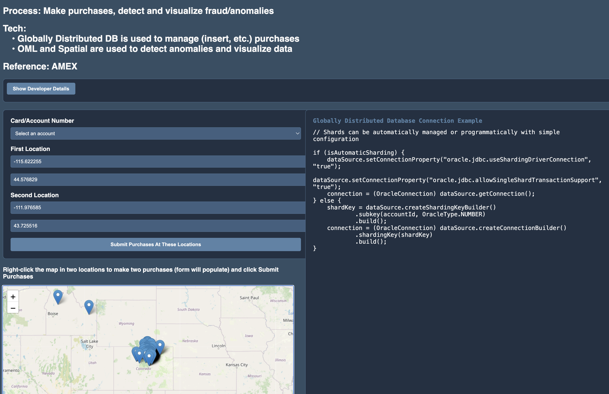

# Make purchases and visualize fraud

## Introduction

### Objectives

-  Understand concepts of Globally Distribute Database, OML, and Spatial in the context of credit card purchases and fraud detection

### Prerequisites

This lab assumes you have already completed the earlier labs.

## Task 1: Create a Globally Distributed Database

1. GDB can be deployed on Kubernetes, Terraform, or with Docker.
    The documentation found here: https://docs.oracle.com/en/database/oracle/oracle-database/23/shard/gdd-oracle-cloud-infrastructure.html

## Task 2: Run the application

1. Follow the steps in the README.md in `financial/cc-purchase-globally-distributed-database` directory of the Github repos

# Migration

Migration from an existing non-distributed database to a distributed database consists of two phases: schema migration and data migration. 
Oracle Globally Distributed Database provides guidelines for migrating your existing database schema and data to a distributed database.
[See this doc for details](https://docs.oracle.com/en/database/oracle/oracle-database/23/shard/migration1.html)

# Scaling, Sizing, and Performance

[See Section 2.1.5 of this documentation for details](https://docs.oracle.com/en/database/oracle/oracle-database/23/odbtc/overview-true-cache-configuration.html)

## Learn More

* [Oracle Database](https://bit.ly/mswsdatabase)
* [Fintech Transformation with globally distributed database](https://www.oracle.com/a/ocom/docs/database/fintech-transformation-with-globally-distributed-database.pdf)

Oracle Sharding Quick Start
https://apexapps.oracle.com/pls/apex/r/dbpm/livelabs/run-workshop?p210_wid=854

Oracle Sharding: Hyperscale Globally Distributed Database
https://apexapps.oracle.com/pls/apex/r/dbpm/livelabs/run-workshop?p210_wid=866

Oracle Globally Distributed Database with RAFT
https://apexapps.oracle.com/pls/apex/r/dbpm/livelabs/run-workshop?p210_wid=835

Use Raft Replication with Distributed Database for Resilient Never-Down Apps
https://apexapps.oracle.com/pls/apex/r/dbpm/livelabs/view-workshop?wid=3772

Oracle Globally Distributed Database supports RAFT Replication in Oracle Database 23ai
https://blogs.oracle.com/database/post/raft-replication-in-distributed-23c

Pinpoint suspicious financial transactions with Oracle Spatial and Python
https://oracle-livelabs.github.io/spatial-graph/spatial-python/workshops/pinpoint-fraud/sandbox/index.html

## Acknowledgements
* **Authors** - Paul Parkinson, Architect and Developer Advocate
* **Last Updated By/Date** - Paul Parkinson, 2025

