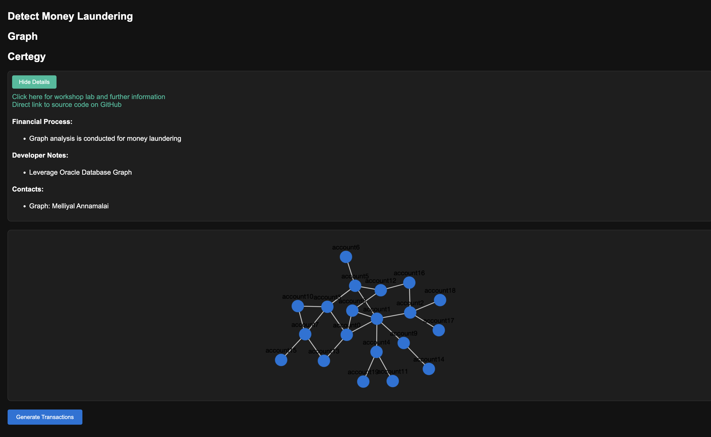

# Fraud alerts on credit card purchase

## Introduction

### Prerequisites

This lab assumes you have already completed the earlier labs.

## Task 1: Create and visualize a graph of transactions

1. Follow [Graph Studio: Find Circular Payment Chains with Graph Queries in Autonomous Database workshop](https://apexapps.oracle.com/pls/apex/r/dbpm/livelabs/run-workshop?p210_wid=770)

2. Understand SQL for Graph

You may now proceed to the next lab.

## Learn More

* [Oracle Database](https://bit.ly/mswsdatabase)
* [Certegy fights payment fraud with Oracle Cloud](https://www.oracle.com/customers/certegy/)

## Acknowledgements
* **Authors** - Paul Parkinson, Architect and Developer Advocate
* **Last Updated By/Date** - Paul Parkinson, 2025

