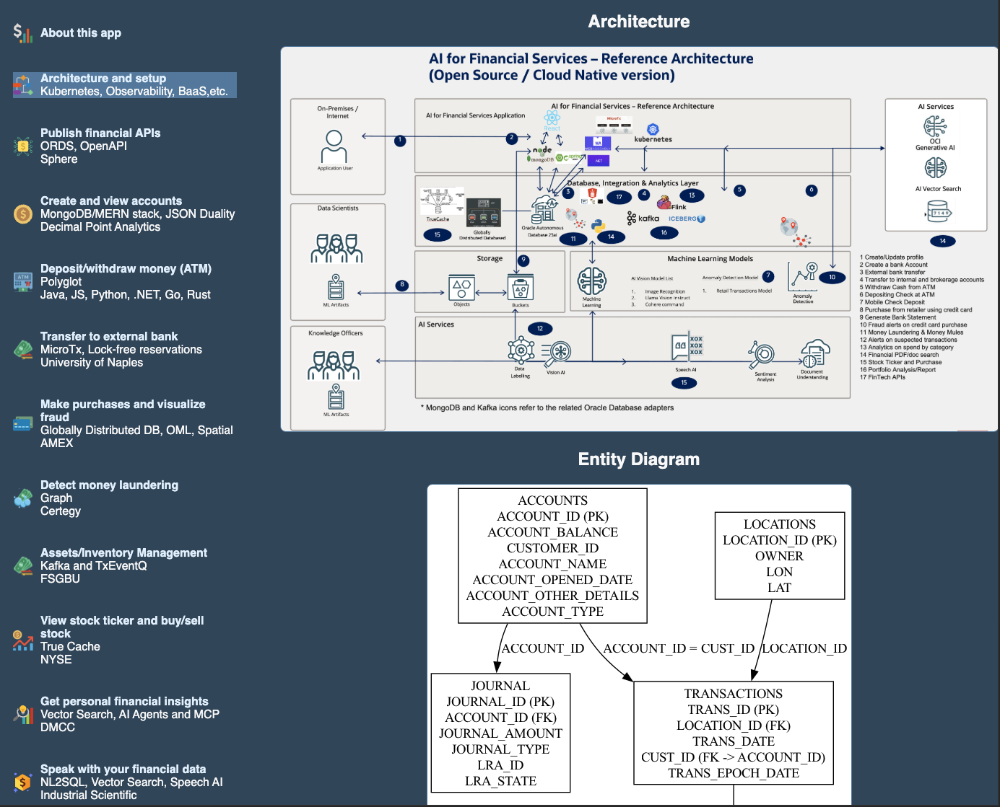

# React Frontend Service

## Introduction



### Objectives

-  Understand how to build, deploy, and run the React frontend service.


### Prerequisites

This lab only requires that you have completed the setup lab and can actually be .

## Task 1: Insure you have NPM installed

Ensure you have Node Package Manager (npm) installed. You can check this by running:

```
bash npm -v
```
If you do not have npm installed, you can install it by following the instructions at [Node.js Download](https://nodejs.org/en/download/).


## Task 2: Run the React Frontend locally

1.  Navigate to the `<REPOS_ROOT_DIR>/financial/react-frontend` directory and run `npm install` and `npm start` to start the React application.

```
cd <REPOS_ROOT_DIR>/financial/react-frontend
npm install
npm start
```

This will start the React application on your local machine, typically accessible at `http://localhost:3000`.

You may now proceed to the next lab.

## Learn More

* [Oracle Database](https://bit.ly/mswsdatabase)
* [Prevent and Detect Fraud with Immutable and Blockchain Tables on Oracle Autonomous Database workshop](https://livelabs.oracle.com/pls/apex/dbpm/r/livelabs/view-workshop?wid=4142)

## Acknowledgements
* **Authors** - Paul Parkinson, Architect and Developer Advocate
* **Last Updated By/Date** - Paul Parkinson, 2025

