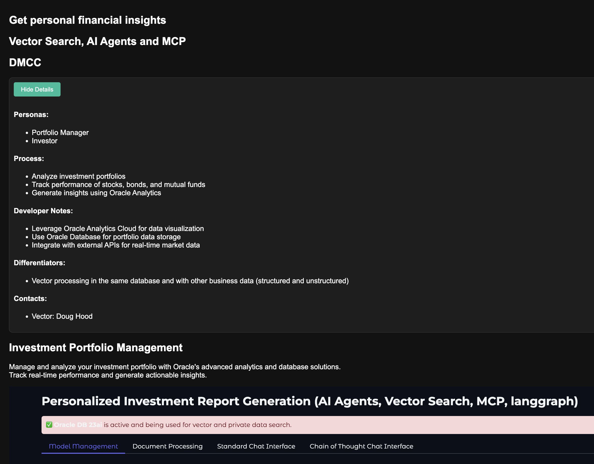

# Bank Account Statement and Portfolio Analysis

## Introduction

 

Goal: Generate a basic PDF report analyzing Oracle's recent stock data for a generic institutional client.

Flow:

Data Ingestion (RAG Agent focusing on Web Data):
- Action: The RAG Agent will be primarily focused on fetching the latest stock data directly (eg from Yahoo Finance) or True Cache. 

Basic Prompt-Driven Analysis (Analytic Agent):
- Action: The Analytic Agent will take the raw stock data fetched by the RAG Agent and analyze it based on a predefined prompt.
- Example Prompt: "Analyze the recent stock data for CompanyXYZ (XYZ) from Yahoo Finance. Identify key trends like the latest closing price, daily change, and any significant volume changes. Provide a brief summary of these observations."

Minimal Narrative Generation (Narrative Generation Agent - Basic PDF Output):
- Action: The Narrative Generation Agent will take the output of the Analytic Agent and generate a very basic PDF report.
- PDF Structure: The PDF will have a title (e.g., "XYZ Stock Analysis"), a section for the raw data (maybe a small table of the fetched information), and a section for the analysis summary provided by the Analytic Agent. Keep formatting extremely basic.

Elementary Output/Consumption (Personalization Agent - Very Basic):
- Action: The report will be geared towards a generic institutional client interested in high-level XYZ stock information. The "personalization" is simply focusing the analysis on Oracle.

Direct Delivery (Client Communication Agent - Packaging):
- Action: The output PDF from the Narrative Generation Agent will be the deliverable. "Packaging and delivery" is simply saving the PDF to a designated location.

Accuracy Check (Integrated into Analytic Agent):
- Action: Accuracy and Quality Assurance Agent's role is be very basic and likely integrated into the Analytic Agent. The prompt could include instructions for the Analytic Agent to double-check the fetched data (e.g., ensuring the date is current) and the analysis for logical consistency. A quick manual review is also recommended.

Agents and their Roles:
- RAG Agent: Fetch Oracle stock ticker data from Yahoo Finance (web).
- Data Ingestion Agents (One and Two): Their roles are merged into the RAG Agent for fetching web data. 
- Analytic Agent: Analyze the fetched stock data based on predefined prompt.
- Accuracy and Quality Assurance Agent: Basic checks integrated into the Analytic Agent and a quick manual review.
- Narrative Generation Agent: Generate a very basic PDF report with raw data and analysis summary.
- Personalization Agent: Focus analysis on Oracle for a generic institutional client (minimal personalization).
- Client Communication Agent: Save the generated PDF as the final deliverable.

### Objectives

-  Understand AI Agents, MCP, and Oracle Database 23ai Vector Search, etc. capabilities

### Prerequisites

This lab only requires that you have completed the setup lab.

## Task 1: Follow the Readme

Follow the readme at [this location](https://github.com/paulparkinson/oracle-ai-for-sustainable-dev/tree/main/financial/graph-circular-payments).

## Video Tutorial

*Click the image above to watch the tutorial video*

You may now proceed to the next lab.

## Learn More

* [Oracle Database](https://bit.ly/mswsdatabase)
* https://www.oracle.com/artificial-intelligence/build-multiagent-rag-solutionon-oci/ https://github.com/oracle-devrel/devrel-labs/tree/update/agentic_rag
* https://blogs.oracle.com/developers/post/agentic-rag-enterprisescale-multiagent-ai-system-on-oracle-cloud-infrastructure
* [python-oracledb 3.0 Data Frames — a new way to query data](https://medium.com/oracledevs/python-oracledb-3-0-data-frames-a-new-way-to-query-data-4139418bef82)
* [Writing to Parquet and Delta Lake files from Oracle Database using Python](https://levelup.gitconnected.com/writing-to-parquet-and-delta-lake-files-from-oracle-database-using-python-5f7382bfcdc6)

## Acknowledgements
* **Authors** - Paul Parkinson, Architect and Developer Advocate
* **Last Updated By/Date** - Paul Parkinson, 2025

