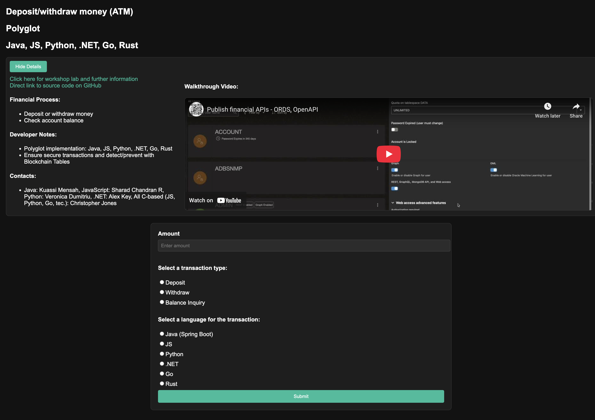

# Mobile check deposit

## Introduction

### Objectives

-  Understand how to make basic connection and operations for any language you are working with.

### Prerequisites

This lab only requires that you have completed the setup lab.

## Task 1: Follow the Readme

Follow the readme at [this location](https://github.com/paulparkinson/oracle-ai-for-sustainable-dev/tree/main/financial/graph-circular-payments).

You may now proceed to the next lab.

## Learn More

* [Oracle Database](https://bit.ly/mswsdatabase)
* [Prevent and Detect Fraud with Immutable and Blockchain Tables on Oracle Autonomous Database workshop](https://livelabs.oracle.com/pls/apex/dbpm/r/livelabs/view-workshop?wid=4142)

## Acknowledgements
* **Authors** - Paul Parkinson, Architect and Developer Advocate
* **Last Updated By/Date** - Paul Parkinson, 2025

